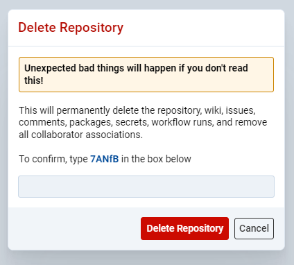

import ComponentDemo from '@site/src/components/DocsTools/ComponentDemo';

Webforj version 24.02 is live and available for development! Learn more about what main features and fixes are included in this release.


<!-- truncate -->

# 24.02

As always, see the [GitHub release overview](https://github.com/webforj/webforj/releases/tag/24.01) for a more comprehensive list of changes.

## Option dialogs



With 24.02, webforJ introduces a robust option dialog feature that allows applications to interact with users and gather input effectively. These dialogs are modal, meaning they halt app execution until the user provides input, ensuring critical messages are addressed before proceeding. These function similarly to `JOptionPane` in Swing, addressing the need for blocking dialogs in web applications.

There are multiple types of these dialogs:

- **`Message`**: Display informative messages to users.
- **`Confirm`**: Request user confirmation for specific actions.
- **`Input`**: Gather textual input from users.
- **`File Chooser`**: Allow users to select files from their system.
- **`File Upload`**: Enable users to upload files directly.

The various dialog options are provided to help clarify and specify the type of interaction users should take throughout navigation of an app. 

## Progress bar overhaul

The `ProgressBar` in 24.02 has gotten a powerful, comprehensive overhaul. This component provides a visual representation of task progress, making it easy for users to monitor the completion status of ongoing tasks. The progress bar fills up as the task progresses, displaying the percentage of completion both visually and textually.

<ComponentDemo 
path='https://demo.webforj.com/webapp/controlsamples?class=componentdemos.progressbar.ProgressBarBasic' 
javaE='https://raw.githubusercontent.com/webforj/ControlSamples/main/src/main/java/componentdemos/progressbar/ProgressBarBasic.java'
height='150px'
/>

The following key features are included in the `ProgressBar` out of the box:

- **Configurable Values**: Supports setting and getting current, minimum, and maximum values to accurately represent task progress.

- **Indeterminate Mode**: Allows for an indeterminate state to indicate ongoing tasks without a definite end.

- **Text Visibility**: Options to display the percentage of completion or the raw value as text.

- **Orientation Support**: The `ProgressBar` can be oriented either horizontally or vertically, providing flexibility in how it is displayed in your application.

- **Styling Options**: Includes themes, animation, and striped designs for enhanced visual feedback.

The `ProgressBar` component is highly versatile and can be used to visualize the completion status of various tasks. It allows configuration of minimum and maximum values, making it adaptable to different use cases.

## Interval

We've introduced `Interval` functionality in webforJ, providing a mechanism similar to the Swing `Timer`, which offers a way to execute code at fixed time intervals. This feature is essential for tasks that need periodic execution, such as updating UI elements, performing background operations, or polling for data.

In the above `ProgressBar` the start, pause and restart functionality were all implemented via webforJ's `Interval` class. In addition to these functions, it also allows developers to specify a timeout value in seconds, supporting fractional seconds for precise timing. For tasks with unknown completion times, the `Interval` can be set to an indeterminate state, allowing it to keep running until explicitly stopped.

To create, start, stop and then restart an interval, the following code can be executed:

```java
// Create a new Interval with a delay of 2.5 seconds
Interval interval = new Interval(2.5f, event -> {
    System.out.println("Interval elapsed!");
});

// Start the interval
interval.start();

// Stop the interval
interval.stop();

// Restart the interval
interval.restart();
```

The `Interval` helps manage periodic tasks - its ability to handle fixed time delays, support multiple event listeners, and provide robust performance makes it an essential feature for developers looking to implement timed events efficiently.

