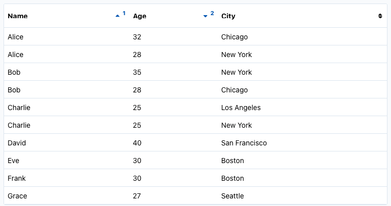

webforJ version `25.00` is out now! This release includes brand-new UI components, functional improvements, and key architectural updates. Let's walk through some of the most exciting additions.

<!-- truncate -->

## Servlet 6 or later

webforj `25.00` now requires Servlet 6 or later. If you're using the Jetty Maven plugin for development, outlined in the [Getting Started](../../docs/introduction/getting-started) section, you must switch to the [EE10 variant](https://mvnrepository.com/artifact/org.eclipse.jetty.ee10/jetty-ee10-maven-plugin) of the plugin instead of the older EE8 version.


:::info Upgrade Guide
<!-- placeholder for the upgrade guide -->
See the [upgrade guide](/docs/upgrading/webforj-25.00) to ensure a smooth transition from webforJ 24 to 25
:::

## `Alert` component

A new `Alert` component has been added in webforJ `25.00`. This component provides contextual feedback messages for users, such as when displaying notifications, warnings, success confirmations, and more.

Alerts can be styled, themed, and optionally dismissed by the user.

#### Key features

- **Themes**: Use standard `Theme` values such as `DEFAULT`, `PRIMARY`, `SUCCESS`, `DANGER`, etc., to visually differentiate alerts.
- **Closable**: Set alerts to be dismissible by the user with `setClosable(true)`.
- **Visibility control**: Show or hide the alert using `open()` and `close()`.
- **Expanse support**: Use `setExpanse()` to control the sizing (e.g., `SMALL`, `MEDIUM`, `LARGE`).
- **Content flexibility**: Use `setText()` for plain messages, or `addToContent()` to embed components inside the alert.
- **Event handling**: Listen for when the alert is closed by the user using `onClose()` method.

#### Example usage

```java
Alert alert = new Alert("Profile updated successfully!", Theme.SUCCESS)
  .setClosable(true)
  .setExpanse(Expanse.SMALL)
  .onClose(e -> {
    System.out.println("Alert dismissed by user.");
  });

mainFrame.add(alert);
```

## `InfiniteScroll` & `Refresher` components

In addition to the `Alert` component, two additional components have been introduced in this release which are designed to interact with dynamic data: the `InfiniteScroll` and the `Refresher` components. These components aim to make interaction with dynamic data more efficient, and align with what users expect in a modern web app.

<video width="100%" height="400px" controls>
  <source src="https://cdn.webforj.com/webforj-documentation/video/release/scroll_refresh.mp4" type="video/mp4" />
</video>

### `InfiniteScroll`

If using the pagination is undesirable in your app, the `InfiniteScroll` component is a perfect fit. This component allows content to load continuously as the user scrolls down a page and is perfect for use cases like social feeds, product listings, or any scenario where data is retrieved in batches.

#### Key features

- **Automatic loading**: Trigger data fetching when the user nears the bottom of the viewport.
- **Customizable indicator**: Override the loading state with custom content using `addToContent()`.
- **Icon and message control**: Change the spinner or loading text with `setIcon()` and `setText()`.
- **Manual completion**: Stop further loading by calling `.setCompleted(true)` when there's no more data.
- **Scroll event handling**: React to the scroll trigger with `onScroll()` to load new data chunks.

#### Example usage

```java
InfiniteScroll scroll = new InfiniteScroll("Loading more customers...");
scroll.onScroll(event -> {
  // Fetch and add more content here
});
```

After loading new content, simply call `update()` to reset the component and prepare for the next scroll trigger.

### `Refresher`

The `Refresher` component brings native-like pull-to-refresh capability to webforJ apps, ideal for mobile devices. This addition further builds on webforJ’s mobile support - especially when paired with [installable apps](../../docs/configuration/installable-apps), introduced in [24.21](../2025-01-27-webforj-v24.21/24.21.md). Together, they allow you to build apps that look and feel native, in Java.

#### Key features

- **Touch-based refresh**: Triggers an event when the user pulls down from the top of the screen. This event can be used to reload data, perform updates, etc.
- **Customizable Icons**: You can define which icons appear during each stage of the refresh gesture:
  - `setArrowIcon()`: Shown while the user pulls down.
  - `setRefreshIcon()`: Displayed while data is refreshing.
- **Thresholds**: Customize how far the user must pull before triggering a refresh:
  - `setThreshold()`: Minimum distance (in pixels) required to enter the "release to refresh" state.
  - `setThresholdMax()`: Maximum pull distance to cap how far the component can stretch.
- **Themeable**: Integrates with your app’s look using `setTheme()`.

#### Example usage

```java
Refresher refresher = new Refresher();
refresher.onRefresh(event -> {
  // Reload your data or perform updates
  refresher.finish(); // Always call when the refresh action is complete
});
```

## `Table` enhancements

The `25.00` release brings two new features to the `Table` component: conditional styling and multi-column sorting. These additions give more control over the appearance and behavior of tables.

### Conditional styling

Tables can now dynamically style individual rows and cells based on the data they represent. With the new `setRowPartProvider()` and `setCellPartProvider()` methods, you can apply custom CSS part names to rows and cells, enabling styles like conditional highlighting or state indicators.


```java
// Apply alternating row styles
table.setRowPartProvider(person -> {
  int index = data.indexOf(person);
  return List.of(index % 2 == 0 ? "row-even" : "row-odd");
});
```

```css
/* Apply CSS styling to the dwc-table::part */
dwc-table::part(row-even) {
  background-color: var(--dwc-color-default);
}
```

### Borders and striped rows

`25.00` introduces two highly requested enhancements for improving the appearance of tables in your app: customizable borders and striped rows.

These new styling options are simple to apply and help developers deliver clearer, more readable data presentations with minimal effort.

#### Customizable table borders
The new `setBordersVisible()` method controls which borders are displayed around and within your table. You can choose to show or hide borders between rows, columns, or around the entire table.

```java
// Show all borders: rows, columns, and outer border
table.setBordersVisible(EnumSet.of(
  Table.Border.ROWS,
  Table.Border.COLUMNS,
  Table.Border.AROUND
));

// Remove all borders
table.setBordersVisible(EnumSet.noneOf(Table.Border.class));
```

This gives you full control over how your table is rendered - whether you prefer a minimal layout or a fully bordered grid.

#### Striped rows for improved readability

With the new `setStriped()` method, alternating background colors are applied to every other row, making large tables easier to scan visually.

```java
table.setStriped(true);
```

### Multi-column sorting

Sorting in tables has been overhauled in this release. By default, tables now use single-column sorting—clicking a column header will sort that column and clear sorting from others.

If your app needs more flexibility, multi-column sorting can now be enabled with:

```java
table.setMultiSorting(true);
```

When active, users can sort by multiple columns in a defined order. The sorted columns are visually numbered to indicate their sort precedence, helping to clarify information display in more complex tables.




For server-side sorting, you can define sort priority programmatically:

```java
column1.setSortIndex(1); // Highest priority
column2.setSortIndex(2); // Secondary
```

## Desktop notifications

With webforJ `25.00`, you can now notify your users beyond the browser with the new `DesktopNotification` component. This feature enables native desktop notifications that display system-level alerts, even if the web app tab isn't currently active. 

<video width="100%" height="400px" controls>
  <source src="https://cdn.webforj.com/webforj-documentation/video/release/desktop_notifications.mp4" type="video/mp4" />
</video>

<br /><br />

To use this feature, make sure to include the following dependency in your `pom.xml`

```xml
<dependency>
  <groupId>com.webforj</groupId>
  <artifactId>webforj-desktop-notification</artifactId>
</dependency>
```

:::warning
This is currently an experimental feature, and is subject to change in future versions.
:::

These notifications are useful when informing users about new messages, system updates, or background events.

#### When and how notifications appear
Notifications will only be shown if the following conditions are met:

- The app is served from a secure origin (HTTPS).
- The user has interacted with the page (e.g., clicked a button).
- The browser has granted notification permissions.
- The app isn't running in incognito or private mode.

Once permission is granted, your app can trigger system-level alerts like this:

```java
DesktopNotification.show("Order Received", "You have a new customer order!");
```

You can also configure the icon and attach event listeners for `onClick`, `onError`, `onOpen`, and `onClose` events:

```java
DesktopNotification notification = new DesktopNotification("Upload Complete", "Your file has been uploaded.")
    .setIcon("icons://upload-icon.png")
    .onClick(e -> System.out.println("Notification clicked!"))
    .onError(e -> System.out.println("Failed to show notification."))
    .open();
```

As always, see the [GitHub release overview](https://github.com/webforj/webforj/releases/tag/25.00) for a more comprehensive list of changes. 