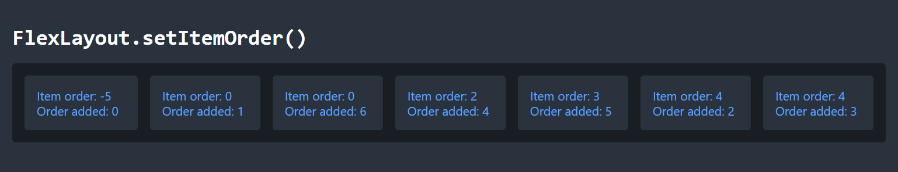
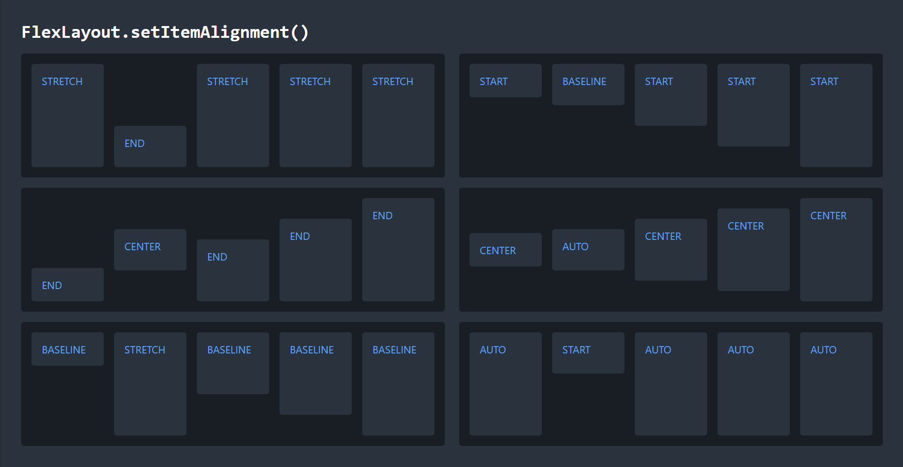
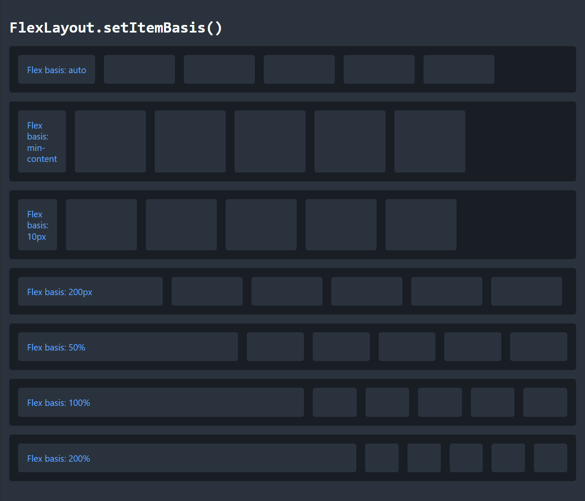
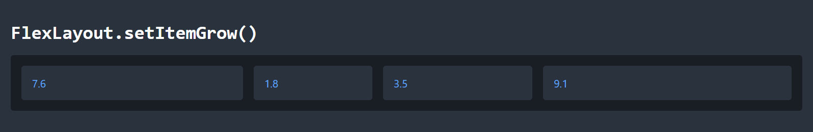
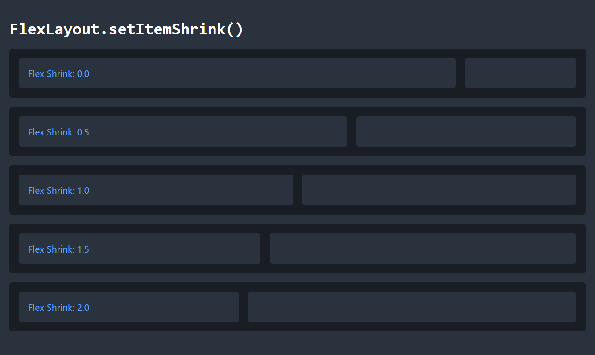

The webforJ [`FlexLayout`](https://docs.webforj.com/docs/components/flex-layout) component provides an easy and Java-like way to create CSS Flexbox layouts. 
For an introduction, see the first part of this series, [FlexWrap your mind around webforJ's FlexLayout](/blog/2025/08/26/flexlayout-container), in which I discuss the general benefits of the webforJ FlexLayout component and the methods that modify the flex container. 
In this article, I'll dive into the flex items inside the container to see how you can further customize the behavior of your layout.

## Flex item basics
Components that you add to a FlexLayout are considered to be "flex items," and you can set different properties on these items to affect the way they behave within the layout. 
In CSS, this would mean setting certain flex-related properties on the flex item. 
In webforJ, you can set these properties by calling methods on the FlexLayout, and passing in the flex items as parameters.
For example, the code below creates a `FlexLayout`, adds a `Paragraph` component to it, and then sets the basis value for the `Paragraph`.
```java
FlexLayout flex = FlexLayout.create().build();
Paragraph p = new Paragraph("Paragraph text");
flex.add(p);
flex.setItemBasis("50%", p);
```

## Order
When you add items to a FlexLayout, they will appear in the order that you added them. 
However, you can adjust this order at any time by using `setItemOrder()`, which corresponds to the CSS property `order`. 
By default, all items have an order of 0, and items with the same order are arranged in the order they are added to the FlexLayout. 
You can set this value to any negative or positive integer, and smaller values will be arranged before larger values. 
The image below shows a series of items added to a FlexLayout, along with their item order property and the order in which they were added to the layout.
Notice how the items are arranged based on item order, but items with the same order value are arranged according to the order they were added.



## Self alignment
Flex items are aligned along the cross axis according to the alignment of the FlexLayout, but you can override the alignment of specific items with `setItemAlignment()`, which corresponds to the CSS property `align-self`. 
This gives you a lot of "flexibility" in how you arrange the items in your layout. 
If you want to draw attention to an element, or if certain items look better with a different alignment, you can customize it as needed. 
Use any `FlexAlignment` enum to set the alignment. 
The `FlexAlignment.AUTO` value will cause the item to use whatever alignment is set on the FlexLayout overall.

In the following image, the FlexLayout has the alignment value shown on the majority of the items, and the second item has a different value, set with `setItemAlignment()`.


## Basis
You can set the basis of a flex item with `setItemBasis()`, which corresponds to the CSS property `flex-basis`. 
The basis of a flex item defines its default size along the main axis. 
Because the whole point of a FlexLayout is dynamic sizing of elements, this does not necessarily define the actual, rendered size of the element. 
Instead, think of the basis like a preferred or starting size. 
The FlexLayout tries to make every item its basis size, and then everything grows or shrinks as needed from that starting point.

To set the item basis, provide a String value with any CSS size value. 
This can be a percentage, pixels, rems, or any other standard size unit. 
You can also use the keywords `auto`, `content`, `min-content`, `max-content`, or `fit-content`. 
These keywords have subtle differences in how they automatically size the element based on its content.

In the following image, each element has the width set to `6rem`, and the first element has the basis set to the value specified in the text. 
Because the basis has priority over the `width` property, the elements can become either smaller or larger depending on the basis size. 
You can also see how setting large values for the basis does not cause the flex item to actually be that size, but it does affect how the space is distributed. 
For values of 50%, 100%, and 200%, the first item takes increasingly more space, but instead of forcing the other elements out of existence, it determines how aggressively the element will force the others to shrink.



## Grow
You can control how much flex items increase in size to fit the available space with `setItemGrow()`, which corresponds to the CSS property `flex-grow`.
The grow property controls whether an item can increase in size, and how much it will grow relative to the other items in the layout.
By default, items have a grow value of 0.0, which prevents them from growing.
If multiple items are able to grow and there is available space in the layout, they will grow in proportion to their grow values.

In the FlexLayout below, each of the four flex items starts with the same basis, but has their grow value set to the value they display. 



## Shrink
On the other hand, you can control how much flex items will shrink when necessary by using `setItemShrink()`, which corresponds to the CSS property `flex-shrink`.
The default shrink value for an item is 1.0, which means most items will shrink if necessary, at the same rate. 

The image below shows a series of FlexLayouts with two items, both of which have their basis set to 75%. 
In other words, they are competing for the same space, and will have to resolve the conflict. 
In each layout, the shrink value for the first item is changed. 
When the shrink value is 0.0, it doesn't shrink and takes its full space. 
At values less than one, it can shrink, but still takes more space than the other item, because it shrinks less. 
At a value of 1.0, they shrink equally, and at higher values, the first item shrinks more.



## Summary

The webforJ FlexLayout component is a powerful tool, and can be configured in many different ways. 
By adjusting the order, basis, grow, and shrink properties of the flex items, you can control how each item behaves in the layout.
By combining these properties with properties of the flex container, you can exercise a great deal of control over how the components in your app are arranged, and even change the arrangement as needed.

See the [`FlexLayout` component page](https://docs.webforj.com/docs/components/flex-layout) and the 
<JavadocLink type="flexlayout" location="com/webforj/component/layout/flexlayout/FlexLayout" code="true">FlexLayout</JavadocLink>
JavaDocs for full documentation of webforJ's FlexLayout component.
For a deeper dive into CSS Flexbox, check out the [CSS Flexbox Layout Guide](https://css-tricks.com/snippets/css/a-guide-to-flexbox/) from CSS Tricks.