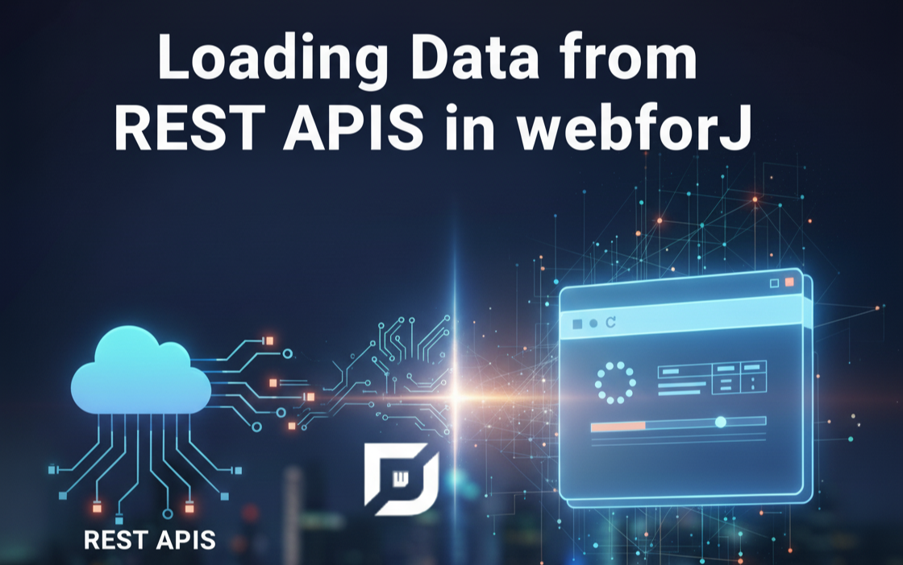
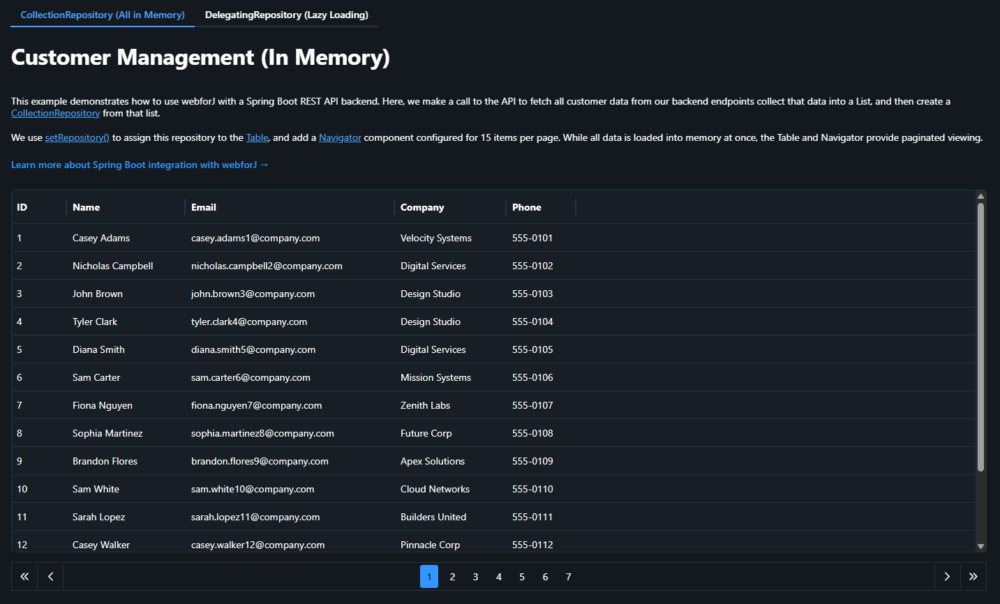
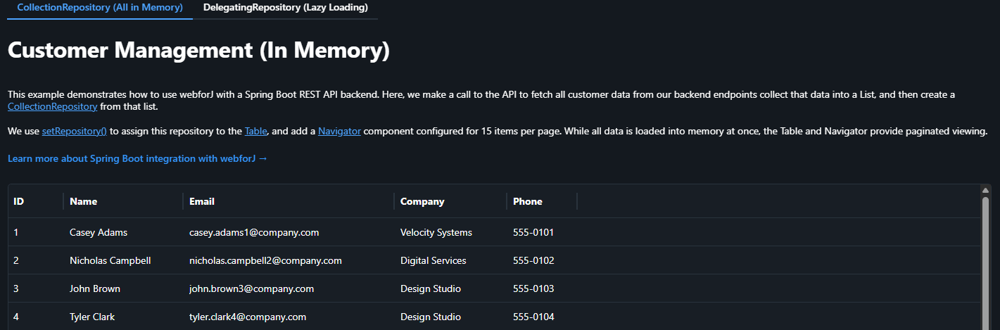
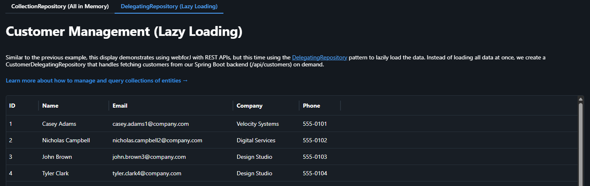

When building web applications that consume REST APIs, one of the most important decisions you'll make is how to load and manage your data. Load everything at once for snappy client-side operations, or fetch data on-demand to keep memory usage low? The answer, as with most things in software development, is: it depends.

In this post, we'll explore two distinct approaches to loading data from REST APIs in webforJ applications, examining the trade-offs of each and showing you exactly how to implement them using Spring Boot and webforJ's repository patterns.

<!-- truncate -->

## The Setup: A Customer Management System

Our demo application displays 100 customer records in a table with pagination. Simple enough, right? But we've implemented it in two different ways, each living in its own tab, to demonstrate when each approach shines.




**The Architecture**: This is a unified Spring Boot application where everything runs together on the same server and port. Spring Boot serves our webforJ frontend while simultaneously exposing REST API endpoints (like `/api/customers`) that the frontend consumes. You can use common querying tools like Postman or Insomnia and query the same server for data (at the appropriate endpoint) that serves the app.

It's a clean, all-in-one setup that showcases how webforJ and Spring Boot work together - your UI and your API existing in a single deployable app.

Both `Table` components showcase:
- A display of the same 100 customers
- Consumption of REST endpoints from the same Spring Boot server that's running the app
- Support for pagination with 15 items per page
- An identical look to the user

But under the hood? They work very differently.

## Approach 1: CollectionRepository (Load Everything Up Front)

The first approach uses webforJ's [`CollectionRepository`](https://docs.webforj.com/docs/advanced/repository/overview#collection-repository) to load all data into memory at once, then handle pagination.



### How It Works

```java
// 1. Fetch ALL customers from the REST API in one call
List<Customer> customers = customerService.getAllCustomers();

// 2. Create a CollectionRepository from the complete list
CollectionRepository<Customer> repository = new CollectionRepository<>(customers);

// 3. Wire up your Table and Navigator
customerTable.setRepository(repository);
navigator = new Navigator(repository, 15);
```

That's it. One API call, all your data in memory, instant pagination.

### The Backend Endpoint

The Spring Boot controller just needs a simple endpoint that returns everything (the `getAllCustomers()` method, in this case):

```java
@RestController
@RequestMapping("/api/customers")
public class CustomerRestController {
    @GetMapping
    public List<Customer> getAllCustomers() {
        return customerRepository.findAll();
    }
}
```

### The Pros

**Simple Implementation**: It's the easiest pattern to implement. One endpoint, one service call, done. No need to manage offset/limit parameters or worry about pagination logic.

**Excellent for Small Datasets**: If you're working with a few hundred records or less, the performance is excellent and the memory footprint is negligible.

### The Cons

**Initial Load Time**: Users have to wait for all 100 (or 1000, or 10,000) records to load before seeing anything. For large datasets, this can be noticeable.

**Memory Usage**: All data sits in memory for the lifetime of the session. With thousands of records or complex objects, this can add up quickly.

**Stale Data**: Once loaded, the data doesn't update unless you explicitly refresh it. If the backend data changes frequently, users see outdated information.

**Scalability Ceiling**: This approach hits a wall. At some point, loading 50,000 records becomes impractical no matter how you optimize it.

### When to Use CollectionRepository

This approach is perfect when:
- You're working with **small to medium datasets** (up to a few thousand records)
- Data **changes infrequently** (reference data, configuration, etc.)
- You need **instant filtering and sorting** without round trips
- **Simplicity is a priority** and you want minimal backend complexity

This approach worked because our API was relatively simple, and we were only interested in getting the entirety of the data in one fell swoop. As you start to work with more complex REST APIs and need to convert the repository criteria into HTTP request parameters, such as pagination, the `DelegatingRepository` becomes the more appropriate tool. 

## Approach 2: DelegatingRepository (Lazy Loading on Demand)

The second `Table` demonstrates webforJ's [`DelegatingRepository`](https://docs.webforj.com/docs/advanced/repository/delegating-repository) to fetch only the data needed for the current page, loading more as users navigate.



### How It Works

Instead of fetching everything at once, we create a custom repository that knows how to fetch data in chunks. This is because the `DelegatingRepository` lets you specify criteria and turn that into HTTP requests. Here, we use pagination as an example of using repository functions to correspond to API calls:

```java
@Component
public class CustomerDelegatingRepository extends DelegatingRepository<Customer, Object> {

    public CustomerDelegatingRepository(RestClientService restClientService) {
        super(
            // Function 1: Find - fetch a page of data
            criteria -> {
                int limit = criteria.getLimit();
                int offset = criteria.getOffset();
                List<Customer> customers = restClientService.fetchCustomers(limit, offset);
                return customers.stream();
            },

            // Function 2: Count - get total number of records
            criteria -> restClientService.getCustomerCount(),

            // Function 3: Find by key - fetch a single item by ID
            key -> restClientService.fetchCustomerById((Long) key)
        );
    }
}
```

The `DelegatingRepository` requires three functions:
1. **Find**: Fetches a page of data based on limit and offset
2. **Count**: Returns the total count for pagination calculations
3. **Find by key**: Fetches a single item when needed

### Using the DelegatingRepository

Once defined, using it is just as simple as the CollectionRepository:

```java
// Inject the repository
private final CustomerDelegatingRepository customerRepository;

public CustomerDelegatingDisplay(CustomerDelegatingRepository customerRepository) {
    this.customerRepository = customerRepository;
}

// Wire it up to your table and navigator
customersTable.setRepository(customerRepository);
navigator = new Navigator(customerRepository, 15);
```

### The Backend Implementation

The Spring Boot controller needed to support pagination in order to demonstrate this:

```java
@RestController
@RequestMapping("/api/customers")
public class CustomerRestController {

    @GetMapping("/paginated")
    public List<Customer> getCustomersPaginated(
        @RequestParam int limit,
        @RequestParam int offset) {
        Pageable pageable = PageRequest.of(offset / limit, limit);
        return customerRepository.findAll(pageable).getContent();
    }

    @GetMapping("/count")
    public long getCustomerCount() {
        return customerRepository.count();
    }

    @GetMapping("/{id}")
    public ResponseEntity<Customer> getCustomerById(@PathVariable Long id) {
        return customerRepository.findById(id)
            .map(ResponseEntity::ok)
            .orElse(ResponseEntity.notFound().build());
    }
}
```

### The Pros

**Fast Initial Load**: Users see data immediately. Only 15 records load on startup, not 100 or 10,000.

**Low Memory Footprint**: At any given time, you're only holding one or two pages of data in memory, not the entire dataset.

**Scales Indefinitely**: Whether you have 100 records or 100,000, the client-side performance remains consistent.

### The Cons

**Network Latency**: Every page change requires a round trip to the server. On slow connections or with high latency, this creates lag when users navigate.

**Backend Complexity**: Your backend needs to implement and maintain proper pagination logic, including offset/limit handling and efficient database queries.

**More API Calls**: More network requests means more opportunities for failures and more load on your backend infrastructure.

### When to Use DelegatingRepository

This approach shines when:
- You're working with **large datasets** (thousands to millions of records)
- Data **changes frequently** and freshness matters
- You want to **minimize memory usage** and initial load time
- Your backend **already supports pagination** (or you can easily add it)
- Users typically **work with subsets** of data, not the whole collection

## Implementation Highlights

Both approaches use webforJ's [`Navigator`](https://docs.webforj.com/docs/components/navigator) component for pagination UI and webforJ's [`Table`](https://docs.webforj.com/docs/components/table/overview) component for displaying data. The beauty of webforJ's repository abstraction is that the UI code doesn't need to know which loading strategy you're using - it all works the same way from the table and navigator's perspective.

```java
// This code works identically with both repository types
customerTable.setRepository(repository);
navigator = new Navigator(repository, 15);
navigator.setLayout(Navigator.Layout.PAGES);
```

The repository interface abstracts away the loading strategy, so you can switch between approaches without rewriting your UI code.

## Making the Choice

So which approach should you use? Here's my rule of thumb:

**Start with CollectionRepository if:**
- Your dataset is under 1,000 records
- You need a quick prototype
- Data rarely changes
- You want the simplest possible implementation

**Go with DelegatingRepository when:**
- You have thousands of records or more
- Memory efficiency matters
- Data changes frequently
- You're building for scale from the start

And remember: you can always start simple and refactor later. The repository pattern makes it straightforward to switch between approaches as your requirements evolve.

## See It in Action

Want to try both approaches yourself? The complete source code for this demo application is available on GitHub:

🔗 **[View the webforj-rest project on GitHub](https://github.com/webforj/built-with-webforj/tree/main/webforj-rest)**

Clone it, run it, and see how each approach behaves with your own data and use cases!

## Learn More

- [Repository Overview](https://docs.webforj.com/docs/advanced/repository/overview) - Understanding repositories in webforJ
- [DelegatingRepository Guide](https://docs.webforj.com/docs/advanced/repository/delegating-repository) - Deep dive into lazy loading
- [Spring Boot Integration](https://docs.webforj.com/docs/integrations/spring/spring-boot) - Using webforJ with Spring Boot
- [Table Component](https://docs.webforj.com/docs/components/table/overview) - Working with tables
- [Navigator Component](https://docs.webforj.com/docs/components/navigator) - Adding pagination

---

The right data loading strategy can make the difference between an application that feels sluggish and one that feels responsive. Understanding these two approaches and when to use each will help you build faster, more efficient webforJ applications that scale with your needs.
