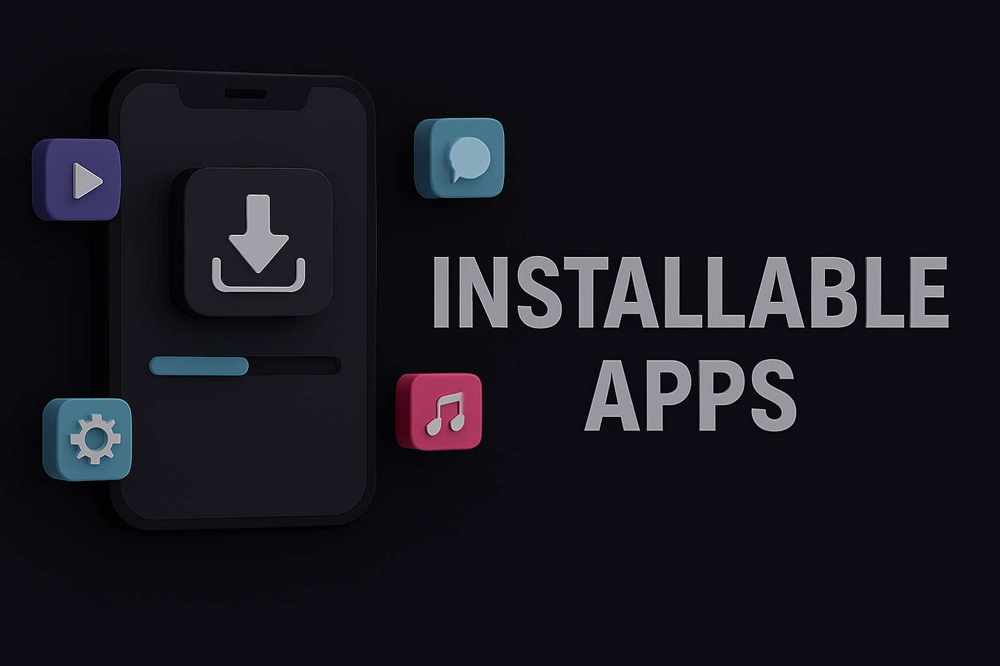
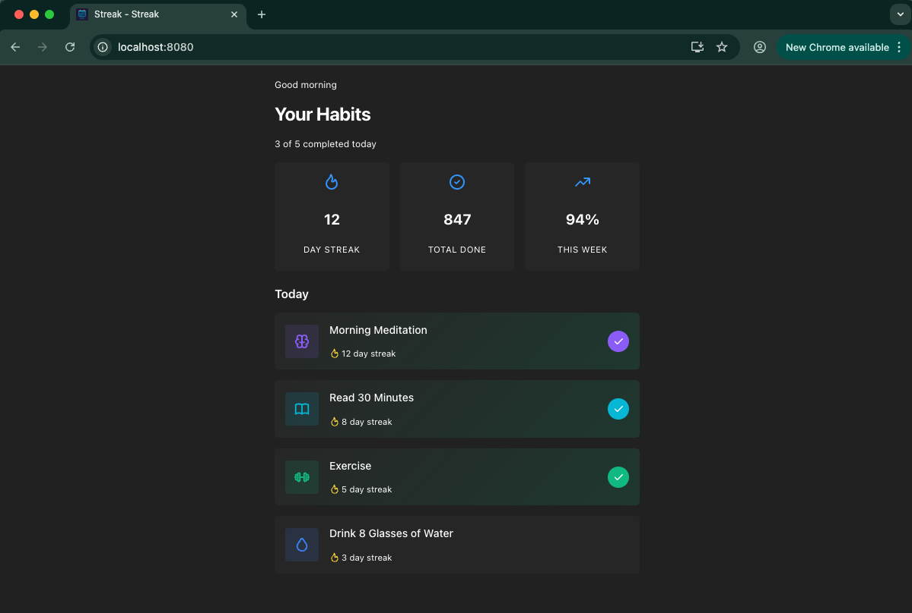
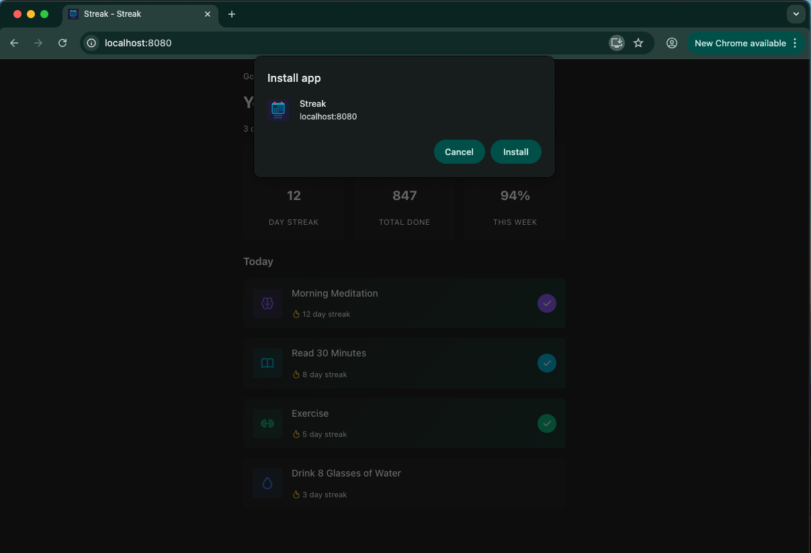
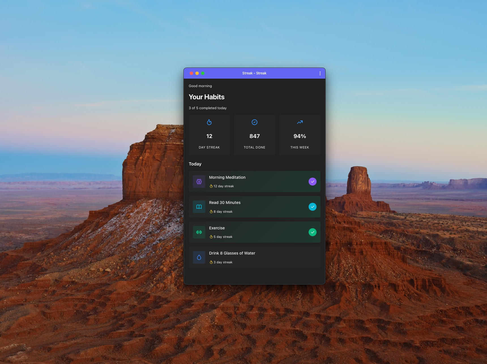

I've been working with webforJ for a while now, mostly on documentation and component demos. But I recently wanted to build something small from scratch to try out a feature I hadn't used yet: installable apps.

The idea is that your web app can be "installed" on a device, kind of like a native app. It gets its own icon on the home screen or in the app launcher, and when you open it, the browser UI is gone. Your app gets its own window.

I built a habit tracker called Streak to test it out. I wanted to see what it takes to make a webforJ app feel like a "real" app instead of a website, and the installable apps feature turned out to be the key piece.

<!-- truncate -->



## The one-annotation setup

The core of installable apps in webforJ is the `@AppProfile` annotation. At minimum, you need a name and a short name:

```java
@AppProfile(
  name = "Streak",
  shortName = "Streak"
)
public class Application extends App {
}
```

The `name` is what shows up in install dialogs and app settings. The `shortName` is for places with limited space, like underneath home screen icons. They can be the same if your app name is already short.

With just this, your app becomes installable. When someone visits it in Chrome (or another browser that supports PWAs), they'll see an install icon in the address bar. Click it, confirm, and the app is installed.



But there's more you can configure, and that's where it gets interesting.

## Colors and the launch experience

When you tap an installed app's icon, there's a brief moment while it loads. During that time, the device shows a splash screen. You can control what that looks like with two properties:

```java
@AppProfile(
  name = "Streak",
  shortName = "Streak",
  themeColor = "#6366f1",
  backgroundColor = "#0f0f23"
)
```

The `backgroundColor` fills the splash screen. For Streak, I used a dark color (`#0f0f23`) that matches the app's background. That way, when the app finishes loading, it doesn't flash from white to dark. It just appears.

The `themeColor` is a bit different. It affects browser and OS UI elements. I set it to an indigo (`#6366f1`) that I was using as an accent color throughout the app.

:::tip Hex Values Only
These have to be hex values, not CSS variables. The `@AppProfile` annotation generates a web manifest file, which is JSON, so it doesn't understand `var(--dwc-color-primary)`.
:::

Getting these colors right matters more than I expected. When they match your app's actual design, the whole experience from icon tap to running app feels cohesive. When they don't match, you get this jarring flash of the wrong color before your UI shows up.

## Display modes

The `display` property controls how much browser UI shows up (or doesn't) when your app runs:

```java
display = ProfileDescriptor.Display.STANDALONE
```

`STANDALONE` is the default, and it's what most apps want. Your app gets its own window with none of the browser chrome. It looks like a native app.

`FULLSCREEN` goes further and uses the entire display area, including where the status bar would normally be. This makes sense for games or video players where you want every pixel.

`MINIMAL_UI` keeps a minimal set of navigation controls. The specific elements vary by browser, but typically include back, forward, and reload buttons. This could be useful if your app doesn't have its own navigation and you want users to be able to go back.

`BROWSER` opens the app in a conventional browser tab or new window. You might use this if you want the home screen icon but don't want to change how the app actually runs.

For Streak, I stuck with `STANDALONE`. It's a simple app with one view, so there was no need for browser navigation.

## Icons

webforJ handles icon sizing for you. You put one icon file at `src/main/resources/icons/icon.png`, and the framework generates the other sizes on the fly using the `icons://` protocol.

:::tip
Request `icons://icon-192x192.png` and it scales your source image to 192x192. Request `icons://icon-512x512.png` and you get 512x512. The default configuration already points to this, so if you drop an `icon.png` in the right folder, it works without adding anything to your `@AppProfile`.
:::

I generated an icon for Streak, dropped it in the folder, and that was it.

## The full setup

Here's what Streak's `Application` class looks like with everything configured:

```java
@Routify(packages = "com.webforj.samples.streak.views")
@StyleSheet("ws://app.css")
@AppTheme("dark-pure")
@AppProfile(
  name = "Streak",
  shortName = "Streak",
  description = "Build better habits, one day at a time",
  themeColor = "#6366f1",
  backgroundColor = "#0f0f23",
  display = ProfileDescriptor.Display.STANDALONE,
  categories = {"lifestyle", "productivity"}
)
public class Application extends App {
}
```



## A note on HTTPS

Installable apps need to be served over HTTPS. Browsers won't offer the install option if your app is running on plain HTTP.

:::note Localhost Exception
During development, you can run on `http://localhost:8080` and everything works fine. The browser knows localhost is a development environment and relaxes the restriction.
:::

When you deploy, you'll need HTTPS. If you're using a platform like Heroku, Render, or most cloud providers, they handle this for you. If you're running your own server, you'll need to set up a certificate.

## What it actually feels like

So after all that, what's the difference?

When I was developing Streak, I had it open in a browser tab like any other web app. It worked fine, but it felt like a website. The browser UI was always there, reminding me I was in Chrome.

After installing it, the experience changed. Clicking the icon on my desktop opened Streak in its own window, with the habit tracker UI filling the screen instead of sitting inside a browser tab.

It's a small thing, but it does feel different. More like a tool I'm using and less like a page I'm visiting.

Whether that matters depends on what you're building. For something like Streak, where the whole point would be checking in daily on habits, having it feel like a "real" app helps with that.

## Screenshots and other options

There's more you can configure that I didn't use for Streak. The `@AppProfile` annotation supports screenshots, which show up in install dialogs to give users a preview of your app. You can specify orientation preferences if your app only works in portrait or landscape.

I didn't need any of that for a simple demo, but it's there if you're building something more substantial.

## Trying it out

If you want to see an installable webforJ app in action before building your own, check out [Focus Tracker](https://github.com/webforj/built-with-webforj/tree/main/webforj-focustracker) in the built-with-webforj repository. It's a Pomodoro timer that uses `@AppProfile` along with some other PWA features like notifications and badge updates.

Clone it, run `mvn jetty:run`, and try installing it. It's a good way to see the full flow without starting from scratch.

For the complete list of `@AppProfile` properties and more detailed examples, the [Installable Apps documentation](/docs/configuration/installable-apps) covers everything.