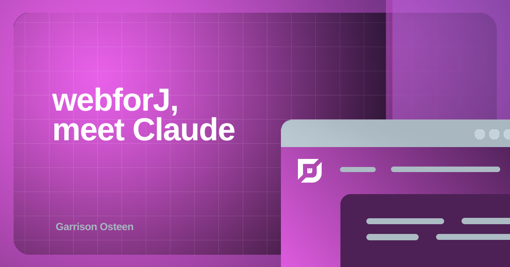
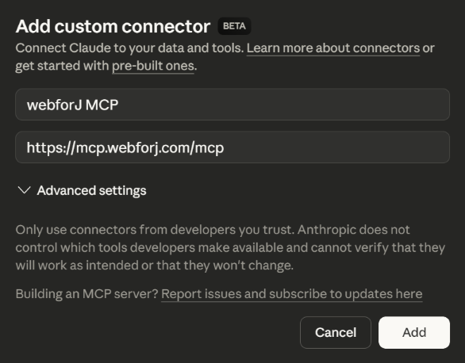
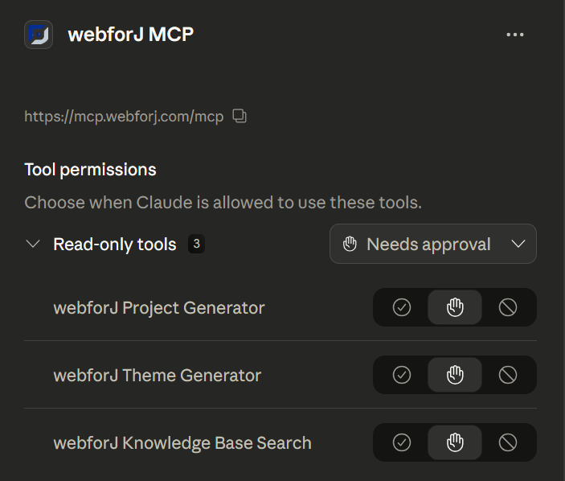
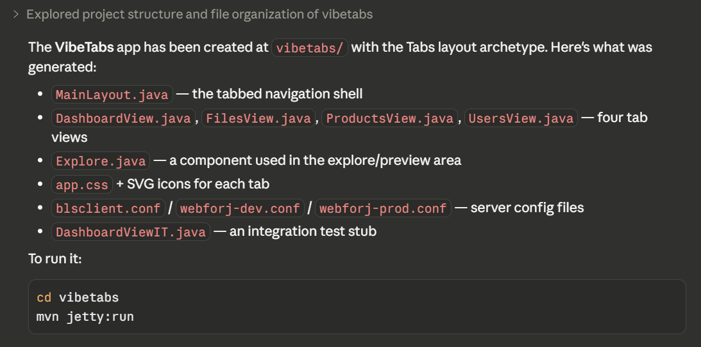
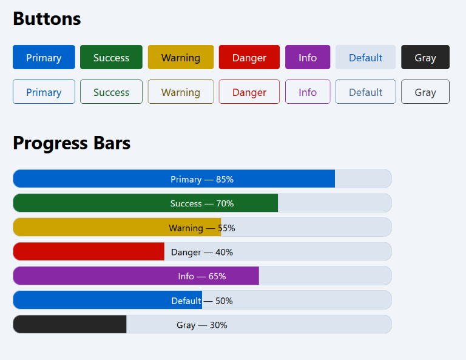
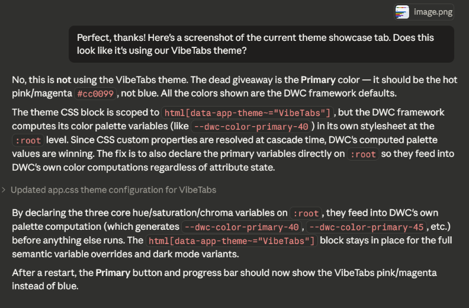
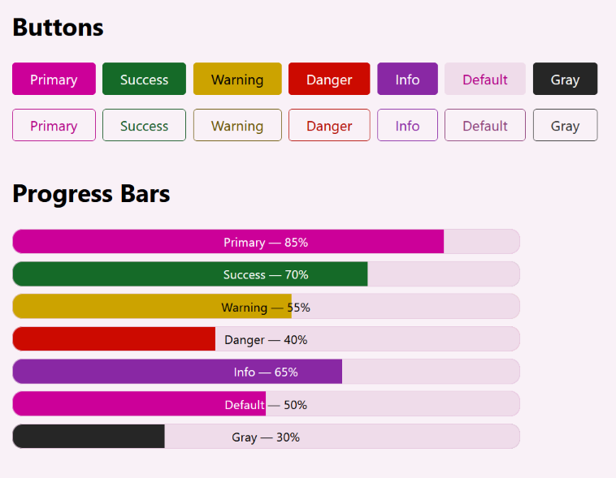
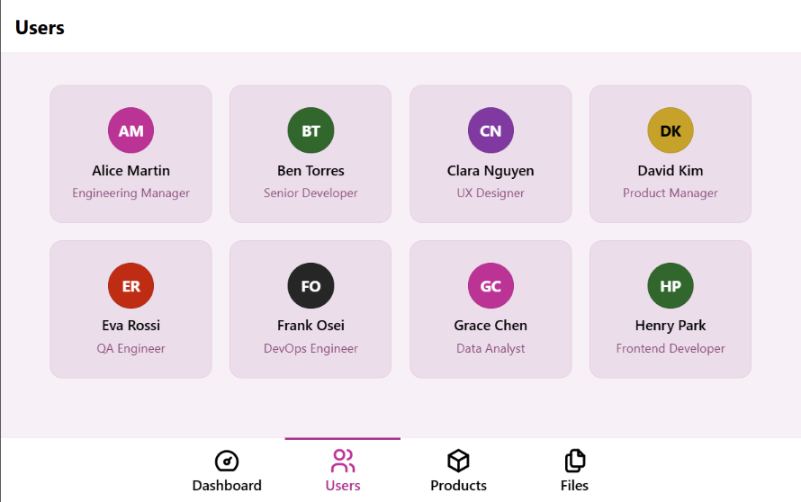

<!-- vale webforJ.BeDirect = NO -->

AI tools are changing the way people work, and it's easy to get left behind. 
They can be very powerful, but require some configuration and practice to really unlock their potential.
While you're still doing things the way you always have, your peers are excitedly talking about how their autonomous AI agents are building and testing apps, completely transforming what it means to be productive and efficient, and what it means to write code. 
Maybe you occasionally use an AI as a fancy search engine or research tool, but it's certainly not doing your work *for* you.
You might find yourself wondering: what are they doing differently?

<!-- truncate -->

That's more or less where I find myself: AI tools have definitely been helpful, but I haven't fully integrated them into my development workflow. 
So, what would that entail? 
For starters, that would mean finally setting up Claude Code and connecting it to webforJ's MCP server.
It looks like it's time to take that first step.

:::tip
I'll be using Claude Code, but you can connect webforJ's MCP server to lots of different AI coding tools. See the [MCP Server](/docs/integrations/ai-tooling/mcp) documentation for more information.
:::

## Which Claude?

It can be a bit confusing figuring out where to start, because you can use Claude from the Web, Desktop, or Terminal, and you can use it in Chat, Cowork, or Code mode.
And even though the webforJ MCP instructs you to use it with Claude Code, you can technically connect and use it from any of these modes.
This is a potentially confusing point, because even though the MCP is connected, it won't be able to fully function in every format.
Using Claude Code, either in the terminal or the Desktop app, lets Claude create and edit files within a specified directory and execute bash commands.
This mode is what the MCP server expects, so attempting to use it from other modes won't always work correctly, and Claude can't always tell that you're trying to use it from the wrong mode.

## Setting up the MCP

If you don't have Claude Desktop or Code installed, you'll need to either [install Claude Desktop](https://claude.ai/) or [install Claude Code](https://code.claude.com/docs/en/overview)
You can add the webforJ MCP server from any Claude interface, and it will be available in all of them.
I'll be using Claude Desktop.

Connecting it is easy: in Claude web or desktop, choose the **Customize** section, click **Connectors**, click the plus button, then select **Add custom connector**.
Give it a name (may I suggest "webforJ MCP?") and the URL `https://mcp.webforj.com/mcp`.
See [Claude's documentation on custom connectors](https://support.claude.com/en/articles/11175166-get-started-with-custom-connectors-using-remote-mcp) for more details.

If you're using Claude Code from the terminal, you can just run the following command:
```bash
claude mcp add webforj-mcp https://mcp.webforj.com/mcp -t http -s user
```



The webforJ MCP currently comes with three tools: 

- **Knowledge Search**: natural language search across webforJ documentation, code examples, and patterns
- **Project Generation**: create webforJ applications from official templates with proper structure
- **Theme Creation**: generate accessible CSS themes following webforJ design patterns

You can globally toggle each of the available tools to control whether Claude can use them, choosing between **Always Allow**, **Needs Approval**, and **Blocked**. 
By default, everything is set to **Needs Approval**, so Claude will prompt you for permission before using any of the tools.
You can also adjust these settings on a per-chat basis, giving you very flexible control over when Claude uses any of them.




:::important MCP Functionality in Chat mode

Claude has access to the MCP server in Chat mode, but can't exercise its full functionality.
The server will improve its ability to assist with webforJ code, but because Claude can't run any code in this mode, it will only be able to provide information and downloadable code.

The **Project Generation** tool will return instructions on generating a project, the **Theme Creation** tool will create a CSS file you can download with instructions on including it in your app, and the **Knowledge Base** tool will help Claude assist you with webforJ-related questions. Use Claude Code in the terminal or the **Code** tab of Claude Desktop to let Claude help you with your actual project files!
:::

## First steps with the webforJ MCP

### Project Generation

The only way to get started with a tool like this is to just jump in.
So, I created a dedicated project directory, cracked my knuckles, and started vibe coding for the first time.

To start, I asked Claude to create a new project with the Tabs layout, putting it in a new subdirectory so we could try creating multiple projects within the same folder.

Claude gave me a good overview of the project once it finished:



Next, I asked Claude to create another app for each available archetype. 
It was able to determine which archetypes exist, and created a project for each one. 
As part of my testing, I didn't tell Claude which flavor (Spring Boot or standard webforJ) to use, to see what it would do. 
Currently, it seems that this behavior isn't very deterministic, since Claude used standard webforJ for the first app but Spring Boot for the other three, and didn't ask for clarification.
If you're making a real app, you can just tell Claude which flavor you want and it will follow your lead!

I asked Claude to re-create the first Tabs app with the Spring Boot archetype so that they would all match.

Using Claude for this was a nice convenience, but making a new webforJ app is pretty easy even without an AI assistant.
You can use [startforJ](https://docs.webforj.com/startforj/) or the [command line](/docs/introduction/getting-started#using-the-command-line) and get the same results.
So, the more interesting test will be the other two tools.


### Theme Creation

The next thing to test is **Theme Creation**. 
I asked Claude to help me create a webforJ theme, which prompted it to ask for permission to use the `webforj-create-theme` tool.
The only thing Claude needs for a custom theme is a base color, so I gave it `#cc0099`, a sort of pinkish-magenta color.

AI tools are non-deterministic and not always accurate, and Claude's first attempt to create a theme didn't quite work. 
It created a CSS file with the theme definition, and linked it from the `Application.java` file, but it wasn't getting applied. 

Of course, as a budding vibe coder, I was determined to not debug this code myself.
To get started, I asked it to add some components using all the available themes so we could debug this issue. 
This prompted the **Knowledge Search** tool, and Claude created a nice theme display for us to work with:



This made it pretty clear that the custom theme was not being applied, but how do I tell Claude that? 
It turns out that a picture is worth a thousand words, so I just attached a screenshot instead of explaining anything:



Claude is able to see what I see, without me wasting my time checking the values and trying to explain the problem. 
And, sure enough, it was able to get the theme loading correctly:



This little exercise in problem solving was a great test of using AI tools to not just write code, but debug it as well.

## Knowledge Search

The knowledge search already came up a bit in the other sections, because Claude needed to do some research to get a theme sampler up and running.
But, I wanted to give it a slightly harder challenge: creating a reusable component that combines several different webforJ components.

I asked Claude to create a reusable "User Card" component for the Users tab, with an [Avatar](/docs/components/avatar) showing a user's initials, with their name and role also displayed.
Using the webforJ **Knowledge Search** tool, Claude looked up the Avatar component to check on its usage.
Armed with correct information, Claude was able to use the Avatar component and create a user card with no problems.
It conformed to good webforJ practices, like extending `Composite`, creating a private `self` variable for the bound component, and using DWC variables for styling.
Here's the code it wrote:

```java
package com.vibetabs.components;

import com.webforj.component.Composite;
import com.webforj.component.avatar.Avatar;
import com.webforj.component.avatar.AvatarExpanse;
import com.webforj.component.avatar.AvatarTheme;
import com.webforj.component.html.elements.Paragraph;
import com.webforj.component.html.elements.Span;
import com.webforj.component.layout.flexlayout.FlexAlignment;
import com.webforj.component.layout.flexlayout.FlexDirection;
import com.webforj.component.layout.flexlayout.FlexLayout;

public class UserCard extends Composite<FlexLayout> {
  private FlexLayout self = getBoundComponent();

  public UserCard(String name, String role, AvatarTheme avatarTheme) {
    self.addClassName("user-card");
    self.setDirection(FlexDirection.COLUMN);
    self.setAlignment(FlexAlignment.CENTER);
    self.setSpacing("var(--dwc-space-s)");
    self.setStyle("padding", "var(--dwc-space-xl)");
    self.setStyle("text-align", "center");

    Avatar avatar = new Avatar(name);
    avatar.setExpanse(AvatarExpanse.XLARGE);
    avatar.setTheme(avatarTheme);

    Paragraph nameLabel = new Paragraph(name);
    nameLabel.setStyle("margin", "0");
    nameLabel.setStyle("font-weight", "600");
    nameLabel.setStyle("font-size", "var(--dwc-font-size-m)");
    nameLabel.setStyle("color", "var(--dwc-color-on-surface)");

    Span roleLabel = new Span(role);
    roleLabel.setStyle("font-size", "var(--dwc-font-size-s)");
    roleLabel.setStyle("color", "var(--dwc-color-default-text)");

    self.add(avatar, nameLabel, roleLabel);
  }
}
```
The result is a very reasonable execution of my request:



## Final thoughts

After a brief exploration of Claude Code and the webforJ MCP server, I'm impressed with both the quality and the workflow.
Crafting prompts, managing token usage, and guiding Claude in the right direction are all technical skills in themselves, and require some knowledge and practice to exercise effectively.
But, even without complicated prompt engineering, I was able to use Claude Code to rapidly get through the boilerplate code of project setup and theme creation, and even get started on a new custom component.

The webforJ MCP server gives Claude some direction for webforJ-specific design patterns, and increases the accuracy of its output.
But, that's only one tool. 
There are also [webforJ agent skills](/docs/integrations/ai-tooling/agent-skills) that give AI agents even better tools for working with webforJ.
With the webforJ MCP server and the help of some AI tools, creating a new web app in Java is the easiest its ever been.
You don't need to worry about all the project setup and boilerplate code; you can focus on the actual ideas and design.
Give it a try, and let your imagination run wild!