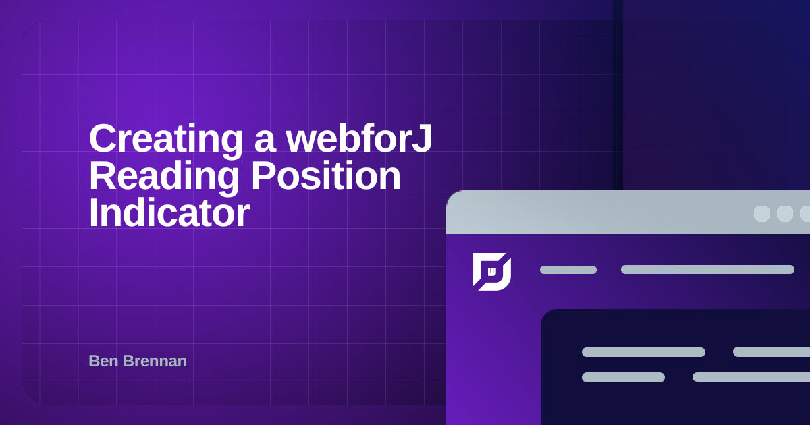

Recently, I was browsing articles on [CSS Tricks](https://css-tricks.com) and came across *[Reading Position Indicator](https://css-tricks.com/reading-position-indicator/)* by Pankaj Parashar.
I've seen this type of indicator in articles, blogs, and in lengthy terms and conditions that I've definitely read through thoroughly. I wanted to try recreating a reading position indicator using webforJ, and see if I could build it in less than 100 lines of code. 

<!-- truncate -->

Including import statements, I managed to keep this project contained within 76 lines of code. Here's how I did it, piece by piece.


## The visuals

### The main component

I knew immediately which webforJ component I wanted to use for this project: the [`ProgressBar`](/docs/components/progressbar) component. Even though it's the most crucial component, it only took a few lines to get it working the way I wanted.

Apart from the logic that determined how far along the page a user was, all I needed to do was set an initial and a maximum value. I decided to start it at `0` and set a maximum value of `100` to represent completing 100% of the article. I also made the maximum value a variable so I could use it later in the project.

```java
private final Integer maxProgressValue = 100;
private final ProgressBar progressBar = new ProgressBar(0, maxProgressValue);
```

### A persistent `Toolbar`

Ok, now that I had the component that would show the progression, I wanted to keep it compact, close to an article header, and anchored at the top of the screen. I knew that if I nested my `ProgressBar` inside a `Toolbar`, as shown in the [`ProgressBar` in toolbars](/docs/components/toolbar#progressbar-in-toolbars) example, I could achieve my goals for compactness and closeness to the article header.

```java
private final Toolbar toolbar = new Toolbar();
toolbar.add(new H3("Reading Position Indicator"), progressBar);
```

To keep it anchored, I decided to style my toolbar with CSS, targeting the web component as it appears in the DOM. Using two `setStyle()` calls for anchoring the toolbar could have saved me some lines of code, as I wouldn't have to use the `@StyleSheet` annotation or wrap my CSS styling in a selector, but I  ultimately decided to keep this project well-organized. I'm glad I made that design choice, because I later decided to style the background color of the `Toolbar`.

```css
dwc-toolbar {
  position: sticky;
  top: 0;
  background-color: var(--dwc-surface-3);
}
```

### Filler content

I had my progress bar anchored at the top of the page, along with the article header. The next thing I needed to add was filler content for the page, enough of it so that the content exceeds the content window's size.

I used a Java loop to generate repeatable filler text that only took up space in the UI, not in my project's code. Also, even though it added more lines, I put the content into a [`FlexLayout`](/docs/components/flex-layout) to make the project look more presentable.

```java
private final FlexLayout content = new FlexLayout();

for (int i = 0; i < 10; i++) {
  Div filler = new Div("Lorem ipsum velit esse cillum dolore ".repeat(50));
  content.add(filler);
}

content
    .setDirection(FlexDirection.COLUMN)
    .setWidth("75vw")
    .setMinWidth(300)
    .setMargin("0 auto");
```

## The logic

### Composite component

Since all the UI needs to go somewhere, I decided to make my [composite component](/docs/building-ui/composite-components) another `FlexLayout`. My composite component also included the scrollbar, so anything larger than the screen will overflow.


```java
public class ReadingIndicatorView extends Composite<FlexLayout> {
  private final FlexLayout self = getBoundComponent();
  public ReadingIndicatorView() {

    self.setDirection(FlexDirection.COLUMN)
        .setStyle("overflow-y", "scroll")
        .setSize("100vw", "100vh")
        .add(toolbar, content);
  }
}
```

### Event listeners

I wanted my `ProgressBar` to react whenever a user scrolled the composite component. This was pretty straightforward, as I could add an event listener directly for the [`scroll` event](https://developer.mozilla.org/en-US/docs/Web/API/Document/scroll_event), queuing up another part of my code that would handle actually setting the values needed for the `ProgressBar`:

```java
self.getElement().addEventListener("scroll", e -> updateProgressBar());
```

There was another event that I wanted my project to listen to: when the size of the viewing window changed. Even if the user didn't scroll through the article, resizing the page changes the scrolled and total article ratio.

However, this is where I ran into a little snag. You see, the [`resize` event](https://developer.mozilla.org/en-US/docs/Web/API/Window/resize_event) in modern browsers is only fired on the `window` object, so I couldn’t register an event listener as I did for the `scroll` event. While my composite component couldn't listen to the `resize` event directly, it could listen to a custom event I created to fire whenever the resize event happened using a small amount of JavaScript.

```java
self.setAttribute("id", "composite-component")
    .getElement()
    .executeJsVoidAsync(
        """
    const compositeComponent = document.getElementById("composite-component");
    window.addEventListener('resize', () => {
      compositeComponent.dispatchEvent(new Event('element-resize'));
      });
    """);

self.getElement().addEventListener("element-resize", e -> updateProgressBar());
```

### Updating the `ProgressBar` value

Finally, I had to write a section of code that calculates the article's current progress, then use that value to update the `ProgressBar`. Looking at the following figure can help visualize how three element properties can be used for the calculation.


The [`scrollHeight`](https://developer.mozilla.org/en-US/docs/Web/API/Element/scrollHeight) is the total height of an element's content, which includes the non-visible portions hidden by overflow. The visible portion of the element’s content is the [`clientHeight`](https://developer.mozilla.org/en-US/docs/Web/API/Element/clientHeight), and [`scrollTop`](https://developer.mozilla.org/en-US/docs/Web/API/Element/scrollTop) is the distance scrolled from the top of the `scrollHeight`.

Reaching the end of an article wouldn't mean the `scrollTop` would be the same value as the `scrollHeight`; it would be the distance of `scrollHeight` minus the `clientHeight`. I used this ratio to scale with the `maxProgressValue` to update the `ProgressBar`.

```java
Double scrollHeight = (Double) self.getProperty("scrollHeight");
Double scrollTop = (Double) self.getProperty("scrollTop");
Double clientHeight = (Double) self.getProperty("clientHeight");

Double maxScroll = scrollHeight - clientHeight;
Double articleProgress = scrollTop / maxScroll * maxProgressValue;

progressBar.setValue(articleProgress.intValue());
```

## Final product and thoughts

The following block of code is the full project of my reading position indicator, made within 100 lines of code. Even when I did need to use JavaScript, it was minimal and contained within my composite component. I hope my project gives you some inspiration for webforJ-focused solutions for your next project.

<Tabs>
  <TabItem value="java" label="Java" default>
    ```java title="ReadingIndicatorView.java"
    @Route()
    @StyleSheet("ws://css/readingIndicatorStyle.css")
    public class ReadingIndicatorView extends Composite<FlexLayout> {
      private final FlexLayout self = getBoundComponent();
      private final Integer maxProgressValue = 100;
      private final ProgressBar progressBar = new ProgressBar(0, maxProgressValue);
      private final Toolbar toolbar = new Toolbar();
      private final FlexLayout content = new FlexLayout();

      public ReadingIndicatorView() {
        toolbar.add(new H3("Reading Position Indicator"), progressBar);
        setContent();
        setupEventHandlers();

        self.setDirection(FlexDirection.COLUMN)
            .setStyle("overflow-y", "scroll")
            .setSize("100vw", "100vh")
            .add(toolbar, content);
      }

      private void setContent() {
        for (int i = 0; i < 10; i++) {
          Div filler = new Div("Lorem ipsum velit esse cillum dolore ".repeat(50));
          content.add(filler);
        }
        content
            .setDirection(FlexDirection.COLUMN)
            .setWidth("75vw")
            .setMinWidth(300)
            .setMargin("0 auto");
      }

      private void setupEventHandlers() {
        self.getElement().addEventListener("element-resize", e -> updateProgressBar());
        
        self.setAttribute("id", "main-article")
            .getElement()
            .executeJsVoidAsync(
                """
            const main = document.getElementById("main-article");
            window.addEventListener('resize', () => {
              main.dispatchEvent(new Event('element-resize'));
              });
            """);

        self.getElement().addEventListener("scroll", e -> updateProgressBar());
      }

      private void updateProgressBar() {
        Double scrollHeight = (Double) self.getProperty("scrollHeight");
        Double scrollTop = (Double) self.getProperty("scrollTop");
        Double clientHeight = (Double) self.getProperty("clientHeight");

        Double maxScroll = scrollHeight - clientHeight;
        Double articleProgress = scrollTop / maxScroll * maxProgressValue;

        progressBar.setValue(articleProgress.intValue());
      }
    }
    ```
  </TabItem>
  <TabItem value="CSS" label="CSS">
    ```css title="readingIndicatorStyle.css"
    dwc-toolbar {
      position: sticky;
      top: 0;
      background-color: var(--dwc-surface-2);
    }
    ```
  </TabItem>
</Tabs>