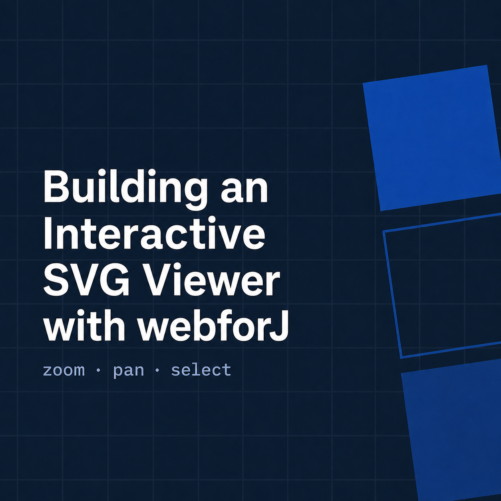
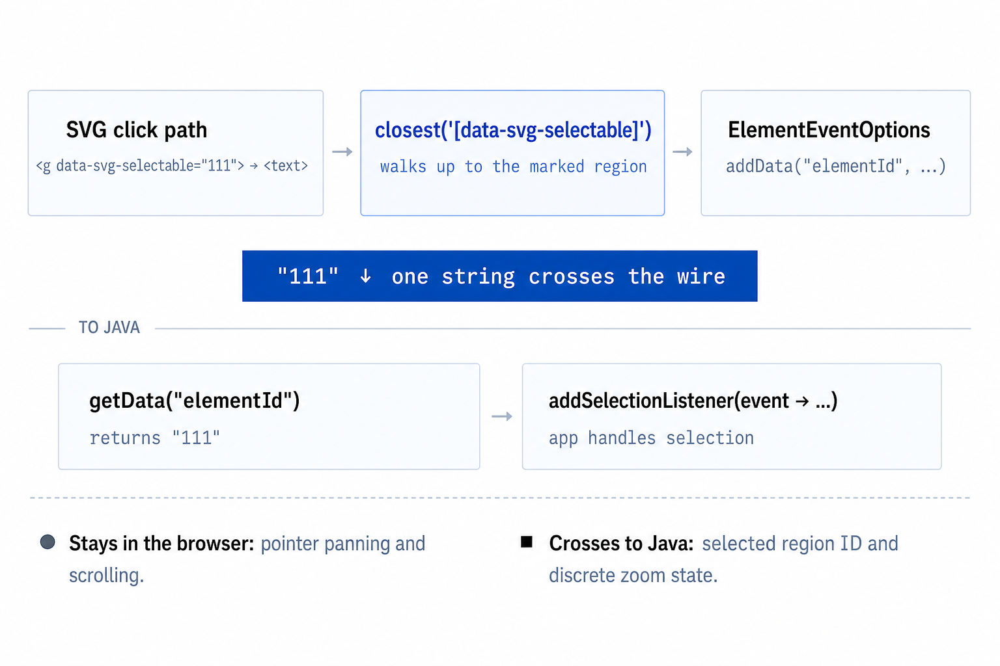

I was building a demo that needed to display an SVG diagram in a webforJ app. At first, that sounded like a straightforward image-loading task. Put the file on the page, give it a size, and move on.

The actual requirement was more interesting. The diagram was larger than its viewport, so users needed to zoom and pan around it. Its individual sections also represented meaningful objects, and the Java app needed to react when a user selected one.

At that point, it wasn't really an image anymore. It was an interactive part of the app.

I could have built all of this directly into the view, but the behavior was self-contained enough to deserve its own component. The result was `SvgViewer`, a reusable webforJ composite that accepts trusted SVG markup, provides zoom and pan controls, and publishes the ID of a selected SVG region as a typed Java event.

<!-- truncate -->

## Starting with a small Java API

Before thinking about the internal layout or JavaScript, I decided what using the component should look like. The surrounding view only creates the viewer, provides SVG content, and listens for selections:

```java
SvgViewer svgViewer = new SvgViewer()
    .setSvgContent(Assets.contentOf("/img/lifecycle-listeners.svg"))
    .setZoomIncrement(0.25);

svgViewer.setSize("600px", "600px");
svgViewer.addSelectionListener(event ->
    openDiagramSection(event.getElementId()));

self.add(svgViewer);
```

The view doesn't need to know how pointer capture works, which element scrolls, or how a browser click becomes a Java value. Those details stay inside `SvgViewer`.

This is the kind of boundary a webforJ [`Composite`](/docs/building-ui/composing-components) is good at creating. The component can be assembled from standard webforJ and HTML components while exposing an API based on what the app actually needs.

## Building and bundling the composite

The Java API owns state and composition, while a small browser component owns pointer interaction. In webforJ 26.01, both authored frontend files are bound to the component with `@BundleEntry`:

```java
@BundleEntry("svg-viewer/svg-viewer.js")
@BundleEntry("svg-viewer/svg-viewer.css")
public class SvgViewer extends Composite<Div>
    implements HasSize<SvgViewer>, HasStyle<SvgViewer> {

  private final EventDispatcher dispatcher = new EventDispatcher();
  private final Element svgContainer = new Element();
  private final Element viewport = new Element("svg-pan-viewport");
  private double zoom = 1.0;
  private double zoomIncrement = 0.1;
  private double zoomMin = 0.2;
  private double zoomMax = 3.0;

  public SvgViewer() {
    Div root = getBoundComponent();
    root.addClassName("svg-viewer");

    Div header = new Div();
    header.addClassName("svg-viewer__header");

    Button plusButton = new Button("+");
    plusButton.setTheme(ButtonTheme.PRIMARY);
    Button minusButton = new Button("-");

    header.add(FlexLayout.create(plusButton, minusButton)
        .horizontal()
        .align().center()
        .build());

    viewport.addClassName("svg-viewer__content");
    svgContainer.addClassName("svg-inner");
    viewport.add(svgContainer);
    root.add(header, viewport);

    plusButton.onClick(event -> setZoom(zoom + zoomIncrement));
    minusButton.onClick(event -> setZoom(zoom - zoomIncrement));
    applyZoom();
  }
}
```

The entries live under `src/main/frontend/svg-viewer`. The webforJ Maven plugin compiles them, runs their frontend tests, and loads them when `SvgViewer` is used:

```xml
<plugin>
  <groupId>com.webforj</groupId>
  <artifactId>webforj-maven-plugin</artifactId>
  <version>${webforj.version}</version>
  <extensions>true</extensions>
</plugin>
```

Implementing `HasSize` and `HasStyle` lets callers size and position the composite like other webforJ components without exposing its internal root `Div`.

## Making intended SVG regions selectable

An SVG displayed through an `` element is useful when it only needs to be seen. It isn't enough when the app needs to identify groups and paths inside it. The SVG markup needs to be part of the page's DOM:

```java
public SvgViewer setSvgContent(String svgContent) {
  svgContainer.setHtml(
      Objects.requireNonNull(svgContent, "svgContent"));
  return this;
}
```

`setHtml()` must only receive content the app trusts. In this demo, the SVG is packaged with the app and loaded using `Assets.contentOf()`. Uploaded or externally supplied SVG must be sanitized before insertion.

Not every SVG `id` represents something the app should select. Definitions, masks, and drawing tools can introduce internal IDs, so the component uses an explicit `data-svg-selectable` contract:

```xml
<g id="111" data-svg-selectable="111">
  <rect x="70" y="80" width="250" height="48" rx="24" />
  <text x="195" y="110">onWillRun Hook</text>
</g>
```

The attribute value is the app-level identifier. A user can click the group itself or any nested shape or label and get the same result.

## Sending a typed selection event to Java



The listener is attached to the viewport because clicks from the inline SVG bubble to it. [`ElementEventOptions`](/docs/building-ui/events#configuring-element-events) filters out unmarked targets and extracts only the value Java needs:

```java
ElementEventOptions selectionOptions = new ElementEventOptions()
    .addData("elementId",
        "event.target.closest('[data-svg-selectable]')"
            + "?.dataset.svgSelectable || ''")
    .setFilter(
        "Boolean(event.target.closest('[data-svg-selectable]'))");

viewport.addEventListener("click", event -> {
  Object value = event.getData().get("elementId");
  if (value instanceof String elementId && !elementId.isBlank()) {
    dispatcher.dispatchEvent(new SelectionEvent(this, elementId));
  }
}, selectionOptions);
```

The browser resolves the nearest explicitly selectable ancestor before the event travels to the server. The composite then turns that DOM event into a domain event with a removable registration:

```java
public ListenerRegistration<SelectionEvent> addSelectionListener(
    EventListener<SelectionEvent> listener) {
  return dispatcher.addListener(SelectionEvent.class, listener);
}

public static final class SelectionEvent extends EventObject {
  private final String elementId;

  private SelectionEvent(SvgViewer source, String elementId) {
    super(source);
    this.elementId = elementId;
  }

  public String getElementId() {
    return elementId;
  }
}
```

Unlike a single stored `Consumer`, `EventDispatcher` supports multiple listeners and returns a `ListenerRegistration` that callers can remove when their own lifecycle ends.

## Keeping drag-to-pan in the browser

Selection is meaningful to Java, but dragging is continuous browser interaction. Sending every pointer movement to the server would add traffic without adding useful app state.

The bundled `svg-pan-viewport` custom element owns that interaction. It initializes once per element, removes every handler when disconnected, and keeps all drag state on the instance:

```javascript
import { exceedsDragThreshold } from "./drag-state.js";

class SvgPanViewport extends HTMLElement {
  #drag = null;
  #suppressClick = false;

  connectedCallback() {
    if (this.dataset.panReady === "true") return;

    this.dataset.panReady = "true";
    this.addEventListener("pointerdown", this.#onPointerDown);
    this.addEventListener("pointermove", this.#onPointerMove);
    this.addEventListener("pointerup", this.#onPointerEnd);
    this.addEventListener("pointercancel", this.#onPointerEnd);
    this.addEventListener("click", this.#onClick, true);
  }

  disconnectedCallback() {
    this.removeEventListener("pointerdown", this.#onPointerDown);
    this.removeEventListener("pointermove", this.#onPointerMove);
    this.removeEventListener("pointerup", this.#onPointerEnd);
    this.removeEventListener("pointercancel", this.#onPointerEnd);
    this.removeEventListener("click", this.#onClick, true);
    delete this.dataset.panReady;
    this.#drag = null;
    this.#suppressClick = false;
  }

  #onPointerDown = (event) => {
    if (!event.isPrimary ||
        (event.pointerType === "mouse" && event.button !== 0)) {
      return;
    }

    this.#drag = {
      pointerId: event.pointerId,
      startX: event.clientX,
      startY: event.clientY,
      lastX: event.clientX,
      lastY: event.clientY,
      moved: false,
    };
  };

  #onPointerMove = (event) => {
    if (!this.#drag || event.pointerId !== this.#drag.pointerId) return;

    if (!this.#drag.moved) {
      this.#drag.moved = exceedsDragThreshold(
        this.#drag.startX,
        this.#drag.startY,
        event.clientX,
        event.clientY,
      );
      if (this.#drag.moved) {
        this.setPointerCapture(event.pointerId);
        this.classList.add("is-panning");
      }
    }

    if (!this.#drag.moved) return;

    event.preventDefault();
    this.scrollLeft -= event.clientX - this.#drag.lastX;
    this.scrollTop -= event.clientY - this.#drag.lastY;
    this.#drag.lastX = event.clientX;
    this.#drag.lastY = event.clientY;
  };

  #onPointerEnd = (event) => {
    if (!this.#drag || event.pointerId !== this.#drag.pointerId) return;

    this.#suppressClick = event.type === "pointerup" && this.#drag.moved;
    this.classList.remove("is-panning");
    if (this.hasPointerCapture(event.pointerId)) {
      this.releasePointerCapture(event.pointerId);
    }
    this.#drag = null;
  };

  #onClick = (event) => {
    if (this.#suppressClick) {
      this.#suppressClick = false;
      event.preventDefault();
      event.stopImmediatePropagation();
    }
  };
}

if (!customElements.get("svg-pan-viewport")) {
  customElements.define("svg-pan-viewport", SvgPanViewport);
}
```

Pointer capture starts only after the movement threshold is crossed. Capturing on `pointerdown` would retarget a normal click to the viewport and lose the nested SVG target. Once a real drag starts, capture keeps the gesture active outside the viewport, and the following synthetic click is stopped before it can become a selection.

Because each `SvgPanViewport` stores its own state, multiple viewers can pan independently on the same page.

## Zooming with validated bounds

Zoom remains Java-owned state because button clicks are discrete actions. The setter validates finite values, clamps them to the configured range, and returns the component for fluent configuration:

```java
public SvgViewer setZoom(double value) {
  requireFinite(value, "zoom");
  zoom = Math.clamp(value, zoomMin, zoomMax);
  applyZoom();
  return this;
}

private void applyZoom() {
  svgContainer.setStyle("transform", "scale(" + zoom + ")");
  svgContainer.setStyle("transform-origin", "top left");
}

public SvgViewer setZoomIncrement(double increment) {
  requirePositive(increment, "zoomIncrement");
  zoomIncrement = increment;
  return this;
}
```

`setZoomMin()` and `setZoomMax()` reject inverted ranges and reclamp the current zoom after a bound changes. That prevents invalid configuration from leaving the component in a state the controls can't reproduce.

## Making the component look at home

The component's CSS uses webforJ design tokens instead of hardcoded theme colors:

```css
.svg-viewer {
  border: 1px solid var(--dwc-color-default);
  border-radius: var(--dwc-border-radius);
  overflow: hidden;
  background: var(--dwc-surface-1);
  display: flex;
  flex-direction: column;
}

.svg-viewer__header {
  background: var(--dwc-surface-3);
  border-bottom: thin solid var(--dwc-color-default);
  padding: var(--dwc-space);
  flex-shrink: 0;
}

.svg-viewer__content {
  cursor: grab;
  display: block;
  flex: 1;
  min-height: 0;
  overflow: auto;
  touch-action: none;
}

.svg-viewer__content.is-panning {
  cursor: grabbing;
}

.svg-inner {
  display: inline-block;
  min-height: 100%;
  min-width: 100%;
  transition: transform 0.2s ease;
}
```

The viewer follows the active theme without maintaining separate light and dark styles. `touch-action: none` also lets the pointer implementation handle finger-driven panning consistently.

## Testing the component boundaries

The sample tests each layer at the level where it can fail:

- Java unit tests verify fluent setters, clamping, invalid ranges, `NaN`, and infinite values.
- A Bun test verifies that small pointer jitter remains a click and movement at the threshold starts a drag.
- Playwright tests run against the packaged frontend bundle. They verify zoom bounds, independent viewer instances, selection from nested SVG text, actual viewport scrolling, and suppression of selection after dragging.

This coverage matters because the difficult failures cross boundaries. A Java-only test can't prove that the custom element registered, and a JavaScript-only test can't prove that the selected ID reached a typed Java listener.

## From a one-off requirement to a reusable component

The Java side owns the public API, state, controls, and app-facing selection event. CSS owns layout and theme integration. JavaScript handles only the continuous browser interaction that benefits from staying local. `ElementEventOptions` carries the one value the server needs across that boundary.

The result is a component whose vocabulary matches the problem: display this trusted diagram, let the user explore it, and tell the app which marked region they selected.

## Get the source code

The complete sample includes two viewer instances and Java, Bun, and Playwright tests:

[View the SvgViewer source code](https://github.com/EHandtkeBasis/SvgViewer)

Run it in development mode with:

```bash
mvn compile webforj:watch jetty:run
```

Then open [http://localhost:8080](http://localhost:8080).
