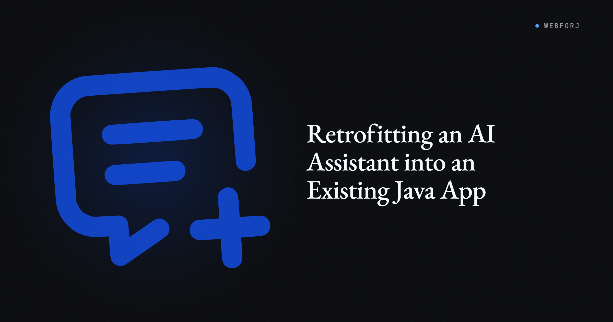

The request usually lands vague: leadership wants AI in the app. A day of back-and-forth resolves it into something concrete, a chat feature where users can ask questions and get streaming, well-formatted answers grounded in the app's own domain.

What most tutorials skip is what the feature looks like end to end: the streaming UI, the cancel behavior, the prompt shape, the error surface, and how it all hangs together in a real Java app. This post uses [`ghost:ai`](https://github.com/webforj/built-with-webforj/tree/main/webforj-ghostai), a small open-source reference project in the built-with-webforJ collection, as the running example. Every code snippet is real code from that project.


<!-- truncate -->

## What ghost:ai actually is

A single-page chat app: text area at the bottom, streaming markdown response in the middle, thinking indicator while the model works. The webforJ MCP server is called for documentation lookups so answers about webforJ come from current docs rather than the model's training data. The full source is one Spring Boot entry class, one view, two services, and a handful of UI components — small enough to read in one sitting.

## The chat service

The core of the feature is one Spring service that wraps Spring AI's `ChatClient`:

```java
@Service
public class ChatService {
  private static final String CONVERSATION_ID = "default";
  private final ChatClient chatClient;
  private final ChatMemory chatMemory;

  public ChatService(ChatModel chatModel, ToolCallbackProvider toolCallbackProvider) {
    this.chatMemory = MessageWindowChatMemory.builder().build();
    this.chatClient = ChatClient.builder(chatModel)
        .defaultSystem("""
            // ... role + tool-usage instructions ...
            """)
        .defaultAdvisors(MessageChatMemoryAdvisor.builder(chatMemory).build())
        .defaultToolCallbacks(toolCallbackProvider)
        .build();
  }

  public Flux<String> stream(String message) {
    return chatClient.prompt()
        .user(message)
        .advisors(a -> a.param(ChatMemory.CONVERSATION_ID, CONVERSATION_ID))
        .stream()
        .content();
  }
}
```

The system prompt is where the feature is actually defined. It has two blocks: a role statement giving the assistant a personality, and an explicit tool-usage block telling the model to always call `webforj_knowledge_base` first, reminding it that its training data is outdated, and instructing it to say "I don't know" instead of guessing. Skip that block and the assistant hallucinates about webforJ features that don't exist.

`MessageWindowChatMemory` gives you a sliding window of recent messages in one line, and `MessageChatMemoryAdvisor` wires it into every request. For per-user memory, derive `CONVERSATION_ID` from request context. `stream()` returns a `Flux<String>` so users see text appear token by token instead of waiting for the whole response.

## The MCP piece

Spring AI auto-wires a `ToolCallbackProvider` from any registered MCP clients. ghost:ai's `application.properties` registers one:

```properties
spring.ai.mcp.client.enabled=true
spring.ai.mcp.client.name=webforj-chat
spring.ai.mcp.client.streamable-http.connections.webforj.url=https://mcp.webforj.com
spring.ai.mcp.client.streamable-http.connections.webforj.endpoint=/mcp
```

Spring AI connects to `mcp.webforj.com`, discovers `webforj_knowledge_base`, and hands it to the `ChatClient`. The chat service never touches the tool directly — the MCP server describes itself. That beats stuffing documentation into the prompt as static context, because the knowledge base changes on the server and the client never has to redeploy to pick up new docs.

## The view: streaming, thinking, cancel

<video src="https://cdn.webforj.com/webforj-documentation/blogs/webforj-v25.11/ghsot-ai.mov" autoPlay muted loop playsInline style={{width: '100%', borderRadius: '8px', marginBottom: '1rem'}}></video>

Streaming raw tokens into a Java UI is where features usually go wrong. ghost:ai uses webforJ's `MarkdownViewer`, which renders markdown progressively as text is appended. Two flags matter: `setAutoScroll(true)` keeps the newest text in view as the response grows, and `setProgressiveRender(true)` renders markdown as it streams in, so code fences and lists appear formatted rather than raw text.

When the user hits send, the view starts the stream and shows a thinking indicator until the first chunk arrives:

```java
private void handleSend(String message) {
  // ...
  showThinking();
  firstChunkReceived = false;
  chatInput.setState(ChatInput.State.STREAMING);

  currentSubscription = chatService.stream(message)
      .doOnNext(chunk -> {
        if (!firstChunkReceived) {
          firstChunkReceived = true;
          hideThinking();
        }
        markdownViewer.append(chunk);
      })
      .doOnError(error -> {
        hideThinking();
        markdownViewer.setVisible(true);
        markdownViewer.append("*Error: " + error.getMessage() + "*");
        currentSubscription = null;
        chatInput.setState(ChatInput.State.IDLE);
        chatInput.focusInput();
      })
      .doOnComplete(() -> {
        currentSubscription = null;
        markdownViewer.whenRenderComplete().thenAccept(v -> {
          chatInput.setState(ChatInput.State.IDLE);
          chatInput.focusInput();
        });
      })
      .subscribe();
}
```

Failure paths get real UI treatment. An error becomes an italicized message in the response, the input returns to idle, and focus goes back to the text area. Silent failure — a spinning wheel that never resolves — is the worst outcome, and this handler prevents it.

`whenRenderComplete()` is small but load-bearing. Because progressive rendering means markdown is still animating in after the model finishes streaming, re-enabling the input the moment `.doOnComplete` fires would let the user send the next message before the previous one is done rendering. `whenRenderComplete()` waits for the animation to settle first.

**Cancel actually cancels.** The `Disposable` returned by `subscribe()` is stored, and the stop button tears the whole thing down:

```java
private void handleStop(Void v) {
  if (currentSubscription != null) {
    currentSubscription.dispose();
    currentSubscription = null;
  }
  hideThinking();
  markdownViewer.setVisible(true);
  markdownViewer.stop();
  chatInput.setState(ChatInput.State.IDLE);
  chatInput.focusInput();
}
```

Disposing the subscription cancels the upstream stream. `markdownViewer.stop()` halts the progressive-rendering animation. Together they leave the UI in a state the user can immediately act on.

## Ghost text in the input

As the user types, faded suggestion text appears completing what they might want to ask. Hit Tab to accept, keep typing to ignore. A second, smaller `ChatClient` drives it via a dedicated `PredictionService` with an autocomplete-focused system prompt (see the repo for the full instructions).

The interesting part is how this gets wired in. Firing a prediction on every keystroke would spam the API, so the input debounces through a `ScheduledExecutorService`:

```java
textArea.onValueChange(e -> {
  // ... cancel any pending prediction ...

  String input = e.getValue();
  if (input == null || input.trim().length() < 10 || state != State.IDLE) {
    textArea.setPredictedText("");
    return;
  }

  pendingPrediction = debouncer.schedule(() -> Environment.runLater(() -> {
    String prediction = predictionService.predict(input);
    if (prediction != null && !prediction.isEmpty()) {
      textArea.setPredictedText(prediction);
    }
  }), 250, TimeUnit.MILLISECONDS);
});
```

Each keystroke cancels the pending prediction and schedules a new one 250ms out. Only when the user pauses does the API call fire. `Environment.runLater()` marshals the result back onto the UI thread, and `setPredictedText()` renders the faded suggestion. Users press Tab to accept or keep typing to overwrite.

## Retrofitting this into an existing app

ghost:ai is a full-page chat, but the pattern is portable. In an app that already has a UI, put a `MarkdownViewer` plus a text input inside a `Drawer` on the right edge, open it from a button in your toolbar, and wire it to a `ChatService` scoped to whatever domain data the current user can see. Swap the MCP tool provider for one connected to your own services, or drop it and put domain context in the system prompt.

The permission story matters here. Because the chat service is just another Spring bean, any domain data it accesses goes through the same repositories and service methods your existing UI uses. Same `@PreAuthorize`, same tenant scoping, same audit trail.

## Get the source

**[View webforj-ghostai on GitHub](https://github.com/webforj/built-with-webforj/tree/main/webforj-ghostai)**

You'll need Java 21, Maven 3.9+, and a Mistral API key. `mvn spring-boot:run` starts the app on `http://localhost:8080`. Swap the model provider in `application.properties` for OpenAI, Anthropic, or a local Ollama if you'd prefer.

For deeper reading, see the [`MarkdownViewer` docs](/docs/components/markdownviewer), the [`TextArea` predicted-text guide](/docs/components/textarea#predicted-text), and [Spring AI's tool-calling reference](https://docs.spring.io/spring-ai/reference/api/tools.html).
