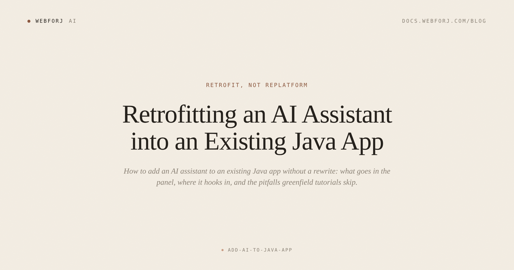
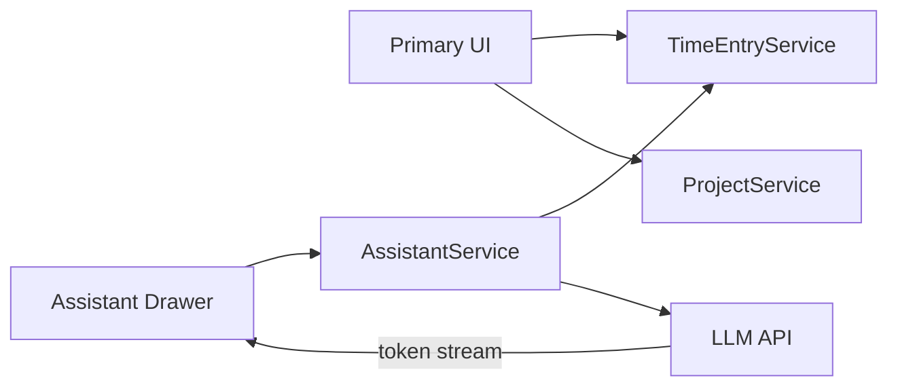

The request landed on a Tuesday, in a Slack message vague enough to be anything: "leadership wants AI in the app." A day later, after some back-and-forth, it resolved into something concrete — an assistant panel somewhere in the UI that lets users ask questions about their own data. Not a chatbot with a personality. Not embeddings and semantic search. Just: ask a question, get a sensible answer drawn from what the user can already see.

If you've been building Java apps for a while, you know this request. And if you've gone looking for help, you've probably found the same pile of tutorials: build an AI app from scratch. New project, new dependencies, greenfield setup. Those tutorials are good for what they are. They answer a different question than the one your team is actually asking.

The question your team is asking is a retrofit question. You have a working app — users, a domain model, service layers, years of business logic. How do you add an assistant panel to *that*?

<!-- truncate -->

## What's actually in an assistant panel

Before thinking about where it goes, it helps to be concrete about what it is. An assistant panel is not a chat app. It's not a RAG pipeline. It's not a semantic search index.

At minimum, it has four things:

- A text input for the question
- An output area that fills in as the response streams in
- A cancel button that actually works
- An error state that's visible — not silent

That's the whole thing. The input/output loop is structurally identical to a search form, with two differences: the response takes longer, and the output is generated rather than retrieved. Both of those differences have UX consequences we'll get to.

What it's *not* is important too. It's not a multi-turn conversation with memory across sessions (unless you build that). It's not an agent that can take actions (unless you build that). It's not semantic search across your data (unless you build that). Every "while you're at it" that gets added to the panel is scope creep, and scope creep is how a retrofit becomes a rewrite.

## Where the panel lives in the UI

The answer that's worked well in practice: the end-drawer. A panel that slides in from the right edge of the screen, available on any view, opened by a button in the toolbar.

The argument for this placement is pragmatic. The assistant is auxiliary to whatever the user is doing — they're looking at a time-entry list, a project dashboard, an invoice — and an end-drawer doesn't fight the primary interface. It's available on intent, visible on demand, and dismissible when the user is done.

In webforJ, this is a standalone `Drawer` component at `Placement.RIGHT`, opened by a button in the app's header toolbar:

```java
private final Drawer assistantDrawer = new Drawer("AI Assistant");
private final Button openAssistant = new Button("Ask AI");

private void wireAssistantDrawer() {
    assistantDrawer.setPlacement(Drawer.Placement.RIGHT);
    assistantDrawer.add(new AssistantPanel());

    openAssistant.onClick(e -> assistantDrawer.open());
}
```

The `AssistantPanel` is its own composite component — input, output, controls — and the `Drawer` is the container that decides where it appears in the layout. Drawers in webforJ stack independently, so the assistant drawer coexists with the navigation drawer on the left without conflict.

The shape of the panel itself is small:

```java
public class AssistantPanel extends Composite<FlexLayout> {
    private final TextField question = new TextField();
    private final Div answer = new Div();
    private final Button send = new Button("Ask");
    private final Button cancel = new Button("Cancel");

    public AssistantPanel() {
        FlexLayout self = getBoundComponent();
        self.setDirection(FlexDirection.COLUMN);

        send.onClick(e -> onAsk());
        cancel.onClick(e -> onCancel());
        self.add(answer, question, send, cancel);
    }

    private void onAsk() {
        String q = question.getValue();
        question.setValue("");
        answer.setText("…");
        // delegate to AssistantService, update answer as tokens arrive
    }

    private void onCancel() {
        // cancel the in-flight LLM request
        assistantDrawer.close();
    }
}
```

A few things are intentionally absent from this sketch: message history, markdown rendering, auto-scroll. Those belong in a full chat UI. This is a retrofit assistant panel — smaller scope, sooner in production.

## What the assistant reads, and through which methods

This is the load-bearing part of the retrofit pattern.

The assistant should read domain data through the same service methods the rest of your UI calls — not through a new data access path built specifically for it.

```java
@Service
public class AssistantService {
    private final TimeEntryService timeEntryService;

    public void answer(String question, User user, Consumer<String> onToken) {
        // Same method the UI calls — same permission checks, same tenant scope
        List<TimeEntry> recent = timeEntryService.findRecentForUser(user, 30);
        String prompt = buildPrompt(question, recent);
        // call LLM API, stream tokens to onToken
    }

    private String buildPrompt(String question, List<TimeEntry> entries) {
        // format entries as context, prepend scope statement
        return "...";
    }
}
```

Because `AssistantService` calls `TimeEntryService.findRecentForUser()`, it gets the same `@PreAuthorize` checks (or Spring Security filter), the same tenant scoping, the same audit log entries. No new permission code written. No new database query. No new API endpoint.



One new box. The arrows from the new box into the domain go through the same service methods the UI already calls.

The permission-shaped read is not a nice property of this pattern — it *is* the property. Teams that build a new data access path specifically for the AI assistant do it because they started from a greenfield tutorial, where there was no existing service layer. You have one. Call it.

## What actually goes in the prompt

Here is where teams overcorrect. They pull in large amounts of data — whole tables, full schemas, everything the assistant *might* need — and the prompts balloon, latency rises, and the answers don't improve proportionately.

The prompt for a retrofit assistant panel is narrow by design:

1. **A scope statement.** One to three sentences: what the assistant can answer, and what it cannot. "You are an assistant for the time-tracking module. You can answer questions about the time entries visible to this user. You cannot modify data, access other modules, or answer general questions outside this domain."
2. **The user's current context.** Which view are they on? Which record is in focus? This is the signal that makes the assistant useful without pulling in a larger dataset.
3. **The relevant data returned from the domain method.** Not raw rows — a formatted summary of what's useful for this question, derived from what the service already returned.

The scope statement matters more than it appears to. When the LLM gets a question outside the declared scope, it says so rather than hallucinating an answer from training data. That behavior is not automatic — the model follows the scope statement because you put it there.

## The error surface just changed

Your app, before the assistant, had a deterministic error surface: form validation, network timeouts against your own API, database errors wrapped in a friendly message. You knew the shape of what could go wrong.

After the assistant panel ships, the error surface is wider:

- LLM API rate limit — "try again in a moment"
- Stream timeout — the model started but didn't finish — show what arrived, offer retry
- Malformed stream chunk — log, recover, don't show raw bytes
- Model refusal — the LLM declined the request — "I can't answer that" not a stack trace
- Hallucinated answer — structurally correct, factually wrong — your scope statement limits the blast radius; you cannot detect this programmatically

Each failure mode looks different to the user and needs a different message. The worse failure mode is not any of these individually — it's silent failure. The assistant returns nothing, the output area stays empty, and the user doesn't know whether to try again or whether the feature is broken. Visible failure with a specific message beats silence every time.

## Scope creep is the pattern that eats retrofits

The assistant ships. Users like it. Then, in the next sprint:

- "Can the assistant also answer questions about invoices?" — a different module
- "Can it see the user's full history, not just recent entries?" — bigger context window, more latency, more cost
- "Can it write entries, too?" — agency, a fundamentally different trust model
- "Can it send a summary email?" — cross-system actions, a different pattern entirely

Each of these is reasonable on its own. Together, they turn a two-week retrofit into a six-month project. Some of them — the ones that add agency, that require semantic search across large data volumes, that need cross-module access outside your permission model — are genuinely different posts, different patterns, different architectural commitments.

The place to draw the line is in the UI itself. The scope statement in the prompt tells the model where the boundary is. The component's label tells the user. If you call it "Ask about your time entries," users expect it to answer questions about time entries. When it declines a question about invoices, that's not a bug — that's the scope, working. Make it visible, and users will calibrate to it.

## Latency is a UX property now

A domain read that took 40ms is now followed by a streaming LLM response that takes two to eight seconds. That's not a performance regression — it's inherent to the pattern — but the UI has to account for it.

Three affordances the assistant panel needs that the rest of your UI doesn't:

**A visible thinking state, local to the panel.** Not a spinner over the whole page — something that signals "the assistant is working" without blocking the rest of the interface. The user should be able to keep reading the list while the response generates.

**A cancel that actually cancels.** If the user navigates away or closes the drawer while a response is generating, the LLM call should stop. Not degrade gracefully — actually stop. LLM APIs expose this via request cancellation. A response that keeps streaming after the user closed the panel is wasted cost and a resource leak.

**No blocking modals.** Wire the assistant to a modal dialog, and the rest of the app freezes while the response generates. The drawer pattern avoids this by design — the panel slides in alongside the existing UI, not over it.

## Where this pattern breaks down

The retrofit pattern works for one shape of assistant: a user asks a question about data they could already see if they looked at the right screen, and gets a synthesized answer drawn from data the service method already has access to. That covers most of what teams actually want from a first assistant.

It starts to break down when:

- **The question requires data no existing service method can easily fetch.** "Compare my performance against the team average" — if no service computes that, you're either building a new method (which may be appropriate) or pulling in data the assistant shouldn't see.
- **The question requires fuzzy semantic search.** "Find all entries related to the rebranding project" — if projects aren't tagged consistently, you need embeddings and a vector store. That's a different architecture, not a retrofit add-on.
- **The user wants the assistant to take actions.** "Book the next two hours to Project Alpha" — write operations require a different trust model, confirmation UX, and error-handling strategy. Building this right is a separate problem.

Hitting these cases isn't failure — it's discovering what the second version of the feature looks like. The retrofit gives you the first version, in production, in weeks. The harder versions follow from a foundation that's already running.

## When the assistant is the product

Sometimes it is. Some apps are AI-first — the assistant is the interface, not an addendum to it. If your users will interact primarily through natural language, and the primary UI is conversational, then greenfield is the right shape. Build for that.

The retrofit pattern is for the other case: the app has a primary UI that works, users have habits built around it, and the assistant is an accelerant for specific workflows. That's most enterprise Java apps that are "getting AI" right now. The request isn't "rebuild the app as a chatbot." It's "add a panel that makes the app smarter about the data users are already looking at."

Those are different problems. Conflating them is how teams end up building more than they needed.

## What you leave with

A retrofit assistant panel in an existing Java app is one new service class, one new composite component, and a standalone `Drawer` added to your layout. The assistant reads through your existing service layer — same permission checks, same tenant scoping, no new data access path. The UI is non-blocking, surfaces a visible working state, and fails with a specific message when something goes wrong.

That's a week of work, not a quarter. It goes into production without touching the core of your app. The scope creep, the error surface, the latency affordances — those are the parts the greenfield tutorials skip, because none of that applies in a greenfield. It applies in yours.

If you want to go deeper on the streaming primitive — how to wire a real token stream from an LLM API into a Java UI — the [java-llm-streaming post](/blog/java-llm-streaming) covers that end-to-end. For the full chat treatment inside the drawer, including multi-turn conversation and message history, see the [java-chat-ui post](/blog/java-chat-ui). For the broader modernization frame this retrofit fits into, [java-desktop-to-web](/blog/java-desktop-to-web) is the pillar.
