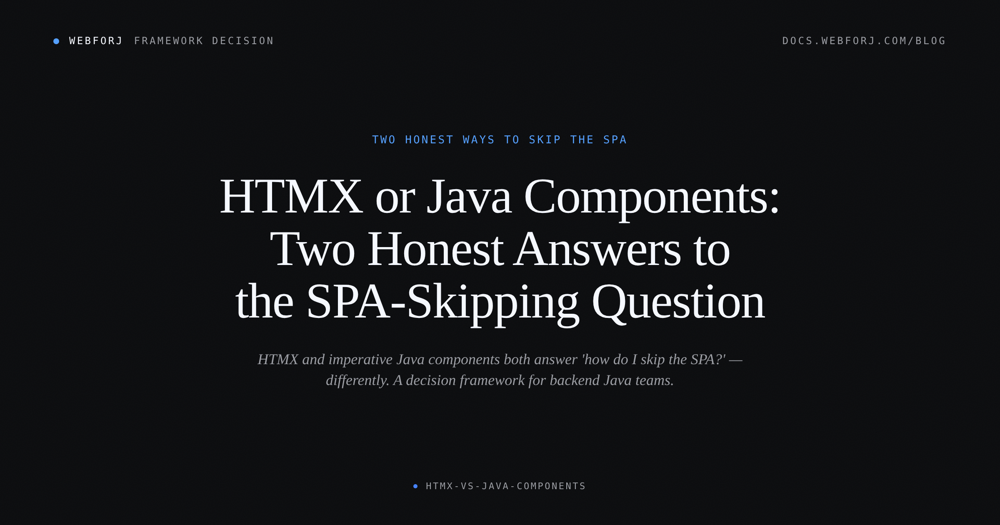

The "HTMX vs React" essay has become its own genre. You have probably read three of them in the last six months. The argument is usually the same: React ships kilobytes of JavaScript, HTMX ships a single script tag, hypermedia is how the web was supposed to work. Compelling, and probably right on its terms. But if your team writes Java for a living and you are asking "how do we ship interactive UI without a full SPA stack?", the React comparison does not really help. You were not considering React anyway.

The question most backend Java teams actually have is more specific: HTMX, or a component model that stays entirely in Java? Those are the two real answers on the table, and the SERP does not compare them. Every article picks HTMX against a JavaScript framework. Nobody writes the comparison against the third shape — an imperative Java component tree with state and behavior on the server, no HTML fragments crossing the wire, no attribute vocabulary to learn separately from your application code.

This post is that comparison. Not a verdict, and not a promotion for either side. A map.

<!-- truncate -->

## What both approaches are actually answering

The underlying question is: how do I ship interactive behavior without a SPA? HTMX is one answer. Imperative Java components are another. Neither sends a JSON contract back and forth between a separate frontend and backend process. Neither requires a JavaScript build system or a separate deployment. Both keep the logic server-side.

They get to that same place by very different roads.

## How HTMX works

HTMX puts behavior on HTML elements with attributes. An element with `hx-get` fires an HTTP request to a server URL when triggered. The server returns a fragment of HTML. The client swaps that fragment into the DOM at the location named by `hx-target`.

A Spring MVC controller serving an HTMX request looks like any other controller — the difference is what it returns:

```java
@GetMapping("/todos/{id}")
@ResponseBody
public String getTodoDetail(@PathVariable Long id) {
    Todo todo = todoService.findById(id);
    return "<div class=\"detail\"><strong>" + todo.getTitle() + "</strong></div>";
}
```

On the page, the trigger is a standard HTML element with HTMX attributes:

```html
<button hx-get="/todos/42"
        hx-target="#detail"
        hx-swap="innerHTML">
  Show detail
</button>
<div id="detail"></div>
```

When the button is clicked, HTMX fires the GET request, the controller returns the HTML fragment, and HTMX swaps it into `#detail`. The browser never navigates. The server returns HTML, not JSON.

With Thymeleaf you would return a template fragment reference instead of a raw string — `return "fragments/todo :: detail"` — but the shape of the interaction is the same either way.

## How an imperative Java component tree works

With a framework like webforJ, the server holds a live tree of component objects. Views are defined in Java — no HTML templates, no attribute DSL. When something in the view needs to change, you call a method on the component object. The framework figures out what changed and syncs the client over a persistent connection.

The same todo-detail behavior looks like this:

```java
public class TodoDetail extends Composite<FlexLayout> {
    private final Div detail = new Div();

    public TodoDetail() {
        Button loadButton = new Button("Show detail");
        loadButton.onClick(event -> loadDetail(42L));

        getBoundComponent()
            .setDirection(FlexDirection.COLUMN)
            .add(loadButton, detail);
    }

    private void loadDetail(Long id) {
        Todo todo = todoService.findById(id);
        detail.setText(todo.getTitle());
    }
}
```

No HTTP request to a fragment endpoint. No DOM targeting. The button's `onClick` handler runs server-side Java. The framework patches the client DOM to match whatever the component tree looks like after `detail.setText(...)`. From the developer's perspective, you called a method and the page updated.

## Where HTMX has the advantage

The strongest case for HTMX is when you already have something. If you have a Spring MVC app with Thymeleaf templates that renders fine as static HTML, HTMX is additive. You put `hx-get` on a link and it becomes an in-place update instead of a full page reload. Your existing routes, your existing templates, your existing HTML — none of it has to change to get started.

`hx-boost` is the purest expression of this. Add it to a link and the navigation becomes an AJAX swap instead of a full load:

```html
<a href="/todos" hx-boost="true">All todos</a>
```

One attribute on one element. The existing `/todos` route and its full-page HTML response keep working as-is. HTMX intercepts the navigation and swaps only the content that changed.

The footprint is genuinely small. A single `<script>` tag, no build step, no module bundler, no package.json. If your team is comfortable maintaining HTML templates and wants to keep doing that, HTMX fits the existing skill shape without asking anyone to learn a new abstraction.

## Where Java components have the advantage

The case for imperative Java components is strongest when the client-side state graph gets complex. Multi-field forms where validation on one field affects the display of another. Tables with local sort and filter applied on top of server-fetched data. Real-time views where updates arrive asynchronously and need to merge into what the user is already editing.

With HTMX, each of these becomes a coordination problem: which element triggers which request, what does the server return, where does it get swapped, how do you keep multiple fragments consistent with each other. The framework gives you the wire protocol; the state machine is yours to build on top of it.

With a Java component tree, the state machine is fields and methods. The component holds state in Java instance variables. Event handlers are methods that modify that state and update child components directly. There is no wire protocol at the application level — the component knows about its children and calls their methods.

The single-language story matters too. With HTMX you maintain Java controllers, HTML templates with HTMX attributes, and the mental model for how they compose. With webforJ there is Java on both sides of the interaction: the view is Java objects, the business logic is Java, the event handlers are Java. A single debugger steps through the whole thing.

## Composition is where the paradigms diverge

HTMX composes via attributes on markup. The unit of reuse is the HTML fragment — a partial template returned from any endpoint and swapped into any named target. You compose behavior by stacking attributes on an element:

```html
<input type="search"
       name="q"
       hx-get="/search"
       hx-target="#results"
       hx-trigger="keyup changed delay:300ms"
       hx-swap="innerHTML">
<div id="results"></div>
```

The behavior — debounced search that updates a named target — lives entirely in the attributes. No JavaScript file, no component class to import. Composing a variation means writing different attributes, not subclassing or configuring an object.

Java components compose via objects and methods. The unit of reuse is the class:

```java
public class SearchPanel extends Composite<FlexLayout> {
    private final Div results = new Div();

    public SearchPanel() {
        TextField searchField = new TextField("Search");
        Button searchButton = new Button("Go");

        searchButton.onClick(event ->
            updateResults(searchField.getValue()));

        getBoundComponent()
            .setDirection(FlexDirection.COLUMN)
            .add(searchField, searchButton, results);
    }

    private void updateResults(String query) {
        // query the service, populate this.results
    }
}
```

To reuse `SearchPanel` elsewhere, you import it and add it to another component's layout. To customize it, you extend it or give it a constructor parameter. The debugger traces through the same Java stack frames as the rest of your backend. Your IDE's "find usages" works on it.

Neither model is strictly better. The HTMX pattern is less setup for a single self-contained use case. The Java-object pattern is more manageable when `SearchPanel` appears in twelve places and you need to change what it renders or how it behaves.

## The wire, and what changes between interactions

With HTMX, each interaction is a discrete HTTP request. The server processes it, returns HTML, and forgets about it. The advantage: your server is stateless, horizontally scalable, and easy to reason about in isolation. The trade-off: each interaction incurs a full round trip, and coordinating state across multiple fragments is the application's responsibility, not the framework's.

With Java components, the server holds a live session object for each connected client. Interactions travel over a persistent connection and the server mutates the component tree directly — no round trip per interaction in the traditional sense. The advantage: the component tree is a single source of truth, and the framework handles syncing it to the client. The trade-off: the server carries per-client session state, which affects your horizontal scaling story and your failure modes when a connection drops.

Neither trade-off is wrong. They are different bets about where the complexity should live.

## When to reach for HTMX

- You have a working server-rendered app and want to add interactivity without introducing a new mental model or deployment artifact.
- Your team writes HTML templates comfortably and wants to keep doing that.
- The interactions are discrete and well-bounded — load a detail pane, submit a form, swap a list segment.
- You want the page to function with JavaScript disabled for most of its use cases.
- Page weight and external dependency count are constraints.

## When to reach for a Java component tree

- You are building rich, state-heavy interfaces — live tables, multi-step forms with cross-field dependencies, real-time collaborative views.
- Your team would rather write Java than manage a parallel HTML template layer with its own attribute vocabulary.
- You are starting fresh and want one mental model across the full stack.
- You are already on Spring Boot and want the UI wired directly to your service beans without a separate REST contract between them.

## Where each approach breaks down

HTMX strains when the client-side state graph gets large. A multi-step wizard where each step depends on earlier answers, where the back button needs to restore exact field state, where validation is cross-field — this is fighting the fragment model. You will end up with either a pile of JavaScript that grew organically to manage state between swaps, or a server-side session that is doing most of the work the fragment protocol was supposed to replace.

HTMX also does not compose well with JavaScript-disabled requirements when you have leaned into `hx-` attributes for core flows. `hx-boost` on existing links is progressive enhancement. Bespoke `hx-get` interactions that replace your navigation are not.

Java components break down when you need pages to work with JavaScript fully disabled — the framework requires a persistent connection to function. They also break down when you are trying to add interactivity to existing HTML that the framework did not render. If you have a Thymeleaf app you want to keep mostly intact and just make a few things more interactive, a component-tree framework is not additive the way HTMX is. And for pages where clean server-rendered HTML per URL is a hard SEO requirement, you need to check whether the component-tree model delivers that before committing to it.

## The decision

There is no universal winner here, and the "HTMX vs React" framing obscures that — it is an unfair fight and the wrong comparison for most Java teams.

If you have an existing server-rendered app you want to make more interactive, HTMX is the lower-friction path. If you are building something where the richness of the UI is the product, your team writes more Java than HTML, and you are starting fresh, a component-tree model earns its setup cost.

Both are real answers to the same question. The right one depends on what your app already looks like and where it is going.

For the Java component side, the [Spring Boot integration guide](/docs/integrations/spring/spring-boot) shows how webforJ wires into a Spring Boot application, and [composing components](/docs/building-ui/composing-components) covers the `Composite` pattern in depth. For the HTMX side, Carson Gross's essays at [htmx.org/essays](https://htmx.org/essays/) are the best place to understand why the paradigm exists, in the author's own words.
