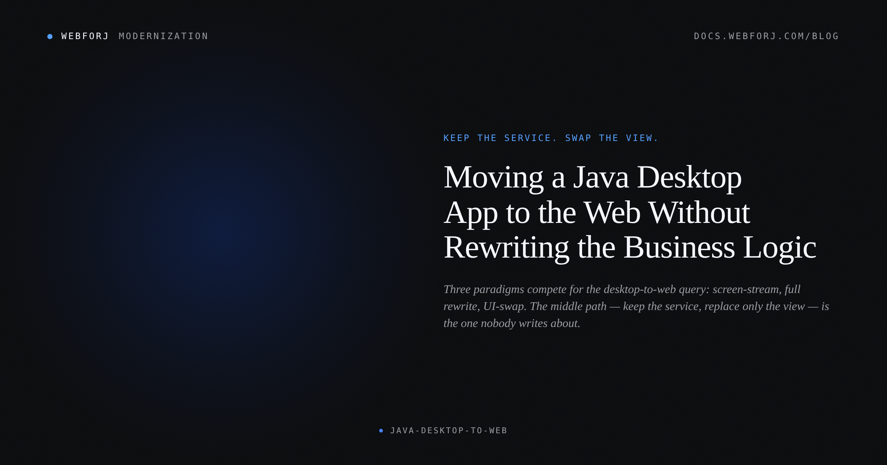

The Swing app works fine. It has for fifteen years. The problem is the laptop it runs on, the VPN the field team needs to launch it, the help desk tickets about Java versions, and the sales manager who keeps asking why the competitors have something that works in a browser. Nobody is saying the business logic is wrong. The order service is solid. The validation rules are exactly right. The question is whether "moving it to the web" means blowing all of that up.

The SERP gives you two answers: screen-stream your existing app with Webswing or AjaxSwing, or hire a consultancy to rewrite everything as REST endpoints with a React frontend. Both are legitimate in some situations. But neither is the answer for the team that has a service layer and just needs a different view on top of it. That answer — keep the services, replace only the UI — is the one nobody writes about.

That is what this post is about.

<!-- truncate -->

## Three paradigms competing for the same query

When someone searches "migrate Java desktop app to web," they are usually trying to solve one of three different problems, and the tools that come up are not interchangeable.

**Screen-streaming** (Webswing, AjaxSwing, Oracle Remote Desktop) takes your existing Swing or JavaFX app, runs it server-side, and renders it to a browser over a pixel stream or canvas protocol. The app does not change at all. The user gets a browser window that looks like the desktop app — same layout, same widgets, same behavior. The advantage is zero code changes and a production-ready deployment in days. The trade-off is that you are still shipping a desktop app; you have just moved where it runs. You get browser delivery, not a web experience.

**Full rewrite** is what consultancies propose when they want to start fresh. Pull the UI out entirely, expose the domain layer as a REST API, build a React or Angular frontend on top of it. When it works, you get a modern web app. The cost is high, the risk is high, and the institutional knowledge baked into years of UI code often does not survive the translation. Teams underestimate how much business logic lives in ActionListeners and how long "just the API layer" takes.

**UI-swap** is the middle path: keep the service layer as Java, keep the domain objects and repositories, but replace only the view layer. Instead of a Swing `JFrame` calling `orderService.submit(order)`, you have a webforJ view calling the same `orderService.submit(order)`. The wire between UI and service does not move. Only the presentation layer changes.

Most searches for "Java desktop to web" are really asking about this third option. The first two exist on the SERP. This one mostly does not.

## Where the boundary lives

The argument against UI-swap is usually "our Swing code doesn't have a service layer." That is sometimes true, but less often than teams expect. In any Swing app that has been in production for more than a few years, there is almost always an implicit boundary somewhere — a class that does the database work, a service that handles the business rules, a DAO that insulates the UI from the persistence layer. The ActionListeners call something. That something is the boundary.

Even apps with business logic scattered across ActionListeners have a recoverable structure: the queries hit a database, the mutations go through something that validates them. The work of UI-swap is not inventing a service layer from scratch; it is finding the seam that is already there and building the new view on the other side of it.

Consider a simple order-management piece. The service contract looks like this in both the old and new worlds:

```java
public interface OrderService {
    List<Order> getOpenOrders(String customerId);
    void submit(Order order);
    BigDecimal getTotal(Order order);
}
```

No Swing imports. No web imports. Plain Java with a clear contract. The `OrderService` does not know whether its caller holds a `JFrame` or a webforJ view. That is the seam.

## What the shape looks like

Here is a representative Swing view fragment — a small order panel that calls into that service:

```java
public class OrderPanel extends JPanel {
    private final OrderService orderService;
    private final JTextField customerField = new JTextField(20);

    public OrderPanel(OrderService orderService) {
        this.orderService = orderService;
        JButton submitButton = new JButton("Submit");
        submitButton.addActionListener(e -> {
            String customerId = customerField.getText();
            orderService.submit(new Order(customerId));
        });
        setLayout(new BorderLayout());
        add(customerField, BorderLayout.NORTH);
        add(submitButton, BorderLayout.SOUTH);
    }
}
```

The equivalent webforJ view calls the same service. The structure follows the `Composite<FlexLayout>` pattern from the [Composing Components](/docs/building-ui/composing-components) docs, with the `ActionListener` replaced by `onClick` and the GridBagLayout dance replaced by `getBoundComponent().setDirection(...).add(...)`:

```java
public class OrderView extends Composite<FlexLayout> {
    private final FlexLayout self = getBoundComponent();
    private TextField customerField;
    private Button submitButton;
    private Div orderList;

    public OrderView() {
        initializeComponents();
        setupLayout();
        configureEvents();
    }

    private void initializeComponents() {
        customerField = new TextField("Customer ID");
        submitButton = new Button("Submit");
        orderList = new Div();
    }

    private void setupLayout() {
        FlexLayout header = new FlexLayout(customerField, submitButton);
        header.setAlignment(FlexAlignment.CENTER);
        header.setSpacing("8px");
        getBoundComponent()
            .setDirection(FlexDirection.COLUMN)
            .add(header, orderList);
    }

    private void configureEvents() {
        submitButton.onClick(event -> submitOrder());
    }

    private void submitOrder() {
        // calls orderService.submit(new Order(customerField.getValue()))
    }
}
```

`JTextField` → `TextField`. `JTable` → [`Table<Order>`](/docs/components/table/overview) (not shown here — the Table component covers the column and item binding API). `addActionListener` → `onClick`. The `orderService.submit(...)` call is the same; only the view layer changed.

Adding webforJ to the existing Maven project is one dependency:

```xml
<dependency>
  <groupId>com.webforj</groupId>
  <artifactId>webforj</artifactId>
  <version>26.01</version>
</dependency>
```

Not a new project, not a new build system, not a renegotiated Spring context. The existing Maven build gets a new dependency. The existing service layer gets a new caller.

## What the peer-reviewed research says

The question of whether incremental UI-layer modernization works in practice has been studied. A 2024 paper in the CLEI Electronic Journal ([DOI 10.19153/cleiej.27.1.5](https://www.clei.org/cleiej/index.php/cleiej/article/view/647)) examined incremental migration of legacy Java desktop applications and found that phased UI-layer replacement — preserving the service layer and migrating views one at a time — significantly reduced integration risk compared to big-bang rewrites. The study's conclusion is unsurprising to anyone who has watched a big-bang rewrite miss its deadline: the risk concentrates at integration time, and incremental approaches distribute that risk across the delivery schedule.

That is not an argument to never do a full rewrite. It is an argument that the incremental path has research behind it, not just intuition.

## View-by-view, not big bang

The practical version of UI-swap does not require porting every view before shipping anything. You start with one screen — the highest-value one, the one users complain about most, the one with the simplest service interface. You get that screen into a browser and running against the same service as the Swing panel. Users verify that it behaves correctly. You release it.

The next sprint, you migrate another screen. The sprint after that, another. The Swing app is still running during this period, and the screens that have not been migrated yet still work. There is no moment when the entire system is broken waiting for the migration to finish.

This is what "view-by-view" buys in practice: regression risk is bounded per sprint, rollback scope is one screen rather than an entire rewrite, and the team is building confidence in the new view layer incrementally rather than betting everything on a single integration week.

## Where the abstraction leaks

The correspondence between Swing and webforJ is not perfect. Some Swing patterns translate awkwardly.

**Blocking modal dialogs.** Swing's `JOptionPane.showConfirmDialog(...)` and similar blocking calls work because the Swing event thread can block while waiting for user input. webforJ's async event model does not support blocking at the UI layer — dialogs are non-blocking and you provide a callback. Apps that use blocking modals extensively need to rethink those flows, not just find-and-replace them.

**`SwingWorker` background patterns.** Swing's `SwingWorker` handles background computation and UI updates across thread boundaries. webforJ handles this differently — background work runs in a server thread and pushes updates to the client over the persistent connection. The pattern exists; the API is different and the mental model requires adjustment.

**Native file pickers and OS integrations.** If the app opens the native file-system dialog or integrates with OS-level clipboard or drag-and-drop APIs, those integrations need to be re-examined. The browser provides equivalent capabilities via its own APIs, but the mapping is not automatic.

**Tight JNI integrations.** If the app calls native libraries through JNI for something core to its function, those calls can usually still run server-side — webforJ views run on the JVM — but anything that expects a local display or a local file path needs to be rethought.

These are concrete gaps. They are also well-understood failure modes, which means they are auditable before you commit. A quick survey of the codebase for `JOptionPane.showConfirmDialog`, `SwingWorker`, and native library calls tells you whether the view layer will translate cleanly or whether specific screens need extra design work.

## When to reach for the other approaches

UI-swap is not the right answer in every situation.

If the app is small, greenfield-ish, or the service layer does not exist, a full rewrite may be cheaper than carving out a seam that was never designed to be carved. The rule of thumb: if the migration conversation starts with "we would need to refactor the domain model first," a full rewrite deserves serious consideration.

If the app must run on air-gapped machines, has regulatory requirements that preclude web delivery, or must remain locally installed — screen-streaming may be the right shape. Webswing puts a working browser experience in front of users with zero code changes, and for some organizations that is the right trade.

## Where this pattern breaks down

The UI-swap pattern depends on one thing: a service layer that the UI is calling, rather than a UI that is the service layer. Apps where most of the business logic lives in `ActionListener` bodies, where the Swing model objects are also the persistence objects, where there is no meaningful boundary between what the UI sees and what the database stores — those apps do not have a seam to build on. You can still migrate them, but you are doing a refactor first, not a UI swap.

It is worth being clear-eyed about this before starting. The seam audit — a few hours reading the codebase for what the listeners call and where those calls go — tells you which category you are in.

## The decision

Most Java desktop apps that are still earning their keep in production have a service layer. The boundary is there. The question is whether the team knows that the UI-swap path exists before they sign up for a two-year full rewrite.

If the services are solid and the view layer is the problem, the migration scope is a lot smaller than the SERP implies. One dependency, a new caller for each screen, the same service contract the desktop app already uses.

The [getting started guide](/docs/introduction/getting-started) has the first-app walkthrough for the webforJ side, and the [Table component](/docs/components/table/overview) and [data binding overview](/docs/data-binding/overview) cover the two pieces of the view layer that tend to come up most often when porting production Swing apps. The [Spring Boot integration guide](/docs/integrations/spring/spring-boot) is the relevant next step for teams whose service layer is already Spring-managed.
