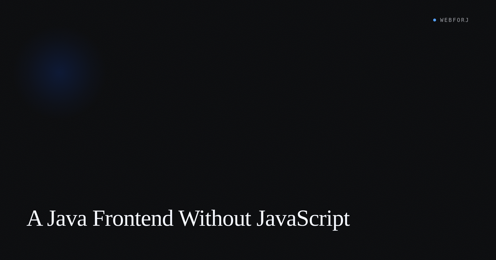

The request came from the usual place. A Java team was asked for a web UI. First instinct: add React. Hire a frontend developer, stand up a separate build, expose the backend as a REST API, wire the two halves together with a JSON contract. That is the default answer for most teams in 2026, and for many teams it is the correct one.

For the team described in our [Spring Boot frontend post](/blog/spring-boot-frontend-java), it was not. They shipped a time-tracker on Spring Boot and webforJ — one repo, one language, no `package.json` in sight — and the year after looked meaningfully different from what the React path would have produced. That post covers the build; this one is the decision-shaped version: what the choice cost, what it returned, and when it stops making sense.

<!-- truncate -->

## What "without JavaScript" means

The scope is narrower than the phrase implies. "Without JavaScript" means no JavaScript in the application code that the team writes or maintains. A webforJ app does run JavaScript in the browser — the DWC component library ships as JavaScript, and that JavaScript draws the UI. The same is true of virtually every web approach: even server-rendered HTML with Thymeleaf runs JavaScript in the browser.

The question is who authors it. In a React app the team writes and maintains JavaScript. In a Java-only frontend the team writes Java and the framework handles the browser layer. The JavaScript exists; it is just not the team's code to debug, update, or reason about.

That distinction matters because "no JavaScript" as a philosophical statement is usually unprovable, but as a scope statement — no JS build, no JS authored by the team — it is often achievable and worth pricing out before defaulting to the SPA.

## Three shapes on the table

The SERP for "spring boot without react" mostly argues between two options: a full SPA plus REST API, or HTMX with server-rendered HTML. There is a third shape that comes up less often.

**SPA plus REST.** A separate frontend talking to a JSON API. A second codebase, a second build pipeline, and a JSON contract that both sides have to keep in sync. The standard path for most product teams, for good reason.

**HTMX plus server-rendered HTML.** HTML fragments returned from Spring MVC endpoints and swapped into the DOM by a small JavaScript library. One codebase, one language, but an HTML template layer — Thymeleaf, Freemarker, or similar — on top of the Java services, plus an attribute vocabulary on the markup.

**Java imperative UI.** Views as Java objects. State in fields, behavior in methods, the framework diffing the component tree to the browser over a persistent connection. No HTML template layer, no attribute vocabulary to learn alongside the Java code.

All three skip or minimize the full SPA stack. The second and third are compared in more depth in the [htmx-vs-java-components post](/blog/htmx-vs-java-components). This post is about what it looks like to take the third path all the way and what the team noticed afterward.

The mental model for the Java imperative approach is the closest to how Swing or JavaFX developers already think. Components have constructors. State lives in fields. Events are method calls. For a team whose instinct is to write Java rather than configure a build, the ramp to this model is shorter than the ramp to React — though shorter ramp is not the same as better outcome, and the long-term fit depends on the problem.

## What the team gave up

**The JavaScript component ecosystem.** npm has a charting library for any niche visualization, a specialized date-range picker, a WebGL canvas, a legacy third-party widget someone is contractually required to embed. These are JavaScript-first artifacts. Getting them into a Java imperative UI involves a bridge call rather than a standard import. Sometimes the bridge is fine; sometimes the gap is the deciding factor.

**A hire pipeline pre-trained on the tools.** Most frontend candidates know React. The component tree model transfers, but the specific patterns do not: React hooks, client-side routing, the state management idioms. A Java-experienced hire with no React background picks up webforJ faster than a React developer does. Both end up productive, but the ramp looks different.

**A trivially edge-cacheable deployment target.** A React SPA is a set of static files. A Java imperative UI requires a running JVM server — the same server that runs the services. For line-of-business apps behind a corporate network, that constraint is irrelevant. For a public-facing site with global traffic, it may not be.

## What the team got

The time-tracker that came out of the Java-only path had properties the SPA alternative would not have had by default.

**One Maven build.** The CI pipeline runs `mvn package`. The service and the UI are in the same module, tested in the same build, deployed as the same artifact. No separate npm pipeline, no frontend job to cache, no version contract to pin between the Java API and the JavaScript client.

**No JSON wire between service and view.** The Java service objects are called directly from the Java UI code. When the `TimeEntry` class gains a field, the storage and the display update in the same commit, checked by the same compiler. In a SPA-plus-REST setup that same change requires updating the API endpoint, updating the client deserialization, and manually or programmatically verifying the contract. The cost is real and it accumulates over the lifetime of an evolving domain model.

This also means the Java type system covers the full stack. A method that returns a `List<TimeEntry>` is the same `TimeEntry` in the service, the repository, and the UI. No DTO layer, no serialization annotations specifically for the wire, no client-side type definitions to keep in sync with the backend ones.

**One debugger, one language.** A click on the UI triggers Java code on the server. The stack trace from the browser event to the service call is a Java stack trace, readable in the same IDE as the service code. The server-side session the framework maintains is a plain Java object. Breakpoints reach from user interaction to repository call without switching tools.

## Where a small JS bridge is the right answer

Choosing a Java-only frontend is not a claim that JavaScript should never run. It is a claim that the team should not have to author it to build the application.

There are specific cases where a browser capability has no Java-level wrapper and a direct call makes sense. WebAuthn credential creation, clipboard access on older browser versions, embedding a legacy widget that ships as a JavaScript bundle — webforJ's [`executeJavascript`](/docs/building-ui/execute-javascript) method handles these with a targeted string of JavaScript evaluated on the client.

The pattern: use it when the requirement is browser-specific and the JavaScript surface is small and self-contained. A five-line call to initialize a third-party control is a fine use. Building a parallel state management layer in JavaScript to compensate for something the Java UI cannot express is a signal to reconsider the approach, not a use case for the bridge.

The difference between "a small JS bridge" and "writing a second frontend in JS" is not always obvious when you are inside the project. One heuristic: if the JavaScript you are writing needs its own state, its own tests, and its own build step — even a small one — you have crossed into the second-frontend zone. If it is a handful of lines with no logic of its own, it is a bridge call.

## When the answer is still "yes, JavaScript"

A public-facing marketing site with heavy animation, complex scroll interactions, and SEO requirements that depend on static HTML at each URL — a React or static-site framework is closer to the right tool. The Java imperative model is server-side and stateful; CDN edge delivery is not its native shape.

A team already staffed on TypeScript and shipping without significant pain — the switching cost is not justified. The Java-only path saves setup cost for teams paying that cost for the first time. Teams who have already paid it and internalized it are not candidates for the trade.

A product with deep visualization requirements where the specific libraries required — a particular charting engine, interactive geographic rendering, domain-specific graph editors — have no Java-level equivalents and the bridge calls would be extensive. The [component catalog](/docs/components/overview) covers what ships with webforJ; check whether the gap is bridgeable for your specific requirements before committing.

## What changed in the developer loop

The most concrete change the team noticed was in the feedback cycle. Adding a form field is a Java method call. Changing validation logic is a Java condition. Both get compiler feedback immediately, not after a hot-reload. The feedback loop for UI changes became the Java feedback loop.

Onboarding the next hire looked different depending on their background. A Java developer with no significant frontend experience understood the component model within a sprint. A React developer needed more time to stop reaching for the patterns they knew. Both shipped features within two sprints; the paths there diverged.

The CI pipeline simplified. The build lost a stage — no `npm install`, no lint run, no Jest suite, no browser-automation test runner configured against a separately running dev server. The tradeoff is a narrower ecosystem, but the operational surface the team has to maintain got smaller.

## Closing

"Do I need JavaScript?" is a question most Java teams never ask, because the answer is assumed. For a substantial class of internal tools and line-of-business apps, the assumption does more work than the evidence supports.

The Java-only path is not always the right answer — for teams shipping fine on React it is not an answer at all, and for public marketing sites and visualization-heavy products it is usually the wrong fit. But for a Java-native team standing up a new internal tool on Spring Boot, it is a trade worth pricing out before committing to the SPA default.

The [Spring Boot frontend post](/blog/spring-boot-frontend-java) shows what the concrete build looks like. The [getting started guide](/docs/introduction/getting-started) covers bootstrapping a webforJ project. If the underlying question is modernization rather than greenfield — moving a desktop app to the web rather than starting fresh — the [Java desktop-to-web post](/blog/java-desktop-to-web) covers that path.
