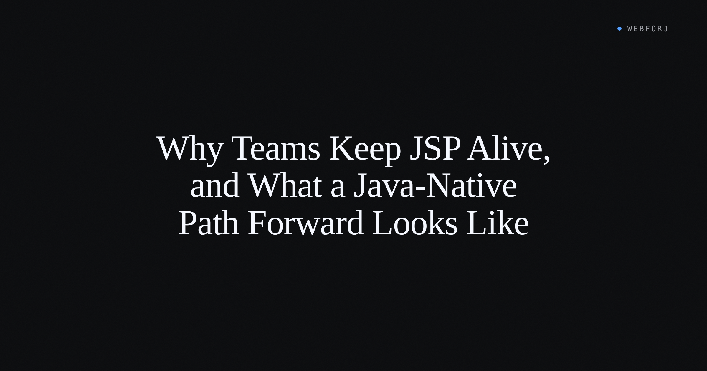

The `customers.jsp` has been in production since 2011. The team knows every quirk — the `pageContext.getAttribute` calls that pull in the session-managed customer list, the JSTL loop that renders the rows, the shared header partial included from `/WEB-INF/includes/header.jsp`. It works. Operations knows how to deploy a WAR. The business rules are encoded in the tag libraries. On Monday, leadership asked for a modernization plan.

The SERP for "jsp modernization" gives you two answers: swap the template engine for Thymeleaf, or rebuild the frontend in React. Both are legitimate paths. Neither removes the template layer.

This post covers the third option: replace the JSP page with a Java component tree. Views become Java classes. The loop disappears from the source. The taglib becomes a plain Java class. The include becomes a constructor call. This is not a new idea — it is just underrepresented in the search results because most teams that have done it have not written it down.

<!-- truncate -->

## Why JSP is still in production

Teams keep JSP pages alive for reasons that hold up under inspection.

The deployment model is familiar: package a WAR and hand it to the app server. Fifteen years of institutional knowledge is encoded in the custom tag libraries — `<myco:pricingBadge>`, `<myco:customerHeader>` — that call real business logic. The JSTL loops are readable to anyone who has done frontend work in Java in the last two decades. And it still works.

The reason modernization comes up is usually not that JSP has stopped working. It is that the surrounding platform has moved. The app server that was current in 2011 now requires a paid support contract. The team wants to run on Spring Boot. A mobile client that was not in scope in 2011 is now in scope. The page is fine; the surrounding infrastructure is what is prompting the question.

That context matters because it shapes what a good answer looks like. A team that needs to run on a modern JVM with Spring Boot and deliver data to a mobile API does not necessarily need to throw away the tag library. It may need to separate the rendering layer from the business logic encoded in those tags. That separation is what makes the third path possible.

## What the SERP recommends

Two paradigms dominate the results.

**Thymeleaf** is the template-engine swap. Replace `<c:forEach>` with `th:each`, replace scriptlets with Thymeleaf expressions, keep the overall shape of an HTML file with logic woven in. The team still writes templates. The deployment model changes from WAR-to-app-server to Spring Boot JAR, but the authoring model — a markup file with iteration constructs — is essentially the same.

**React** is the full frontend rebuild. Expose the backend as a REST API, write a new client in JavaScript, ship a separate deployment artifact. The team stops writing JSP and starts writing JSX. The business logic in the tag libraries needs to be re-expressed as API responses. The upgrade is complete but the cost is real: a second language, a second build pipeline, and a JSON contract to maintain.

Both paths are well-documented because both are common. Neither removes the template layer; they replace one template engine with another, or replace templates with JavaScript components.

## The third path: replace the page with a Java component tree

In this model, there is no template. The `customers.jsp` does not become `customers.html`; it becomes `CustomersView.java`. Iteration is a property of a data-bound component, not a loop in the source. The header partial is a Composite class, imported and instantiated like any Java class.

The authoring model shifts: the question is no longer "what does the template for this page look like?" but "what Java class structure corresponds to this page?" For a team that writes Java most of the day and switches to a template language for UI work, removing that context switch is the point.

The rest of this post maps four substitutions. Each starts with a small JSP fragment and shows what the equivalent structure looks like in a Java component tree.

## Scriptlet → Java method

A scriptlet that formats data inline in a table cell looks like this:

```jsp
<td>
  <%
    String formatted = formatPhone(customer.getPhone());
    out.print(formatted);
  %>
</td>
```

The logic is real Java — there is a `formatPhone` method somewhere — but it is embedded in a template and evaluated at render time by the JSP compiler. It is invisible to unit tests and to static analysis tools unless they understand JSP compilation.

In a Java component tree, the same logic is a method on a plain Java class, referenced through a column definition:

```java
Table<Customer> table = new Table<>();
table.addColumn("phone", Customer::getPhone);
```

The method reference passes the value; any formatting logic lives in the model or in a dedicated method, called like any other Java code. The JSP compiler is not involved. The logic is reachable by a unit test and navigable in the debugger.

## `<c:forEach>` → Repository-bound Table

A JSTL customer list looks like this:

```jsp
<c:forEach var="customer" items="${customers}">
  <tr>
    <td><c:out value="${customer.id}" /></td>
    <td><c:out value="${customer.name}" /></td>
    <td><c:out value="${customer.email}" /></td>
  </tr>
</c:forEach>
```

The iteration is in the template. The data source (`${customers}`) was put on the request by a servlet or controller. Pagination, sorting, and refresh all require additional template logic and additional request-handling code.

The webforJ equivalent uses a `Table` bound to a `Repository`:

```java
List<Customer> customers = new ArrayList<>();
CollectionRepository<Customer> repository = new CollectionRepository<>(customers);
Table<Customer> table = new Table<>();
table.setRepository(repository);
table.addColumn("ID", Customer::getId);
table.addColumn("Name", Customer::getName);
table.addColumn("Email", Customer::getEmail);
```

There is no loop in the source. The `Table` component handles iteration, pagination, and column rendering. When the backing list changes and `repository.commit()` is called, the table updates. For Spring-managed data, a `SpringDataRepository` wraps a JPA repository directly and connects the same way — but the pattern is identical: define the columns, set the repository, let the component handle the rest.

The [Table overview](/docs/components/table/overview) covers the full column-configuration and sorting surface.

## `<jsp:include>` → Composite

A JSP include that pulls in a shared header:

```jsp
<jsp:include page="/WEB-INF/includes/header.jsp" />
```

Behind this is a resolution path — the JSP engine finds the file relative to the WAR structure — and implicit coupling: both the including page and the included file share `pageContext`, and the included file can read session attributes the including page set.

The Composite equivalent is a class:

```java
public class HeaderComposite extends Composite<FlexLayout> {
    private FlexLayout self = getBoundComponent();

    public HeaderComposite() {
        initializeComponents();
        setupLayout();
    }

    private void initializeComponents() {
        // header fields and navigation
    }

    private void setupLayout() {
        getBoundComponent().setDirection(FlexDirection.COLUMN);
    }
}
```

Using it in a view is a constructor call:

```java
add(new HeaderComposite());
```

No resolution path. No implicit page-context coupling. The `HeaderComposite` is a class: visible to the IDE, navigable in the debugger, injectable as a Spring bean if the view is Spring-managed. The [composing-components](/docs/building-ui/composing-components) doc covers the Composite pattern and how views are composed from smaller pieces.

## The custom tag library problem

The section most JSP migration guides skip is the tag library.

`<myco:userBadge user="${u}" />` looks like a one-liner in the JSP. Behind it is a tag handler class that reads from page or request context, formats a user record, and emits HTML. The coupling is often invisible: the tag reads session attributes that were put there by a servlet several request hops ago.

In a Java component tree, the tag becomes a plain Java class:

```java
public class UserBadge extends Composite<FlexLayout> {
    private FlexLayout self = getBoundComponent();

    public UserBadge() {
        initializeComponents();
        setupLayout();
    }

    private void initializeComponents() {
        // badge content
    }

    private void setupLayout() {
        getBoundComponent().setDirection(FlexDirection.COLUMN);
    }
}
```

Used as:

```java
add(new UserBadge(user));
```

The constructor is explicit. The dependencies are declared. The implicit session-state coupling the tag handler had is gone — which is the point, and also where the work surfaces. If the tag handler was reading `pageContext.getSession().getAttribute("currentUser")`, that attribute needs to become a constructor argument or a Spring-injected dependency. The one-liner in the JSP was hiding that coupling; the port makes it visible.

Legacyleap's JSP migration guide notes that *"hidden dependencies: shared objects, tag libraries, and legacy connectors are rarely documented."* Audit the tag libraries for implicit `pageContext` reads before estimating scope. Teams that find this coupling late tend to treat it as a bug in the port; it was always there.

## What does not translate cleanly

**Deep JSTL branching** with request-scoped data — `<c:if test="${not empty requestScope.errors}">` wrapping several conditional branches — translates at the logic level but requires working through where the condition evaluates. In a Java component tree, the condition is a Java `if` and the component is either added or not. That is usually simpler, but it does require understanding where the relevant state lives and moving it into the view's constructor or event handlers.

**Tag files with attribute declarations** — `<%@ attribute name="label" required="true" %>` — are essentially components with named parameters. They map to Composite constructors. The difficulty is when the tag file also does page-level things: setting response headers, writing to a shared output buffer. Those behaviors need to move to a filter or a view-lifecycle hook, not a Composite.

**Pages that depend on JSP compilation order**: some legacy JSPs use `<%@ include file="..." %>` — the static include directive, not `<jsp:include>` — to share scriptlet variables across file boundaries. The included file can reference variables declared in the including file because they are merged at compile time. That coupling has no Composite equivalent and must be resolved into explicit data passing before the port.

## When to reach for the other approach

A team running Thymeleaf and shipping without friction has already paid the migration cost. The switch to a Java component tree is not justified unless the team wants to stop writing templates, not just modernize the specific template engine.

A public-facing page where content must be indexable as server-rendered HTML at each URL — without JavaScript — is better served by a template engine or a static site generator. The Java component tree model is stateful and server-managed; it does not produce the same URL-structured HTML response that Thymeleaf or a static page generates.

A UI that needs to serve more than one client — a browser view and a mobile API from the same data layer — is better shaped as a REST API behind both. Building business logic into a component tree couples it to one delivery model.

## Where this pattern breaks down

Very small legacy pages — a handful of static rows with no business logic — may not be worth porting. If the cost of writing a Composite exceeds the maintenance cost of the JSP page, and the page is unlikely to change, the migration adds cost without return.

Pages whose rendering depends on JSP-specific mechanisms that have no component equivalent — a tag that writes inline JavaScript for a browser interaction tied to the page's render cycle, or a direct `response.setHeader()` call from a tag handler — need those mechanisms extracted before the port can start. That extraction is often the work, and it reveals whether the page is a port candidate or a rewrite.

## Closing

The JSP-to-Thymeleaf path and the JSP-to-React path exist because they solve real problems. The path described here — replacing the page with a Java component tree — is the one the search results underrepresent, and it is the one most worth considering for teams that already write Java and would rather stop context-switching to a template language.

The same UI-swap framing applies whether the starting point is JSP or a Swing desktop app: keep the service layer, replace only the view. The [composing-components doc](/docs/building-ui/composing-components) is the right starting point for the Composite pattern. The [Table overview](/docs/components/table/overview) covers data binding and column configuration.

The customers from `customers.jsp` will still appear in the browser. The team will be writing Java the whole way down.
