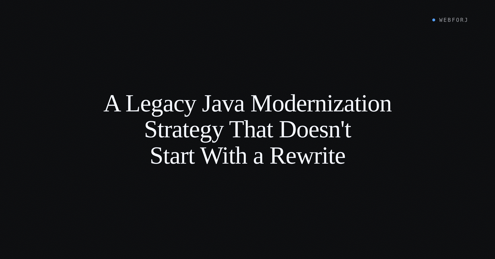

The Java application that runs the business has been in production for eleven years. The team knows its every quirk — the domain model, the service boundary, the edge cases encoded in the repository layer. On Thursday, the CTO asked for a modernization plan. By Monday, someone will be in a room arguing that the answer is a full rewrite in Spring Boot and React.

That argument is expensive and high-risk, and it treats "modernization" as a single project. That is how these projects fail. Modernizing a Java system that has been in production for a decade is not one project. It is three: upgrade the JDK, move the UI to the web, and — separately, later, maybe not at all — refactor the service layer. The shops that succeed do them in that order. The shops that fail try to do them in parallel.

<!-- truncate -->

## Three projects hiding in one word

When an engineering lead hears "modernization," the question is which of the three they are actually being asked to do.

**The JDK upgrade** is the cheapest of the three and unlocks everything else. Moving from Java 8 to Java 21 is a well-understood operation with mature tooling. The benefits — virtual threads, modern pattern matching, long-term support — are real and compounding. The risk, relative to the other two projects, is low.

**Moving the UI to the web** is the project most teams avoid naming clearly. A Swing or SWT application that runs locally needs a browser delivery model. The path that keeps institutional knowledge intact is a view-by-view replacement: the service layer stays untouched, the views are rewritten as web components, and the application ships incrementally — one screen at a time — rather than all at once.

**Refactoring the service layer** is the project that modernization consultancies always include in their roadmaps and engineering leads almost always underestimate. It is also the one most likely to be optional. If the service layer is stable, well-understood, and covered by tests, it may not need to move at all. If it is a tangle of static singletons that already hurts the team, modernization is the right moment — but only after the other two are done.

These three are often presented as one continuous project. They are not. Each has different staffing requirements, different risk profiles, and different definitions of done. Treating them as one is what produces the year-long release freeze.

## Project one: the JDK upgrade

Start here. The JDK upgrade is separable from everything else and pays dividends before either of the next two projects begins.

Modern tooling has removed most of the friction. [OpenRewrite](https://openrewrite.org/) provides automated recipes for the most common migration tasks: the `javax.*` to `jakarta.*` package rename (relevant if the app uses EE APIs), deprecated API replacements, and dependency upgrades. The recipes operate on the source tree and produce a diff — the team reviews it, runs the test suite, and ships. For large codebases, this automated analysis compresses weeks of manual scanning.

The sharp edges are real but predictable. If the app uses a Java EE API stack, the namespace rename from `javax.` to `jakarta.` is the most significant mechanical change. Apps on Spring Boot 3.x already require Jakarta EE; apps on older stacks need to know where that boundary is. Java Flight Recorder (available since JDK 11) becomes useful during this phase: profiling the application under the new JVM reveals whether the migration introduced unexpected behavior before any service changes begin.

One caution about sequencing: the JDK upgrade touches the same classpath as the other two projects. Run it first, in isolation, so the team has a stable new baseline before the UI or service work starts. Mixing all three on one branch is how you end up with a regression that nobody can attribute to a specific change.

## Project two: the UI to the web

The incumbent modernization narrative describes this project as: expose the existing backend as a REST API, hire frontend developers, build a React application. That path is legitimate. It also costs: a second build pipeline, a JSON contract that must track the domain model, and a team split across two languages.

There is a path that rarely appears in the consultancy roadmaps. The service layer that already exists — the `OrderService`, the `CustomerRepository`, the pricing rules — does not need to become a REST API. It can be called directly from a web UI written in the same language, by the same team that wrote it.

The view-by-view pattern works like this: each Swing panel is replaced one at a time with a web component. The service calls stay the same. The `orderService.submit(order)` call in the new view is the same call that was in the `JPanel`. After the first screen ships, the team has a working web application — one view, the rest still Swing. They continue one view per sprint until the desktop UI is retired.

This incremental delivery is what makes the pattern feasible without a release freeze. The service tests that existed before the migration continue to pass, because the service did not change. The regression risk is bounded to each view, not spread across the entire system.

A peer-reviewed study in the CLEI Electronic Journal (DOI [10.19153/cleiej.27.1.5](https://www.clei.org/cleiej/index.php/cleiej/article/view/647)) examined migration strategies for Java desktop applications and found that bounded-scope, incremental UI-layer migration produces lower regression rates than full rewrites — consistent with what practitioners report.

The webforJ [getting started guide](/docs/introduction/getting-started) covers bootstrapping a web view against an existing Java service. The [composing-components](/docs/building-ui/composing-components) page covers the structural pattern for building reusable view components — the web equivalent of the Composite used in a Swing application.

## Project three: the service refactor (maybe)

Only begin this project when the other two are complete. A service refactor undertaken while the JDK is being upgraded and the UI is being rewritten is compounding risk with no clear ownership.

The question is whether the service layer needs to move at all. A service layer that is stable, covered by integration tests, and understood by the team is not a problem to fix. The modernization projects around it change the runtime and the delivery layer; neither requires the domain model to change.

The cases that do warrant a service refactor are specific: a service layer built on static singletons that make testing impossible, circular dependencies that block incremental compilation, or a data access layer that does not survive the connection-pool behavior of a modern Spring Boot deployment. These are problems worth addressing. They are also problems the team will have known about long before the modernization conversation started — if they are present, they will have been costing the team effort for years.

If the service layer is worth refactoring, the modernization window is the right moment: both the JDK and the delivery layer have already moved, and the team has momentum. But this is a separate project with separate scope. It should not be bundled into the UI move.

## What parallel execution costs

Five-phase consultancy modernization frameworks typically present all three projects as running in parallel — a Gantt chart with overlapping bars, a dependency graph with arrows everywhere.

The failure mode is consistent. The team attempts the JDK upgrade, the UI rewrite, and the service refactor simultaneously. A regression appears. It takes a week to determine whether it came from the JDK change, the new UI thread model, or the service modification someone was testing on the same branch. The release date slips. The scope contracts. The project ends with partial delivery on two out of three fronts.

Sequential execution avoids this. When the JDK upgrade ships and the application is stable for six weeks, any subsequent regression during the UI work is in the new UI layer — not in three places at once. The scope of each project is bounded, the test surface is defined, and the team knows what changed.

## A note on the numbers

Modernization content circulates figures like "50% faster release cycles" and "40% lower maintenance costs." These figures appear consistently enough to seem authoritative. They are not. They circulate from vendor white papers and consultancy sales materials without primary sources. A Java team planning a budget around them is building a business case on unverifiable claims.

The real costs and benefits of a modernization project depend on the specific codebase, the team's familiarity with the tools, and the degree of coupling in the existing service layer. Build the budget from the actual scope of each project — not from industry averages that nobody can trace to a primary source.

## Running the sequenced version

A realistic sequenced modernization for a mid-size Java application — 100,000 lines of code, five-person team — looks something like this:

**Months 1–4: JDK upgrade.** Audit the dependency tree. Run OpenRewrite recipes. Resolve the `javax.` to `jakarta.` namespace issues. Profile with Java Flight Recorder. Ship the upgraded application to a stabilization period on staging. This phase does not ship a new feature; it ships a stable platform.

**Months 4–10: View-by-view UI migration.** Begin with the highest-traffic view. Replace it with a web component. Ship to production. Continue with the next view. The Swing application remains in production for the screens not yet migrated. This phase ships incrementally, so the team always has a working product in users' hands.

**Months 10+: Service refactor, if warranted.** If the audit from phase one identified problems in the service layer, address them now. The JDK is current and the UI is on the web — the team has a stable platform and six months of project momentum to draw on.

This timeline extends or compresses depending on the codebase. The critical variable is not speed — it is sequencing. The team that finishes the JDK upgrade before starting the UI work, and finishes the UI work before touching the service layer, will have an easier time attributing problems and a shorter recovery path when issues appear.

## Closing

The "big rewrite" recommendation appears because it is the easiest to explain in a thirty-minute executive meeting. Three sequential projects are harder to describe. They are also more likely to succeed.

The sequenced path preserves what took years to build — the domain model, the service logic, the institutional knowledge encoded in the repository layer — while moving what needs to move: the JDK and the delivery layer. The service layer gets touched only when the evidence says it should, not because a modernization framework said all three had to happen at once.

The webforJ [getting started guide](/docs/introduction/getting-started) is the right starting point for teams ready to begin the view-by-view UI migration.
