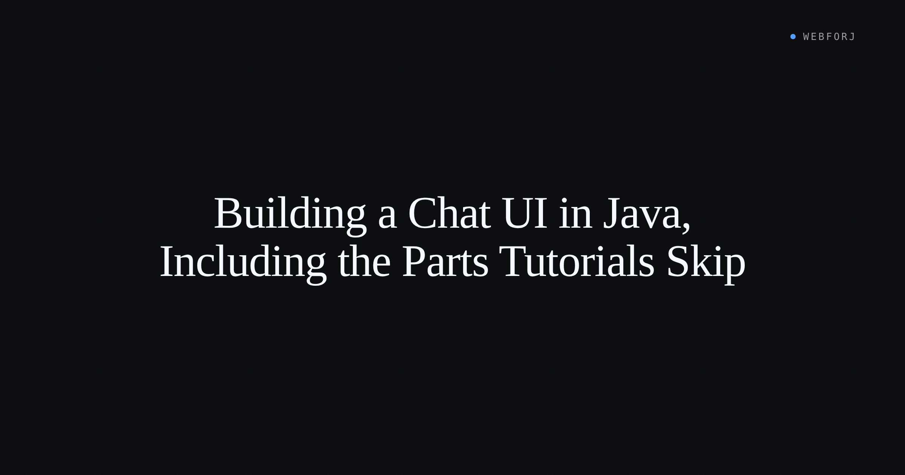

The LangChain4j quickstart is excellent for the model call. Somewhere between "response prints to the console" and "this is an actual chat panel users can sit in front of," five things need to happen that the quickstart doesn't cover: tokens need to stream into the current message without flicker, markdown needs to render as it arrives, the viewport needs to follow the answer without fighting the user's manual scroll, a stop button needs to interrupt the stream cleanly, and a regenerate button needs to re-run from the last user message. Add error states that don't require a page reload and conversation history that survives the session, and you have a chat panel instead of a demo.

This post builds that panel — the UI half — in Java. The token source is a mock: a background thread that emits chunks on a fixed interval, with canned responses for the happy path, a long markdown-heavy answer, and a deliberately-failing response that triggers the error path. The panel code doesn't know it's talking to a mock, which is the point: every feature covered here is a UI concern. Swapping in a real LLM changes one class.

<!-- truncate -->

## What the panel needs to do

Before building, a concrete scope: one conversation, one user, one AI assistant. No rooms, no persistence across restarts (there's a note at the end on adding that), no multi-user shared state. The panel covers:

- A scrollable message list with distinct user and assistant styling
- A `TextArea` composer with a Send button
- Streaming: assistant messages update in place as tokens arrive
- Markdown: code blocks, headers, and lists render during streaming
- Scroll anchoring: the viewport follows the stream, but pauses if the user scrolls up
- Stop: interrupts the stream and keeps the partial response
- Regenerate: re-runs from the last user message
- Error state: the failing mock response triggers an inline error with a retry button

The stack is webforJ with Spring Boot. All examples run with `mvn spring-boot:run`, no API key, no network.

## The layout

The chat panel is a `FlexLayout` split into two regions: a scrollable message list that takes all available vertical space, and a fixed composer row at the bottom. The `FlexLayout` docs cover direction and alignment in detail at [/docs/components/flex-layout](/docs/components/flex-layout).

Inside the message list, each chat turn is its own component: a `Div` with role-based styling applied programmatically. User messages get right-aligned text. Assistant messages get a `MarkdownViewer` — more on that shortly.

The composer is a `TextArea` next to a Button. Submit fires on button click and on `Shift+Enter`. The `TextArea` docs cover auto-resize and the predicted-text (ghost text) feature at [/docs/components/textarea](/docs/components/textarea).

## The central component: MarkdownViewer

Almost everything interesting about a streaming chat UI comes down to one component: [`MarkdownViewer`](/docs/components/markdownviewer). Two flags set up the streaming behavior:

```java
viewer.setProgressiveRender(true);
viewer.setAutoScroll(true);
```

`setProgressiveRender(true)` routes content through a buffer and renders it character-by-character — the typewriter effect chat users now expect. Each `append()` call adds to that buffer:

```java
viewer.append("## New Section\n\n");
viewer.append("More content here...");
```

When the background stream emits a chunk, the view calls `append(chunk)` on the `MarkdownViewer`. The component handles the rendering; the view code stays flat.

The default render speed of 4 (roughly 240 characters per second at 60fps) works for most responses. For faster streams or denser content:

```java
viewer.setRenderSpeed(6);
```

When all content has arrived and you want to show the remainder without waiting for the animation:

```java
viewer.flush();
```

## Scroll anchoring

This is the feature most tutorials implement with custom JavaScript: track the scroll position, detect whether the user has manually scrolled up, pin to the bottom only if they're at the bottom. It's about twenty lines of scroll-delta detection and a shadow element the user never sees.

`setAutoScroll(true)` does all of it. If a user manually scrolls up to review earlier content, auto-scroll pauses and resumes when they scroll back to the bottom. The viewport follows the streaming message during a response and backs off the moment the user signals they want to read above.

```java
viewer.setAutoScroll(true);
```

That's the section. The auto-scroll feature in `MarkdownViewer` is specifically designed for streaming chat — it was shaped by exactly the interaction model a chat panel needs.

## The stop button

A stop button has three jobs: interrupt the stream, leave the partial response in place, and reset the UI to an idle state.

The `isRendering()` method tells you whether the component is actively displaying buffered content, which is useful for deciding when to show or hide the stop button:

```java
if (viewer.isRendering()) {
  stopButton.setVisible(true);
}
```

When the user clicks stop, `stop()` halts rendering and discards any buffered content not yet displayed:

```java
// User clicked "Stop generating"
viewer.stop();
```

The distinction between `stop()` and `flush()` matters. `stop()` cuts off what's in the buffer — the partial response stays as-is. `flush()` shows everything in the buffer immediately. For a stop button, `stop()` is the right call. For a "show all now" shortcut, `flush()` is the right call.

On the stream side, the background task needs to be cancelled at the same moment. How that works depends on your reactive library or executor setup — the webforJ [Asynchronous Updates](/docs/advanced/asynchronous-updates) doc covers the `CompletableFuture` cancellation pattern and how to use `Environment.runLater()` to push UI updates from background threads safely.

Guard against double-clicks by disabling the stop button the moment the user clicks it, and re-enabling Send only after both the stream and the render animation have settled.

## Waiting for the render to finish

This is where chat panels get a subtle wrong answer. When the stream ends, the natural instinct is to re-enable the input field in the stream's completion callback. That callback fires when the last chunk has been sent — but the `MarkdownViewer` may still be animating through its buffer. Re-enabling input at that moment lets the user send the next message while the previous one is still rendering on screen.

`whenRenderComplete()` returns a `PendingResult` that fires when the progressive rendering animation finishes:

```java
viewer.whenRenderComplete().thenAccept(v -> {
  inputField.setEnabled(true);
  inputField.focus();
});
```

Call this in the stream's completion callback, not directly after the last `append()`. The panel then returns to an idle state only once the screen matches the model's output.

## Regenerate

The regenerate button replaces the last assistant message with a new response to the last user message. The state guard is: only enable the button when there's a completed assistant message and no active stream.

The sequence on click:
1. Remove the last assistant message from the message list
2. Clear and re-add a fresh `MarkdownViewer` in its place
3. Re-run the same user message through the stream

The "re-run" part calls the same send method the composer uses, passed the stored user message string. The message list stays unchanged above that point — the conversation history is preserved; only the last answer re-runs.

Disable regenerate while a stream is active (the current response is still arriving). Disable it again at the moment the user clicks it (guard against double-clicks). Re-enable it on stream completion.

## Error states

The mock streaming service includes a deliberate failure: a canned response that throws on the third token. This exercises the error path without needing a real network or rate limit.

Three shapes of error show up in a real chat panel:

**Inline error with retry.** The stream fails mid-response. The partial response stays visible. Below it, an error message and a retry button appear. The retry button re-runs the stream from the last user message — essentially the same operation as regenerate, but triggered by failure rather than user intent.

**Input returned to idle.** After any error, the composer re-enables immediately. The user can rephrase and try again without a page reload.

**No stack traces.** Whatever the underlying error message is, the user sees a short phrase: "Something went wrong" or "The response stopped early." The actual exception goes to the server log. A stack trace rendered into the chat is the wrong response to every error condition a real user will hit.

Handling errors from a background streaming thread requires routing them back to the UI thread. The `Environment.runLater()` API handles this:

```java
Environment.runLater(() -> {
  showErrorState("Response interrupted");
  sendButton.setEnabled(true);
});
```

The [Asynchronous Updates](/docs/advanced/asynchronous-updates) doc has the full thread-safety context for this pattern.

## Markdown during streaming

The brief says to be direct about this, so: incremental markdown rendering has a tricky edge. Markdown syntax spans multiple characters — a heading starts with `#`, a code fence starts with three backticks, a bold span wraps in `**`. If a chunk lands mid-token, the parser sees partial syntax.

`MarkdownViewer` with `setProgressiveRender(true)` handles this by buffering and rendering character-by-character — the animation effect means the parser is always working ahead of what the user sees, and partial tokens complete in the buffer before they reach the display. For most response shapes, this just works. Code blocks render correctly because the fence opens and closes inside the buffer before the content reaches the screen.

Where it can fail: very fast streams that dump a large code block faster than the render speed can keep up. If the buffer grows significantly behind the display, the user sees delayed code highlighting after the model has finished. `setRenderSpeed(6)` — or higher — reduces that lag. `flush()` at stream end eliminates it entirely, at the cost of losing the character-by-character animation for the tail of the response.

The pragmatic approach: tune `renderSpeed` to match the typical chunk rate of your provider. Leave `flush()` as the on-stream-complete call so the final state is always fully rendered.

## Clearing the conversation

Clearing starts a new conversation with the same panel. The sequence:
1. Clear the message list component
2. Clear the conversation history in memory
3. Reset the `MarkdownViewer`:

```java
viewer.clear();
```

`clear()` removes all content and, if progressive rendering is active, stops rendering and settles any pending `whenRenderComplete()` results.

## A note on persistence

The in-memory message list survives the user's browser session (webforJ sessions are server-side and durable within a session) but not a server restart. For persistence across restarts, the message history is a list of records: role (user or assistant), content string, and timestamp. That maps directly to a Spring Data JPA entity and a repository. The [CRUD overview](/docs/introduction/getting-started) covers the Spring Boot + JPA setup if you need a starting point.

## Swapping in a real provider

The mock streaming service emits chunks from a background thread using fixed delays. The interface the panel talks to has one method: `stream(String prompt)` returning something iterable or reactive over chunks. Replace the mock implementation with a LangChain4j or Spring AI `StreamingChatModel` call, and the panel code changes nothing. Every feature covered here — progressive render, auto-scroll, stop, regenerate, error state — is a UI concern that doesn't know or care what's on the other end of the stream.

## Closing

The LangChain4j quickstart stops at the model call because that's where the library's job ends. The rest is UI work. Most of it is handled by the `MarkdownViewer` component and the threading model in webforJ — `setProgressiveRender(true)`, `setAutoScroll(true)`, `stop()`, `flush()`, and `whenRenderComplete()` cover the behavior that makes a streaming response feel like a real chat panel rather than a log printer.

The [MarkdownViewer docs](/docs/components/markdownviewer) have the full API surface for the component. The [Asynchronous Updates](/docs/advanced/asynchronous-updates) doc covers the threading model for background streams.

What the panel doesn't have is a real model on the other end. That's one class to swap.
