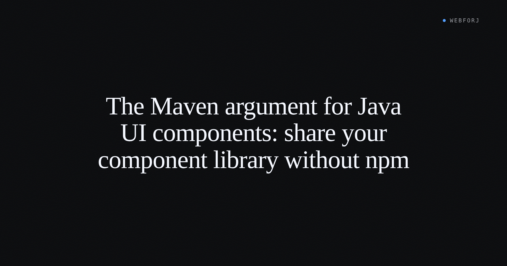

A developer on a platform team gets a request from three other squads: "We heard you built a nice date-picker. Can we use it?" It's a reasonable ask. In the JavaScript ecosystem, answering it involves a sequence of tooling decisions that have nothing to do with the date-picker itself: which registry to use, whether to set up a monorepo with npm workspaces or Lerna, whether Storybook will document the component, which bundler format to target (ESM? CommonJS? Both?), and how to manage peer dependency version conflicts when each consuming project has its own React version.

In a Java shop building with a framework where UI components are Java classes, the answer is shorter: publish a JAR.

<!-- truncate -->

## What component distribution requires

Strip the tooling conversation down to the problem. A team that wants to share UI components across projects needs four things: a way to version the components, a way to distribute them to other teams, a predictable experience for the teams consuming them, and documentation of what the components do.

For JavaScript, the ecosystem built infrastructure to solve each of these: npm handles distribution and versioning, semver tooling like Renovate tracks dependency updates, Storybook or Bit documents what components look like and how they behave, and bundlers like Rollup produce multiple output formats to match the consuming project's needs.

Java teams already have matching infrastructure for all of these. Maven manages dependency resolution and semantic versioning. Internal Nexus or Artifactory handles artifact distribution — the same registry the team already uses for every other library. JavaDoc documents API surfaces. And a JAR is the universal Java consumption format, compatible with every build tool in the ecosystem.

The infrastructure isn't new. It's what Java shops have been running for years. The question is whether UI components belong in it — and with a Java-native UI framework, they do.

## A webforJ component is a Java class

This is the key premise. In webforJ, a UI component is a Java class that extends [`Composite`](/docs/building-ui/composing-components) or wraps a web component via [`ElementComposite`](/docs/building-ui/element-composite). It has typed constructors, typed properties via `PropertyDescriptor`, and typed event APIs.

A date-picker web component wrapped in the `ElementComposite` confiugured with team's preferred default behavior is a class. A data table component with opinionated column configuration is a class. Both can live in a Maven module alongside the rest of the team's shared Java code.

There's nothing special about UI components from a packaging perspective. The annotation-based API, the component hierarchy, the event model — all of it is Java. The consuming developer imports the class, constructs it, adds it to a layout. The experience from the consuming side is identical to using any other library: a `<dependency>` block in `pom.xml`, then the class is on the classpath.

## The packaging story

A component library in a Java shop is a Maven module with `<packaging>jar</packaging>`. No special build tooling, no bundler configuration, no registry format decisions. The components go in the module, the module gets a version, the version goes to the internal Nexus or Maven Central.

The consuming team declares the dependency:

```xml
<dependency>
  <groupId>com.example</groupId>
  <artifactId>ui-components</artifactId>
  <version>1.4.0</version>
</dependency>
```

That's the consuming team's side of the story. No install step beyond Maven's dependency resolution. No peer dependency conflicts. No questions about whether the component library supports the consuming app's bundler setup. The library targets Java; the consuming app is Java; the JAR is the format both sides already use.

Version management follows standard Maven practices: semantic versioning in the POM, release via whatever CI/CD pipeline the team already uses for other libraries, dependency updates tracked through the same tooling the rest of the codebase uses.

## What Storybook does that JavaDoc doesn't

A comparison worth making directly: Storybook provides visual component documentation — a browsable catalog where developers can see components in various states, interact with them, and read usage examples rendered as working code. JavaDoc documents API signatures. For UI components, those are different things.

Java shops address this with a demo application: a running webforJ app that mounts each shared component in its interesting configurations, wired to real data or representative fixtures. It's more work to build than a Storybook configuration, and it's less interactive than Storybook's controls. For teams where developers can run the demo app locally or reach a shared staging environment, it's sufficient.

Scoped npm packages handle namespacing cleanly: `@my-org/ui-components` is unambiguous across the public registry. Maven's `groupId` does the same job — `com.example.ui` or `com.myorg.components` separates the library from everything else in the Maven ecosystem without any special registry configuration.

Bundlers produce multiple JavaScript output formats because JavaScript runtimes disagree about module formats. JVM applications don't have this disagreement. A JAR is a JAR, and it works with Maven, Gradle, Ant, and every other Java build tool.

## The point where this matters

Teams that have built with Java-native UI frameworks and found a component pattern they like often don't realize the distribution infrastructure is already in place. The mental model from years of JavaScript UI work — "sharing components means figuring out npm" — doesn't transfer to a Java context.

The mechanics of publishing a Java library to an internal Nexus instance or to Maven Central are documented and well-understood. The webforJ component model is designed to work the same way. When the platform team gets the request about the date-picker, the conversation about tooling can be short.
