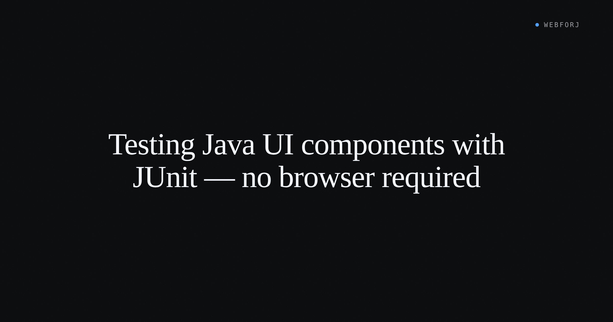

The standard advice for Java UI testing is "use Selenium." It's right for a lot of things: full user journeys, multi-page navigation, browser-specific behaviors like focus management and keyboard trapping. For component-level logic — does this button disable when the form is invalid? does this field surface the correct default label? — Selenium is the wrong tool. The feedback loop is slow, the setup requires real infrastructure, and the test is asserting against rendered HTML when what matters is a property value on a Java object.

When a UI component is a Java class, it's testable with the tools Java already has.

<!-- truncate -->

## What puts component logic in reach of JUnit

Template-based frameworks — Thymeleaf, JSP, FreeMarker — compose the UI as strings. To test whether a conditional block renders, you need the template engine to process the template, which means a running server context, and to inspect the result, you're parsing HTML. The component logic and the rendering are inseparable.

In a framework where components are Java objects, the two are separate from the start. A webforJ component is a Java class. Its properties are fields. Its state is readable without rendering. To verify that a `TextField` has a specific default label, you instantiate the class and read the property — no server, no browser, no HTML.

That's not a testing convenience bolted on after the fact. It's a consequence of keeping UI composition in Java.

## PropertyDescriptorTester — validating the property contract

webforJ components that wrap third-party web components declare their properties with [`PropertyDescriptor`](/docs/building-ui/element-composite) fields. Each descriptor maps a Java property name to a web component attribute, along with its default value. A component with ten properties has ten descriptors — and ten potential mismatches between the declared defaults, the getter method, and the setter method.

`PropertyDescriptorTester` validates all of them in a single JUnit call. It scans the component class, finds every `PropertyDescriptor` field, sets the default value via the setter, reads it back via the getter, and compares. Any mismatch — wrong method name, wrong default, wrong wiring — surfaces as an `AssertionError` with the specific property named.

Here's the test case pattern from the [PropertyDescriptorTester docs](/docs/testing/property-descriptor-tester):

```java title="MyComponentTest.java"
import com.webforj.component.element.PropertyDescriptorTester;
import org.junit.jupiter.api.Test;

class MyComponentTest {

  MyComponent component = new MyComponent();

  @Test
  void validateProperties() {
    try {
      PropertyDescriptorTester.run(MyComponent.class, component);
    } catch (Exception e) {
      fail("PropertyDescriptor test failed: " + e.getMessage());
    }
  }
}
```

The test runs without a server, without a browser, and without Spring context. It's a pure JUnit test — the component is a Java object; the tester calls its methods and checks the results.

`PropertyDescriptorTester` is marked experimental in the current release. For the full API — including `@PropertyExclude` for skipping properties that depend on external systems, and `@PropertyMethods` for non-standard getter/setter naming — see the [reference docs](/docs/testing/property-descriptor-tester).

## Testing event registration

Components expose typed listener APIs: `addClickListener`, `addOpenListener`, `addValueChangeListener`. Testing that a listener registration works doesn't require a DOM event to fire. The event API on a Java component is a method call that returns a registration handle; the handle is a Java object. Whether the listener was accepted is checkable without simulating a user interaction.

The pattern: instantiate the component, register a listener, assert the registration handle is not null. If the component's listener API fires synchronously when the event condition is met (which is the case for value-change events backed by a mutable field), you can trigger the condition in the test, catch the event in the listener, and assert on the received value — all in a plain JUnit test method.

For events that require a real browser interaction (a mouse click, a keyboard event, a touch gesture), browser-level E2E coverage is still appropriate. The unit/E2E boundary is between "component accepts and routes this event type" and "the browser fires this event under these user conditions."

## Where Selenium belongs

Selenium covers what unit tests can't: real navigation between routes, real browser APIs (scroll position, clipboard access, system dialogs), cross-component interactions where the behavior emerges from how multiple components interact in a rendered layout. These tests are right to be slow — they're verifying the assembled system, not individual components.

The problem with using Selenium for component-level assertions is the cost-to-signal ratio. A Selenium test that verifies a text field's default label has the same latency as one that verifies a complete checkout flow — browser startup, page load, element lookup, assertion, teardown. For a property that's two method calls away, that's overhead with no return.

The [webforJ testing docs](/docs/testing/overview) describe the full testing approach: unit tests for component logic with JUnit, end-to-end tests for user journeys with Selenium or Playwright. Each layer covers what it's suited for.

## The two-layer test pyramid

For a Java UI app built with webforJ, the practical test structure is two layers:

**Unit tests (fast, no infrastructure):** component property validation via `PropertyDescriptorTester`, event listener registration, state transitions triggered by method calls. These run in milliseconds. Every developer runs them on every change.

**E2E tests (slower, require a running server and browser):** user journeys that span multiple components, routes, or browser events. These run in CI and before release. They verify behavior the unit layer can't reach.

There's no middle layer of "render the component in a headless browser and assert on HTML." Because the component logic is in Java, unit tests cover it. Because user journeys need a real environment, E2E tests cover them. The HTML rendering is an output of the framework, not something to test directly.

The consequence: when a test fails, it's clear which layer it belongs to and what it's verifying. A failing unit test means component logic is wrong. A failing E2E test means the assembled system behaves differently than expected. The distinction is built into the test structure.
