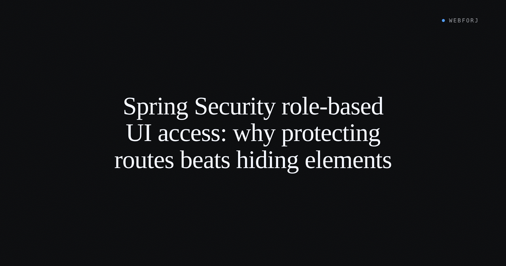

A developer asks: "How do I control which users see which views?" In a webforJ app, the natural answer is to call `setVisible(false)` on a navigation component based on the current user's role, or to conditionally add layout elements depending on permissions. It's direct and it works for what it does — but what it does is different from what the question was asking.

Controlling visibility and restricting access are different operations. Treating them as equivalent is how unintended access surfaces in production.

<!-- truncate -->

## Two operations that look the same

The developer's intent is usually to prevent unauthorized users from reaching a view. What `setVisible(false)` addresses is whether to render a particular UI component in the current layout.

Those operations run at different points in the application lifecycle. Component visibility — `setVisible(false)`, `setEnabled(false)` — is evaluated while the containing view is already rendering. The component's visibility state is a property of the rendered UI. The check has already happened; the framework has committed to generating a response.

Route-level enforcement intercepts before any of that. An annotation on the view class itself is evaluated by the security system before the view is constructed. If the check fails, rendering never starts — the user is redirected before a single component is created.

The surface result is similar: the user doesn't see the restricted content. The structural difference is significant: one determines the output of a render; the other determines whether the render occurs.

## What component visibility does

`setVisible(false)` on a navigation component removes it from the rendered layout. If the user lacks the required role, the button doesn't appear. The link is absent from the UI.

What `setVisible(false)` doesn't do is stop the user from navigating to the target view directly. The visibility check is on the component pointing to the destination, not on the destination. A user who knows the URL — from a bookmark, a shared link, browser history, or a network scan — can reach the unprotected route regardless of whether any navigation component is rendered.

webforJ's [component documentation](/docs/building-ui/using-components) states this directly:

> `setVisible(false)` and `setEnabled(false)` affect the UI only. They don't stop a determined user from invoking the underlying action through the browser or a crafted request, so never rely on them to protect sensitive operations. Always enforce access control on the server.

Component visibility is a presentation-layer decision. It controls what the interface shows. It doesn't control who can reach a view.

## What route-level enforcement does instead

Route-level security shifts the enforcement point. When `@RolesAllowed` appears on a Java view class, the security system evaluates it before instantiating the view. The webforJ [Security Annotations](/docs/security/annotations) documentation describes this directly: "the security system automatically enforces these rules before any component is rendered."

```java title="TeamsView.java"
@Route(value = "/teams", outlet = MainLayout.class)
@RolesAllowed("ADMIN")
public class TeamsView extends Composite<FlexLayout> {
  private final FlexLayout self = getBoundComponent();

  public TeamsView() {
    self.setHeight("100%");
    self.setAlignment(FlexAlignment.CENTER);
    self.add(new Explore("Teams"));
  }
}
```

If the check fails, the view class is never touched. The components in that view are never constructed. There is no rendered output to shape — the user is redirected at the navigation interceptor.

This changes the security posture in a concrete way: there is no path to the view that skips the check. Direct URL navigation, history manipulation, and any client-side mechanism that triggers a route change all arrive at the same enforcement point. The annotation is on the thing being protected, not on a pointer to it.

It also keeps the access policy co-located with the view it governs. Any developer reading the view class can see its security requirements in the annotation — there's no need to search the layout for conditionally rendered navigation components.

## The production hardening rule

webforJ's production hardening documentation addresses the visibility/security distinction directly. Under "Disabled and hidden aren't security," the [Production Hardening guide](/docs/security/application-security/production-hardening) states:

> `setEnabled(false)` and `setVisible(false)` are interface cues, not access controls. webforJ mirrors a control's disabled state to the client, but it doesn't stop a manipulated client from re-enabling that control and triggering its action.

The instruction that follows: put the real rule in the server-side handler. A disabled button is a UX signal. A server-side permission check is what stops a manipulated client.

Component visibility operates on the same principle. Hiding a navigation element guides users by not showing them paths they won't be permitted to follow. A `@RolesAllowed` annotation on the route class stops any client from rendering the view. The former is a courtesy to the user; the latter is a constraint on the system.

## Server-side authorization for actions

Route annotations handle navigation security. Actions inside a view are a separate concern. When a button triggers a destructive operation — a delete, a publish, a role assignment — the view is already open and no route is evaluated when the button fires.

In those cases, the server-side handler needs its own check:

```java
delete.onClick(e -> {
    Authentication auth = SecurityContextHolder.getContext().getAuthentication();
    boolean allowed = auth.getAuthorities().stream()
        .anyMatch(a -> a.getAuthority().equals("ROLE_ADMIN"));
    if (!allowed) {
        return;
    }
    userService.delete(selected);
});
```

The pattern is the same principle as route annotations but applied one level down: the annotation decides who can reach the view, the handler confirms whether the user is allowed to perform a specific action within it. A button that's conditionally rendered based on role is good UX — it removes a control that serves no purpose for this user — but the handler check is what stops a manipulated client from triggering the action anyway.

## When component visibility is the right tool

None of this argues against component visibility as a UX mechanism. The case for using it holds in the right context.

Conditionally rendering navigation based on role makes the interface less cluttered, and hiding controls that a user can't use keeps the experience consistent with what each role is expected to do. If a user can't reach `/admin`, showing an "Admin" link only to redirect them on arrival is noise, not navigation.

The component visibility check is the right tool for that case. The access control for the view the component navigates to belongs at the route level.

Route annotations enforce access; component visibility reflects access. Both are useful. The mistake is using one to do the job of the other.

## Where each belongs

A common pattern that creates exposure in Java web apps: the view exists, the route is unannotated, and `setVisible(false)` hides the navigation component. From the user's perspective, the control is gone. From anyone who knows the URL, the route is reachable.

In webforJ, `@RolesAllowed` on the view class is the complete solution. There is no template layer to keep in sync with the annotation — the annotation is the policy. If someone removes the navigation component entirely, the route still enforces the correct access. If the annotation changes, the policy changes, and nothing else needs updating.

For views that carry sensitive data or privileged actions, `@RolesAllowed` — or `@RouteAccess` with SpEL expressions for more nuanced conditions — is non-negotiable.

webforJ's [Security Annotations](/docs/security/annotations) reference covers `@RolesAllowed`, `@PermitAll`, `@AnonymousAccess`, and `@DenyAll` for common cases, and [`@RouteAccess` with SpEL expressions](/docs/security/spel-expressions) for more complex role and authority combinations.
