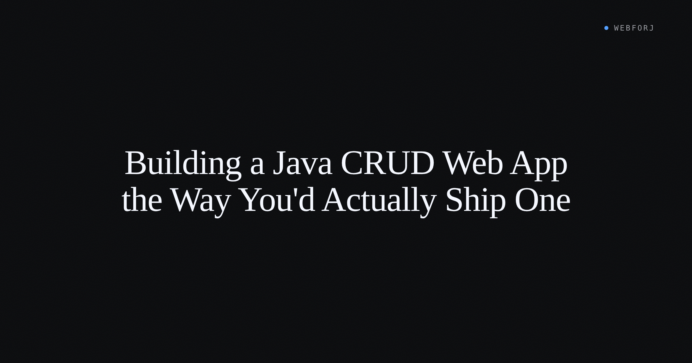

I've watched a spreadsheet turn into an admin panel more than once. It starts as a shared file where one person updates statuses and another filters by column. Six months later the request arrives: make it a real tool — something that searches by name, filters by role, edits inline, and doesn't lose data when two people touch the same row.

That's the tool this post builds. A user management panel with live search, role and status filters, sortable columns, and an edit form backed by Jakarta Bean Validation. Spring Boot handles the data layer; webforJ's `Table` component and `SpringDataRepository` adapter handle the UI — no separate frontend project, no context switching between languages.

The tutorial that follows isn't a "hello world CRUD" walkthrough. It covers the parts every tutorial skips: the search box that queries the database instead of filtering an in-memory list, the filter dropdown that composes cleanly with search, the edit form that maps validation errors back to the field that failed, and the empty state that tells the user something instead of showing a blank box.

<!-- truncate -->

## What we're building

The domain is a user management panel — the kind a support team would use day-to-day. A `User` entity with id, email, name, role (ADMIN / SUPPORT / VIEWER), active flag, and createdAt. A seed of ~500 users, enough to matter when filtering. Two views:

- `UserListView`: searchable, filterable, sortable table
- `UserDetailView`: edit form with Bean Validation and a clear error path

Authentication in the sample is a hardcoded three-user fixture — admin, support, and viewer — so the panel runs without an OAuth provider or any external account. A dev-only "switch user" dropdown in the toolbar lets you step through the different roles and see what each one sees. The permission logic — who can toggle the active flag, who can only view — demonstrates the pattern without requiring a full RBAC system.

## The domain

The `User` entity carries JPA annotations and Jakarta Bean Validation constraints together. Keeping the constraints on the entity means the validation rule lives in one place: the binding context in the edit form picks them up from there, and the JPA layer enforces the not-null ones at the database level.

The role is a Java enum (`ADMIN`, `SUPPORT`, `VIEWER`), persisted as a string. The `active` flag is a simple boolean. Both are what a `ChoiceBox` filter will target.

## The repository layer

For full compatibility with webforJ components, create the Spring Data repository implementing both `JpaRepository` and `JpaSpecificationExecutor`:

```java title="UserRepository.java"
@Repository
public interface UserRepository
        extends JpaRepository<User, Long>,
        JpaSpecificationExecutor<User> {
}
```

`JpaRepository` covers CRUD operations and pagination. `JpaSpecificationExecutor` is what makes dynamic search and filter work — it exposes a `findAll(Specification, Pageable)` method that the `SpringDataRepository` adapter translates into webforJ's internal `findBy` / `size` contract. The [Spring Data JPA integration](/docs/integrations/spring/spring-data-jpa) docs describe this detection: the adapter examines which Spring Data interfaces your repository implements and enables the corresponding features automatically.

A service class wraps the repository and exposes the adapter:

```java title="UserService.java"
@Service
@Transactional
public class UserService {
  private final UserRepository repository;

  public UserService(UserRepository repository) {
    this.repository = repository;
  }

  public User updateUser(User user) {
    if (!repository.existsById(user.getId())) {
      throw new IllegalArgumentException("User not found with ID: " + user.getId());
    }
    return repository.save(user);
  }

  public SpringDataRepository<User, Long> getRepositoryAdapter() {
    return new SpringDataRepository<>(repository);
  }

  public User getUserByKey(Long id) {
    return repository.findById(id)
        .orElseThrow(() -> new IllegalArgumentException("User not found with ID: " + id));
  }
}
```

`getRepositoryAdapter()` is the handshake point between the Spring side and the webforJ side. It wraps the Spring Data repository in webforJ's `Repository` interface so the `Table` can drive pagination and sorting without knowing anything about JPA.

## The list view — table basics

The `Table` component binds directly to a `Repository`. Add columns, set the repository, and the table handles the first page fetch, pagination, and column sorting:

```java title="UserListView.java"
@Route
public class UserListView extends Composite<Div> {
  private SpringDataRepository<User, Long> repository;
  private Table<User> table = new Table<>();

  public UserListView(UserRepository userRepository) {
    // Wrap Spring Data repository for webforJ
    repository = new SpringDataRepository<>(userRepository);

    // Connect to table
    table.setRepository(repository);

    // Define columns
    table.addColumn("name", User::getName)
          .setPropertyName("name"); // Sort by actual JPA property
    table.addColumn("email", User::getEmail);
    table.addColumn("role", user ->
          user.getRole() != null ? user.getRole().toString() : "");

    // Enable sorting
    table.getColumns().forEach(column -> column.setSortable(true));
  }
}
```

`setPropertyName()` is important for sorting. The column label shown in the header might differ from the JPA field name — especially when the cell renderer is a lambda that formats the value. `setPropertyName("name")` tells the adapter which JPA property goes into the `ORDER BY` clause when a user clicks that column header. Without it, sorting on computed columns produces no result or sorts incorrectly.

The table fetches its first page when it renders. There's no manual `reload()` call after adding columns.

## Search that actually queries the database

A search field that filters an in-memory list works fine at 20 rows. At 500 it's tolerable. Beyond that, loading every record into memory before filtering is the wrong query for the wrong reason — it defeats the JPA paging the repository is already set up to do.

The fix is to push the search term into a JPA `Specification` and hand it to the repository. The table re-fetches from the database with the filter applied, returning only the matching page:

```java
// Filter by a single field
Specification<User> emailFilter = (root, query, cb) ->
  cb.equal(root.get("email"), "alice@example.com");
repository.setFilter(emailFilter);

// Clear filter
repository.setFilter(null);
```

For a real search box, the `Specification` becomes a `LIKE` query on the name and email fields. Wire it to a `TextField`'s modify event: each keystroke builds a new specification from the current term and calls `repository.setFilter()`. The [Spring Data JPA integration](/docs/integrations/spring/spring-data-jpa) docs cover the full filtering API, including the `escapeLikePattern` pattern for protecting the `LIKE` clause from SQL injection through user-supplied characters.

After setting a filter, call `repository.commit()` to tell the `Table` to re-fetch. The table responds to `commit()`, not to `setFilter()` directly — this lets you batch multiple filter changes before triggering a single query.

## Filter dropdowns

A role filter and an active status filter both follow the same specification pattern as search. Where search builds a dynamic `LIKE` condition from a text field, the dropdowns build a static equality condition from a selected enum value.

When filter values combine — a search term and a role selection — compose them into one specification:

```java
// Multiple conditions
Specification<User> activeRoleFilter = (root, query, cb) ->
  cb.and(
    cb.equal(root.get("role"), "SUPPORT"),
    cb.equal(root.get("active"), true)
  );
repository.setFilter(activeRoleFilter);
```

A `ChoiceBox` with options "All", "Admin", "Support", "Viewer" drives the role filter. When the selection changes, the view rebuilds the combined specification — current search term plus selected role — and calls `repository.setFilter()` followed by `repository.commit()`. The `Table` re-fetches with both conditions applied at the query layer; neither the table nor the client holds a full dataset to filter locally.

Clearing a filter means setting `null`:

```java
repository.setFilter(null);
```

## Sortable columns

Sorting is automatic once `setSortable(true)` is set on each column and `setPropertyName()` is registered for any column where the header label doesn't match the JPA field. When a user clicks a column header, `SpringDataRepository` translates the sort direction into an `ORDER BY` on the next page fetch. A second click reverses the direction; a third clears it.

The sort and filter states are independent — filtering by role doesn't reset the sort, and sorting by name doesn't clear the search term. The repository composes them in the query.

## Inline edit and detail edit

Two edit modes serve different purposes. Inline edit is the right choice for a single boolean toggle — flipping a user's `active` flag without navigating away. Detail edit handles the full form, where multiple fields need editing and Bean Validation should catch bad input before it reaches the database.

For detail edit, `BindingContext.of()` wires every form field to the model automatically:

```java
bindingContext = BindingContext.of(this, User.class, true);
```

The `true` argument enables automatic binding — it connects each field in the form component to the matching property on `User` by name. When the user hits Save, `write()` pushes the form values back to the model and runs Jakarta validation in the same call:

```java
private void saveUser() {
  ValidationResult result = bindingContext.write(this.currentUser);
  if (result.isValid()) {
    if (onSave != null) {
      onSave.accept(this.currentUser);
    }
    self.close();
  }
}
```

If validation fails — an empty `name`, an invalid `email` — the binding context maps each constraint violation back to the field that owns it. The `@Email` constraint on the entity surfaces on the email field; the `@NotBlank` constraint surfaces on the name field. No manual error routing. If validation passes, the updated user goes to the service layer and the table refreshes.

For cases where the field name doesn't match the property name, `@UseProperty` on the field annotation tells the binding context which property to use:

```java
@UseProperty("role")
private ChoiceBox<String> roleBox;
```

The [Data binding overview](/docs/data-binding/overview) covers the full `BindingContext` API, including manual bindings for complex forms where automatic field-name matching isn't enough.

## Empty and error states

An admin panel that shows a blank box when a filter returns nothing isn't usable. The user doesn't know whether the data is missing, the query failed, or the app is broken.

A clear empty message removes the ambiguity:

```java
table.setEmptySelectionLabel("No users match the current filters.");
```

For query failures — database connection issues, unexpected exceptions in the `Specification` — a try/catch in the filter event handler can set a visible error indicator in the view and clear the filter. The principle is the same as the empty state: the UI should communicate what happened, not silently show nothing.

## A note on permissions

The sample runs with a hardcoded three-user fixture map — admin, support, viewer — so there's no external identity provider to configure. A dev-only dropdown in the toolbar switches between fixtures, making the permission states easy to walk through.

The light permission check lives at two levels. At the view level, `@RolesAllowed` on `UserDetailView` keeps the edit form off-limits to viewers:

```java
@Route(value = "/users/:id/edit", outlet = MainLayout.class)
@RolesAllowed({"ADMIN", "SUPPORT"})
public class UserDetailView extends Composite<FlexLayout> {
  // ...
}
```

At the action level, the handler that toggles the active flag checks the role before committing. A viewer-role user might reach the list view — that's fine — but the toggle is disabled in the UI and the server-side handler returns early if the active-toggle action arrives from a support-role session.

The route annotation is the floor, not the ceiling. It stops the detail view from rendering at all for unauthorized users. The handler check stops a manipulated client from triggering a privileged write through a view it was never supposed to reach.

For the production wiring — connecting to a real identity provider, using Spring Security's `SecurityContextHolder` to inspect the authenticated principal — the [Security Annotations](/docs/security/annotations) reference covers `@RolesAllowed`, `@PermitAll`, `@AnonymousAccess`, and `@DenyAll`.

## What's next

The ~500-user seed is enough to feel like a real dataset. A production panel at 50,000 rows needs pagination surfaced in the UI — the `Table` already handles it at the data layer, but making it navigable requires a `Navigator` component or custom pagination controls wired to the repository's page state. The [Repository documentation](/docs/advanced/repository/overview) covers the `setBaseFilter()` API for base filters that persist across page changes.

An audit log and a CSV export are the natural follow-ons: both reach into the same service layer the panel is already wired to. A second entity — articles, orders, whatever fits the domain — follows the same structure: a `JpaRepository` + `JpaSpecificationExecutor` repository, a service that exposes `getRepositoryAdapter()`, and a view that sets up the `Table` with columns and sorting.

## The panel you can actually ship

By the end of this build, the panel searches against the database, filters by role, sorts by column, edits with validation, and handles empty states without a blank screen.

The components are composable in a predictable way. The `Specification` pattern that drives the search box is the same one that drives role filtering — they compose into a single filter handed to the repository. The `BindingContext` that handles the user edit form works identically on any other entity's edit form. The `SpringDataRepository` adapter makes any Spring Data JPA repository compatible with the `Table` without touching the repository interface.

That composability is worth naming: the architecture of this panel doesn't change when the domain grows. Adding new columns, new filters, and new entity types is the same operation repeated — not a new pattern to learn.
