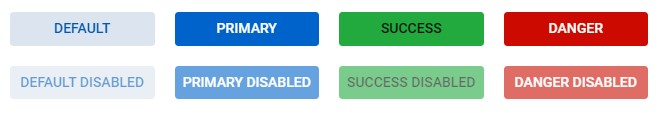

import ComponentDemo from '@site/src/components/DocsTools/ComponentDemo';

<div style={{width: "100%" , display: "flex", justifyContent: "flex-end", marginBottom: "-50px"}}>
<p style={{color: "gray"}} >API:&nbsp;</p>
<b><a href="https://javadoc.io/doc/org.dwcj/dwcj-engine/latest/org/dwcj/controls/button/Button.html" style={{justifySelf: "flex-end"}}> Java </a></b>
</div>

### Text

Buttons come with a parameterized constructor, taking a String argument, which will set the initial text of the button. The ```setText(String foo)``` method can also be called to set the text of the button.  

<br />

### Adding Icons to Buttons

In addition to, or instead of having text on a button, it is possible to add an icon to a button as well. Out of the box, the following icon pools can be used:

<ol>
    <li><a href='https://tabler-icons.io/'> Tabler </a></li>
    <li><a href='https://feathericons.com/'> Feather </a></li>
    <li><a href='https://fontawesome.com/'> Font Awesome Free </a></li>
</ol>

Below are examples of buttons with text to the left and right, as well as a button with only an icon:

<ComponentDemo 
path='https://hot.bbx.kitchen/webapp/controlsamples?class=control_demos.buttondemos.ButtonIcon' 
javaE='https://raw.githubusercontent.com/DwcJava/ControlSamples/main/src/main/java/control_demos/buttondemos/ButtonIcon.java'
javaC='https://raw.githubusercontent.com/DwcJava/ControlSamples/main/src/main/code_snippets/button/Icon.txt'
cssURL='https://raw.githubusercontent.com/DwcJava/ControlSamples/main/src/main/resources/css/buttonstyles/icon_styles.css' 
javaHighlight='{15,17,19}'
height="100px"
/>


<!--  d -->
<br />

To add these icons, set the button's text to have an `<html>` tag, with a `<bbj-icon>` tag inside with the name attribute set accordingly. In addition to an icon, include text to the left or right of the `<bbj-icon>` tag to include a label as well.

<br />

### Disabling a Button

Button components can be disabled to convey to a user that a certain action is not yet or is no longer available. A disabled button will increase the gray scale of the button, and is available for 
all button themes and expanses. <br/><br/>

<ComponentDemo 
path='https://hot.bbx.kitchen/webapp/controlsamples?class=control_demos.buttondemos.ButtonDisable' 
javaE='https://raw.githubusercontent.com/DwcJava/ControlSamples/main/src/main/java/control_demos/buttondemos/ButtonDisable.java'
javaC='https://raw.githubusercontent.com/DwcJava/ControlSamples/main/src/main/code_snippets/button/Disable.txt'
cssURL='https://raw.githubusercontent.com/DwcJava/ControlSamples/main/src/main/resources/css/buttonstyles/disable_styles.css'
javaHighlight='{49-52}'
/>

<!--  -->

<br />

Disabling a button can be done at any time in the code by using the ```setEnabled(boolean foo)``` function. For added convenience, a button can also be disabled when clicked using the built-in ```setDisabledOnClick(boolean foo)``` function.

<br />

### Themes

DWCJ button components come with 14 themes built in for quick styling without the use of CSS.
Shown below are example buttons with each of the supported Themes applied: <br/>


<ComponentDemo 
path='https://hot.bbx.kitchen/webapp/controlsamples?class=control_demos.buttondemos.ButtonThemes' 
javaE='https://raw.githubusercontent.com/DwcJava/ControlSamples/main/src/main/java/control_demos/buttondemos/ButtonThemes.java'
javaC='https://raw.githubusercontent.com/DwcJava/ControlSamples/main/src/main/code_snippets/button/Theme.txt'
cssURL='https://raw.githubusercontent.com/DwcJava/ControlSamples/main/src/main/resources/css/buttonstyles/theme_styles.css'
javaHighlight='{23-36}'
/>

<!--  -->

<br/>

Listed below are the current supported theme options for the button control:<br/>

|Button Themes|
|-|
|<ul><li>```Button.Theme.DEFAULT```</li><li>```Button.Theme.DANGER```</li><li>```Button.Theme.GRAY```</li><li>```Button.Theme.INFO```</li><li>```Button.Theme.PRIMARY```</li><li>```Button.Theme.SUCCESS```</li><li>```Button.Theme.WARNING```</li><li>```Button.Theme.OUTLINED_DEFAULT```</li><li>```Button.Theme.OUTLINED_DANGER```</li><li>```Button.Theme.OUTLINED_GRAY```</li><li>```Button.Theme.OUTLINED_INFO```</li><li>```Button.Theme.OUTLINED_PRIMARY```</li><li>```Button.Theme.OUTLINED_SUCCESS```</li><li>```Button.Theme.OUTLINED_WARNING```</li></ul>|

<br />

### Expanses
There are five button expanses that are supported in the DWCJ which allow for quick styling without using CSS.
Below are the various expanses supported for the button component: <br/>

<ComponentDemo 
path='https://hot.bbx.kitchen/webapp/controlsamples?class=control_demos.buttondemos.ButtonExpanses' 
javaE='https://raw.githubusercontent.com/DwcJava/ControlSamples/main/src/main/java/control_demos/buttondemos/ButtonExpanses.java'
javaC='https://raw.githubusercontent.com/DwcJava/ControlSamples/main/src/main/code_snippets/button/Expanses.txt'
cssURL='https://raw.githubusercontent.com/DwcJava/ControlSamples/main/src/main/resources/css/buttonstyles/expanse_styles.css'
javaHighlight='{18-22}'
/>

<!--  -->

|Button Expanses|
|-|
|<ul><li>```Button.Expanse.XSMALL```</li><li>```Button.Expanse.SMALL```</li><li>```Button.Expanse.MEDIUM```</li><li>```Button.Expanse.LARGE```</li><li>```Button.Expanse.XLARGE```</li></ul>|


<br />

### Vertical Text Alignments

The DWCJ supports alignment of text within a button without having to use CSS to accomplish this.
Shown below are the three options for vertical alignment of text within a button : <br/>

<ComponentDemo 
path='https://hot.bbx.kitchen/webapp/controlsamples?class=control_demos.buttondemos.ButtonAlignment' 
javaE='https://raw.githubusercontent.com/DwcJava/ControlSamples/main/src/main/java/control_demos/buttondemos/ButtonAlignment.java'
javaC='https://raw.githubusercontent.com/DwcJava/ControlSamples/main/src/main/code_snippets/button/Alignment.txt'
cssURL='https://raw.githubusercontent.com/DwcJava/ControlSamples/main/src/main/resources/css/buttonstyles/alignment_styles.css'
javaHighlight='{24,27,30}'
/>

<!--  -->

Listed below are the current supported vertical text alignments for the button component:

|Button Vertical Alignments|
|-|
|<ul><li>```Button.Expanse.TOP```</li><li>```Button.Expanse.CENTER```</li><li>```Button.Expanse.BOTTOM```</li></ul>|