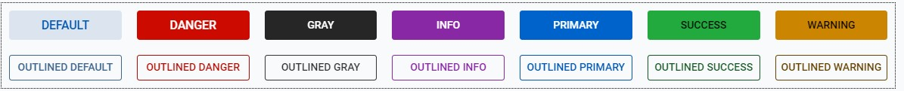
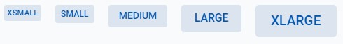
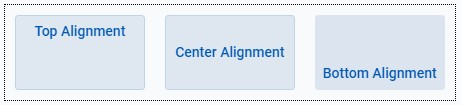
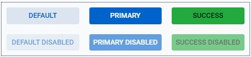

# Button

The button control object provides methods for creating and manipulating a button in applications
or webpages. The button's behavior can be modified with the methods and events listed below, and is customizable with various themes, styles and expanses.

### At a Glance

|Parent Class| Interfaces |
|------------|------------|
|[AbstractDwcControl](#)| <ul><li>[HasFocus](#)</li><li>[HasTabTraversal](#)</li><li>[HasTextAlignment](#)</li></ul>|

| Methods |
|------------|
| <ul><li>[`Button(String text)`](#)</li><li>[`Expanse getExpanse()`](#)</li><li>[`Theme getTheme()`](#)</li><li>[`TextVerticalAlignment getVerticalAlignment()`](#)</li><li>[`Boolean isDisableOnClick()`](#)</li><li>[`Button setDisableOnClick(boolean disable)`](#)</li><li>[`Button setExpanse(Button.Expanse expanse)`](#)</li><li>[`Button setTheme(Button.Theme theme)`](#)</li><li>[`Button setVerticalAlignment(Button.TextVerticalAlignment alignment)`](#)</li></ul>|


| Events |
|------------|
| <ul><li>[`Button onClick(Consumer<ButtonPushEvent> callback)`](#)</li></ul> |


<!-- ### Methods

| Method Name | Parameters | Returns | Description |
|:-----------:|:----------:|:-------:|-------------|
| <a name='tButton'/>`Button`| `String` | N/A | Parameterized constructor for the Button control which will set the text of the button to the string passed. May be passed no parameters as well.|
| <a name='tClick'/>`onClick` | `Consumer<ButtonPushEvent>` A function that performs the desired on-click behavior| `Button` | Function that registers a click on the button. Needs to take the function signature of a separate function which can be written to handle the click. An example function signature might be `button.onClick(this::buttonPushHandler)` where the buttonPushHandler is later defined in your program. The signature of that function may look something like this: `buttonPushHandler(ButtonPushEvent ev){...}`  |
| <a name='tDisableG'/>`isDisableOnClick` | N/A | `Boolean` | Returns whether or not the button will be disabled when clicked on. |
| <a name='tDisableS'/>`setDisableOnClick` | `Boolean` | `Button` |Sets whether or not the button will be disabled when clicked on.|
| <a name='tThemeS'/>`setTheme` | `Button.Theme` | `Button` | Sets the vertical alignment for text within a button. To do this, use one of the enums listed in the <b>[Themes section.](###Themes)</b> |
| <a name='tExpanseS'/>`setExpanse` | `Button.Expanse` | `Button` | Sets the expanse of a button based on predetermined values that can be explored in more detail in the <b>[Expanses section.](###Expanses)</b> |
| <a name='tVertAlignG'/>`getVerticalAlignment` | N/A | `Button.TextVerticalAlignment` |Returns an enum value representing the vertical alignment of the text within a button. See <b>[Vertical Alignments.](###Vertical-Text-Alignments)</b>|
| <a name='tVertAlignS'/>`setVerticalAlignment` | `Button.TextVerticalAlignment` | `Button` | Sets the vertical alignment for text within a button. To do this, use one of the enums listed in the <b>[Vertical Alignments.](###Vertical-Text-Alignments)</b>| -->


### Button Text

Buttons come with a parameterized constructor, taking a String argument, which will set the initial text of the button. The ```setText(String foo)``` method can also be called to set the text of the button.  

### Themes

DWCJ button components come with 14 themes built in for quick styling without the use of CSS.
Shown below are example buttons with each of the supported Themes applied: <br/>
<!--  -->
<iframe 
loading="lazy"
src='http://localhost:8888/webapp/dwcj_control_demos?class=org.dwcj.control_demos.buttondemos.ButtonDemo' 
style={{"width": "100%"}}></iframe><br/>
Listed below are the current supported theme options for the button control:<br/><br/>

|Button Themes|
|-|
|<ul><li>```Button.Theme.DEFAULT```</li><li>```Button.Theme.DANGER```</li><li>```Button.Theme.GRAY```</li><li>```Button.Theme.INFO```</li><li>```Button.Theme.PRIMARY```</li><li>```Button.Theme.SUCCESS```</li><li>```Button.Theme.WARNING```</li><li>```Button.Theme.OUTLINED_DEFAULT```</li><li>```Button.Theme.OUTLINED_DANGER```</li><li>```Button.Theme.OUTLINED_GRAY```</li><li>```Button.Theme.OUTLINED_INFO```</li><li>```Button.Theme.OUTLINED_PRIMARY```</li><li>```Button.Theme.OUTLINED_SUCCESS```</li><li>```Button.Theme.OUTLINED_WARNING```</li></ul>|

<br/>Theming is supported by use of a built-in enum class. To apply a theme, execute code similar to the following: <br/><br />

```java
import org.dwcj.controls.button.Button;

Button exampleButton = new Button("Example");      //Creates a new button with the text "example"
exampleButton.setTheme(Button.Theme.DEFAULT);      //Sets the button's theme to be the default theme.
```


### Expanses
There are five button expanses that are supported in the DWCJ which allow for quick styling without using CSS.
Below are the various expanses supported for the button control: <br/>
<!--  -->
<iframe 
loading="lazy"
src='http://localhost:8888/webapp/dwcj_control_demos?class=org.dwcj.control_demos.buttondemos.ButtonExpanses' 
style={{"width": "100%", "height" : "100px"}}></iframe><br/>
Listed below are the current supported expanse options for the button control:<br/><br/>

|Button Expanses|
|-|
|<ul><li>```Button.Expanse.XSMALL```</li><li>```Button.Expanse.SMALL```</li><li>```Button.Expanse.MEDIUM```</li><li>```Button.Expanse.LARGE```</li><li>```Button.Expanse.XLARGE```</li></ul>|

<br/>Expanses are supported by use of a built-in enum class. To apply an expanse, execute code similar to the following: <br/><br />

```java
import org.dwcj.controls.button.Button;

Button exampleButton = new Button("Example");      //Creates a new button with the text "example"
exampleButton.setExpanse(Button.Expanse.MEDIUM);     //Sets the button's expanse to the medium size.
```


### Vertical Text Alignments

The DWCJ supports alignment of text within a button without having to use CSS to accomplish this.
Shown below are the three options for vertical alignment of text within a button : <br/><br/>
<!--  -->
<iframe 
loading="lazy"
src='http://localhost:8888/webapp/dwcj_control_demos?class=org.dwcj.control_demos.buttondemos.ButtonAlignment' 
style={{"width": "100%", "height" : "120px"}}></iframe>

Listed below are the current supported vertical text alignments for the button control:

|Button Vertical Alignments|
|-|
|<ul><li>```Button.Expanse.TOP```</li><li>```Button.Expanse.CENTER```</li><li>```Button.Expanse.BOTTOM```</li></ul>|


<br/>The various alignments are supported by use of a built-in enum class. To apply an alignment, execute code similar to the following: <br/><br/>

```java
import org.dwcj.controls.button.Button;                       

Button exampleButton = new Button("Example");                             //Creates a new button with the text "example"
exampleButton.setVerticalAlignment(Button.TextVerticalAlignment.CENTER);  //Sets the button's theme to be the default theme.
```


### Disabling a Button

Button controls can be disabled to convey to a user that a certain action is not yet or is no longer available. A disabled button will increase the gray scale of the button, and is available for 
all button themes and expanses. <br/><br/>
<!--  -->
<iframe 
loading="lazy"
src='http://localhost:8888/webapp/dwcj_control_demos?class=org.dwcj.control_demos.buttondemos.ButtonDisable' 
style={{"width": "100%"}}></iframe>

Disabling a button can be done at any time in the code by using the ```setEnabled(boolean foo)``` function. For added convenience, a button can also be disabled when clicked using the built-in ```setDisabledOnClick(boolean foo)``` function.

### Adding Icons to Buttons

In addition to, or instead of having text on a button, it is possible to add an icon to a button as well. Out of the box, the following icon pools can be used:

<ol>
    <li><a href='https://tabler-icons.io/'> Tabler </a></li>
    <li><a href='https://feathericons.com/'> Feather </a></li>
    <li><a href='https://fontawesome.com/'> Font Awesome Free </a></li>
</ol>

Below are examples of buttons with text to the left and right, as well as a button with only an icon:
<iframe
loading="lazy" 
src='http://localhost:8888/webapp/dwcj_control_demos?class=org.dwcj.control_demos.buttondemos.ButtonIcon'
style={{"width": "450px","height" : "70px"}}></iframe> <br /><br />

To add these icons, set the button's text to have an `<html>` tag, with a `<bbj-icon>` tag inside with the name attribute set accordingly. In addition to an icon, include text to the left or right of the `<bbj-icon>` tag to include a label as well:

```java
 Button b1 = new Button ("<html><bbj-icon name=\"alien\"></bbj-icon> Button with Icon and Text</html>");
```


### Sample Program

This code snippet is a small demonstration program that will create two buttons, each of which has an event attached. The first button will display a modal window with the first and last name that have
been entered into the text boxes, and the second button will clear any text within these boxes.

<iframe
loading="lazy" 
src='http://localhost:8888/webapp/dwcj_control_demos?class=org.dwcj.control_demos.buttondemos.ButtonHelloWorld' 
style={{"width": "450px","height" : "350px"}}></iframe>

<details>
    <summary>Show Code</summary> 

    
```java
import org.dwcj.App;
import org.dwcj.controls.panels.AppPanel;
import org.dwcj.controls.label.Label;
import org.dwcj.controls.textbox.TextBox;
import org.dwcj.controls.button.Button;
import org.dwcj.controls.button.events.ButtonClickEvent;

import org.dwcj.exceptions.DwcAppInitializeException;


public class HelloWorldJava extends App {
    
    private TextBox edFirstname;
    private TextBox edLastname;

    @Override
    public void run() throws DwcAppInitializeException {


        AppPanel panel = new AppPanel();

        //Initial styling for the application panel
        panel.setStyle("display", "inline-grid");
        panel.setStyle("grid-template-columns", "1fr 2fr");
        panel.setStyle("gap", "20px");
        panel.setStyle("left", "20px");
        panel.setStyle("top", "20px");
        panel.setStyle("border", "1px dotted");
        panel.setStyle("padding", "10px");
        // Adding some labels and TextBox controls to use in the demonstration
        panel.add(new Label("Firstname:"));
        edFirstname = new TextBox();
        panel.add(edFirstname);
        panel.add(new Label("Lastname:"));
        edLastname = new TextBox("");
        panel.add(edLastname);
  
        //Creating the button and using the parameterized constructor for initial text
        Button helloBtn = new Button("Display Name");

        //adding the button to our application panel
        panel.add(helloBtn);

        //Setting the theme, expanse and text alignment using the Button's enum values
        helloBtn.setTheme(Button.Theme.PRIMARY);
        helloBtn.setExpanse(Button.Expanse.LARGE);
        helloBtn.setVerticalAlignment(Button.TextVerticalAlignment.CENTER);

        //Setting a click event for the first button
        helloBtn.onClick(this::onHelloButtonPush);
    
        //Repeating the above functionality for the second button
        Button deleteBtn = new Button("Clear Text");
        panel.add(deleteBtn);
        deleteBtn.setTheme(Button.Theme.DANGER);
        deleteBtn.setExpanse(Button.Expanse.LARGE);
        deleteBtn.setVerticalAlignment(Button.TextVerticalAlignment.CENTER);
        deleteBtn.onClick(this::onDeleteButtonPush);
        //Styling for both buttons
        helloBtn.setStyle("grid-column", "1 / span 2");
        helloBtn.setStyle("width", "100%");
        deleteBtn.setStyle("grid-column", "1 / span 2");
        deleteBtn.setStyle("width", "100%");
        
    }
        
    //Implementing behavior for the first button
    private void onHelloButtonPush(ButtonClickEvent ev) {
        String text = edFirstname.getText() + " " + edLastname.getText();
        App.msgbox(text, 0, "Hello World");
    } 
    
    //Implementing behavior for the second button
    private void onDeleteButtonPush(ButtonClickEvent ev) {
        edFirstname.setText("");
        edLastname.setText("");
    } 
}
```


</details>

