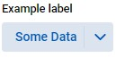

# Combo Box

### Labeling

Labels can be easily added above the component without the need to create a separate Label component above the control. 

<!-- <iframe 
loading="lazy"
src='https://hot.bbx.kitchen/webapp/controlsamples?class=control_demos.comboboxdemos.ComboboxLabelDemo' 
style={{"width": "100%", "height":"100px"}}></iframe> -->



<br/>

Use the `setAttribute()` function to create a label. The attribute to be changed is `label`, and the value should be the desired label text.  


```java
import org.dwcj.controls.combobox.ComboBox;

ComboBox exampleComboBox = new ComboBox();      //Creates a new ComboBox
exampleComboBox.setAttribute("label", "Example combo box label!");     //Gives the combo box a label with the provided text
```

<br/>

### Themes

DWCJ Combo Box components come with 14 themes built in for quick styling without the use of CSS.
Shown below are example boxes with each of the supported Themes applied: <br/>

<!-- <iframe 
loading="lazy"
src='https://hot.bbx.kitchen/webapp/controlsamples?class=control_demos.comboboxdemos.ComboboxThemeDemo' 
style={{"width": "100%", "height" : "170px"}}></iframe> -->


<br/>

Listed below are the current supported theme options for the combo box control:

|Combo Box Themes|
|-|
|<ul><li>```ComboBox.Theme.DEFAULT```</li><li>```ComboBox.Theme.DANGER```</li><li>```ComboBox.Theme.GRAY```</li><li>```ComboBox.Theme.INFO```</li><li>```ComboBox.Theme.PRIMARY```</li><li>```ComboBox.Theme.SUCCESS```</li><li>```ComboBox.Theme.WARNING```</li><li>```ComboBox.Theme.OUTLINED_DEFAULT```</li><li>```ComboBox.Theme.OUTLINED_DANGER```</li><li>```ComboBox.Theme.OUTLINED_GRAY```</li><li>```ComboBox.Theme.OUTLINED_INFO```</li><li>```ComboBox.Theme.OUTLINED_PRIMARY```</li><li>```ComboBox.Theme.OUTLINED_SUCCESS```</li><li>```ComboBox.Theme.OUTLINED_WARNING```</li></ul>|

<br/>Theming is supported by use of a built-in enum class. To apply a theme, execute code similar to the following: <br/><br />

```java
import org.dwcj.controls.combobox.ComboBox;

ComboBox exampleComboBox = new ComboBox();      //Creates a new Combo Box with the text "example"
exampleComboBox.setTheme(ComboBox.Theme.DEFAULT);      //Sets the box's theme to be the default theme.
```

<br />

### Expanses
There are five Combo Box expanses that are supported in the DWCJ which allow for quick styling without using CSS.
Below are the various expanses supported this control: <br/>

<!-- <iframe 
loading="lazy"
src='https://hot.bbx.kitchen/webapp/controlsamples?class=control_demos.comboboxdemos.ComboboxExpanseDemo' 
style={{"width": "100%", "height" : "120px"}}></iframe> -->


<br/>
Listed below are the current supported expanse options for the combo box control:<br/><br/>

|ComboBox Expanses|
|-|
|<ul><li>```ComboBox.Expanse.XSMALL```</li><li>```ComboBox.Expanse.SMALL```</li><li>```ComboBox.Expanse.MEDIUM```</li><li>```ComboBox.Expanse.LARGE```</li><li>```ComboBox.Expanse.XLARGE```</li></ul>|

<br/>Expanses are supported by use of a built-in enum class. To apply an expanse, execute code similar to the following: <br/><br />

```java
import org.dwcj.controls.combobox.ComboBox;

ComboBox exampleComboBox = new ComboBox("Example");      //Creates a new ComboBox with the text "example"
exampleComboBox.setExpanse(ComboBox.Expanse.MEDIUM);     //Sets the ComboBox's expanse to the medium size.
```
<!-- 

### Sample Program
The sample program below is a simple demonstration that will change the color of the
square div in the center of the demonstration depending on the color chosen within
the box.

<iframe
loading="lazy" 
src='https://hot.bbx.kitchen/webapp/controlsamples?class=control_demos.comboboxdemos.ComboboxDemo' 
style={{"width": "100%","height" : "250px"}}></iframe>

<details>
    <summary>Show Code</summary>


```java
import java.util.HashMap;
import java.util.Map;

import org.dwcj.App;
import org.dwcj.controls.panels.AppPanel;
import org.dwcj.controls.panels.Div;
import org.dwcj.controls.combobox.ComboBox;
import org.dwcj.controls.combobox.events.ComboBoxSelectEvent;
import org.dwcj.exceptions.DwcAppInitializeException;

public class ComboboxDemo extends App{
    
    ComboBox cb1;
    Div d1;

    @Override
    public void run() throws DwcAppInitializeException {


        AppPanel panel = new AppPanel();
        panel.setStyle("display", "inline-grid");
        panel.setStyle("grid-template-columns", "1fr 1fr");
        panel.setStyle("padding", "10px");
        panel.setStyle("gap", "50px");
        panel.setStyle("height", "100%");

        cb1 = new ComboBox();
        d1 = new Div();

        d1.setStyle("height", "50px").setStyle("width", "50px").setStyle("grid-column", "2").setStyle("background", "blue");
        d1.setStyle("align-self", "center").setStyle("justify-self", "center");

        Map<Object, String> data = new HashMap<>();
        data.put("Random Data1", "Green");
        data.put("Random Data2", "Blue");
        data.put("Random Data3", "Red");
        data.put("Random Data4", "Yellow");

        cb1.setItems(data);

        panel.add(cb1, d1);

        cb1.setAttribute("label", "Choose a Color:").selectIndex(0).setStyle("grid-column", "1").setExpanse(ComboBox.Expanse.LARGE).setStyle("width", "250px");
        cb1.onSelect(this::cbSelect);
        

    }

    private void cbSelect(ComboBoxSelectEvent ev){
        d1.setStyle("background", ev.getControl().getItemAt(ev.getControl().getSelectedIndex()).toLowerCase());
    }

}

```

</details>

 -->
