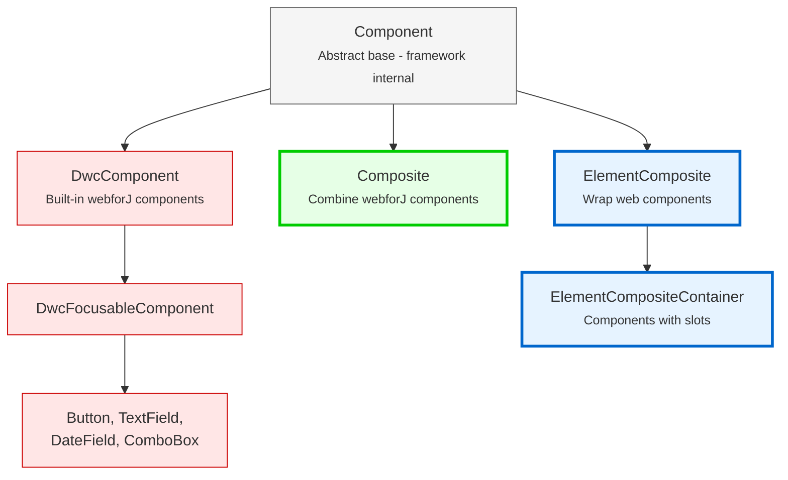

<DocChip chip='since' label='23.05' />
<JavadocLink type="foundation" location="com/webforj/component/Component" top='true'/> 

Before building custom components in webforJ, it's important to understand the foundational architecture that shapes how components work. This article explains the component hierarchy, component identity, lifecycle concepts, and how concern interfaces provide component capabilities.

## Understanding the component hierarchy

webforJ organizes components into a hierarchy with two groups: framework internal classes you should never extend, and classes designed specifically for building custom components. This section explains why webforJ uses composition over inheritance and what each level of the hierarchy provides.

### Why composition instead of extension?

In webforJ, built-in components like [`Button`](../components/button) and [`TextField`](../components/fields/textfield) are final classes—you can't extend them:

```java
// This won't work in webforJ
public class MyButton extends Button {
    // Button is final - cannot be extended 
}
```

webforJ uses **composition over inheritance**. Instead of extending existing components, you create a class that extends `Composite` and combines components inside it. `Composite` acts as a container that wraps a single component (called the bound component) and lets you add your own components and behavior to it.

```java
public class SearchBar extends Composite<FlexLayout> {
    private TextField searchField;
    private Button searchButton;
    
    public SearchBar() {
        searchField = new TextField("Search");
        searchButton = new Button("Go");
        
        getBoundComponent()
            .setDirection(FlexDirection.ROW)
            .add(searchField, searchButton);
    }
}
```

### Why you can't extend built-in components

webforJ components are marked as final to maintain the integrity of the underlying client-side web component. Extending webforJ component classes would grant control over the underlying web component, which could lead to unintended consequences and break the consistency and predictability of component behavior.

For a detailed explanation, see [Final Classes and Extension Restrictions](https://docs.webforj.com/docs/architecture/controls-components#final-classes-and-extension-restrictions) in the architecture documentation.

### The component hierarchy



**Classes for developers (use these):**
- **Composite**: Compose existing webforJ components into reusable business logic units
- **ElementComposite**: Integrate web components with type-safe property management
- **ElementCompositeContainer**: Work with web components that contain other components via slots

**Internal framework classes (never extend directly):**
- **Component**: Abstract base class - framework internal, don't extend
- **DwcComponent**: Built-in webforJ components - framework internal, all built-in components are final

:::danger[Never extend `Component` or `DwcComponent`]
Never extend `Component` or `DwcComponent` directly. All built-in components are final. Always use composition patterns with `Composite` or `ElementComposite`.

Attempting to extend `DwcComponent` will throw a runtime exception.
:::

### What each level provides

**`Component`:** lifecycle management, window association, component identity, `whenAttached()` method

**`DwcComponent`:** control interaction, property handling, text/HTML management, CSS classes and styles, visibility and sizing, event dispatching

**`Composite`:** combine existing webforJ components, encapsulate layout and behavior, hide implementation details, provide clean APIs

**`ElementComposite`:** type-safe property management via PropertyDescriptors, custom event handling, direct DOM access via `getElement()`, web component lifecycle integration

### Concern interfaces: Adding capabilities to your components

Implementing concern interfaces automatically gives your components the same APIs as built-in webforJ components:

```java
// Implement HasSize to get width/height methods automatically
public class SizedCard extends Composite<Div> implements HasSize<SizedCard> {
    
    public SizedCard() {
        getBoundComponent().setText("Card content");
    }
    
    // No need to implement these - you get them for free:
    // setWidth(), setHeight(), setSize()
}

// Use it like any webforJ component
SizedCard card = new SizedCard();
card.setWidth("300px")
    .setHeight("200px");
```

The composite automatically forwards these calls to the underlying `Div`. No extra code needed.

**Common concern interfaces:**
- `HasSize` - `setWidth()`, `setHeight()`, `setSize()`
- `HasFocus` - `focus()`, `setFocusable()`, focus events
- `HasClassName` - `addClassName()`, `removeClassName()`
- `HasStyle` - `setStyle()`, inline CSS management
- `HasVisibility` - `setVisible()`, show/hide capability
- `HasText` - `setText()`, text content management
- `HasAttribute` - `setAttribute()`, HTML attribute management

:::warning
If the underlying component doesn't support the interface capability, you'll get a runtime exception. Provide your own implementation in that case.
:::

For a complete list of available concern interfaces, see the [webforJ JavaDoc](https://javadoc.io/doc/com.webforj/webforj-foundation/latest/com/webforj/concern/package-summary.html).

## Component identity: Server ID and client ID

webforJ maintains two IDs for every component:

```java
// Server ID - available immediately
Button myButton = new Button("Click me");
String serverId = myButton.getComponentId(); // Available now

// Find components server-side
FlexLayout container = new FlexLayout();
container.add(myButton);
Component found = container.getComponent(serverId); // Works

// Client ID - only after DOM attachment
myButton.whenAttached().then(button -> {
    String clientId = button.getClientComponentId(); // Available after attached
    // Use with DWC API: objects.get(clientId)
});
```

**Server ID:**
- Created automatically when component is instantiated
- Used for server-side lookups in containers
- Available immediately after creation

**Client ID:**
- Only exists after component attaches to DOM
- Used for client-side JavaScript and DWC API
- Access with `objects.get(ID)` in client code

**When to use each:**
- **Server ID**: Looking up components in containers, server-side logic
- **Client ID**: Client-side JavaScript, DWC API calls

Most of the time, the framework handles this automatically.

## Component lifecycle overview

### The framework handles everything automatically

webforJ manages the component lifecycle automatically:

1. **Creation** - Component instantiation
2. **Configuration** - Properties set before attachment
3. **Attachment** - Added to window/container
4. **Post-Attachment** - Framework replays configurations  
   *Optional hook: `onDidCreate()` runs here*
5. **Runtime** - Component active and interactive
6. **Destruction** - Component destroyed  
   *Optional hook: `onDidDestroy()` runs here*

For most components, automatic lifecycle management is all you need. The optional hooks `onDidCreate()` and `onDidDestroy()` are only necessary when you have specific setup or cleanup requirements.

### Constructor-first approach (99% of components)

Most components do everything in the constructor:

```java
// MOST COMMON - No lifecycle methods needed
public class UserForm extends Composite<FlexLayout> {
    private TextField nameField;
    private TextField emailField;
    private Button submitButton;
    
    public UserForm() {
        // Everything happens in constructor
        nameField = new TextField("Name");
        emailField = new TextField("Email");
        submitButton = new Button("Submit");
        
        getBoundComponent()
            .setDirection(FlexDirection.COLUMN)
            .add(nameField, emailField, submitButton);
            
        // Event handlers work in constructor
        submitButton.onClick(e -> handleSubmit());
    }
    
    private void handleSubmit() {
        String name = nameField.getValue();
        String email = emailField.getValue();
        // Handle form submission
    }
}
```

**Use constructor for:**
- Adding child components
- Setting properties
- Basic layout setup
- Event registration

### When you need lifecycle methods (rare cases)

Lifecycle methods (`onDidCreate`, `onDidDestroy`) are **optional hooks**. Use them only when you need:

- Cleanup resources (intervals, connections)
- Setup requiring DOM attachment
- JavaScript integration needing DOM presence

```java
// RARE CASE - Lifecycle method for cleanup
public class AutoRefreshPanel extends Composite<FlexLayout> {
    private Interval refreshInterval;
    
    public AutoRefreshPanel() {
        getBoundComponent().add(new Label("Auto-refreshing content"));
        
        // Start interval that needs cleanup
        refreshInterval = new Interval(5f, e -> refresh());
        refreshInterval.start();
    }
    
    // OPTIONAL - Only needed for cleanup
    @Override
    protected void onDidDestroy() {
        if (refreshInterval != null) {
            refreshInterval.stop(); // Prevent memory leak
        }
    }
    
    private void refresh() {
        // Refresh logic
    }
}
```

### Using `whenAttached()` for deferred operations

For operations needing DOM attachment, `whenAttached()` is often cleaner than `onDidCreate()`:

```java
// PREFERRED - Using whenAttached()
public class DataGrid extends Composite<FlexLayout> {
    
    public DataGrid() {
        getBoundComponent().setDirection(FlexDirection.COLUMN);
        
        // Load data when attached - no lifecycle method needed
        whenAttached().then(component -> {
            loadDataFromServer();
        });
    }
    
    private void loadDataFromServer() {
        // Data loading requiring DOM attachment
    }
}
```

**Alternative using lifecycle hook:**

```java
// ALTERNATIVE - Using onDidCreate()
public class DataGridWithHook extends Composite<FlexLayout> {
    
    @Override
    protected void onDidCreate(FlexLayout layout) {
        layout.setDirection(FlexDirection.COLUMN);
        loadDataFromServer();
    }
    
    private void loadDataFromServer() {
        // This runs when component is attached
    }
}
```

Both approaches work. `whenAttached()` keeps logic in the constructor.

## What's next

Ready to build? Start with [Composite Components](composite-components) to create your first custom component.

