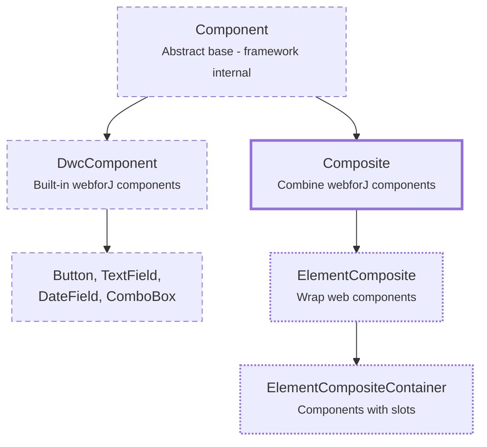

<JavadocLink type="foundation" location="com/webforj/component/Component" top='true'/> 

Before building custom components in webforJ, it's important to understand the foundational architecture that shapes how components work. This article explains the component hierarchy, component identity, lifecycle concepts, and how concern interfaces provide component capabilities.

## Understanding the component hierarchy {#understanding-the-component-hierarchy}

webforJ organizes components into a hierarchy with two groups: framework internal classes you should never extend, and classes designed specifically for building custom components. This section explains why webforJ uses composition over inheritance and what each level of the hierarchy provides.

### Why composition instead of extension? {#why-composition-instead-of-extension}

In webforJ, built-in components like [`Button`](../components/button) and [`TextField`](../components/fields/textfield) are final classes—you can't extend them:

```java
// This won't work in webforJ
public class MyButton extends Button {
  // Button is final - cannot be extended 
}
```

webforJ uses **composition over inheritance**. Instead of extending existing components, you create a class that extends `Composite` and combines components inside it. `Composite` acts as a container that wraps a single component (called the bound component) and lets you add your own components and behavior to it.

```java
public class SearchBar extends Composite<FlexLayout> {
  private final FlexLayout self = getBoundComponent();
  private TextField searchField;
  private Button searchButton;
  
  public SearchBar() {
    searchField = new TextField("Search");
    searchButton = new Button("Go");
    
    self.setDirection(FlexDirection.ROW)
      .add(searchField, searchButton);
  }
}
```

### Why you can't extend built-in components {#why-you-cant-extend-built-in-components}

webforJ components are marked as final to maintain the integrity of the underlying client-side web component. Extending webforJ component classes would grant control over the underlying web component, which could lead to unintended consequences and break the consistency and predictability of component behavior.

For a detailed explanation, see [Final Classes and Extension Restrictions](https://docs.webforj.com/docs/architecture/controls-components#final-classes-and-extension-restrictions) in the architecture documentation.

### The component hierarchy {#the-component-hierarchy}

<div style={{textAlign: 'center'}}>

```mermaid
graph TD
  A[Component<br/><small>Abstract base - framework internal</small>]
  
  A --> B[DwcComponent<br/><small>Built-in webforJ components</small>]
  A --> C[Composite<br/><small>Combine webforJ components</small>]
  
  B --> E[Button, TextField,<br/>DateField, ComboBox]
  
  C --> D[ElementComposite<br/><small>Wrap web components</small>]
  D --> F[ElementCompositeContainer<br/><small>Components with slots</small>]

  classDef internal stroke-dasharray:6 4,stroke-width:1px
  classDef primary stroke-width:3px
  classDef secondary stroke-width:2px,stroke-dasharray:2 2
  class A,B,E internal
  class C primary
  class D,F secondary
```
</div>

Classes for developers (use these):
- `Composite`
- `ElementComposite`
- `ElementCompositeContainer`

Internal framework classes (never extend directly):
- `Component`
- `DwcComponent`

:::warning[Never extend `Component` or `DwcComponent`]
Never extend `Component` or `DwcComponent` directly. All built-in components are final. Always use composition patterns with `Composite` or `ElementComposite`.

Attempting to extend `DwcComponent` will throw a runtime exception.
:::

## Concern interfaces {#concern-interfaces}

Concern interfaces are Java interfaces that provide specific capabilities to your components. Each interface adds a set of related methods. For example, `HasSize` adds methods for controlling width and height, while `HasFocus` adds methods for managing focus state.

When you implement a concern interface on your component, you get access to those capabilities without writing any implementation code. The interface provides default implementations that work automatically.

Implementing concern interfaces gives your custom components the same APIs as built-in webforJ components:

```java
// Implement HasSize to get width/height methods automatically
public class SizedCard extends Composite<Div> implements HasSize<SizedCard> {
  private final Div self = getBoundComponent();
  
  public SizedCard() {
    self.setText("Card content");
  }
  
  // No need to implement these - you get them for free:
  // setWidth(), setHeight(), setSize()
}

// Use it like any webforJ component
SizedCard card = new SizedCard();
card.setWidth("300px")
  .setHeight("200px");
```

The composite automatically forwards these calls to the underlying `Div`. No extra code needed.

### Appearance {#concern-interfaces-appearance}

These interfaces control the visual presentation of a component, including its dimensions, visibility, styling, and theme.

| Interface | Description |
|---|---|
| `HasSize` | Controls width and height, including min and max constraints. Extends `HasWidth`, `HasHeight`, and their min/max variants. |
| `HasVisibility` | Shows or hides the component without removing it from the layout. |
| `HasClassName` | Manages CSS class names on the component's root element. |
| `HasStyle` | Applies and removes inline CSS styles. |
| `HasHorizontalAlignment` | Controls how content is aligned horizontally within the component. |
| `HasExpanse` | Sets the component's size variant using the standard expanse tokens (`XSMALL` through `XLARGE`). |
| `HasTheme` | Applies a theme variant such as `DEFAULT`, `PRIMARY`, or `DANGER`. |
| `HasPrefixAndSuffix` | Adds components to the prefix or suffix slot inside the component. |

### Content {#concern-interfaces-content}

These interfaces manage what a component displays, including text, HTML, labels, hints, and other descriptive content.

| Interface | Description |
|---|---|
| `HasText` | Sets and retrieves the component's plain text content. |
| `HasHtml` | Sets and retrieves the component's inner HTML. |
| `HasLabel` | Adds a descriptive label associated with the component, used for accessibility. |
| `HasHelperText` | Displays secondary hint text below the component. |
| `HasPlaceholder` | Sets placeholder text shown when the component has no value. |
| `HasTooltip` | Attaches a tooltip that appears on hover. |

### State {#concern-interfaces-state}

These interfaces control the interactive state of a component, including whether it's enabled, editable, required, or focused on load.

| Interface | Description |
|---|---|
| `HasEnablement` | Enables or disables the component. |
| `HasReadOnly` | Puts the component into a read-only state where the value is visible but can't be changed. |
| `HasRequired` | Marks the component as required, typically for form validation. |
| `HasAutoFocus` | Moves focus to the component automatically when the page loads. |

### Focus {#concern-interfaces-focus}

These interfaces manage how a component receives and responds to keyboard focus.

| Interface | Description |
|---|---|
| `HasFocus` | Manages focus state and whether the component can receive focus. |
| `HasFocusStatus` | Checks whether the component currently has focus. Requires a round-trip to the client. |
| `HasHighlightOnFocus` | Controls whether the component's content is highlighted when it receives focus, and how (`KEY`, `MOUSE`, `KEY_MOUSE`, `ALL`, and so on). |

### Input constraints {#concern-interfaces-input-constraints}

These interfaces define what values a component accepts, including the current value, allowed ranges, length limits, formatting masks, and locale-specific behavior.

| Interface | Description |
|---|---|
| `HasValue` | Gets and sets the component's current value. |
| `HasMin` | Sets a minimum allowed value. |
| `HasMax` | Sets a maximum allowed value. |
| `HasStep` | Sets the step increment for numeric or range inputs. |
| `HasPattern` | Applies a regular expression pattern to constrain accepted input. |
| `HasMinLength` | Sets the minimum number of characters required in the component's value. |
| `HasMaxLength` | Sets the maximum number of characters allowed in the component's value. |
| `HasMask` | Applies a format mask to the input. Used by masked field components. |
| `HasTypingMode` | Controls whether typed characters are inserted or overwrite existing characters (`INSERT` or `OVERWRITE`). Used by masked fields and `TextArea`. |
| `HasRestoreValue` | Defines a value the component resets to when the user presses Escape or calls `restoreValue()`. Used by masked fields. |
| `HasLocale` | Stores a per-component locale for locale-sensitive formatting. Used by masked date and time fields. |
| `HasPredictedText` | Sets a predicted or auto-complete text value. Used by `TextArea` to support inline suggestions. |

### Validation {#concern-interfaces-validation}

These interfaces add client-side validation behavior, including marking components invalid, displaying error messages, and controlling when validation runs.

| Interface | Description |
|---|---|
| `HasClientValidation` | Marks a component invalid, sets the error message, and attaches a client-side validator. |
| `HasClientAutoValidation` | Controls whether the component validates automatically as the user types. |
| `HasClientAutoValidationOnLoad` | Controls whether the component validates when it first loads. |
| `HasClientValidationStyle` | Controls how validation messages are displayed: `INLINE` (below the component) or `POPOVER`. |

### DOM access {#concern-interfaces-dom-access}

These interfaces provide low-level access to the component's underlying HTML element and client-side properties.

| Interface | Description |
|---|---|
| `HasAttribute` | Reads and writes arbitrary HTML attributes on the component's element. |
| `HasProperty` | Reads and writes DWC component properties directly on the client element. |

### i18n {#concern-interfaces-i18n}

This interface provides translation support for components that need to display localized text.

| Interface | Description |
|---|---|
| `HasTranslation` | Provides the `t()` helper method for resolving translation keys to localized strings using the app's current locale. |

:::warning
If the underlying component doesn't support the interface capability, you'll get a runtime exception. Provide your own implementation in that case.
:::

For a complete list of available concern interfaces, see the [webforJ JavaDoc](https://javadoc.io/doc/com.webforj/webforj-foundation/latest/com/webforj/concern/package-summary.html).

## Component identifiers {#component-identifiers}

webforJ components have internal identifiers that the framework uses for tracking and managing components. Understanding these identifiers helps explain how the framework works under the hood.

### Server-side component ID {#server-side-component-id}

Every component is assigned a server-side identifier automatically when created. This identifier is used internally by the framework for tracking components. Retrieve it with `getComponentId()`:

```java
Button button = new Button("Click Me");
String serverId = button.getComponentId();
```

The server-side ID is useful when you need to query for specific components within a container or implement custom component tracking logic.

### Client-side component ID {#client-side-component-id}

The client-side component ID provides access to the underlying web component from JavaScript. This allows you to interact directly with the client-side component when needed:

```java
Button btn = new Button("Click me");
btn.onClick(e -> {
  OptionDialog.showMessageDialog("The button was clicked", "An event occurred");
});

btn.whenAttached().thenAccept(e -> {
  Page.getCurrent().executeJs("objects.get('" + btn.getClientComponentId() + "').click()");
});
```

Use `getClientComponentId()` with `objects.get()` in JavaScript to access the web component instance.

:::important
The client-side component ID is not the HTML `id` attribute of the DOM element. For setting HTML IDs for testing or CSS targeting, see [Using Components](using-components).
:::

## Component lifecycle overview {#component-lifecycle-overview}

webforJ manages the component lifecycle automatically. The framework handles component creation, attachment, and destruction without requiring manual intervention.

**Lifecycle hooks** are available when you need them:
- `onDidCreate(T container)` - Called after the component is attached to the DOM
- `onDidDestroy()` - Called when the component is destroyed

These hooks are **optional**. Use them when you need to:
- Clean up resources (stop intervals, close connections)
- Initialize components that require DOM attachment
- Integrate with client-side JavaScript

For most simple cases, you can initialize components directly in the constructor. Use lifecycle hooks like `onDidCreate()` to defer work when necessary.