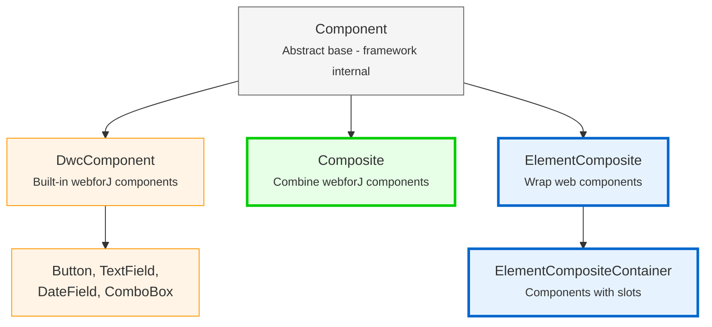

<DocChip chip='since' label='23.05' />
<JavadocLink type="foundation" location="com/webforj/component/Component" top='true'/> 

Before building custom components in webforJ, it's important to understand the foundational architecture that shapes how components work. This article explains the component hierarchy, component identity, lifecycle concepts, and how concern interfaces provide component capabilities.

## Understanding the component hierarchy

webforJ organizes components into a hierarchy with two groups: framework internal classes you should never extend, and classes designed specifically for building custom components. This section explains why webforJ uses composition over inheritance and what each level of the hierarchy provides.

### Why composition instead of extension?

In webforJ, built-in components like [`Button`](../components/button) and [`TextField`](../components/fields/textfield) are final classes—you can't extend them:

```java
// This won't work in webforJ
public class MyButton extends Button {
    // Button is final - cannot be extended 
}
```

webforJ uses **composition over inheritance**. Instead of extending existing components, you create a class that extends `Composite` and combines components inside it. `Composite` acts as a container that wraps a single component (called the bound component) and lets you add your own components and behavior to it.

```java
public class SearchBar extends Composite<FlexLayout> {
    private TextField searchField;
    private Button searchButton;
    
    public SearchBar() {
        searchField = new TextField("Search");
        searchButton = new Button("Go");
        
        getBoundComponent()
            .setDirection(FlexDirection.ROW)
            .add(searchField, searchButton);
    }
}
```

### Why you can't extend built-in components

webforJ components are marked as final to maintain the integrity of the underlying client-side web component. Extending webforJ component classes would grant control over the underlying web component, which could lead to unintended consequences and break the consistency and predictability of component behavior.

For a detailed explanation, see [Final Classes and Extension Restrictions](https://docs.webforj.com/docs/architecture/controls-components#final-classes-and-extension-restrictions) in the architecture documentation.

### The component hierarchy



**Classes for developers (use these):**
- **Composite**
- **ElementComposite**
- **ElementCompositeContainer**

**Internal framework classes (never extend directly):**
- **Component**
- **DwcComponent**

:::warning[Never extend `Component` or `DwcComponent`]
Never extend `Component` or `DwcComponent` directly. All built-in components are final. Always use composition patterns with `Composite` or `ElementComposite`.

Attempting to extend `DwcComponent` will throw a runtime exception.
:::

## Concern interfaces: Adding capabilities to your components

Concern interfaces are Java interfaces that provide specific capabilities to your components. Each interface adds a set of related methods. For example, `HasSize` adds methods for controlling width and height, while `HasFocus` adds methods for managing focus state.

When you implement a concern interface on your component, you get access to those capabilities without writing any implementation code. The interface provides default implementations that work automatically.

Implementing concern interfaces gives your custom components the same APIs as built-in webforJ components:

```java
// Implement HasSize to get width/height methods automatically
public class SizedCard extends Composite<Div> implements HasSize<SizedCard> {
    
    public SizedCard() {
        getBoundComponent().setText("Card content");
    }
    
    // No need to implement these - you get them for free:
    // setWidth(), setHeight(), setSize()
}

// Use it like any webforJ component
SizedCard card = new SizedCard();
card.setWidth("300px")
    .setHeight("200px");
```

The composite automatically forwards these calls to the underlying `Div`. No extra code needed.

**Common concern interfaces:**
- `HasSize` - `setWidth()`, `setHeight()`, `setSize()`
- `HasFocus` - `focus()`, `setFocusable()`, focus events
- `HasClassName` - `addClassName()`, `removeClassName()`
- `HasStyle` - `setStyle()`, inline CSS management
- `HasVisibility` - `setVisible()`, show/hide capability
- `HasText` - `setText()`, text content management
- `HasAttribute` - `setAttribute()`, HTML attribute management

:::warning
If the underlying component doesn't support the interface capability, you'll get a runtime exception. Provide your own implementation in that case.
:::

For a complete list of available concern interfaces, see the [webforJ JavaDoc](https://javadoc.io/doc/com.webforj/webforj-foundation/latest/com/webforj/concern/package-summary.html).

## Component lifecycle overview

webforJ manages the component lifecycle automatically. The framework handles component creation, attachment, and destruction without requiring manual intervention.

**Lifecycle hooks** are available when you need them:
- `onDidCreate()` - Called after component is attached to the DOM
- `onDidDestroy()` - Called when component is destroyed

These hooks are **optional**. Use them when you need to:
- Clean up resources (stop intervals, close connections)
- Initialize components that require DOM attachment
- Integrate with client-side JavaScript

For most simple cases, you can initialize components directly in the constructor. Use lifecycle hooks like `onDidCreate()` to defer work when necessary.


