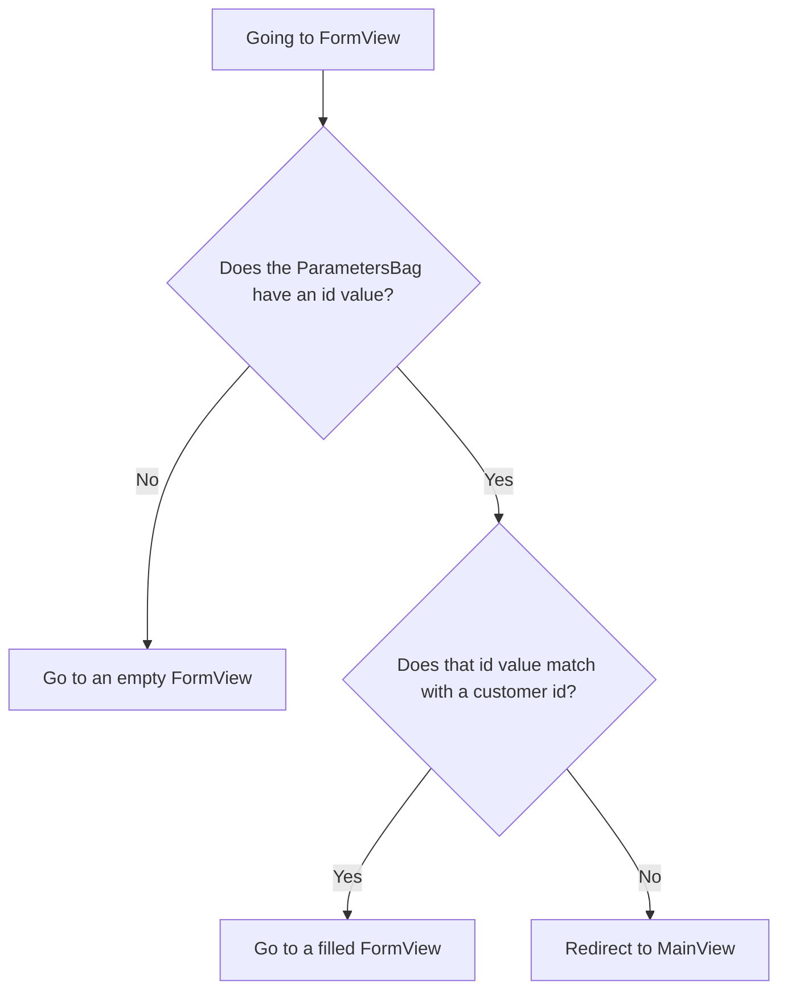

The app from [Routing and Composites](/docs/introduction/tutorial/routing-and-composites) can only add new customers to the database. Using the following concepts, you’ll give users the ability to also edit the data of existing customers: 

- Route patterns
- Passing parameter values through a URL
- Lifecycle observers

Completing this step creates a version of [4-observers-and-route-parameters](https://github.com/webforj/webforj-demo-application/tree/main/4-observers-and-route-parameters).

<!-- <div class="videos-container">
  <video controls>
    <source src="https://cdn.webforj.com/webforj-documentation/video/tutorials/scaling-with-routing-and-composites.mp4" type="video/mp4"/>
  </video>
</div> -->

## Using the customer's `id` {#using-the-customers-id}

In [Working with Data](/docs/introduction/tutorial/working-with-data), you created a `Customer` entity that assigns a unique `id` to customers when they’re added to the database. This `id` is always a numeric `Long` value.

```java
 @Id
 @GeneratedValue(strategy = GenerationType.IDENTITY)
  private Long id;
```

Having a unique `id` value for each customer allows you to modify `FormView` to use it as an initial parameter.

In this step, you’ll make changes to `FormView` so it uses an `id` as an initial parameter before anything loads. Then, you’ll have `FormView` evaluate the `id` to determine whether the form is for adding a new customer or updating an existing one. Finally, in `MainView`, you’ll make changes so `MainView` can send users to `FormView` with an `id` value.

## Adding a route pattern to `FormView` {#adding-a-route-pattern}

In the previous step, setting the route in `FormView` to `@Route(customer)` maps the class locally to [http://localhost:8080/**customer**](http://localhost:8080/customer). Adding a route pattern lets you add an `id` as an initial parameter to `FormView`.

A [Route Pattern](/docs/routing/route-patterns) lets you add a parameter in the URL, make it optional, and set constraints on valid patterns. Using the `@Route` annotation, here’s what makes `id` an optional route parameter for `FormView`:

- **`/:id`** - This gives the route a named parameter of `id`, so going to [http://localhost:8080/**customer/6**](http://localhost:8080/customer/6) loads `FormView` with an `id` parameter of `6`.

- **`?`** - This allows the `id` parameter to be optional. By default, they’re required, but making the `id` optional lets you use `FormView` for adding new customers that don’t have an `id` yet.

- **`<[0-9]+>`** - In angle brackets, `<>`, you can add a constraint as a regular expression to the `id`. Now, when present, the `id` has to be a positive number. If the `id` doesn’t match the constraint, e.g., [http://localhost:8080/customer/**john-smith**](http://localhost:8080/customer/john-smith), it sends the user to a 404 page.

To add the optional route parameter to `FormView`, change the `@Route` annotation to this:

```java
@Route("customer/:id?<[0-9]+>")
```

## Routing to `FormView` {#routing-to-formview}

`FormView` now accepts an optional `id` parameter. Due to the route pattern you defined earlier, `FormView` only loads if the `id` is a whole positive number.

However, `FormView` can still load when a user manually enters a URL for a non-existent customer, like [http://localhost:8080/customer/**5000**](http://localhost:8080/customer/5000). Adding a lifecycle observer before entering `FormView` lets your app determine how to handle the incoming `id` value.

### Conditional routing {#conditonal-routing}

Lifecycle observers allow components to react to lifecycle events at specific stages. The [Lifecycle Observers](/docs/routing/navigation-lifecycle/observers) article lists available observers, but this step only uses the `WillEnterObserver`.

The `WillEnterObserver` occurs before the component's routing finishes.
Using this observer allows you to evaluate the incoming `id`. If the `id` doesn’t match an existing customer, you can redirect the user back to `MainView` to find a valid customer to edit.

Before discussing the code for the `WillEnterObserver`, the following flowchart lays out what should be the possible outcomes when routing to `FormView`:



### Using the `WillEnterObserver` {#using-the-willenterbbserver}

Using the lifecycle observer that happens before the component fully loads, `WillEnterObserver`, allows you to add conditions when it’s OK to continue to `FormView`, or if the app needs to redirect users to `MainView`.


Each lifecycle observer is implemented as an interface, so include `WillEnterObserver` as part of the declaration for `FormView`:

```java
public class FormView extends Composite<Div> implements WillEnterObserver {
```

The `WillEnterObserver` observer has the `onWillEnter()` method that webforJ calls before routing to the component. This method has two parameters: the `WillEnterEvent` and the `ParametersBag`.

The `WillEnterEvent` determines whether to continue routing to the component with the `accept()` mehod, or stop routing using the `reject()` method. After rejecting the current route, you need to redirect the user somewhere else.

The `ParametersBag`, which is the topic of the next section, contains the parameters from the URL, for this tutorial, that’s the `id`. You’ll be using the  `ParametersBag` in the next section to create the conditional logic for `onWillEnter()`.

The following `onWillEnter()` is an example with only two outcomes:

```java
@Override
public void onWillEnter(WillEnterEvent event, ParametersBag parameters) {

  //Add conditional logic
  if (<condition>) {

    //Allow routing to FormView to proceed
    event.accept();

  } else {

    //Stop routing to FormView
    event.reject();

    //Send the user to MainView
    navigateToMain();
  }
}
```

### Using the `ParametersBag` {#using-the-parametersbag}

As briefly mentioned in the previous section, the `ParametersBag` is a container of queryable parameters from the URL. Every lifecycle observer has access to this object, and using it in your app allows you to get the `id` value as a [query parameter](/docs/routing/query-parameters).

The `ParametersBag` object provides several query methods to retrieve a parameter as a specific object type. For example, using `getInt()` can get you a parameter as an `Integer`.

However, since some parameters are optional, what `getInt()` actually returns is `Optional<Integer>`. Using the `ifPresentOrElse()` method on the `Optional<Integer>` allows you to set a variable using the `Integer`.

When there’s no `id` present, the user can continue going to `FormView` to add a new customer.

```java
@Override
public void onWillEnter(WillEnterEvent event, ParametersBag parameters) {

  //Determine which parameter to get, and check if it's present or not
  parameters.getInt("id").ifPresentOrElse(id -> {

    //Use the id as a variable
    customerId = Long.valueOf(id);

  //When no id is present, continue to FormView for a new customer
  }, () -> event.accept());
        
}
```

### Is the `id` valid? {#is-the-id-valid}

As of right now, the `WillEnterObserver` from the last section only accepts the routing when no `id` is present. The observer needs to perform one more verification before continuing to `FormView`: verify that the `id` matches an existing customer.

Now `FormView` can utitilize `CustomerService` not only for updating the H2 database, but to also confirm a customer’s existence using the `doesCustomerExist()` method. If there’s no match, the app can reject the current routing and redirect the user to `MainView` using `navigateToMain()`.

When given a valid `id`, the app can use `accept()` to continue routing to `FormView`. Then, the app can call another method to initialize the values from the customer with the corresponding `id` to the working `Customer` copy. Like when adding a new customer, using the working copy allows users to edit with the UI without directly editing the repository.

```java
// Use the ParametersBag in onWillEnter() to define customerId
//...
customerId = Long.valueOf(id);

public void fillForm(Long customerId) {
  customer = customerService.getCustomerByKey(customerId);
  firstName.setValue(customer.getFirstName());
  lastName.setValue(customer.getLastName());
  company.setValue(customer.getCompany());
  country.selectKey(customer.getCountry());
}
```

### Completed `onWillEnter()` {#completed-onwillenter}

The last two sections went into detail about how to handle each outcome for routing into `FormView` using the `ParametersBag` and the `CustomerService`.

The following is the completed `onWillEnter()` for `FormView` that uses the `ParametersBag` to either reject or accept the incoming route, and calls other methods to either fill the form or send the user to `MainView`:

```java
@Override
public void onWillEnter(WillEnterEvent event, ParametersBag parameters) {

  //Determine which parameter to get, and check if it's present or not
  parameters.getInt("id").ifPresentOrElse(id -> {

    //Use the id as a variable
    customerId = Long.valueOf(id);

    //Check if there's a customer with this id
    if (customerService.doesCustomerExist(customerId)) {

        //This customer exists, so continue to FormView, and initialize the fields using the id
        event.accept();
        fillForm(customerId);
      } else {

        //This customer doesn't exists, so redirect to MainView
        event.reject();
        navigateToMain();
      }

  //No id was present, so continue to FormView for a new customer
  }, () -> event.accept());
        
}
```

## Adding or editing a customer {#adding-or-editing-a-customer}

The previous version of this app only handled new customers when the user submitted the form. Now that users can edit existing customers, the `submitCustomer()` method must verify whether the customer already exists before  updating  the database. 

Initially, it was unnecessary to assign a variable for the customer `id` in `FormView`, as new customers are assigned a unique `id` when they’re submitted into the database. However, if you declare `customerId` as an initial variable in `FormView` with an `id` value that's not in use, it remains untouched for new customers, and overwritten in `onWillEnter()` for existing ones.

This allows you to use `doesCustomerExist()` to verify whether to add a new customer or update an existing one. 

```java
private Long customerId = 0L;

//...

private void submitCustomer() {
  if (customerService.doesCustomerExist(customerId)) {
    customerService.updateCustomer(customer);
  } else {
    customerService.createCustomer(customer);
  }
  navigateToMain();
}
```

## Completed `FormView` {#completed-formview}

Here’s how `FormView` should look, now that it can handle editing existing customers: 

<!-- vale off -->
<ExpandableCode title="FormView.java" language="java" startLine={1} endLine={15}>
{`@Route("customer/:id?<[0-9]+>")
@FrameTitle("Customer Form")
public class FormView extends Composite<Div> implements WillEnterObserver {
  private final CustomerService customerService;
  private Customer customer = new Customer();
  private Long customerId = 0L;
  private Div self = getBoundComponent();
  private TextField firstName = new TextField("First Name", e -> customer.setFirstName(e.getValue()));
  private TextField lastName = new TextField("Last Name", e -> customer.setLastName(e.getValue()));
  private TextField company = new TextField("Company", e -> customer.setCompany(e.getValue()));
  private ChoiceBox country = new ChoiceBox("Country",
      e -> customer.setCountry((Customer.Country) e.getSelectedItem().getKey()));
  private Button submit = new Button("Submit", ButtonTheme.PRIMARY, e -> submitCustomer());
  private Button cancel = new Button("Cancel", ButtonTheme.OUTLINED_PRIMARY, e -> navigateToMain());

  private ColumnsLayout layout = new ColumnsLayout(
    firstName, lastName,
    company, country,
    submit, cancel);

  public FormView(CustomerService customerService) {
    this.customerService = customerService;

    fillCountries();
    setColumnsLayout();

    self.setMaxWidth(600)
      .addClassName("card")
      .add(layout);

    submit.setStyle("margin-top", "var(--dwc-space-l)");
    cancel.setStyle("margin-top", "var(--dwc-space-l)");
  }

  private void setColumnsLayout() {
    List<Breakpoint> breakpoints = List.of(
      new Breakpoint(600, 2));

    layout.setSpacing("var(--dwc-space-l)")
      .setBreakpoints(breakpoints);
  }

  private void fillCountries() {
    ArrayList<ListItem> listCountries = new ArrayList<>();
    for (Country countryItem : Customer.Country.values()) {
      listCountries.add(new ListItem(countryItem, countryItem.toString()));
    }
    country.insert(listCountries);
  }

  private void submitCustomer() {
    if (customerService.doesCustomerExist(customerId)) {
      customerService.updateCustomer(customer);
    } else {
      customerService.createCustomer(customer);
    }
    navigateToMain();
  }

  private void navigateToMain(){
    Router.getCurrent().navigate(MainView.class);
  }

  @Override
  public void onWillEnter(WillEnterEvent event, ParametersBag parameters) {
    parameters.getInt("id").ifPresentOrElse(id -> {
      customerId = Long.valueOf(id);
      if (customerService.doesCustomerExist(customerId)) {
         event.accept();
         fillForm(customerId);
        } else {
          event.reject();
          navigateToMain();
        }

    }, () -> event.accept());
        
  }

  public void fillForm(Long customerId) {
    customer = customerService.getCustomerByKey(customerId);
    firstName.setValue(customer.getFirstName());
    lastName.setValue(customer.getLastName());
    company.setValue(customer.getCompany());
    country.selectKey(customer.getCountry());
  }

}
`}
</ExpandableCode>
<!-- vale on -->

## Navigating from `MainView` to `FormView` to edit customers {#navigating-from-mainview-to-formview-to-edit-customers}

Earlier in this step, you used an existing `ParametersBag` to determine the value of an `id`. Creating a new `ParametersBag` lets you navigate between classes directly with the parameters of your your choice. Using the data in the `Table` is a viable option for sending users to `FormView` with a customer `id`.

Similar to the button, tying the navigation to a user-chosen action lets them decide when to go to `FormView`. Adding an event listener to the `Table` lets send the users to `FormView` with a `ParametersBag`:

```java
table.addItemClickListener(this::editCustomer);

private void editCustomer(TableItemClickEvent<Customer> e) {
  Router.getCurrent().navigate(FormView.class,
      ParametersBag.of("id=" + e.getItemKey()));
  }
```

However, the key of the `Table` items is automatically generated by default. You can explicitly make each key correlate to a customer's `id` by using the `setKeyProvider()` method:

```java
table.setKeyProvider(Customer::getId);
```

In `MainView`, add the `addItemClickListener()` and `setKeyProvider()` methods to `buildTable()`, then add the method that sends the user to `FormView` with a value for the `id` in the  `ParametersBag` based on where on the table the user clicked:

```java title="MainView.java" {34-35,38-41}
@Route("/")
@FrameTitle("Customer Table")
public class MainView extends Composite<Div> {

  private final CustomerService customerService;

  private Div self = getBoundComponent();
  private Table<Customer> table = new Table<>();
  private Button add = new Button("Add Customer", ButtonTheme.PRIMARY,
      e -> Router.getCurrent().navigate(FormView.class));

  public MainView(CustomerService customerService) {
    this.customerService = customerService;

    add.setWidth(200);
    buildTable();

    self.setWidth("fit-content")
      .addClassName("card")
      .add(table, add);
  }
  
  private void buildTable() {
    table.setSize("1000px", "294px");
    table.setMaxWidth("90vw");
    table.addColumn("firstName", Customer::getFirstName).setLabel("First Name");
    table.addColumn("lastName", Customer::getLastName).setLabel("Last Name");
    table.addColumn("company", Customer::getCompany).setLabel("Company");
    table.addColumn("country", Customer::getCountry).setLabel("Country");
    table.setColumnsToAutoFit();
    table.setColumnsToResizable(false);
    table.getColumns().forEach(column -> column.setSortable(true));
    table.setRepository(customerService.getFilterableRepository());
    table.setKeyProvider(Customer::getId);
    table.addItemClickListener(this::editCustomer);
  }

  private void editCustomer(TableItemClickEvent<Customer> e) {
    Router.getCurrent().navigate(FormView.class,
        ParametersBag.of("id=" + e.getItemKey()));
  }
}
```

## Running the app {#running-the-app}

When you've finished this step, you can compare it to [4-observers-and-route-parameters](https://github.com/webforj/webforj-demo-application/tree/main/4-observers-and-route-parameters) on GitHub. To see the app in action:

1. Navigate to the top-level directory containing the `pom.xml` file, this is `4-observers-and-route-parameters` if you're following along with the version on GitHub.

2. Use the following Maven command to run the Spring Boot app locally:
    ```bash
    mvn
    ```

Running the app automatically opens a new browser at http://localhost:8080.

## Next step {#next-step}

Now that users can edit customer data directly, your app should validate changes before committing them to the repository. Additionally, binding the data to the UI will allow the components to display error messages when the data is invalid.