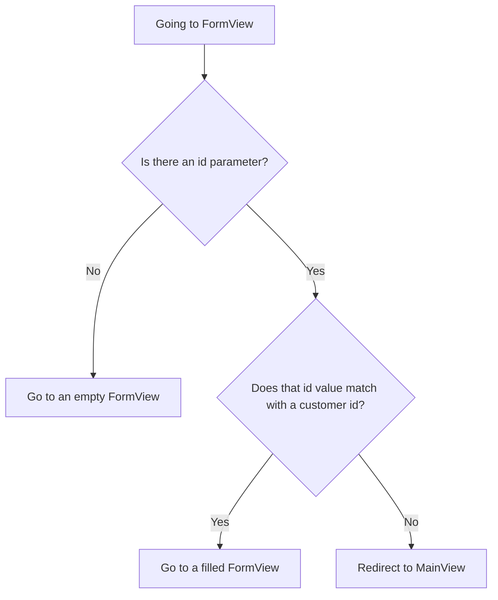

The app from [Routing and Composites](/docs/introduction/tutorial/routing-and-composites) can only add new customers to the database. Using the following concepts, you’ll give users the ability to also edit the data of existing customers: 

- Route patterns
- Passing parameter values through a URL
- Lifecycle observers

Completing this step creates a version of [4-observers-and-route-parameters](https://github.com/webforj/webforj-tutorial/tree/main/4-observers-and-route-parameters).

<!-- <div class="videos-container">
  <video controls>
    <source src="https://cdn.webforj.com/webforj-documentation/video/tutorials/scaling-with-routing-and-composites.mp4" type="video/mp4"/>
  </video>
</div> -->

## Running the app {#running-the-app}

As you develop your app, you can use [4-observers-and-route-parameters](https://github.com/webforj/webforj-tutorial/tree/main/4-observers-and-route-parameters) as a comparison. To see the app in action:

1. Navigate to the top-level directory containing the `pom.xml` file, this is `4-observers-and-route-parameters` if you're following along with the version on GitHub.

2. Use the following Maven command to run the Spring Boot app locally:
    ```bash
    mvn
    ```

Running the app automatically opens a new browser at `http://localhost:8080`.

## Using the customer's `id` {#using-the-customers-id}

To use `FormView` to edit existing customers, you will need a way to tell it which customer to edit.
You can do this by providing an initial parameter to `FormView` representing the customer ID.
In [Working with Data](/docs/introduction/tutorial/working-with-data), you created a `Customer` entity that assigns a numeric `Long` value as a unique `id` to customers when they’re added to the database.

```java
 @Id
 @GeneratedValue(strategy = GenerationType.IDENTITY)
  private Long id;
```

In this step, you’ll make changes to `FormView` so it uses an `id` as an initial parameter before anything loads. Then, you’ll have `FormView` evaluate the `id` to determine whether the form is for adding a new customer or updating an existing one. Finally, you'll modify `MainView` so it sends an `id` value when navigating to `FormView`.

## Adding a route pattern to `FormView` {#adding-a-route-pattern}

In the previous step, setting the route in `FormView` to `@Route(customer)` maps the class locally to `http://localhost:8080/customer`. Adding a route pattern lets you add an `id` as an initial parameter to `FormView`.

A [Route Pattern](/docs/routing/route-patterns) lets you add a parameter in the URL, make it optional, and set constraints on valid patterns. Using the `@Route` annotation, here’s what makes `id` an optional route parameter for `FormView`:

- **`/:id`** gives the route a named parameter of `id`, so going to `http://localhost:8080/customer/6` loads `FormView` with an `id` parameter of `6`.

- **`?`** makes the `id` parameter optional. By default, parameters are required, but making the `id` optional lets you use `FormView` for adding new customers that don’t have an `id` yet.

- **`<[0-9]+>`** constrains `id` to be a positive number. In angle brackets, `<>`, you can add a constraint as a regular expression to the parameter. If the `id` doesn’t match the constraint, e.g., `http://localhost:8080/customer/john-smith`, it sends the user to a 404 page.

To add the optional route parameter to `FormView`, change the `@Route` annotation to this:

```java
@Route("customer/:id?<[0-9]+>")
```

## Routing to `FormView` {#routing-to-formview}

`FormView` now accepts an optional `id` parameter and only loads if the `id` is a whole positive number.

However, `FormView` can still load when a user manually enters a URL for a non-existent customer, like `http://localhost:8080/customer/5000`. Adding a lifecycle observer before entering `FormView` lets your app determine how to handle the incoming `id` value.

### Conditional routing {#conditional-routing}

Lifecycle observers allow components to react to lifecycle events at specific stages. The [Lifecycle Observers](/docs/routing/navigation-lifecycle/observers) article lists available observers, but this step only uses the `WillEnterObserver`.

The `WillEnterObserver` timing occurs before the component's routing finishes.
Using this observer allows you to evaluate the incoming `id`. If the `id` doesn’t match an existing customer, you can redirect the user back to `MainView` to find a valid customer to edit.

Before discussing the code for the `WillEnterObserver`, the following flowchart lays out what should be the possible outcomes when routing to `FormView`:


```mermaid
flowchart TD
    A[Going to FormView] --> B{Is there an id parameter?}
    B -->|No| C[Go to an empty FormView]
    B -->|Yes| D{Does that id value match with a customer id?}
    D -->|Yes| E[Go to a filled FormView]
    D -->|No| F[Redirect to MainView]
```

### Using the `WillEnterObserver` {#using-the-willenterobserver}

Using the lifecycle observer that triggers before the component fully loads, `WillEnterObserver`, allows you to add conditions to determine whether the app should continue to `FormView`, or if it needs to redirect users to `MainView`.

Each lifecycle observer is an interface, so implement `WillEnterObserver` as part of the declaration for `FormView`:

```java
public class FormView extends Composite<Div> implements WillEnterObserver {
```

The `WillEnterObserver` observer has the `onWillEnter()` method that webforJ calls before routing to the component. This method has two parameters: the `WillEnterEvent` and the `ParametersBag`.

The `WillEnterEvent` determines whether to continue routing to the component with the `accept()` method, or stop routing using the `reject()` method. After rejecting the current route, you need to redirect the user somewhere else.

The `ParametersBag` contains the router parameters from the URL. You’ll use the `ParametersBag` in the next section to create the conditional logic for `onWillEnter()` using `id` parameter.

The following `onWillEnter()` is an example with only two outcomes:

```java
@Override
public void onWillEnter(WillEnterEvent event, ParametersBag parameters) {

  //Add conditional logic
  if (<condition>) {

    //Allow routing to FormView to proceed
    event.accept();

  } else {

    //Stop routing to FormView
    event.reject();

    //Send the user to MainView
    navigateToMain();
  }
}
```

### Using the `ParametersBag` {#using-the-parametersbag}

As briefly mentioned in the previous section, the `ParametersBag` contains the router parameter from the URL. Every lifecycle observer has access to this object, and using it in your app allows you to get the `id` value.

The `ParametersBag` object provides several query methods to retrieve a parameter as a specific object type. For example, `getInt()` can get you a parameter as an `Integer`.

However, since some parameters are optional, what `getInt()` actually returns is `Optional<Integer>`. Using the `ifPresentOrElse()` method on the `Optional<Integer>` allows you to set a variable using the `Integer`.

When there’s no `id` present, the user can continue going to `FormView` to add a new customer.

```java
@Override
public void onWillEnter(WillEnterEvent event, ParametersBag parameters) {

  //Determine which parameter to get, and check if it's present or not
  parameters.getInt("id").ifPresentOrElse(id -> {

    //Use the id as a variable
    customerId = Long.valueOf(id);

  //When no id is present, continue to FormView for a new customer
  }, () -> event.accept());
        
}
```

### Is the `id` valid? {#is-the-id-valid}

As of right now, the `WillEnterObserver` from the last section only accepts the routing when no `id` is present. The observer needs to perform one more verification before continuing to `FormView`: verify that the `id` matches an existing customer.

Now `FormView` can use `CustomerService` to confirm a customer’s existence using the `doesCustomerExist()` method. If there’s no match, the app can reject the current routing and redirect the user to `MainView` using `navigateToMain()`.

When given a valid `id`, the app can use `accept()` to continue routing to `FormView`. Create a `fillForm()` method to assign the `customer` variable to the customer with the corresponding `id` in the database and set the values of the fields:

```java
public void fillForm(Long customerId) {
  customer = customerService.getCustomerByKey(customerId);
  firstName.setValue(customer.getFirstName());
  lastName.setValue(customer.getLastName());
  company.setValue(customer.getCompany());
  country.selectKey(customer.getCountry());
}
```

Like when adding a new customer, using the working copy allows users to edit customer data in the UI without directly editing the repository.

### Completed `onWillEnter()` {#completed-onwillenter}

The last two sections went into detail about how to handle each outcome for routing into `FormView` using the `ParametersBag` and the `CustomerService`.

The following is the completed `onWillEnter()` for `FormView` that uses the `ParametersBag` to either reject or accept the incoming route, and calls other methods to either fill the form or send the user to `MainView`:

```java
@Override
public void onWillEnter(WillEnterEvent event, ParametersBag parameters) {

  //Determine which parameter to get, and check if it's present or not
  parameters.getInt("id").ifPresentOrElse(id -> {

    //Use the id as a variable
    customerId = Long.valueOf(id);

    //Check if there's a customer with this id
    if (customerService.doesCustomerExist(customerId)) {

        //This customer exists, so continue to FormView, and initialize the fields using the id
        event.accept();
        fillForm(customerId);
      } else {

        //This customer doesn't exists, so redirect to MainView
        event.reject();
        navigateToMain();
      }

  //No id was present, so continue to FormView for a new customer
  }, () -> event.accept());
        
}
```

## Adding or editing a customer {#adding-or-editing-a-customer}

The previous version of this app only added new customers when the user submitted the form. Now that users can edit existing customers, the `submitCustomer()` method must verify if the customer already exists before updating the database. 

Initially, it was unnecessary to assign a variable for the customer `id` in `FormView`, because new customers are assigned a unique `id` when they’re submitted into the database. However, if you declare `customerId` as an initial variable in `FormView` with an `id` value that's not in use, it remains untouched for new customers, and overwritten in `onWillEnter()` for existing ones.

This allows you to use `doesCustomerExist()` to verify whether to add a new customer or update an existing one. 

```java
private Long customerId = 0L;

//...

private void submitCustomer() {
  if (customerService.doesCustomerExist(customerId)) {
    customerService.updateCustomer(customer);
  } else {
    customerService.createCustomer(customer);
  }
  navigateToMain();
}
```

## Completed `FormView` {#completed-formview}

Here’s how `FormView` should look, now that it can handle editing existing customers: 

<!-- vale off -->
<ExpandableCode title="FormView.java" language="java" startLine={1} endLine={15}>
  {`@Route("customer/:id?<[0-9]+>")
  @FrameTitle("Customer Form")
  public class FormView extends Composite<Div> implements WillEnterObserver {
    private final CustomerService customerService;
    private Customer customer = new Customer();
    private Long customerId = 0L;
    private Div self = getBoundComponent();
    private TextField firstName = new TextField("First Name", e -> customer.setFirstName(e.getValue()));
    private TextField lastName = new TextField("Last Name", e -> customer.setLastName(e.getValue()));
    private TextField company = new TextField("Company", e -> customer.setCompany(e.getValue()));
    private ChoiceBox country = new ChoiceBox("Country",
        e -> customer.setCountry((Customer.Country) e.getSelectedItem().getKey()));
    private Button submit = new Button("Submit", ButtonTheme.PRIMARY, e -> submitCustomer());
    private Button cancel = new Button("Cancel", ButtonTheme.OUTLINED_PRIMARY, e -> navigateToMain());
    private ColumnsLayout layout = new ColumnsLayout(
        firstName, lastName,
        company, country,
        submit, cancel);

    public FormView(CustomerService customerService) {
      this.customerService = customerService;
      fillCountries();
      setColumnsLayout();
      self.setMaxWidth(600)
          .addClassName("card")
          .add(layout);
      submit.setStyle("margin-top", "var(--dwc-space-l)");
      cancel.setStyle("margin-top", "var(--dwc-space-l)");
    }

    private void setColumnsLayout() {
      List<Breakpoint> breakpoints = List.of(
          new Breakpoint(600, 2));
      layout.setSpacing("var(--dwc-space-l)")
          .setBreakpoints(breakpoints);
    }

    private void fillCountries() {
      ArrayList<ListItem> listCountries = new ArrayList<>();
      for (Country countryItem : Customer.Country.values()) {
        listCountries.add(new ListItem(countryItem, countryItem.toString()));
      }
      country.insert(listCountries);
      country.selectIndex(0);
    }

    private void submitCustomer() {
      if (customerService.doesCustomerExist(customerId)) {
        customerService.updateCustomer(customer);
      } else {
        customerService.createCustomer(customer);
      }
      navigateToMain();
    }

    private void navigateToMain() {
      Router.getCurrent().navigate(MainView.class);
    }

    @Override
    public void onWillEnter(WillEnterEvent event, ParametersBag parameters) {
      parameters.getInt("id").ifPresentOrElse(id -> {
        customerId = Long.valueOf(id);
        if (customerService.doesCustomerExist(customerId)) {
          event.accept();
          fillForm(customerId);
        } else {
          event.reject();
          navigateToMain();
        }

      }, () -> event.accept());
    }

    public void fillForm(Long customerId) {
      customer = customerService.getCustomerByKey(customerId);
      firstName.setValue(customer.getFirstName());
      lastName.setValue(customer.getLastName());
      company.setValue(customer.getCompany());
      country.selectKey(customer.getCountry());
    }
  }
`}
</ExpandableCode>
<!-- vale on -->

## Navigating from `MainView` to `FormView` to edit customers {#navigating-from-mainview-to-formview-to-edit-customers}

Earlier in this step, you used an existing `ParametersBag` to determine the value of an `id`. Creating a new `ParametersBag` lets you navigate between classes directly with the parameters of your choice. Using the data in the `Table` is a viable option for sending users to `FormView` with a customer `id`.

Similar to the button, tying the navigation to a user-chosen action lets them decide when to go to `FormView`. Adding an event listener to the `Table` lets you send the user to `FormView` with a `ParametersBag`:

```java
table.addItemClickListener(this::editCustomer);

private void editCustomer(TableItemClickEvent<Customer> e) {
  Router.getCurrent().navigate(FormView.class,
      ParametersBag.of("id=" + e.getItemKey()));
  }
```

However, the key of the `Table` items is automatically generated by default. You can explicitly make each key correlate to a customer's `id` by using the `setKeyProvider()` method:

```java
table.setKeyProvider(Customer::getId);
```

In `MainView`, add the `addItemClickListener()` and `setKeyProvider()` methods to `buildTable()`, then add the method that sends the user to `FormView` with a value for the `id` in the  `ParametersBag` based on where on the table the user clicked:

```java title="MainView.java" {30-31,34-37}
@Route("/")
@FrameTitle("Customer Table")
public class MainView extends Composite<Div> {
  private final CustomerService customerService;
  private Div self = getBoundComponent();
  private Table<Customer> table = new Table<>();
  private Button addCustomer = new Button("Add Customer", ButtonTheme.PRIMARY,
      e -> Router.getCurrent().navigate(FormView.class));

  public MainView(CustomerService customerService) {
    this.customerService = customerService;
    addCustomer.setWidth(200);
    buildTable();
    self.setWidth("fit-content")
        .addClassName("card")
        .add(table, addCustomer);
  }

  private void buildTable() {
    table.setSize("1000px", "294px");
    table.setMaxWidth("90vw");
    table.addColumn("firstName", Customer::getFirstName).setLabel("First Name");
    table.addColumn("lastName", Customer::getLastName).setLabel("Last Name");
    table.addColumn("company", Customer::getCompany).setLabel("Company");
    table.addColumn("country", Customer::getCountry).setLabel("Country");
    table.setColumnsToAutoFit();
    table.setColumnsToResizable(false);
    table.getColumns().forEach(column -> column.setSortable(true));
    table.setRepository(customerService.getRepositoryAdapter());
    table.setKeyProvider(Customer::getId);
    table.addItemClickListener(this::editCustomer);
  }

  private void editCustomer(TableItemClickEvent<Customer> e) {
    Router.getCurrent().navigate(FormView.class,
        ParametersBag.of("id=" + e.getItemKey()));
  }
}
```

## Next step {#next-step}

Now that users can edit customer data directly, your app should validate changes before committing them to the repository. In [Validating and Binding Data](/docs/introduction/tutorial/validating-and-binding-data), you’ll create validation rules and directly associate the data model with the UI, allowing the components to display error messages when the data is invalid.