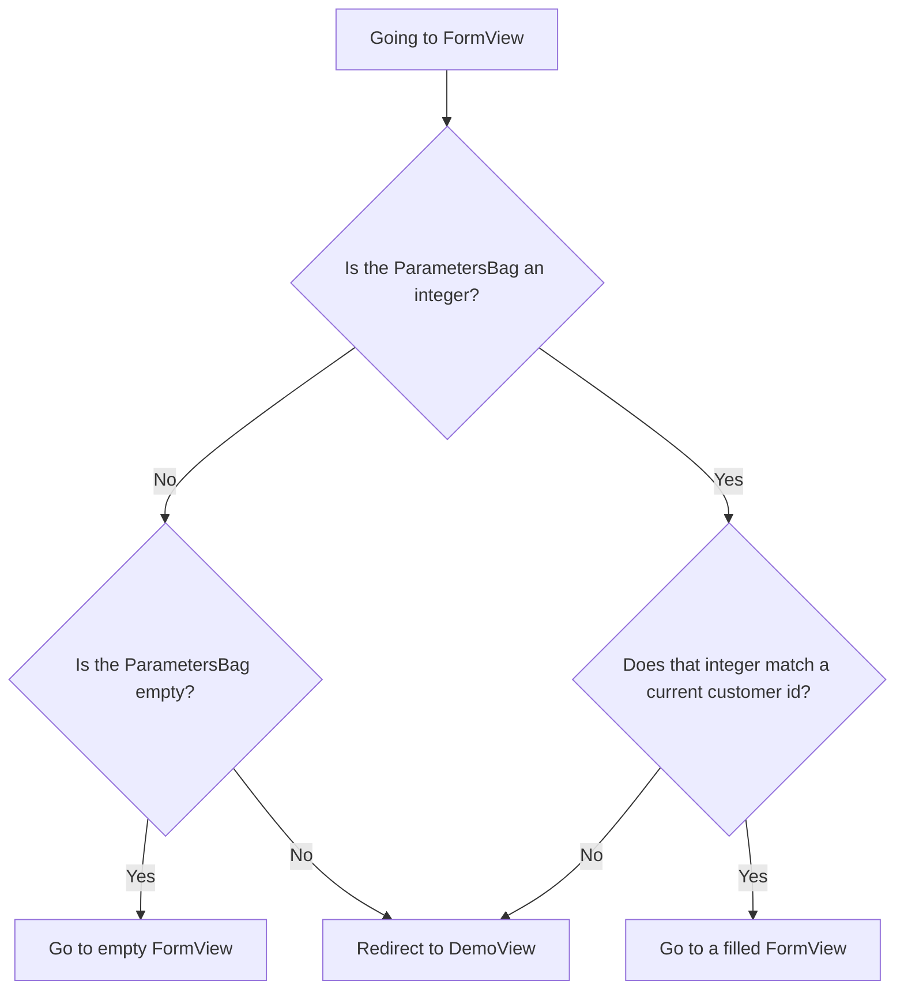

Up until now, this tutorial has only been a single-page app. This step changes that. Using the data from [Working with Data](/docs/introduction/tutorial/working-with-data) and applying the following concepts, you'll create an app that's able to navigate between multiple pages and includes concepts such as:

- Composite components
- Passing parameter values through a URL
- Lifecycle observers

Completing this step creates a version of [3-scaling-with-routing-and-composites](https://github.com/webforj/webforj-demo-application/tree/main/3-scaling-with-routing-and-composites).

<!-- <div class="videos-container">
  <video controls>
    <source src="https://cdn.webforj.com/webforj-documentation/video/tutorials/scaling-with-routing-and-composites.mp4" type="video/mp4"/>
  </video>
</div> -->

## Using routing {#using-routing}

The tutorial uses [Routing](/docs/routing/overview) for navigation. Each page of the app will now be represented as a view, and a defined URL.

### Enabling routing {#enabling-routing}

To enable routing in your app, annotate the class extending the `App` class with [`@Routify`](https://javadoc.io/doc/com.webforj/webforj-foundation/latest/com/webforj/annotation/Routify.html). In the annotation, specify what directory will contain the views. This step also takes out the UI components from the `run()` method and the `@StyleSheet` annotation. You'll move these parts to a separate view class:

```java title="Application.java" {4}
@SpringBootApplication
@AppTheme("system")
// Removed `@StyleSheet` annotation
@Routify(packages = "com.webforj.demos.views")
@AppProfile(name = "DemoApplication", shortName = "DemoApplication")
public class Application extends App {
  public static void main(String[] args) {
    SpringApplication.run(Application.class, args);
  }
// Removed overridden App.run() method
}
```

:::tip Global CSS
Keeping the `@StyleSheet` annotation in `Application` would apply that CSS to the entire app.
:::

## Creating views {#creating-views}

This tutorial will require two views, each represented by a separate class. The first view, `DemoView`, will have the UI components that were initially in the `Application` class. The second view, `FormView`, will be for editing and adding customer data.

Both views will have the following:

- **Composite components** - Both views extend the `Composite` component. [Composite components](/docs/building-ui/composite-components) are wrappers that make it easy to create reusable components.
  This tutorial wraps both views in `Div` elements, but `Composite` components can encapsulate any component, like [`FlexLayout`](/docs/components/flex-layout) or [`AppLayout`](/docs/components/app-layout).

- **`@Route` annotation** - The [`@Route`](https://javadoc.io/doc/com.webforj/webforj-foundation/latest/com/webforj/annotation/Route.html) annotation defines URLs to navigate to specific views.
- **`@FrameTitle` annotation** - The [`@FrameTitle`](https://javadoc.io/doc/com.webforj/webforj-foundation/latest/com/webforj/annotation/FrameTitle.html) annotation defines what appears in the browser's title or page's tab.

## Creating `DemoView` {#creating-demoview}

As mentioned previously, `DemoView` will contain the UI components initially in `Application`. In `/src/main/java/com/webforj/demos/views`, create `DemoView`.

### Making `DemoView` the home page {#making-demoview-the-home-page}

By default, adding the `@Route` annotation creates a URL for the view based on the filename. However, setting it to `@Route("/")` makes `DemoView` the root, so it becomes the home page of your app. 

:::tip Default route
You can specify the root view by simply omitting any parameter in the annotation as well.
:::

### Navigating from `DemoView` to `FormView` {#navigating-from-demoview-to-formview}

You will use the `Router` class twice to navigate from `DemoView` to `FormView` for adding and editing customer data. To navigate to the `FormView` page, you can add the following line of code into your app, such as in an event:

```java
Router.getCurrent().navigate(FormView.class)
```

**Adding customers**

In this case, navigation to `FormView` for new customers will occur from a `ButtonClickEvent`:

```java
private Button add = new Button("Add Customer", ButtonTheme.PRIMARY,
    e -> Router.getCurrent().navigate(FormView.class));
```

**Editing customers**

While `DemoView` shows data for all customers, `FormView` only shows one customer's data at a time. To navigate to `FormView` for an existing customer, the app needs a way to pass along that information.

You'll achieve this by using the customer's `id`. To get the `id`, first set the key provider for the `Table` using the `getId()` method that was made in [Working with Data](/docs/introduction/tutorial/working-with-data):

```java
table.setKeyProvider(Customer::getId);
```

Now you can get a customer `id` by adding an event listener whenever the user clicks a row which retrieves the key set above:

```java
table.addItemClickListener(e -> e.getItemKey());
```

Then, using the same type of event listener, you can navigate to `FormView` and put the customer `id` in a `ParametersBag`. The `ParametersBag` passes additional data through URLs, and allows `FormView` to have a [query parameter](/docs/routing/query-parameters):

```java
private void editCustomer(TableItemClickEvent<Customer> e) {
  Router.getCurrent().navigate(FormView.class,
      ParametersBag.of("id=" + e.getItemKey()));
}
```

### Completed `DemoView` {#completed-demoview}

Here's a look at what `DemoView` should look like before moving on to create `FormView`:

:::note Cleaner code
As your app grows more complex, it's a good idea to section parts of your app. The methods for creating the `Table` component were grouped into a single method.
:::

<!-- vale off -->
<ExpandableCode title="DemoView.java" language="java" startLine={1} endLine={15}>
{`
@Route("/")
@FrameTitle("Demo")
public class DemoView extends Composite<Div> {

  private final CustomerService customerService;

  private Table<Customer> table = new Table<>();
  private Div self = getBoundComponent();
  private Button add = new Button("Add Customer", ButtonTheme.PRIMARY,
      e -> Router.getCurrent().navigate(FormView.class));

  public DemoView(CustomerService customerService) {
    this.customerService = customerService;

    add.setWidth(200);
    buildTable();
    table.setKeyProvider(Customer::getId);
    table.addItemClickListener(this::editCustomer);
    FlexLayout layout = FlexLayout.create(table, add)
        .vertical().contentAlign().center().build().setPadding("var(--dwc-space-l)");
    self.add(layout);
  }

  private void buildTable() {
    table.setHeight("294px");
    table.addColumn("firstName", Customer::getFirstName).setLabel("First Name");
    table.addColumn("lastName", Customer::getLastName).setLabel("Last Name");
    table.addColumn("company", Customer::getCompany).setLabel("Company");
    table.addColumn("country", Customer::getCountry).setLabel("Country");
    table.setColumnsToAutoFit();
    table.getColumns().forEach(column -> column.setSortable(true));
    table.setRepository(customerService.getFilterableRepository());
  }

  private void editCustomer(TableItemClickEvent<Customer> e) {
    Router.getCurrent().navigate(FormView.class,
        ParametersBag.of("id=" + e.getItemKey()));
  }
}
`}
</ExpandableCode>
<!-- vale on -->

## Creating `FormView` {#creating-formview}

The next view to create in `/src/main/java/com/webforj/demos/views` is `FormView`.
This class will need to distinguish between new and existing customers when loading and populating the fields as necessary.

### Adding components for each property {#adding-components-for-each-property}

Each customer's property, except for the `id`, gets an editable field on the form. Whenever those values change, they're updated in a copy of a customer entity without changing the actual repository. The initial values will be set in a later section of this step, [loading data on the `DidEnterObserver`](#loading-data-on-the-didenterobserver).

Naming the components the same as the properties they're representing in the `Customer` entity also makes it easier to bind data in the next step, [validating and Binding Data](/docs/introduction/tutorial/validating-and-binding-data).

```java
Customer customer = new Customer();
Long customerId = 0L;
TextField firstName = new TextField("First Name", e -> customer.setFirstName(e.getValue()));
TextField lastName = new TextField("Last Name", e -> customer.setLastName(e.getValue()));
TextField company = new TextField("Company", e -> customer.setCompany(e.getValue()));
ChoiceBox country = new ChoiceBox("Country",
    e -> customer.setCountry(Country.valueOf(e.getSelectedItem().getText())));
```

Since the list of countries is from a defined list, make a method to add each country for the `ChoiceBox` choices:

```java
private void fillCountries() {
  ArrayList<ListItem> listCountries = new ArrayList<>();
  for (Country countryItem : Customer.Country.values()) {
    listCountries.add(new ListItem(countryItem, countryItem.toString()));
  }
  country.insert(listCountries);
}
```

### Adding or editing a customer {#adding-or-editing-a-customer}

Using `CustomerService`, you can update the H2 database by either adding a customer or modifying an existing one. To tell your app which action to take, add a verification on the customer's `id`. The initial `id` is 0, but gets overwritten with the rest of the properties if there's a valid customer.

```java
Button submit = new Button("Submit", ButtonTheme.PRIMARY, e -> submitCustomer());

// Other UI components and methods in FormView

private void submitCustomer() {
  if (customerService.doesCustomerExist(customerId)) {
    customerService.updateCustomer(customer);
  } else {
    customerService.createCustomer(customer);
  }
  Router.getCurrent().navigate(DemoView.class);
}
```

### Navigation outline {#navigation-outline}

Before going over the navigation code for `FormView`, it'll be helpful to outline what needs to happen before the view loads. When entering `FormView`, part of the URL is used to determine which customer data to load. For example, going to http://localhost:8080/customer/5 would load the data for the customer with the `id` of 5.

While using the UI to navigate from `DemoView` to `FormView` results in a valid URL, putting checks in place prevents errors if a user manually enters a URL to `FromView` that doesn't correlate with an existing customer, like http://localhost:8080/customer/5000 or http://localhost:8080/customer/john-smith. Those invalid URLs will redirect users back to `DemoView`.



### Going back to `DemoView` {#going-back-to-demoview}

There are multiple actions that should send the user back to `DemoView`, such as when they try to go to `FormView` with an invalid `id`, when they click a cancel button, and in `sumbitCustomer()` from [Adding or editing a customer](#adding-or-editing-a-customer). For those reasons, the navigation process is put into a method that can be used multiple times in `FormView`:

```java
private void navigateToHome(){
  Router.getCurrent().navigate(DemoView.class);
}
```

### Getting the customer `id` from the URL {#getting-the-customer-id-from-the-url}

Using `@Route("customer/:id?")` as the route, you allow the URL to have [Query Parameters](/docs/routing/query-parameters) to take the `id` in the URL and choose what to do next in the [Lifecycle Observers](/docs/routing/navigation-lifecycle/observers) `WillEnterObserver` and `DidEnterObserver`.

Both `onWillEnter()` and `onDidEnter()` will take the `ParametersBag` as an argument that can return an `Optional<Integer>` to use as needed by using the `getInt()` method.

```java
@Override
public void onWillEnter(WillEnterEvent event, ParametersBag parameters) {
  parameters.getInt("id").ifPresentOrElse(id -> {
  // logic to apply when the id is an integer
  }, () - > {
  // logic to apply when the id is null or not an integer
  });
}
```


### Validating the `id` on the `WillEnterObserver` {#validating-the-id-on-the-WillEnterObserver}

The `WillEnterObserver` happens before the view loads, so any actions taken need to reject or accept the current path to `FormView` explicitly. When you reject the event, use `navigateToHome()` to send it back to `DemoView`. 

When the `id` from `ParametersBag` is an integer, the next statement verifies whether it matches an existing customer `id`; otherwise, send it back to `DemoView`.

```java
customerId = Long.valueOf(id);
if (customerService.doesCustomerExist(customerId)) {
  event.accept();
} else {
  event.reject();
  navigateToHome();
}
```

When the `id` from `ParametersBag` isn't an integer, verify if it's empty, as an empty `id` would send the user to create a new customer.

```java
if (parameters.get("id").isEmpty()) {
  event.accept();
} else {
  event.reject();
  navigateToHome();
}
```

All together, `onWillEnter()` should look like the following:

```java title="FormView WillEnterObserver"
@Override
public void onWillEnter(WillEnterEvent event, ParametersBag parameters) {
  parameters.getInt("id").ifPresentOrElse(id -> {
    customerId = Long.valueOf(id);
    if (customerService.doesCustomerExist(customerId)) {
       event.accept();
      } else {
        event.reject();
        navigateToHome();
      }

  }, () -> {
    if (parameters.get("id").isEmpty()) {
      event.accept();
    } else {
      event.reject();
      navigateToHome();
    }
  });
}
```

### Loading data on the `DidEnterObserver` {#loading-data-on-the-didenterobserver}

The next lifecycle, `onDidEnter()`, happens when the `Router` navigates to a view.
During this part of the lifecycle, the app is told to:

- **Load Data**: Initialize or fetch data required for the view based on route parameters.
- **Set Up the View**: Update the UI elements based on the context.

```java title="FormView DidEnterObserver"
@Override
public void onDidEnter(DidEnterEvent event, ParametersBag parameters) {
  parameters.getInt("id").ifPresent(id -> {
    customerId = Long.valueOf(id);
    customer = customerService.getCustomerByKey(customerId);
    firstName.setValue(customer.getFirstName());
    lastName.setValue(customer.getLastName());
    company.setValue(customer.getCompany());
    country.selectKey(customer.getCountry());
  });
}
```

### Completed `FormView` {#completed-formview}

Your `FormView` should now look similar to the following:

:::note Moved `@StyleSheet` annotation
Moving `@StyleSheet` from `Application` means the CSS styling will now only apply to `FormView` and not the entire app.
:::

<!-- vale off -->
<ExpandableCode title="FormView.java" language="java" startLine={1} endLine={15}>
{`
@StyleSheet("ws://css/form.css")
@Route("customer/:id?")
@FrameTitle("Customer Form")
public class FormView extends Composite<Div> implements WillEnterObserver, DidEnterObserver {
  private final CustomerService customerService;
  Customer customer = new Customer();
  Long customerId = 0L;
  Div self = getBoundComponent();
  TextField firstName = new TextField("First Name", e -> customer.setFirstName(e.getValue()));
  TextField lastName = new TextField("Last Name", e -> customer.setLastName(e.getValue()));
  TextField company = new TextField("Company", e -> customer.setCompany(e.getValue()));
  ChoiceBox country = new ChoiceBox("Country",
      e -> customer.setCountry(Country.valueOf(e.getSelectedItem().getText())));
  Button submit = new Button("Submit", ButtonTheme.PRIMARY, e -> submitCustomer());
  Button cancel = new Button("Cancel", ButtonTheme.OUTLINED_PRIMARY, e -> navigateToHome());

  ColumnsLayout columnsLayout = new ColumnsLayout(
      firstName, lastName,
      company, country,
      cancel, submit);

  public FormView(CustomerService customerService) {
    this.customerService = customerService;
    fillCountries();

    self.setMaxWidth("600px");
    self.setHeight("100dvh");
    self.addClassName("form");
    self.add(columnsLayout);
  }

  private void fillCountries() {
    ArrayList<ListItem> listCountries = new ArrayList<>();
    for (Country countryItem : Customer.Country.values()) {
      listCountries.add(new ListItem(countryItem, countryItem.toString()));
    }
    country.insert(listCountries);
  }

  private void submitCustomer() {
    if (customerService.doesCustomerExist(customerId)) {
      customerService.updateCustomer(customer);
    } else {
      customerService.createCustomer(customer);
    }
    navigateToHome();
  }

  private void navigateToHome(){
    Router.getCurrent().navigate(DemoView.class);
  }

  @Override
  public void onWillEnter(WillEnterEvent event, ParametersBag parameters) {
    parameters.getInt("id").ifPresentOrElse(id -> {
      customerId = Long.valueOf(id);
      if (customerService.doesCustomerExist(customerId)) {
         event.accept();
        } else {
          event.reject();
          navigateToHome();
        }
        event.accept();

    }, () -> {
      if (parameters.get("id").isEmpty()) {
        event.accept();
      } else {
        event.reject();
        navigateToHome();
      }
    });
  }

  @Override
  public void onDidEnter(DidEnterEvent event, ParametersBag parameters) {
    parameters.getInt("id").ifPresent(id -> {
      customerId = Long.valueOf(id);
      customer = customerService.getCustomerByKey(customerId);
      firstName.setValue(customer.getFirstName());
      lastName.setValue(customer.getLastName());
      company.setValue(customer.getCompany());
      country.selectKey(customer.getCountry());
    });
  }

}
`}
</ExpandableCode>
<!-- vale on -->

## Running the app {#running-the-app}

When you've finished this step, you can compare it to [3-scaling-with-routing-and-composites](https://github.com/webforj/webforj-demo-application/tree/main/3-scaling-with-routing-and-composites) on GitHub. To see the app in action:

1. Navigate to the top-level directory containing the `pom.xml` file, this is `3-scaling-with-routing-and-composites` if you're following along with the version on GitHub.

2. Use the following Maven command to run the Spring Boot app locally:
    ```bash
    mvn
    ```

3. Open your browser and go to http://localhost:8080 to view the app.

With routing and view separation in place, your app is now ready for further scaling, including advanced data binding and validation in the next step.