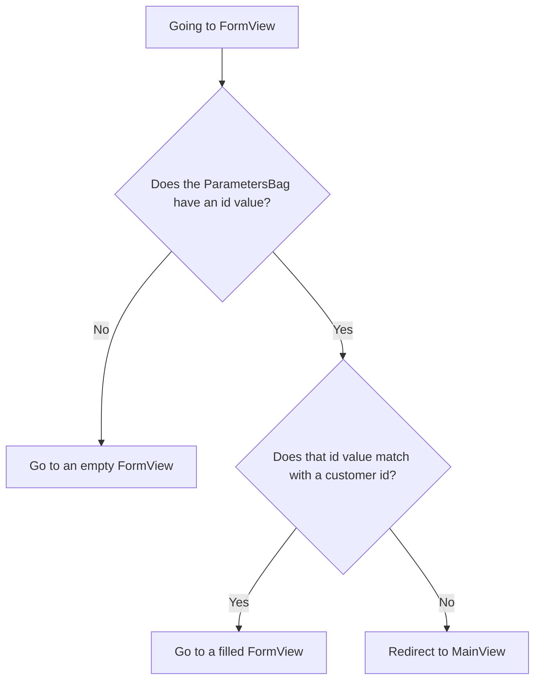

Up until now, this tutorial has only been a single-page app. This step changes that. Using the data from [Working with Data](/docs/introduction/tutorial/working-with-data) you'll create an app that's able to navigate between multiple pages and able to edit the customer data in the browser by applying these concepts:

- Routing
- Composite components
- Passing parameter values through a URL
- Lifecycle observers

Completing this step creates a version of [3-scaling-with-routing-and-composites](https://github.com/webforj/webforj-demo-application/tree/main/3-scaling-with-routing-and-composites).

<!-- <div class="videos-container">
  <video controls>
    <source src="https://cdn.webforj.com/webforj-documentation/video/tutorials/scaling-with-routing-and-composites.mp4" type="video/mp4"/>
  </video>
</div> -->

## Allow your app to be routable {#allow-your-app-to-be-routable}

A routable app renders the UI based on the URL. Annotating the class that extends the `App` class with [`@Routify`](https://javadoc.io/doc/com.webforj/webforj-foundation/latest/com/webforj/annotation/Routify.html) tells webforJ the package that'll contain UI components.

When you're adding the `@Routify` annotation to `Application`, also take out the UI components from the `run()` method and the `@StyleSheet` annotation. You'll move these parts to a class that you'll make in the `com.webforj.demos.views` package:

```java title="Application.java" {3,5,6,14}
@SpringBootApplication
@AppTheme("system")
// Removed @StyleSheet annotation

//Added @Routify annotation
@Routify(packages = "com.webforj.demos.views")
@AppProfile(name = "CustomerApplication", shortName = "CustomerApplication")
public class Application extends App {

  public static void main(String[] args) {
    SpringApplication.run(Application.class, args);
  }

// Removed overridden App.run() method

}
```

:::tip Global CSS
Keeping the `@StyleSheet` annotation in `Application` would apply that CSS to the entire app.
:::

## Creating views {#creating-views}

Using the `@Routify` annotation tells webforJ which packages contain UI content. You determine how components map to the URL by setting the [Route Type](/docs/routing/route-hierarchy/route-types).

There are two [Route Types](/docs/routing/route-hierarchy/route-types) to use for classes with UI content. `View` routes contain UI components directly, while `Layout` routes contain child routes for UI components shared across multiple views. Creating a class that ends in `View` automatically makes it a `View` route.

In `/src/main/java/com/webforj/demos/views`, create two classes:

- **`MainView`** - The view with the UI components that were initially in the `Application` class.
- **`FormView`** - The view with the new UI for editing and adding customer data.

The next few sections are the shared characteristics between `MainView` and `FormView`.

### Using `Composite` components {#using-composite-components}

The views needs a wrapper for the UI on each page. When the app was single-paged, you stored the components inside a `Frame`, but moving forward, you'll store the UI in [`Composite` components](/docs/building-ui/composite-components).

`Composite` components are wrappers that make it easy to create reusable components. You use `Composite` components by extending a class with a `Composite` and set a bound component. This tutorial uses `Div` elements as the bound components, but they can be any component, such as [`FlexLayout`](/docs/components/flex-layout) or [`AppLayout`](/docs/components/app-layout).

```java
// Extend Composite with a bound component
public class BasicView extends Composite<Div> {

  // Access the bound component
  private Div self = getBoundComponent();

  // Create a component UI
  private Button submit = new Button("Submit");

  public BasicView() {

    // Add the UI component to the bound component
    self.add(submit);

  }
}
```

### Mapping URLs to components {#mapping-urls-to-components}

While the `@Routify` annotation tells webforJ where viewable components are, using the `@Route` annotation tells webforJ where and when to load the view class based on the given URL segment. For example, Using `@Route("customer")` locally maps the class to [http://localhost:8080/**customer**](http://localhost:8080/customer).

Setting the route for `MainView` to `@Route("/")` to makes it the intital page when your app runs.

Routes can also contain patterns. Adding a [Route Pattern](/docs/routing/route-patterns) lets you add a parameter in the URL, make it optional, and set constraints on valid patterns. `FormView` needs this to get the customer `id` as a number. Here's what setting the route to `customer/:id?<[0-9]+>` does:

- **`customer`** - This loads `FormView` at `/customer`.
- **`/:id`** - Captures an `id` as a parameter when loading `FormView`, so going to [http://localhost:8080/**customer/6**](http://localhost:8080/customer/6) loads `FormView` with an `id` parameter of `6`.
- **`?`** - Lets the `id` be an optional parameter.
- **`<[0-9]+>`** - Constraints the `id`, when present, to be a positive number. If it’s not present, it’ll send the user to a 404 page.

Add the mentioned `@Route` annotations to your view classes.

```java title="MainView.java" {1}
@Route("/")
public class MainView extends Composite<Div> {

  private Div self = getBoundComponent();

  public MainView() {

  }
}
```

```java title="FormView.java" {1}
@Route("customer/:id?<[0-9]+>")
public class FormView extends Composite<Div> {

  private Div self = getBoundComponent();

  public FormView() {

  }
}
```

:::tip Default behavior
If you don’t explicitly assign a value for the `@Route` annotation, the resulting URL segment becomes the class name converted to all lowercase, with the `View` suffix removed.

- `MainView` would map to `/main`
- `FormView` would map to `/form`
:::

### Using `CustomerService` {#using-customerservice}

Both views interact with the customer data, so include the `CustomerService` class from [Working with Data](/docs/introduction/tutorial/working-with-data) as a constructor parameter for `MainView` and `FormView`. 

```java {6-7}
@Route()
public class BasicView extends Composite<Div> {

  private Div self = getBoundComponent();

  public BasicView(CustomerService customerService) {
    this.customerService = customerService;

  }
}
```

### Setting the frame title {#setting-the-frame-tile}

The last part that the views share is a customer frame title. The [`@FrameTitle`](https://javadoc.io/doc/com.webforj/webforj-foundation/latest/com/webforj/annotation/FrameTitle.html) annotation defines what appears in the browser's title or page's tab. The rest of this step individually focuses on the views.

```java title="MainView.java" {2}
@Route("/")
@FrameTitle("Customer Table")
public class MainView extends Composite<Div> {

  private Div self = getBoundComponent();

  public MainView(CustomerService customerService) {
    this.customerService = customerService;

  }
}
```

```java title="FormView.java" {2}
@Route("customer/:id?<[0-9]+>")
@FrameTitle("Customer Form")
public class FormView extends Composite<Div> {

  private Div self = getBoundComponent();

  public FormView(CustomerService customerService) {
    this.customerService = customerService;

  }
}
```

## Creating `MainView` {#creating-mainview}

As mentioned previously, `MainView` will contain the UI components initially in `Application`. This class also needs a way to navigate to `FormView` for new and existing customers.

## Moved `@StyleSheet` annotation {#moved-stylesheet-annotation}

Originally, having the `@StyleSheet` annotation in `Application` meant that CSS was accessible to the entire app. Moving the annotation to the view level means the app loads the CSS file only when needed, as `FormView` won’t need the `.card` CSS class.

### Navigating from `MainView` to `FormView` to add customers {#navigating-from-mainview-to-formview-to-add-customers}

The [`Router`](https://javadoc.io/doc/com.webforj/webforj-foundation/latest/com/webforj/router/Router.html) class allows you to navigate between different classes by getting a current instance of the `Router` and using the `navigate()` method to navigate from the current class to the desired destination. You'll use this to get from `MainView` to `FormView`. 

```java
Router.getCurrent().navigate(FormView.class);
```

You now have a way to programmatically send users to the form that adds new customers. It should be the user’s decision to go from the table to the new form, so it's time to associate the navigation with a user's action.

To allow users to add a new customer, you can either modify or replace the existing info button from the previous step. Instead of opening a message dialog, have the event grab the current `Router`, then send the user to the `FormView` class:

```java
private Button add = new Button("Add Customer", ButtonTheme.PRIMARY,
    e -> Router.getCurrent().navigate(FormView.class));
```

### Navigating from `MainView` to `FormView` to edit customers {#navigating-from-mainview-to-formview-to-edit-customers}

Sending a user straight to the `FormView` class with no values is fine for adding a new customer, but how's the app supposed to know when to go to `FormView` for an existing customer?

You can pass a customer `id` as a [query parameter](/docs/routing/query-parameters), and webforJ sends it in a `ParametersBag`. Query parameters are additional data passed in the URL. You already made a route pattern for `FormView` in [Mapping URLs to components](#mapping-urls-to-components), so `FormView` already expects to get a value for `id`. Now there’s a new question: how to get the `id` of a specific customer? 

Similar to the button, tying the navigation to a user-chosen action lets them decide when to go to `FormView`. Adding an event listener to the
`Table` lets your app know which customer the user clicked, and sends that customer's `id` to `FormView`.

The `Table` created in [Working with Data](/docs/introduction/tutorial/working-with-data) contains the data of each customer. By using `setKeyProvider()`, associate the data in the cells to the `id` of the customer it came from, without having to visually display it:

```java
table.setKeyProvider(Customer::getId);
```

Add the event listener whenever the user clicks a row on the `Table` to retrieve the key, which is now the customer `id`:

```java
table.addItemClickListener(e -> e.getItemKey());
```

Then, using the same type of event listener, navigate to `FormView` with the `id` in the `ParametersBag`. The `ParametersBag` passes additional data through URLs, and allows you to send the query parameter to `FormView`:

```java
private void editCustomer(TableItemClickEvent<Customer> e) {
  Router.getCurrent().navigate(FormView.class,
      ParametersBag.of("id=" + e.getItemKey()));
}
```

### Grouping the `Table` methods {#grouping-the-table-methods}

With added navigation, your app is growing more complex. It's a good idea to section parts of your app, so one custom method can make changes to the `Table` together. This custom method should also include the newly added methods that add the event listener and set the key provider:

```java
private void buildTable() {
  table.setSize("1000px", "294px");
  table.setMaxWidth("90vw");
  table.addColumn("firstName", Customer::getFirstName).setLabel("First Name");
  table.addColumn("lastName", Customer::getLastName).setLabel("Last Name");
  table.addColumn("company", Customer::getCompany).setLabel("Company");
  table.addColumn("country", Customer::getCountry).setLabel("Country");
  table.setColumnsToAutoFit();
  table.getColumns().forEach(column -> column.setSortable(true));
  table.setRepository(customerService.getFilterableRepository());

  // Methods to get the customer id when navigating to FormView
  table.setKeyProvider(Customer::getId);
  table.addItemClickListener(this::editCustomer);
  }
```

## Completed `MainView` {#completed-mainview}

With the added navigation features and grouped table methods, here's a look at what `MainView` should look like before moving to `FormView`:

<!-- vale off -->
<ExpandableCode title="MainView.java" language="java" startLine={1} endLine={15}>
{`@StyleSheet("ws://css/card.css")
@Route("/")
@FrameTitle("Customer Table")
public class MainView extends Composite<Div> {

  private final CustomerService customerService;

  private Div self = getBoundComponent();
  private Table<Customer> table = new Table<>();
  private Button add = new Button("Add Customer", ButtonTheme.PRIMARY,
      e -> Router.getCurrent().navigate(FormView.class));

  public MainView(CustomerService customerService) {
    this.customerService = customerService;

    add.setWidth(200);
    buildTable();

    self.setWidth("fit-content")
      .addClassName("card")
      .add(table, add);
  }
  
  private void buildTable() {
    table.setSize("1000px", "294px");
    table.setMaxWidth("90vw");
    table.addColumn("firstName", Customer::getFirstName).setLabel("First Name");
    table.addColumn("lastName", Customer::getLastName).setLabel("Last Name");
    table.addColumn("company", Customer::getCompany).setLabel("Company");
    table.addColumn("country", Customer::getCountry).setLabel("Country");
    table.setColumnsToAutoFit();
    table.setColumnsToResizable(false);
    table.getColumns().forEach(column -> column.setSortable(true));
    table.setRepository(customerService.getFilterableRepository());
    table.setKeyProvider(Customer::getId);
    table.addItemClickListener(this::editCustomer);
  }

  private void editCustomer(TableItemClickEvent<Customer> e) {
    Router.getCurrent().navigate(FormView.class,
        ParametersBag.of("id=" + e.getItemKey()));
  }
}
`}
</ExpandableCode>
<!-- vale on -->

## Adding a UI to `FormView` {#adding-a-ui-to-formview}

`FormView` will include multiple UI components to edit each customer property. Instead of editing the repository directly, you'll create a new `Customer` instance and initialize it with the same values. The initial data for `FormView` is covered in a later section, [Routing to `FormView`](#routing-to-formview). For now, just focus on adding the UI components.

This new instance acts as a working copy for the form. The UI edits this copy only. The original `Customer` in the repository remains unchanged until you explicitly use the `CustomerService` to update the repository with the `Customer` copy.

### Adding components for each property {#adding-components-for-each-property}

Every customer's property, aside from the `id`, should have a corresponding component on the form. Initially, the `id` on the form will be `0`, but later you’ll add a way to change it, along with the other initial values for each property.

Naming the components the same as the properties they're representing in the `Customer` entity makes it easier to bind data in the next step, [Validating and Binding Data](/docs/introduction/tutorial/validating-and-binding-data).

The first name, last name, and company properties can use the [`TextField`](/docs/components/fields/textfield) component. With this component, you can add a label and an event listener that fires whenever the field value changes. Each event listener should update the `Customer` copy for the corresponding property.

Add declarations for the `Customer`, `id`, and the three `TextField` components:

```java title="FormView.java" {4-5,9-11}
public class FormView extends Composite<Div> {
  private final CustomerService customerService;

  private Customer customer = new Customer();
  private Long customerId = 0L;

  private Div self = getBoundComponent();

  private TextField firstName = new TextField("First Name", e -> customer.setFirstName(e.getValue()));
  private TextField lastName = new TextField("Last Name", e -> customer.setLastName(e.getValue()));
  private TextField company = new TextField("Company", e -> customer.setCompany(e.getValue()));

  public FormView(CustomerService customerService) {
    this.customerService = customerService;
  }
}
```

Meanwhile, since you already know the country property can only be one of five values: `UNKNOWN`, `GERMANY`, `ENGLAND`, `ITALY`, and `USA`, that property should be editable in a [`ChoiceBox`](/docs/components/lists/choicebox). The `ChoiceBox` component is good for when you have a predefined list of options.

To add the options to a `ChoiceBox`, create a method that puts the enum values from the `Customer` class into an `ArrayList<ListItem>` and put the `ArrayList<ListItem>` into the `ChoiceBox`.

```java
private void fillCountries() {
  ArrayList<ListItem> listCountries = new ArrayList<>();
  for (Country countryItem : Customer.Country.values()) {
    listCountries.add(new ListItem(countryItem, countryItem.toString()));
  }
  country.insert(listCountries);
}
```

Like the `TextField` components, add `ChoiceBox` with a label and an event listener to the `ChoiceBox`. This event listener updates the customer's customer whenever a user selects an option from the `ChoiceBox`.

```java title="FormView.java" {10-11,16,20-26}
public class FormView extends Composite<Div> {
  private final CustomerService customerService;
  private Customer customer = new Customer();
  private Long customerId = 0L;
  private Div self = getBoundComponent();
  private TextField firstName = new TextField("First Name", e -> customer.setFirstName(e.getValue()));
  private TextField lastName = new TextField("Last Name", e -> customer.setLastName(e.getValue()));
  private TextField company = new TextField("Company", e -> customer.setCompany(e.getValue()));

  private ChoiceBox country = new ChoiceBox("Country",
      e -> customer.setCountry(Country.valueOf(e.getSelectedItem().getText())));

  public FormView(CustomerService customerService) {
    this.customerService = customerService;

    fillCountries();

  }

  private void fillCountries() {
    ArrayList<ListItem> listCountries = new ArrayList<>();
    for (Country countryItem : Customer.Country.values()) {
      listCountries.add(new ListItem(countryItem, countryItem.toString()));
    }
    country.insert(listCountries);
  }

}
```

### Laying out the components {#laying-out-the-components}

Right now, `FormView` has four components for the form's editable parts, but it still needs buttons for submitting and canceling.
 
```java
private Button submit = new Button("Submit");
private Button cancel = new Button("Cancel");
```

You can skip ahead to the next sections to create more detailed events for the buttons, but this section covers how to group and layout the components on the form. Using [`FlexLayout`](/docs/components/flex-layout) and [`ColumnsLayout`](/docs/components/columns-layout) for component placement allows your app to achieve dynamic sizing by avoiding explicit width settings. These layouts control how many columns to use, how to space components, and how components should fit within the layouts.

The buttons will be placed in a [`FlexLayout`](/docs/components/flex-layout). Using the `create()` methods makes a [`FlexLayoutBuilder`](https://javadoc.io/doc/com.webforj/webforj-flexlayout/latest/com/webforj/component/layout/flexlayout/FlexLayoutBuilder.html). That allows you to chain methods together, so the buttons in the following `Flexlayout` will be horizontally aligned and spaced out to have even spacing between the two components: 

```java
private FlexLayout buttonsLayout = FlexLayout.create(submit, cancel)
  .horizontal()
  .justify().between()
  .build();
```

Then, you can explicitly set the size of the spacing; here, the tutorial uses a CSS token from DWC:

```java
buttonsLayout.setSpacing("var(--dwc-space-3xl)");
```

Once that’s done, you can set how items should grow proportionally to one another. A section in the `FlexLayout` article, [Flex grow/shrink](/docs/components/flex-layout#flex-grow--shrink), goest into more detail, but all you need to know for this tutorial is the following line makes both components the same size:

```java
buttonsLayout.setItemGrow(1, submit, cancel);
```

The next layout to use is `ColumnsLayout`. This layout controls how many columns to have at different widths. Here, add all the form components, as well as the layout that contains the buttons: 

```java
private ColumnsLayout columnsLayout = new ColumnsLayout(
  firstName, lastName,
  company, country,
  buttonsLayout);
```

To tell when the `ColumnsLayout` should have a certain number of columns, you’d use breakpoints. The
[Breakpoints](/docs/components/columns-layout#breakpoints) section in the `ColumnsLayout` article explains it in detail, but essentially the following breakpoints make it so the layout allows two components if the layout is larger than 600px in width, otherwise it’ll only have one column:

```java
List<Breakpoint> breakpoints = List.of(
  new Breakpoint(0, 1),
  new Breakpoint(600, 2));

columnsLayout.setBreakpoints(breakpoints);
```

The `ColumnsLayout` is going to treat the layout with the buttons as one component, but to have it stretch across two columns, you can use `setSpan()`:

```java
columnsLayout.setSpan(buttonsLayout, 2);
```

To bring the layouts all together, add the `FlexLayout` to the bound component, and declare a method that handles the configurations for each layout:

```java
public class FormView extends Composite<Div> implements WillEnterObserver {
  //Declared components from earlier

  private FlexLayout buttonsLayout = FlexLayout.create(submit, cancel)
      .horizontal()
      .justify().between()
      .build();

  private ColumnsLayout columnsLayout = new ColumnsLayout(
      firstName, lastName,
      company, country,
      buttonsLayout);

  public FormView(CustomerService customerService) {
    this.customerService = customerService;
    
    fillCountries();
    setLayouts();

    self.setMaxWidth(600)
      .setHeight("100dvh")
      .setStyle("margin", "var(--dwc-space-l) auto")
      .add(columnsLayout);
  }

  private void setLayouts() {
    buttonsLayout.setSpacing("var(--dwc-space-3xl)")
      .setItemGrow(1, submit, cancel)
      .setMargin("var(--dwc-space-l) 0");

    columnsLayout.setSpacing("var(--dwc-space-3xl)")
      .setStyle("padding", "var(--dwc-space-l)")
      .setSpan(buttonsLayout, 2);

    List<Breakpoint> breakpoints = List.of(
      new Breakpoint(0, 1),
      new Breakpoint(600, 2));
    columnsLayout.setBreakpoints(breakpoints);
  }
```

### Navigating to `MainView` {#navigating-to-mainview}

In addition to the components that edit customer data, you'll need a button that allows the user to discard their changes. This should return the user to `MainView`.

Since there will be multiple actions that should send the user back to `MainView`, add a method to encapsulate that navigation, allowing you to reuse it in `FormView`:

```java
private void navigateToMain(){
  Router.getCurrent().navigate(MainView.class);
}
```

After adding the `navigateToMain()` method to `FormView`, and add an event to the cancel button that uses `navigateToMain()`:

```java
Button cancel = new Button("Cancel", ButtonTheme.OUTLINED_PRIMARY, e -> navigateToMain());
```

### Adding or editing a customer {#adding-or-editing-a-customer}

With the `TextField` and `ChoiceBox` components, a user can make changes to a `Customer` that don’t affect the repository directly. When they’re ready to commit those changes, there should be a submit button that uses the `CustomerService` to update the H2 database.

One button can update the H2 database by either adding a customer or modifying an existing one. To tell your app which action to take, you can compare the current `customerId` to the repository using `doesCustomerExist()`.

Initially, `FormView` has a `customerId` value of `0`. If left untouched, the `CustomerService` class should create a new customer in the H2 database, and assigns it a new unique `id`.

However, if the `customerId` value is redefined for an existing customer, the `CustomerService` class should update the H2 database with the contents of the `Customer` copy.

Add an event to the sumbit button with the following logic using the `CustomerService` class:

```java
Button submit = new Button("Submit", ButtonTheme.PRIMARY, e -> submitCustomer());

// Other UI components and methods in FormView

private void submitCustomer() {
  if (customerService.doesCustomerExist(customerId)) {
    customerService.updateCustomer(customer);
  } else {
    customerService.createCustomer(customer);
  }
  navigateToMain();
}
```

The next section focuses on retrieving the `customerId` value and using it to initialize the values for the  UI components.

## Routing to `FormView` {#routing-to-formview}

`MainView` will always show the full table for each customer, but the content of `FormView` is dynamic: it’s either showing an existing customer’s details or blank fields to add a new customer.

In this section, you'll focus on using the URL and specific stages of navigating to determine what `Customer` to intitailize for the fields.

### Handling the `id` before entering `FormView` {#handling-the-id-before-entering-formview}

In a previous section of this step, [Mapping URLs to components](#mapping-urls-to-components), you added the route pattern `customer/:id?<[0-9]+>` to `FormView`. This pattern allows users to enter with an optional parameter, but only accepts whole-number values. For example, [http://localhost:8080/customer/**john-smith**](http://localhost:8080/customer/john-smith) won't load `FormView`.

However, `FormView` can still load when a user manually enters a URL for a non-existent customer, like [http://localhost:8080/customer/**5000**](http://localhost:8080/customer/5000). Adding a lifecycle observer before entering `FormView` lets your app determine how to handle the incoming `id` value.

[Lifecycle Observers](/docs/routing/navigation-lifecycle/observers) allow components to react to lifecycle events at specific stages. This tutorial uses `WillEnterObserver`, which occurs before the component's routing finishes. This allows you to redirect invalid requests or fetch data when there's a customer with a matching `id`. The following flowchart lays out how `WillEnterObserver` works for this app:



### Understanding `WillEnterObserver` {#understanding-willenterobserver}

Each lifecycle observer is implemented as an interface. The one you'll use for this tutorial is `WillEnterObserver`, so include it as part of the declaration for `FormView`:

```java
public class FormView extends Composite<Div> implements WillEnterObserver {
```

The `WillEnterObserver` observer has the `onWillEnter()` method that webforJ calls before routing to the component. Inside that lifecycle observer method, you can decide to continue routing to the component with `WillEnterEvent.accept()` or stop routing using `WillEnterEvent.reject()`. After rejecting the current route, you need to redirect the user somewhere else.

The following `onWillEnter()` is an example with only two outcomes:

```java
@Override
public void onWillEnter(WillEnterEvent event, ParametersBag parameters) {

  //Add conditional logic
  if (<condition>) {

    //Allow routing to FormView to proceed
    event.accept();

  } else {

    //Stop routing to FormView
    event.reject();

    //Send the user to MainView
    navigateToMain();
  }
}
```

### Using the `ParametersBag` {#using-the-parametersbag}

The conditional logic for `onWillEnter()` in `FormView` will come from the `ParametersBag`. The `onWillEnter()` method, along with other lifecycle observer methods, uses a `ParametersBag`.

The `ParametersBag` object has several query methods to retrieve parameter values, such as `getInt()`, which returns `Optional<Integer>`. The parameter query, used in combination with the `doesCustomerExist()` method from `CustomerService`, gives you three different conditons to plan for:

**An `id` that matches with a customer `id`**

When given an `id`, you’ll use that value to define `customerId` and use it to look up the corresponding `Customer` in the repository. Then, using the working copy of the `Customer` entity, you can initialize it and the UI components with those same values.

```java
// Use the ParametersBag in onWillEnter() to define customerId
customerId = Long.valueOf(id);

public void fillForm(Long customerId) {
  customer = customerService.getCustomerByKey(customerId);
  firstName.setValue(customer.getFirstName());
  lastName.setValue(customer.getLastName());
  company.setValue(customer.getCompany());
  country.selectKey(customer.getCountry());
}
```

**An `id` that doesn't match with a customer `id`**

For an `id` that doesn't match, you want to reject the routing to `FormView`. Then, redirect users to `MainView`, where they’re more likely to choose an existing customer using the earlier created method, `navigateToMain()`.

**No `id` value present**

When there’s no `id`, it’s for a new customer. The routing can continue to `FormView` with no extra code, as there’s no data to initialize. Submitting changes with this `Customer` creates a new entry for the database.

### Completed `onWillEnter()` {#completed-onwillenter}

Now, add an `onWillEnter()` to `FormView` that uses the `ParametersBag` to either reject or accept the incoming route, and calls other methods to either fill the form or send the user to `MainView`. Putting it all together should look similar to the following:

```java
@Override
public void onWillEnter(WillEnterEvent event, ParametersBag parameters) {

  //Determine which parameter to get, and check if it's present or not
  parameters.getInt("id").ifPresentOrElse(id -> {

    //Use the id as a variable
    customerId = Long.valueOf(id);

    //Check if there's a customer with this id
    if (customerService.doesCustomerExist(customerId)) {

        //This customer exists, so continue to FormView, and initialize the fields using the id
        event.accept();
        fillForm(customerId);
      } else {

        //This customer doesn't exists, so redirect to MainView
        event.reject();
        navigateToMain();
      }

  //No id was present, so continue to FormView for a new customer
  }, () -> event.accept());
        
}
```

## Completed `FormView` {#completed-formview}

Your `FormView` should now look similar to the following:

<!-- vale off -->
<ExpandableCode title="FormView.java" language="java" startLine={1} endLine={15}>
{`@Route("customer/:id?<[0-9]+>")
@FrameTitle("Customer Form")
public class FormView extends Composite<Div> implements WillEnterObserver {
  private final CustomerService customerService;
  private Customer customer = new Customer();
  private Long customerId = 0L;
  private Div self = getBoundComponent();
  private TextField firstName = new TextField("First Name", e -> customer.setFirstName(e.getValue()));
  private TextField lastName = new TextField("Last Name", e -> customer.setLastName(e.getValue()));
  private TextField company = new TextField("Company", e -> customer.setCompany(e.getValue()));
  private ChoiceBox country = new ChoiceBox("Country",
      e -> customer.setCountry(Country.valueOf(e.getSelectedItem().getText())));
  private Button submit = new Button("Submit", ButtonTheme.PRIMARY, e -> submitCustomer());
  private Button cancel = new Button("Cancel", ButtonTheme.OUTLINED_PRIMARY, e -> navigateToMain());

  private FlexLayout buttonsLayout = FlexLayout.create(submit, cancel)
      .horizontal()
      .justify().between()
      .build();

  private ColumnsLayout columnsLayout = new ColumnsLayout(
      firstName, lastName,
      company, country,
      buttonsLayout);

  public FormView(CustomerService customerService) {
    this.customerService = customerService;

    fillCountries();
    setLayouts();

    self.setMaxWidth(600)
      .setHeight("100dvh")
      .setStyle("margin", "var(--dwc-space-l) auto")
      .add(columnsLayout);
  }

  private void setLayouts() {
    buttonsLayout.setSpacing("var(--dwc-space-3xl)")
      .setItemGrow(1, submit, cancel)
      .setMargin("var(--dwc-space-l) 0");

    List<Breakpoint> breakpoints = List.of(
        new Breakpoint(0, 1),
        new Breakpoint(600, 2));

    columnsLayout.setSpacing("var(--dwc-space-3xl)")
      .setStyle("padding", "var(--dwc-space-l)")
      .setSpan(buttonsLayout, 2)
      .setBreakpoints(breakpoints);
  }

  private void fillCountries() {
    ArrayList<ListItem> listCountries = new ArrayList<>();
    for (Country countryItem : Customer.Country.values()) {
      listCountries.add(new ListItem(countryItem, countryItem.toString()));
    }
    country.insert(listCountries);
  }

  private void submitCustomer() {
    if (customerService.doesCustomerExist(customerId)) {
      customerService.updateCustomer(customer);
    } else {
      customerService.createCustomer(customer);
    }
    navigateToMain();
  }

  private void navigateToMain(){
    Router.getCurrent().navigate(MainView.class);
  }

  @Override
  public void onWillEnter(WillEnterEvent event, ParametersBag parameters) {
    parameters.getInt("id").ifPresentOrElse(id -> {
      customerId = Long.valueOf(id);
      if (customerService.doesCustomerExist(customerId)) {
         event.accept();
         fillForm(customerId);
        } else {
          event.reject();
          navigateToMain();
        }

    }, () -> event.accept());
        
  }

  public void fillForm(Long customerId) {
    customer = customerService.getCustomerByKey(customerId);
    firstName.setValue(customer.getFirstName());
    lastName.setValue(customer.getLastName());
    company.setValue(customer.getCompany());
    country.selectKey(customer.getCountry());
  }

}
`}
</ExpandableCode>
<!-- vale on -->

## Running the app {#running-the-app}

When you've finished this step, you can compare it to [3-scaling-with-routing-and-composites](https://github.com/webforj/webforj-demo-application/tree/main/3-scaling-with-routing-and-composites) on GitHub. To see the app in action:

1. Navigate to the top-level directory containing the `pom.xml` file, this is `3-scaling-with-routing-and-composites` if you're following along with the version on GitHub.

2. Use the following Maven command to run the Spring Boot app locally:
    ```bash
    mvn
    ```

Running the app automatically opens a new browser at http://localhost:8080.

## Next step {#next-step}

Now that users can edit customer data directly, your app should validate changes before committing them to the repository. Additionally, binding the data to the UI will allow the components to display error messages when the data is invalid.