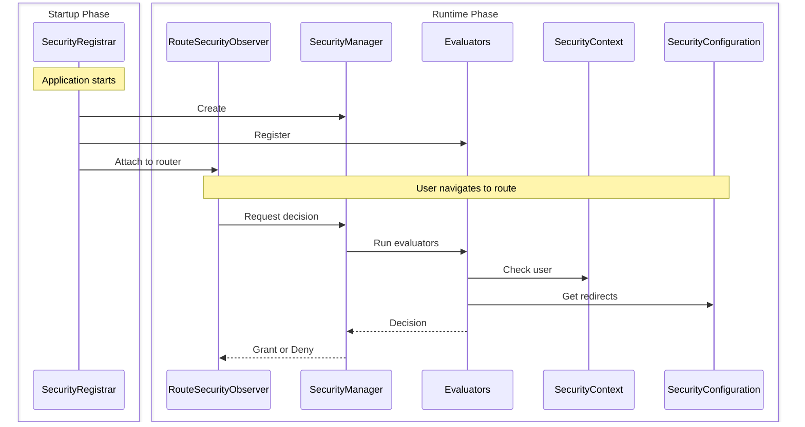

This guide walks through building a complete custom security implementation using session-based authentication. You'll learn how the four core interfaces work together by implementing them from scratch.

:::tip[Most apps should use Spring Security]
The [Spring Security integration](/docs/security/getting-started) auto-configures everything shown here. Only build custom security if you have specific requirements or aren't using Spring Boot.
:::

## What you'll build {#what-youll-build}

A working security system with four classes:

- **SecurityConfiguration** - Defines security behavior and redirect locations
- **SecurityContext** - Tracks who is logged in using HTTP sessions
- **SecurityManager** - Coordinates security checks and provides login/logout
- **SecurityRegistrar** - Wires everything together at app startup

This example uses session-based storage, but you could implement the same interfaces using database queries, LDAP, or any other authentication backend.

## How the pieces work together {#how-the-pieces-work-together}



**Flow:**
1. **SecurityRegistrar** runs at startup, creates the manager, registers evaluators, and attaches the observer
2. **SecurityManager** coordinates everything - it provides the context and configuration to evaluators
3. **SecurityContext** answers "Who is logged in?" by reading from HTTP sessions
4. **SecurityConfiguration** answers "Where to redirect?" for login and access denied pages
5. **Evaluators** make access decisions using the context and configuration

## Step 1: Define security configuration {#step-1-define-security-configuration}

The configuration tells the security system how to behave and where to redirect users:

```java title="SecurityConfiguration.java"
package com.securityplain.security;

import com.webforj.router.history.Location;
import com.webforj.router.security.RouteSecurityConfiguration;
import java.util.Optional;

/**
 * Security configuration for the application.
 *
 * <p>
 * Defines where to redirect users when authentication is required or access is denied.
 * </p>
 */
public class SecurityConfiguration implements RouteSecurityConfiguration {

  @Override
  public boolean isEnabled() {
    return true;
  }

  @Override
  public boolean isSecureByDefault() {
    return false;
  }

  @Override
  public Optional<Location> getAuthenticationLocation() {
    return Optional.of(new Location("/login"));
  }

  @Override
  public Optional<Location> getDenyLocation() {
    return Optional.of(new Location("/access-denied"));
  }
}
```

- `isEnabled() = true` - Security is active
- `isSecureByDefault() = false` - Routes are public unless annotated (use `true` to require authentication on all routes by default)
- `/login` - Where unauthenticated users go
- `/access-denied` - Where authenticated users without permissions go

## Step 2: Implement security context {#step-2-implement-security-context}

The context tracks who is logged in. This implementation uses HTTP sessions to store user information:

<!-- vale off -->

<ExpandableCode title="SecurityContext.java" language="java">
{`package com.securityplain.security;

import com.webforj.Environment;
import com.webforj.router.security.RouteSecurityContext;
import java.util.HashMap;
import java.util.Map;
import java.util.Optional;
import java.util.Set;

/**
 * Simple session-based security context.
 *
 * <p>
 * Stores user principal and roles in HTTP session. This is a minimal implementation for teaching
 * purposes.
 * </p>
 */
public class SecurityContext implements RouteSecurityContext {
  private static final String SESSION_USER_KEY = "security.user";
  private static final String SESSION_ROLES_KEY = "security.roles";
  private static final String SESSION_ATTRS_KEY = "security.attributes";

  /**
   * {@inheritDoc}
   */
  @Override
  public boolean isAuthenticated() {
    return getPrincipal().isPresent();
  }

  /**
   * {@inheritDoc}
   */
  @Override
  public Optional<Object> getPrincipal() {
    return getSessionAttribute(SESSION_USER_KEY);
  }

  /**
   * {@inheritDoc}
   */
  @Override
  public boolean hasRole(String role) {
    Optional<Object> rolesObj = getSessionAttribute(SESSION_ROLES_KEY);
    if (rolesObj.isPresent() && rolesObj.get() instanceof Set) {
      @SuppressWarnings("unchecked")
      Set<String> roles = (Set<String>) rolesObj.get();
      return roles.contains(role);
    }
    return false;
  }

  /**
   * {@inheritDoc}
   */
  @Override
  public boolean hasAuthority(String authority) {
    // In this simple implementation, authorities are the same as roles
    return hasRole(authority);
  }

  /**
   * {@inheritDoc}
   */
  @Override
  public Optional<Object> getAttribute(String name) {
    Optional<Object> attrsObj = getSessionAttribute(SESSION_ATTRS_KEY);
    if (attrsObj.isPresent() && attrsObj.get() instanceof Map) {
      @SuppressWarnings("unchecked")
      Map<String, Object> attrs = (Map<String, Object>) attrsObj.get();
      return Optional.ofNullable(attrs.get(name));
    }
    return Optional.empty();
  }

  /**
   * {@inheritDoc}
   */
  @Override
  public void setAttribute(String name, Object value) {
    Environment.ifPresent(env -> {
      env.getSessionAccessor().ifPresent(accessor -> {
        accessor.access(session -> {
          @SuppressWarnings("unchecked")
          Map<String, Object> attrs =
              (Map<String, Object>) session.getAttribute(SESSION_ATTRS_KEY);
          if (attrs == null) {
            attrs = new HashMap<>();
            session.setAttribute(SESSION_ATTRS_KEY, attrs);
          }
          attrs.put(name, value);
        });
      });
    });
  }

  private Optional<Object> getSessionAttribute(String key) {
    final Object[] result = new Object[1];
    Environment.ifPresent(env -> {
      env.getSessionAccessor().ifPresent(accessor -> {
        accessor.access(session -> {
          result[0] = session.getAttribute(key);
        });
      });
    });
    return Optional.ofNullable(result[0]);
  }
}`}
</ExpandableCode>

<!-- vale on -->

**How it works:**

- `isAuthenticated()` checks if a user principal exists in the session
- `getPrincipal()` retrieves the username from session storage
- `hasRole()` checks if the user's role set contains the specified role
- `getAttribute()` / `setAttribute()` manage custom security attributes
- `Environment.getSessionAccessor()` provides thread-safe session access

## Step 3: Create security manager {#step-3-create-security-manager}

The manager coordinates security decisions. It extends `AbstractRouteSecurityManager` which handles evaluator chains and access denial:

<!-- vale off -->

<ExpandableCode title="SecurityManager.java" language="java">
{`package com.securityplain.security;

import com.webforj.environment.ObjectTable;
import com.webforj.environment.SessionObjectTable;
import com.webforj.router.Router;
import com.webforj.router.security.AbstractRouteSecurityManager;
import com.webforj.router.security.RouteAccessDecision;
import com.webforj.router.security.RouteSecurityConfiguration;
import com.webforj.router.security.RouteSecurityContext;

import java.util.Set;

/**
 * Simple security manager implementation.
 *
 * <p>
 * Provides static methods for login/logout and manages security context.
 * </p>
 */
public class SecurityManager extends AbstractRouteSecurityManager {
  private static final String SESSION_USER_KEY = "security.user";
  private static final String SESSION_ROLES_KEY = "security.roles";

  /**
   * {@inheritDoc}
   */
  @Override
  public RouteSecurityConfiguration getConfiguration() {
    return new SecurityConfiguration();
  }

  /**
   * {@inheritDoc}
   */
  @Override
  public RouteSecurityContext getSecurityContext() {
    return new SecurityContext();
  }

  /**
   * Logs in a user with roles.
   *
   * @param username the username
   * @param password the password
   */
  public RouteAccessDecision login(String username, String password) {
    if ("user".equals(username) && "password".equals(password)) {
      Set<String> roles = Set.of("USER");
      persistUser(username, roles);
      return RouteAccessDecision.grant();
    } else if ("admin".equals(username) && "admin".equals(password)) {
      Set<String> roles = Set.of("USER", "ADMIN");
      persistUser(username, roles);
      return RouteAccessDecision.grant();
    }

    return RouteAccessDecision.deny("Invalid username or password");
  }

  /**
   * Logs out the current user and redirects to login page.
   */
  public void logout() {
    SessionObjectTable.clear(SESSION_USER_KEY);
    SessionObjectTable.clear(SESSION_ROLES_KEY);

    Router router = Router.getCurrent();
    if (router != null) {
      getConfiguration().getAuthenticationLocation().ifPresent(location -> router.navigate(location));
    }
  }

  /**
   * Get the current manager instance.
   *
   * @return the current manager instance
   */
  public static SecurityManager getCurrent() {
    String key = SecurityManager.class.getName();
    if (ObjectTable.contains(key)) {
      return (SecurityManager) ObjectTable.get(key);
    }

    SecurityManager instance = new SecurityManager();
    ObjectTable.put(key, instance);

    return instance;
  }

  void saveCurrent(SecurityManager manager) {
    String key = SecurityManager.class.getName();
    ObjectTable.put(key, manager);
  }

  private void persistUser(String username, Set<String> roles) {
    SessionObjectTable.put(SESSION_USER_KEY, username);
    SessionObjectTable.put(SESSION_ROLES_KEY, roles);
  }
}`}
</ExpandableCode>

<!-- vale on -->

**How it works:**

- Extends `AbstractRouteSecurityManager` to inherit evaluator chain logic
- Provides `getConfiguration()` and `getSecurityContext()` implementations
- Adds `login()` to authenticate users and store credentials in session
- Adds `logout()` to clear session and redirect to login page
- Uses [`SessionObjectTable`](/docs/advanced/object-string-tables#sessionobjecttable) for simple session storage
- Stores itself in [`ObjectTable`](/docs/advanced/object-string-tables#objecttable) for app-wide access

## Step 4: Wire everything at startup {#step-4-wire-everything-at-startup}

The registrar connects all the pieces when the app starts:

```java title="SecurityRegistrar.java"
package com.securityplain.security;

import com.webforj.App;
import com.webforj.AppLifecycleListener;
import com.webforj.annotation.AppListenerPriority;
import com.webforj.router.Router;
import com.webforj.router.security.RouteSecurityObserver;
import com.webforj.router.security.evaluator.AnonymousAccessEvaluator;
import com.webforj.router.security.evaluator.DenyAllEvaluator;
import com.webforj.router.security.evaluator.PermitAllEvaluator;
import com.webforj.router.security.evaluator.RolesAllowedEvaluator;

/**
 * Registers route security components during application startup.
 *
 * <p>
 * Sets up security manager and evaluators with the router.
 * </p>
 */
@AppListenerPriority(1)
public class SecurityRegistrar implements AppLifecycleListener {

  /**
   * {@inheritDoc}
   */
  @Override
  public void onWillRun(App app) {
    // Create security manager
    SecurityManager securityManager = new SecurityManager();
    securityManager.saveCurrent(securityManager);

    // Register built-in evaluators with priorities
    securityManager.registerEvaluator(new DenyAllEvaluator(), 0);
    securityManager.registerEvaluator(new AnonymousAccessEvaluator(), 1);
    securityManager.registerEvaluator(new PermitAllEvaluator(), 2);
    securityManager.registerEvaluator(new RolesAllowedEvaluator(), 3);

    // Create security observer and attach to router
    RouteSecurityObserver securityObserver = new RouteSecurityObserver(securityManager);
    Router router = Router.getCurrent();
    if (router != null) {
      router.getRenderer().addObserver(securityObserver);
    }
  }
}
```

**Register the listener:**

Create `src/main/resources/META-INF/services/com.webforj.AppLifecycleListener` with:

```text
com.securityplain.security.SecurityRegistrar
```

This registers your [`AppLifecycleListener`](/docs/advanced/lifecycle-listeners) so it runs at app startup.

**How it works:**

- Runs early (`@AppListenerPriority(1)`) to set up security before routes load
- Creates the security manager and stores it globally
- Registers built-in evaluators in priority order (lower numbers run first)
- Creates the observer that intercepts navigation
- Attaches the observer to the router so security checks happen automatically

After this runs, security is active for all navigation.

## Using your implementation {#using-your-implementation}

### Create a login view {#create-a-login-view}

```java title="LoginView.java"
package com.securityplain.views;

import com.securityplain.security.SecurityManager;
import com.webforj.component.Composite;
import com.webforj.component.login.Login;
import com.webforj.router.Router;
import com.webforj.router.annotation.FrameTitle;
import com.webforj.router.annotation.Route;
import com.webforj.router.history.Location;
import com.webforj.router.security.annotation.AnonymousAccess;

@Route("/login")
@FrameTitle("Login")
@AnonymousAccess
public class LoginView extends Composite<Login> {
  private Login self = getBoundComponent();

  public LoginView() {
    self.onSubmit(e -> {
      var result = SecurityManager.getCurrent().login(
        e.getUsername(), e.getPassword()
      );
      
      if (result.isGranted()) {
        Router.getCurrent().navigate(new Location("/"));
      } else {
        self.setError(true);
        self.setEnabled(true);
      }
    });

    self.whenAttached().thenAccept(c -> self.open());
  }
}
```
