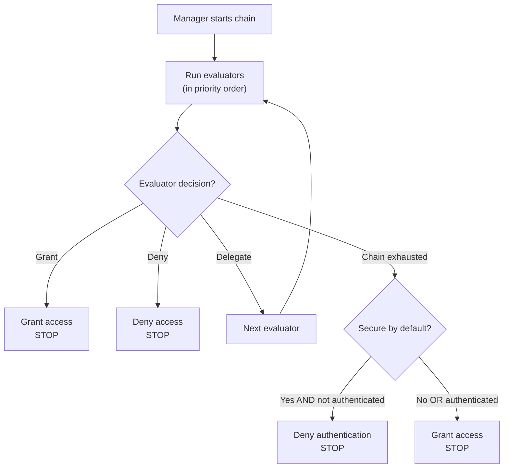

The evaluator chain is the heart of webforJ's security system. It's a priority-ordered sequence of evaluators that examine routes and make access decisions using the chain of responsibility design pattern. Understanding how the chain works helps you create custom evaluators and troubleshoot unexpected access denials.

## The chain of responsibility pattern {#the-chain-of-responsibility-pattern}

The evaluator chain uses the chain of responsibility pattern, where each evaluator in the sequence can either handle a navigation request or pass it to the next evaluator. This creates a system where security logic is distributed across multiple specialized evaluators rather than centralized in a single monolithic checker.

When a route needs evaluation, the security manager creates a chain and starts it at the first evaluator. That evaluator examines the route and makes one of three choices:

1. **Grant access:** The evaluator approves the route and returns immediately. No further evaluators run.
2. **Deny access:** The evaluator blocks the route and returns immediately. No further evaluators run.
3. **Delegate:** The evaluator doesn't make a decision and calls `chain.evaluate()` to pass control to the next evaluator.

This pattern allows evaluators to focus on specific cases. Each evaluator implements `supports(Class<?> routeClass)` to indicate which routes it handles. For example, `AnonymousAccessEvaluator` only runs for routes marked with `@AnonymousAccess`, the manager never invokes it for other routes.

## How the chain is built {#how-the-chain-is-built}

The security manager maintains a list of registered evaluators, each with an associated priority. When a route needs evaluation, the manager sorts evaluators by priority (lower numbers first) and creates a chain.

Evaluators are registered using the manager's `registerEvaluator()` method:

```java
// Register built-in evaluators
securityManager.registerEvaluator(new DenyAllEvaluator(), 0);
securityManager.registerEvaluator(new AnonymousAccessEvaluator(), 1);
securityManager.registerEvaluator(new PermitAllEvaluator(), 2);
securityManager.registerEvaluator(new RolesAllowedEvaluator(), 3);

// Register custom evaluators
securityManager.registerEvaluator(new SubscriptionEvaluator(), 10);
```

Priority determines evaluation order. Lower priorities run first, giving them the first opportunity to make access decisions. This is important for security because it allows critical evaluators to block access before permissive evaluators can grant it.

The chain is stateless and created fresh for each navigation request so that one navigation's evaluation doesn't affect another.

## Chain execution flow {#chain-execution-flow}

When the chain starts, it begins at the first evaluator (lowest priority) and proceeds sequentially:



The chain stops as soon as any evaluator grants or denies access. If all evaluators delegate, the chain exhausts and falls back to secure-by-default behavior.

## Built-in evaluator ordering {#built-in-evaluator-ordering}

Four built-in evaluators handle standard annotations:

| Evaluator | Annotation | Behavior | Chain Behavior | Typical Order |
|-----------|------------|----------|----------------|---------------|
| `DenyAllEvaluator` | `@DenyAll` | Always blocks access | Stops chain (terminal) | Runs first |
| `AnonymousAccessEvaluator` | `@AnonymousAccess` | Allows everyone (authenticated or not) | Stops chain (terminal) | Runs early |
| `PermitAllEvaluator` | `@PermitAll` | Requires authentication, allows all authenticated users | Stops chain (terminal) | Runs mid-chain |
| `RolesAllowedEvaluator` | `@RolesAllowed` | Requires authentication and specific role | **Continues chain** (composable) | Runs later |

:::note
Exact priority numbers are assigned during evaluator registration and differ between implementations. See [Spring Security](/docs/security/getting-started) or [Custom Implementation](/docs/security/architecture/custom-implementation) for specific values.
:::

## How evaluators delegate {#how-evaluators-delegate}

Before invoking an evaluator, the manager calls its `supports(Class<?> routeClass)` method. Only evaluators returning `true` are invoked. This filtering forces evaluators to only run for routes they're designed to handle.

When an evaluator is invoked, it can either:
- **Make a decision**: Return grant or deny to stop the chain
- **Delegate**: Call `chain.evaluate()` to pass control to the next evaluator in the priority sequence

For example, `RolesAllowedEvaluator` checks if the user has the required role. If yes, it calls `chain.evaluate()` to allow further checks by higher-priority evaluators. This active delegation enables evaluator composition.

Terminal evaluators like `PermitAllEvaluator` make final decisions without calling the chain, preventing further evaluation.

## When the chain exhausts {#when-the-chain-exhausts}

If every evaluator delegates and none makes a decision, the chain exhausts, there are no more evaluators to run. At this point, the security system applies a fallback based on the `isSecureByDefault()` configuration:

**Secure by default enabled** (`isSecureByDefault() == true`):
- If user is authenticated: Grant access
- If user isn't authenticated: Deny with authentication required

**Secure by default disabled** (`isSecureByDefault() == false`):
- Grant access regardless of authentication

Routes without any security annotations still have defined behavior. With secure-by-default enabled, unannotated routes require authentication. With it disabled, unannotated routes are public.

## Custom evaluator priorities {#custom-evaluator-priorities}

When creating custom evaluators, choose priorities carefully:

- **0-9**: Reserved for core framework evaluators. Avoid using these priorities unless you're replacing built-in evaluators.
- **10-99**: Recommended for custom business logic evaluators. These run after core evaluators but before generic fallbacks.

Example:

```java title="SubscriptionEvaluator.java"
// Custom evaluator for subscription-based access
@RegisteredEvaluator(priority = 10)
public class SubscriptionEvaluator implements RouteSecurityEvaluator {
  @Override
  public boolean supports(Class<?> routeClass) {
    return routeClass.isAnnotationPresent(RequiresSubscription.class);
  }

  @Override
  public RouteAccessDecision evaluate(Class<?> routeClass,
                                       NavigationContext context,
                                       RouteSecurityContext securityContext,
                                       SecurityEvaluatorChain chain) {
    // Check if the user has an active subscription
    boolean hasSubscription = checkSubscription(securityContext);

    if (!hasSubscription) {
      return RouteAccessDecision.deny("Active subscription required");
    }

    // User has subscription - continue chain for additional checks
    return chain.evaluate(routeClass, context, securityContext);
  }
}
```

This evaluator runs at priority 10, after core evaluators. If the user has an active subscription, it delegates to the chain, allowing composition with other evaluators.

## Evaluator composition {#evaluator-composition}

Most built-in evaluators are **terminal**, they make a final decision and stop the chain. Only `RolesAllowedEvaluator` continues the chain after granting access, allowing composition with custom evaluators.

**Terminal evaluators (can't be composed):**
- `@DenyAll`: Always denies, stops chain
- `@AnonymousAccess`: Always grants, stops chain
- `@PermitAll`: Grants to authenticated users, stops chain

**Composable evaluators:**
- `@RolesAllowed`: If user has role, **continues chain** to allow further checks

### Composition that works {#composition-that-works}

You can compose `@RolesAllowed` with custom evaluators:

```java
@Route("/premium-admin")
@RolesAllowed("ADMIN")  // Checks role, then continues chain
@RequiresSubscription   // Custom check runs after role check
public class PremiumAdminView extends Composite<Div> {
  // Requires ADMIN role AND active subscription
}
```

Flow:
1. `RolesAllowedEvaluator` checks if the user has the `ADMIN` role
2. If yes, calls `chain.evaluate()` to continue
3. `SubscriptionEvaluator` checks subscription status (runs later in chain)
4. If the subscription is active, grants access; otherwise denies

### Composition that doesn't work {#composition-that-does-not-work}

You **can't** combine `@PermitAll` with other evaluators because it stops the chain:

```java
@Route("/wrong")
@PermitAll           // Grants immediately, stops the chain
@RolesAllowed("ADMIN")  // NEVER runs!
public class WrongView extends Composite<Div> {
  // This grants access to ANY authenticated user
  // @RolesAllowed is ignored
}
```

`PermitAllEvaluator` runs first (registered with lower priority), grants access to any authenticated user, and returns without calling `chain.evaluate()`. The `RolesAllowedEvaluator` never executes.
