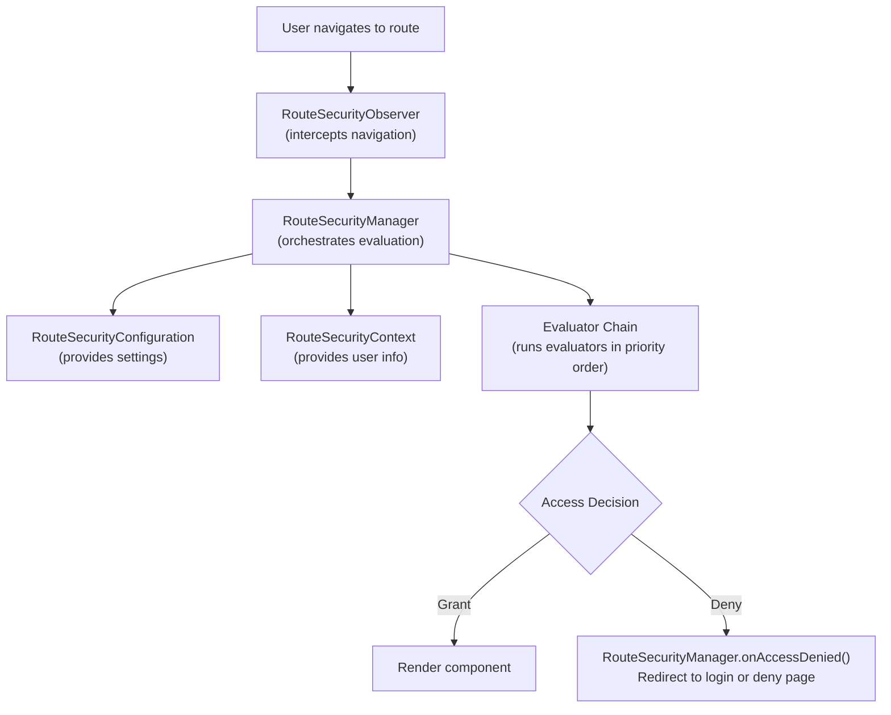

The webforJ security system is built on a foundation of core interfaces that work together to provide route-level access control. These interfaces define the contracts for security behavior, allowing different implementations, whether session-based, based on JSON Web Tokens (JWT), LDAP-integrated, or database-backed, to plug into the same underlying framework.

Understanding this architecture helps you see how security annotations like `@RolesAllowed` and `@PermitAll` are evaluated, how navigation interception works, and how you can build custom security implementations for your specific needs.

## The core interfaces {#the-four-core-interfaces}

The security foundation is built on key abstractions, each with a specific responsibility:

### `RouteSecurityManager` {#routesecuritymanager}

The `RouteSecurityManager` is the central coordinator of the security system. It manages security evaluators, orchestrates the evaluation process, and handles access denial by redirecting users to appropriate pages.

**Responsibilities:**

- Register and manage security evaluators with priorities
- Coordinate the evaluation process when a user navigates to a route
- Handle access denial by triggering redirects to login or access denied pages
- Store and retrieve pre-authentication locations for post-login redirects

```java
public interface RouteSecurityManager {
  RouteAccessDecision evaluate(Class<?> routeClass, NavigationContext context);
  void onAccessDenied(RouteAccessDecision decision, NavigationContext context);
  RouteSecurityContext getSecurityContext();
  RouteSecurityConfiguration getConfiguration();
  void registerEvaluator(RouteSecurityEvaluator evaluator, int priority);
  Optional<Location> consumePreAuthenticationLocation();
}
```

The manager doesn't make security decisions itself, it delegates to evaluators and configuration. It's the glue that connects all security components.

### `RouteSecurityContext` {#routesecuritycontext}

The `RouteSecurityContext` provides access to the current user's authentication state. It answers questions like whether the user is authenticated, what their username is, and whether they have the `ADMIN` role.

**Responsibilities:**

- Determine if the current user is authenticated
- Provide the user's principal (typically their username or user object)
- Check if the user has specific roles or authorities
- Store and retrieve custom security attributes

```java
public interface RouteSecurityContext {
  boolean isAuthenticated();
  Optional<Object> getPrincipal();
  boolean hasRole(String role);
  boolean hasAuthority(String authority);
  Optional<Object> getAttribute(String name);
  void setAttribute(String name, Object value);
}
```

Implementations vary based on the authentication system, HTTP session storage, JWT tokens decoded from headers, database queries, LDAP lookups, or other mechanisms.

### `RouteSecurityConfiguration` {#routesecurityconfiguration}

The `RouteSecurityConfiguration` defines security behavior and redirect locations. It tells the security system where to send users when authentication is required or access is denied.

**Responsibilities:**

- Define whether security is enabled
- Specify secure-by-default behavior
- Provide authentication page location (typically `/login`)
- Provide access denied page location

```java
public interface RouteSecurityConfiguration {
  default boolean isEnabled() { return true; }
  default boolean isSecureByDefault() { return true; }
  default Optional<Location> getAuthenticationLocation() {
    return Optional.of(new Location("/login"));
  }
  default Optional<Location> getDenyLocation() { /* ... */ }
}
```

This interface separates security policy from security enforcement. You can change redirect locations or toggle secure-by-default without modifying the manager or evaluators.

### `RouteSecurityEvaluator` {#routesecurityevaluator}

The `RouteSecurityEvaluator` is where actual security rules are checked. Each evaluator examines a route and decides whether to grant access, deny access, or delegate the decision to the next evaluator in the chain.

**Responsibilities:**

- Determine if this evaluator handles the given route
- Evaluate security annotations on the route class
- Grant access, deny access, or delegate to the next evaluator
- Participate in the chain of responsibility pattern

```java
public interface RouteSecurityEvaluator {
  RouteAccessDecision evaluate(Class<?> routeClass,
                                NavigationContext context,
                                RouteSecurityContext securityContext,
                                SecurityEvaluatorChain chain);
  default boolean supports(Class<?> routeClass) { return true; }
}
```

Built-in evaluators handle standard annotations like `@RolesAllowed`, `@PermitAll`, `@DenyAll`, and `@AnonymousAccess`. You can create custom evaluators to implement domain-specific security logic.

## How the interfaces work together {#how-the-interfaces-work-together}

These four interfaces collaborate during navigation to enforce security rules:



When a user navigates, the `RouteSecurityObserver` intercepts the navigation and asks the `RouteSecurityManager` to evaluate access. The manager consults the `RouteSecurityConfiguration` for settings, gets user information from the `RouteSecurityContext`, and runs each `RouteSecurityEvaluator` in priority order until one makes a decision.

## Interfaces as contracts {#the-interfaces-as-contracts}

Each interface defines a contract, a set of questions the security system needs answered. **How** you answer those questions is your implementation choice:

**`RouteSecurityContext` contract:**

- "Is the current user authenticated?" (`isAuthenticated()`)
- "Who is the user?" (`getPrincipal()`)
- "Does the user have role X?" (`hasRole()`)

You decide where this information comes from HTTP sessions, JWT tokens decoded from headers, database lookups, LDAP queries, or any other authentication backend.

**`RouteSecurityConfiguration` contract:**

- "Is security enabled?" (`isEnabled()`)
- "Should routes be secure by default?" (`isSecureByDefault()`)
- "Where should unauthenticated users go?" (`getAuthenticationLocation()`)

You decide how to source these values: hardcoded, from configuration files, from environment variables, from a database, or computed dynamically.

**`RouteSecurityManager` contract:**

- "Should this user access this route?" (`evaluate()`)
- "What happens when access is denied?" (`onAccessDenied()`)
- "What evaluators should run?" (`registerEvaluator()`)

You decide the authentication flow, where to store pre-authentication locations, and how to handle custom denial scenarios.

The foundation architecture defines these contracts, but implementation is flexible. Different systems can implement these interfaces in entirely different ways based on specific requirements.

## The `AbstractRouteSecurityManager` base class {#the-abstractroutesecuritymanager-base-class}

Most implementations don't implement `RouteSecurityManager` directly. Instead, they extend `AbstractRouteSecurityManager`, which provides:

- Evaluator registration and priority-based sorting
- Chain execution logic
- Access denial handling with automatic redirects
- Pre-authentication location storage in HTTP session
- Secure-by-default fallback behavior

The base class implements the `RouteSecurityManager` interface and provides concrete implementations for evaluator management, access evaluation, and denial handling. Subclasses only need to provide the security context and configuration. The base class handles evaluator management, chain execution, and denial handling automatically.