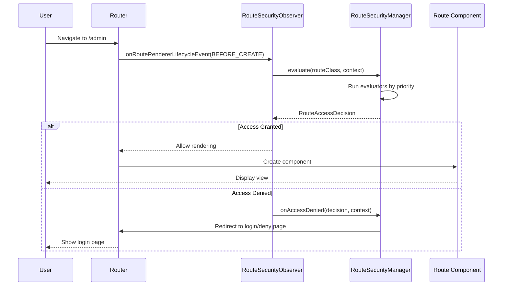

Security enforcement in webforJ happens automatically during navigation. When a user clicks a link or navigates to a route, the security system intercepts the navigation, evaluates access rules, and either allows the navigation to proceed or redirects the user to an appropriate page. This interception is invisible to users and requires no manual security checks in your component code.

Understanding how navigation interception works helps you troubleshoot security issues and build custom navigation logic that integrates with the security system.

## The `RouteSecurityObserver` {#the-routesecurityobserver}

The `RouteSecurityObserver` is a navigation observer that hooks into the router's lifecycle. It listens for navigation events and evaluates security rules before any component is rendered.

The observer is attached to the router's renderer during app startup:

```java
// Create the observer with your security manager
RouteSecurityObserver observer = new RouteSecurityObserver(securityManager);

// Attach it to the router's renderer
Router router = Router.getCurrent();
if (router != null) {
  router.getRenderer().addObserver(observer);
}
```

Once attached, the observer intercepts every navigation request. The observer sits between navigation requests and component rendering, when navigation begins, it asks the security manager to evaluate access. Only if access is granted does the component render.

## Navigation interception flow {#navigation-interception-flow}

When a user navigates to a route, the following sequence occurs:



This flow shows that security evaluation happens before any sensitive route code executes. If access is denied, the component never instantiates, preventing unauthorized users from triggering business logic or accessing protected data.

## Interception points {#interception-points}

The observer intercepts navigation at a specific point in the routing lifecycle:

**Before rendering** The observer's `onRouteRendererLifecycleEvent()` method is called with the `LifecycleEvent.BEFORE_CREATE` event after the route is resolved but before the component is created. This is the critical security checkpoint.

At this point, the router knows which route class will be rendered, but the route hasn't been instantiated yet. The observer can evaluate security annotations on the class without executing route logic.

If access is denied, the observer prevents rendering and triggers a redirect. The original route never instantiates.

## The evaluation process {#the-evaluation-process}

When the observer intercepts navigation, it delegates evaluation to the security manager. The observer retrieves the route class from the navigation context and asks the manager to evaluate access. If the decision grants access, navigation proceeds normally. If the decision denies access, the observer stops propagation to prevent rendering and lets the manager handle the denial.

The manager coordinates the evaluation by:

1. Checking if security is enabled in the configuration
2. Obtaining the current security context (user information)
3. Running the evaluator chain in priority order
4. Returning the final access decision

The observer acts on the decision: if granted, navigation proceeds; if denied, the observer stops propagation and lets the manager handle the denial.

## How access decisions are made {#how-access-decisions-are-made}

The security manager creates an evaluator chain and runs each evaluator in priority order. Evaluators can make three types of decisions:

- **Grant access:** The evaluator approves the navigation, and the route renders. No further evaluators are consulted. The evaluator returns a decision indicating access is granted.

- **Deny access:** The evaluator blocks the navigation. The observer stops rendering and triggers a redirect. The evaluator returns a denial decision, optionally with a reason message. Denial can be due to lack of authentication (requiring login) or lack of authorization (insufficient permissions).

- **Delegate to the next evaluator:** The evaluator doesn't make a decision and passes control to the next evaluator in the chain. The evaluator calls the chain's evaluate method, which advances to the next evaluator in priority order.

Most evaluators only handle routes with specific annotations. For example, `RolesAllowedEvaluator` only evaluates routes annotated with `@RolesAllowed`. If the annotation isn't present, it delegates to the next evaluator.

## Handling access denial {#handling-access-denial}

When access is denied, the manager's `onAccessDenied()` method handles the denial based on the denial type:

- **Authentication required:** User isn't logged in. Redirect to the login page configured in `RouteSecurityConfiguration.getAuthenticationLocation()`.

- **Access denied:** User is logged in but lacks permissions. Redirect to the access denied page configured in `RouteSecurityConfiguration.getDenyLocation()`.

Before redirecting, the manager stores the originally requested location in the HTTP session. After successful login, this location can be retrieved using the manager's `consumePreAuthenticationLocation()` method, which returns the stored location and clears it from the session. If a location was stored, the app can navigate there; otherwise, it navigates to a default page.

## When security is disabled {#when-security-is-disabled}

If `RouteSecurityConfiguration.isEnabled()` returns `false`, the manager bypasses all evaluation and immediately grants access to every route. The evaluator chain never runs, and no security checks occur.

This is useful during development or for applications that don't require security. You can toggle security on and off without removing annotations or unregistering the observer.

## Integration with navigation lifecycle {#integration-with-navigation-lifecycle}

The security observer integrates with the broader [navigation lifecycle](/docs/routing/navigation-lifecycle/overview), where multiple observers can hook into navigation events. Security evaluation happens early in this lifecycle, before navigation blocking or component lifecycle events.

If you implement custom navigation observers, be aware that security evaluation occurs first. If access is denied, your observer's `onRouteRendererLifecycleEvent()` won't be called with `BEFORE_CREATE` because navigation is stopped.
