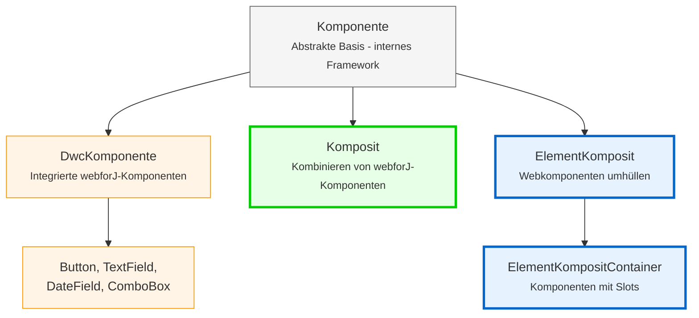

<DocChip chip='since' label='23.05' />
<JavadocLink type="foundation" location="com/webforj/component/Component" top='true'/> 

Bevor Sie benutzerdefinierte Komponenten in webforJ erstellen, ist es wichtig, die grundlegende Architektur zu verstehen, die beeinflusst, wie Komponenten funktionieren. Dieser Artikel erklärt die Komponentenhierarchie, die Identität von Komponenten, Lebenszykluskonzepte und wie Schnittstellen Anliegen Komponentenfähigkeiten bereitstellen.

## Verständnis der Komponentenhierarchie

webforJ organisiert Komponenten in eine Hierarchie mit zwei Gruppen: interne Klassen des Frameworks, die Sie niemals erweitern sollten, und Klassen, die speziell für den Bau benutzerdefinierter Komponenten entwickelt wurden. In diesem Abschnitt wird erklärt, warum webforJ Komposition anstelle von Vererbung verwendet und was jede Ebene der Hierarchie bereitstellt.

### Warum Komposition statt Erweiterung?

In webforJ sind integrierte Komponenten wie [`Button`](../components/button) und [`TextField`](../components/fields/textfield) finale Klassen – Sie können sie nicht erweitern:

```java
// Das wird in webforJ nicht funktionieren
public class MyButton extends Button {
    // Button ist final - kann nicht erweitert werden 
}
```

webforJ verwendet **Komposition über Vererbung**. Anstatt vorhandene Komponenten zu erweitern, erstellen Sie eine Klasse, die `Composite` erweitert und Komponenten darin kombiniert. `Composite` fungiert als Container, der eine einzelne Komponente (die gebundene Komponente) umhüllt und es Ihnen ermöglicht, eigene Komponenten und Verhaltensweisen hinzuzufügen.

```java
public class SearchBar extends Composite<FlexLayout> {
    private TextField searchField;
    private Button searchButton;
    
    public SearchBar() {
        searchField = new TextField("Suche");
        searchButton = new Button("Los");
        
        getBoundComponent()
            .setDirection(FlexDirection.ROW)
            .add(searchField, searchButton);
    }
}
```

### Warum Sie integrierte Komponenten nicht erweitern können

webforJ-Komponenten sind als final gekennzeichnet, um die Integrität der zugrunde liegenden clientseitigen Webkomponente zu wahren. Das Erweitern von webforJ-Komponentenklassen würde Kontrolle über die zugrunde liegende Webkomponente gewähren, was zu unbeabsichtigten Konsequenzen führen und die Konsistenz und Vorhersagbarkeit des Verhaltens von Komponenten gefährden könnte.

Für eine ausführliche Erklärung siehe [Final Classes and Extension Restrictions](https://docs.webforj.com/docs/architecture/controls-components#final-classes-and-extension-restrictions) in der Architekturdokumentation.

### Die Komponentenhierarchie



**Klassen für Entwickler (verwenden Sie diese):**
- **Composite**
- **ElementComposite**
- **ElementCompositeContainer**

**Interne Framework-Klassen (niemals direkt erweitern):**
- **Komponente**
- **DwcKomponente**

:::warning[Niemals `Komponente` oder `DwcKomponente` direkt erweitern]
Erweitern Sie niemals `Komponente` oder `DwcKomponente` direkt. Alle integrierten Komponenten sind final. Verwenden Sie immer Kompositionsmuster mit `Composite` oder `ElementComposite`.

Versuche, `DwcKomponente` zu erweitern, führen zu einer Laufzeitausnahme.
:::

## Schnittstellensorgen: Hinzufügen von Fähigkeiten zu Ihren Komponenten

Schnittstellensorgen sind Java-Schnittstellen, die spezifische Fähigkeiten zu Ihren Komponenten hinzufügen. Jedes Interface fügt eine Gruppe verwandter Methoden hinzu. Zum Beispiel fügt `HasSize` Methoden zur Steuerung von Breite und Höhe hinzu, während `HasFocus` Methoden zum Verwalten des Fokusstatus hinzufügt.

Wenn Sie eine Schnittstellensorge bei Ihrer Komponente implementieren, erhalten Sie Zugang zu diesen Fähigkeiten, ohne Implementierungscode schreiben zu müssen. Das Interface bietet Standardimplementierungen, die automatisch funktionieren.

Die Implementierung von Schnittstellensorgen gibt Ihren benutzerdefinierten Komponenten die gleichen APIs wie integrierte webforJ-Komponenten:

```java
// Implementieren Sie HasSize, um Breiten-/Höhenmethoden automatisch zu erhalten
public class SizedCard extends Composite<Div> implements HasSize<SizedCard> {
    
    public SizedCard() {
        getBoundComponent().setText("Inhalt der Karte");
    }
    
    // Keine Notwendigkeit, diese zu implementieren - Sie bekommen sie kostenlos:
    // setWidth(), setHeight(), setSize()
}

// Verwenden Sie es wie jede webforJ-Komponente
SizedCard card = new SizedCard();
card.setWidth("300px")
    .setHeight("200px");
```

Das Composite leitet diese Aufrufe automatisch an das zugrunde liegende `Div` weiter. Kein zusätzlicher Code erforderlich.

**Häufige Schnittstellensorgen:**
- `HasSize` - `setWidth()`, `setHeight()`, `setSize()`
- `HasFocus` - `focus()`, `setFocusable()`, Fokusereignisse
- `HasClassName` - `addClassName()`, `removeClassName()`
- `HasStyle` - `setStyle()`, Inline-CSS-Management
- `HasVisibility` - `setVisible()`, Sichtbar-/Unsichtbarfähigkeit
- `HasText` - `setText()`, Textinhaltverwaltung
- `HasAttribute` - `setAttribute()`, HTML-Attributverwaltung

:::warning
Wenn die zugrunde liegende Komponente die Schnittstellensorgfähigkeit nicht unterstützt, erhalten Sie eine Laufzeitausnahme. Stellen Sie in diesem Fall Ihre eigene Implementierung bereit.
:::

Für eine vollständige Liste der verfügbaren Schnittstellensorgen siehe die [webforJ JavaDoc](https://javadoc.io/doc/com.webforj/webforj-foundation/latest/com/webforj/concern/package-summary.html).

## Übersicht über den Lebenszyklus der Komponenten

webforJ verwaltet den Lebenszyklus der Komponenten automatisch. Das Framework kümmert sich um die Erstellung, Anhang und Zerstörung von Komponenten, ohne dass manuelles Eingreifen erforderlich ist.

**Lebenszyklus-Hooks** sind verfügbar, wenn Sie sie benötigen:
- `onDidCreate()` - Wird aufgerufen, nachdem die Komponente an das DOM angehängt wurde
- `onDidDestroy()` - Wird aufgerufen, wenn die Komponente zerstört wird

Diese Hooks sind **optional**. Verwenden Sie sie, wenn Sie müssen:
- Ressourcen bereinigen (Intervalle stoppen, Verbindungen schließen)
- Komponenten initialisieren, die eine DOM-Anbindung benötigen
- Integrieren mit clientseitigem JavaScript

In den meisten einfachen Fällen können Sie Komponenten direkt im Konstruktor initialisieren. Verwenden Sie Lebenszyklus-Hooks wie `onDidCreate()`, um Arbeiten bei Bedarf zu verzögern.
