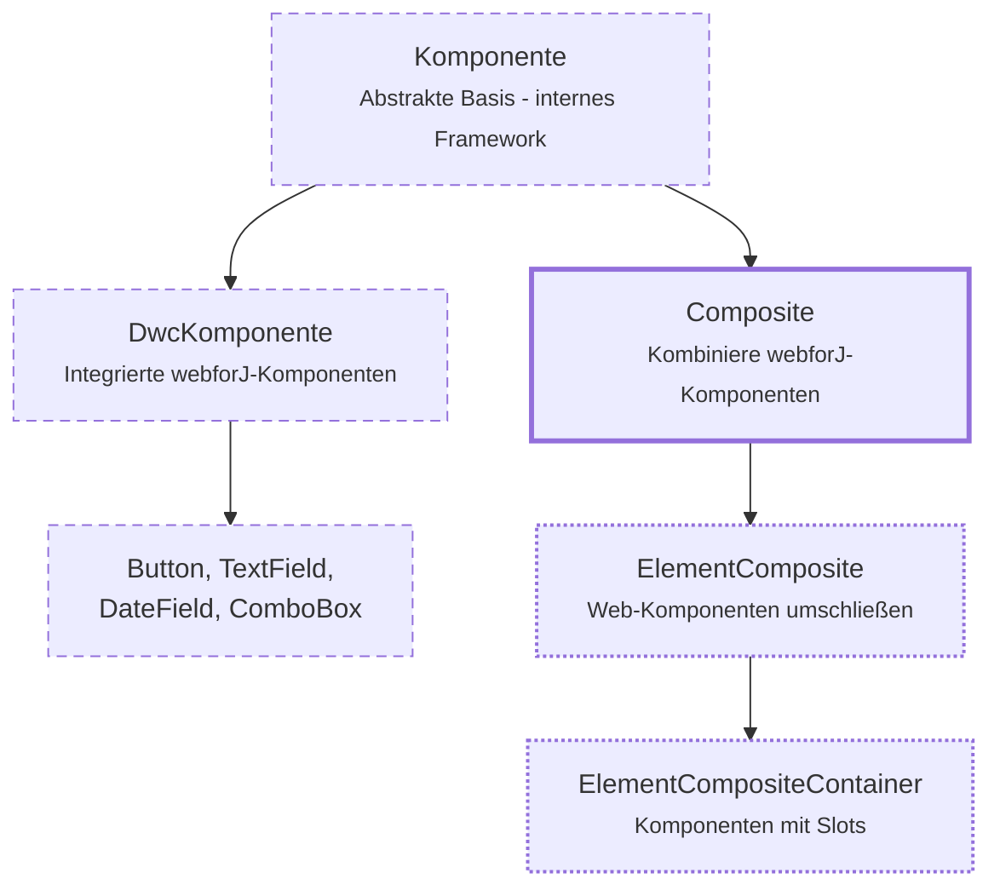

<JavadocLink type="foundation" location="com/webforj/component/Component" top='true'/> 

Bevor Sie benutzerdefinierte Komponenten in webforJ erstellen, ist es wichtig, die grundlegende Architektur zu verstehen, die prägt, wie Komponenten funktionieren. Dieser Artikel erklärt die Komponentenhierarchie, die Identität der Komponenten, Lebenszykluskonzepte und wie Schnittstellen für Belange die Fähigkeiten von Komponenten bereitstellen.

## Verständnis der Komponentenhierarchie {#understanding-the-component-hierarchy}

webforJ organisiert Komponenten in eine Hierarchie mit zwei Gruppen: interne Klassen des Frameworks, die Sie niemals erweitern sollten, und Klassen, die speziell für den Bau benutzerdefinierter Komponenten entwickelt wurden. In diesem Abschnitt wird erläutert, warum webforJ Komposition über Vererbung priorisiert und was jede Ebene der Hierarchie bietet.

### Warum Komposition statt Erweiterung? {#why-composition-instead-of-extension}

In webforJ sind integrierte Komponenten wie [`Button`](../components/button) und [`TextField`](../components/fields/textfield) finale Klassen – Sie können sie nicht erweitern:

```java
// Das funktioniert nicht in webforJ
public class MyButton extends Button {
  // Button ist final - kann nicht erweitert werden 
}
```

webforJ verwendet **Komposition über Vererbung**. Anstatt vorhandene Komponenten zu erweitern, erstellen Sie eine Klasse, die `Composite` erweitert und kombiniert Komponenten darin. `Composite` fungiert als Container, der eine einzelne Komponente (die gebundene Komponente) umschließt und es Ihnen ermöglicht, Ihre eigenen Komponenten und Verhaltensweisen hinzuzufügen.

```java
public class SearchBar extends Composite<FlexLayout> {
  private final FlexLayout self = getBoundComponent();
  private TextField searchField;
  private Button searchButton;
  
  public SearchBar() {
    searchField = new TextField("Suchen");
    searchButton = new Button("Los");
    
    self.setDirection(FlexDirection.ROW)
      .add(searchField, searchButton);
  }
}
```

### Warum Sie integrierte Komponenten nicht erweitern können {#why-you-cant-extend-built-in-components}

webforJ-Komponenten sind als final markiert, um die Integrität der zugrunde liegenden Client-seitigen Web-Komponente zu wahren. Die Erweiterung von webforJ-Komponentenklassen würde Kontrolle über die zugrunde liegende Web-Komponente gewähren, was zu ungewollten Konsequenzen führen und die Konsistenz und Vorhersehbarkeit des Verhaltens von Komponenten gefährden könnte.

Für eine detaillierte Erklärung siehe [Finale Klassen und Erweiterungsbeschränkungen](https://docs.webforj.com/docs/architecture/controls-components#final-classes-and-extension-restrictions) in der Architektur-Dokumentation.

### Die Komponentenhierarchie {#the-component-hierarchy}

<div style={{textAlign: 'center'}}>

```mermaid
graph TD
  A[Komponente<br/><small>Abstrakte Basis - internes Framework</small>]
  
  A --> B[DwcKomponente<br/><small>Integrierte webforJ-Komponenten</small>]
  A --> C[Composite<br/><small>Kombiniere webforJ-Komponenten</small>]
  
  B --> E[Button, TextField,<br/>DateField, ComboBox]
  
  C --> D[ElementComposite<br/><small>Web-Komponenten umschließen</small>]
  D --> F[ElementCompositeContainer<br/><small>Komponenten mit Slots</small>]

  classDef internal stroke-dasharray:6 4,stroke-width:1px
  classDef primary stroke-width:3px
  classDef secondary stroke-width:2px,stroke-dasharray:2 2
  class A,B,E internal
  class C primary
  class D,F secondary
```
</div>

Klassen für Entwickler (verwenden Sie diese):
- `Composite`
- `ElementComposite`
- `ElementCompositeContainer`

Interne Framework-Klassen (niemals direkt erweitern):
- `Component`
- `DwcComponent`

:::warning[Never extend `Component` or `DwcComponent`]
Erweitern Sie niemals `Component` oder `DwcComponent` direkt. Alle integrierten Komponenten sind final. Verwenden Sie immer Kompositionsmuster mit `Composite` oder `ElementComposite`.

Der Versuch, `DwcComponent` zu erweitern, wird eine Laufzeitausnahme auslösen.
:::

## Belang-Schnittstellen {#concern-interfaces}

Belang-Schnittstellen sind Java-Schnittstellen, die spezifische Fähigkeiten für Ihre Komponenten bereitstellen. Jede Schnittstelle fügt eine Reihe verwandter Methoden hinzu. Zum Beispiel fügt `HasSize` Methoden zur Steuerung von Breite und Höhe hinzu, während `HasFocus` Methoden zur Verwaltung des Fokusstatus hinzufügt.

Wenn Sie eine Belang-Schnittstelle für Ihre Komponente implementieren, erhalten Sie Zugriff auf diese Fähigkeiten, ohne Implementierungscode schreiben zu müssen. Die Schnittstelle bietet Standardimplementierungen, die automatisch funktionieren.

Die Implementierung von Belang-Schnittstellen verleiht Ihren benutzerdefinierten Komponenten die gleichen APIs wie den integrierten webforJ-Komponenten:

```java
// Implementieren Sie HasSize, um Breiten-/Höhenmethoden automatisch zu erhalten
public class SizedCard extends Composite<Div> implements HasSize<SizedCard> {
  private final Div self = getBoundComponent();
  
  public SizedCard() {
    self.setText("Inhalt der Karte");
  }
  
  // Diese müssen nicht implementiert werden - Sie erhalten sie kostenlos:
  // setWidth(), setHeight(), setSize()
}

// Verwenden Sie es wie jede webforJ-Komponente
SizedCard card = new SizedCard();
card.setWidth("300px")
  .setHeight("200px");
```

Die Komponente leitet diese Aufrufe automatisch an das zugrunde liegende `Div` weiter. Kein zusätzlicher Code erforderlich.

### Erscheinungsbild {#concern-interfaces-appearance}

Diese Schnittstellen steuern die visuelle Präsentation einer Komponente, einschließlich ihrer Dimensionen, Sichtbarkeit, Stil und Thema.

| Schnittstelle | Beschreibung |
|---|---|
| `HasSize` | Kontrolliert Breite und Höhe, einschließlich Mindest- und Höchstgrenzen. Erweitert `HasWidth`, `HasHeight` und deren min/max Varianten. |
| `HasVisibility` | Zeigt oder verbirgt die Komponente, ohne sie aus dem Layout zu entfernen. |
| `HasClassName` | Verwalten von CSS-Klassennamen des Wurzelelements der Komponente. |
| `HasStyle` | Wendet Inline-CSS-Stile an und entfernt sie. |
| `HasHorizontalAlignment` | Kontrolliert, wie der Inhalt horizontal innerhalb der Komponente ausgerichtet ist. |
| `HasExpanse` | Setzt die Größenvariante der Komponente unter Verwendung der Standard-Expansions-Tokens (`XSMALL` bis `XLARGE`). |
| `HasTheme` | Wendet eine Themenvariante wie `DEFAULT`, `PRIMARY` oder `DANGER` an. |
| `HasPrefixAndSuffix` | Fügt Komponenten zum Präfix- oder Suffix-Slot innerhalb der Komponente hinzu. |

### Inhalt {#concern-interfaces-content}

Diese Schnittstellen verwalten, was eine Komponente anzeigt, einschließlich Text, HTML, Labels, Hinweise und anderer beschreibender Inhalte.

| Schnittstelle | Beschreibung |
|---|---|
| `HasText` | Setzt und ruft den reinen Textinhalt der Komponente ab. |
| `HasHtml` | Setzt und ruft das innere HTML der Komponente ab. |
| `HasLabel` | Fügt ein beschreibendes Label hinzu, das mit der Komponente verbunden ist und für die Zugänglichkeit verwendet wird. |
| `HasHelperText` | Zeigt sekundären Hinweistext unter der Komponente an. |
| `HasPlaceholder` | Setzt Platzhaltertext, der angezeigt wird, wenn die Komponente keinen Wert hat. |
| `HasTooltip` | Fügt ein Tooltip hinzu, das beim Hover erscheint. |

### Zustand {#concern-interfaces-state}

Diese Schnittstellen steuern den interaktiven Zustand einer Komponente, einschließlich, ob sie aktiviert, bearbeitbar, erforderlich oder beim Laden im Fokus ist.

| Schnittstelle | Beschreibung |
|---|---|
| `HasEnablement` | Aktiviert oder deaktiviert die Komponente. |
| `HasReadOnly` | Versetzt die Komponente in einen schreibgeschützten Zustand, in dem der Wert sichtbar ist, aber nicht geändert werden kann. |
| `HasRequired` | Markiert die Komponente als erforderlich, typischerweise für die Validierung von Formularen. |
| `HasAutoFocus` | Verschiebt den Fokus beim Laden der Seite automatisch zur Komponente. |

### Fokus {#concern-interfaces-focus}

Diese Schnittstellen steuern, wie eine Komponente den Tastaturfokus erhält und darauf reagiert.

| Schnittstelle | Beschreibung |
|---|---|
| `HasFocus` | Verwalten des Fokusstatus und ob die Komponente den Fokus erhalten kann. |
| `HasFocusStatus` | Überprüft, ob die Komponente derzeit den Fokus hat. Erfordert eine Rückrunde an den Client. |
| `HasHighlightOnFocus` | Kontrolliert, ob der Inhalt der Komponente hervorgehoben wird, wenn sie den Fokus erhält, und wie (`KEY`, `MOUSE`, `KEY_MOUSE`, `ALL` usw.). |

### Eingabebeschränkungen {#concern-interfaces-input-constraints}

Diese Schnittstellen definieren, welche Werte eine Komponente akzeptiert, einschließlich des aktuellen Wertes, zulässiger Bereiche, Längenlimits, Formatmasken und lokal abhängiger Verhaltensweisen.

| Schnittstelle | Beschreibung |
|---|---|
| `HasValue` | Erfassen und Setzen des aktuellen Wertes der Komponente. |
| `HasMin` | Setzt einen minimal zulässigen Wert. |
| `HasMax` | Setzt einen maximal zulässigen Wert. |
| `HasStep` | Setzt die Schrittgröße für numerische oder Bereichseingaben. |
| `HasPattern` | Wendet ein reguläres Ausdrucksmuster an, um akzeptierte Eingaben einzuschränken. |
| `HasMinLength` | Legt die mindestens erforderliche Anzahl von Zeichen im Wert der Komponente fest. |
| `HasMaxLength` | Legt die maximal zulässige Anzahl von Zeichen im Wert der Komponente fest. |
| `HasMask` | Wendet eine Formatmaske auf die Eingabe an. Wird von maskierten Feldkomponenten verwendet. |
| `HasTypingMode` | Kontrolliert, ob eingegebene Zeichen eingefügt oder vorhandene Zeichen überschrieben werden (`INSERT` oder `OVERWRITE`). Wird von maskierten Feldern und `TextArea` verwendet. |
| `HasRestoreValue` | Definiert einen Wert, auf den die Komponente zurückgesetzt wird, wenn der Benutzer die Escape-Taste drückt oder `restoreValue()` aufruft. Wird von maskierten Feldern verwendet. |
| `HasLocale` | Speichert eine komponentenspezifische Locale für lokal abhängige Formatierung. Wird von maskierten Datum- und Uhrzeitfeldern verwendet. |
| `HasPredictedText` | Setzt einen vorhergesagten oder Autocomplete-Textwert. Wird von `TextArea` verwendet, um Inline-Vorschläge zu unterstützen. |

### Validierung {#concern-interfaces-validation}

Diese Schnittstellen fügen clientseitiges Validierungsverhalten hinzu, einschließlich der Markierung von Komponenten als ungültig, der Anzeige von Fehlermeldungen und der Steuerung, wann die Validierung erfolgt.

| Schnittstelle | Beschreibung |
|---|---|
| `HasClientValidation` | Markiert eine Komponente als ungültig, setzt die Fehlermeldung und fügt einen clientseitigen Validator hinzu. |
| `HasClientAutoValidation` | Kontrolliert, ob die Komponente automatisch validiert, während der Benutzer tippt. |
| `HasClientAutoValidationOnLoad` | Kontrolliert, ob die Komponente validiert, wenn sie zuerst geladen wird. |
| `HasClientValidationStyle` | Kontrolliert, wie Validierungsnachrichten angezeigt werden: `INLINE` (unterhalb der Komponente) oder `POPOVER`. |

### DOM-Zugriff {#concern-interfaces-dom-access}

Diese Schnittstellen bieten einen niedrigen Zugriff auf das zugrunde liegende HTML-Element der Komponente und clientseitige Eigenschaften.

| Schnittstelle | Beschreibung |
|---|---|
| `HasAttribute` | Liest und schreibt beliebige HTML-Attribute des Elements der Komponente. |
| `HasProperty` | Liest und schreibt DWC-Komponenten Eigenschaften direkt am Client-Element. |

### i18n {#concern-interfaces-i18n}

Diese Schnittstelle bietet Übersetzungsunterstützung für Komponenten, die lokalisierten Text anzeigen müssen.

| Schnittstelle | Beschreibung |
|---|---|
| `HasTranslation` | Bietet die `t()`-Hilfsmethode zum Auflösen von Übersetzungsschlüsseln in lokalisierte Strings unter Verwendung der aktuellen Locale der App. |

:::warning
Wenn die zugrunde liegende Komponente die Schnittstellenfähigkeit nicht unterstützt, erhalten Sie eine Laufzeitausnahme. Stellen Sie in diesem Fall Ihre eigene Implementierung bereit.
:::

Für eine vollständige Liste der verfügbaren Belang-Schnittstellen siehe die [webforJ JavaDoc](https://javadoc.io/doc/com.webforj/webforj-foundation/latest/com/webforj/concern/package-summary.html).

## Übersicht über den Komponentenlebenszyklus {#component-lifecycle-overview}

webforJ verwaltet den Komponentenlebenszyklus automatisch. Das Framework behandelt die Erstellung, Anhängung und Zerstörung von Komponenten, ohne dass manuelle Eingriffe erforderlich sind.

**Lebenszyklus-Hooks** sind verfügbar, wenn Sie sie benötigen:
- `onDidCreate(T container)` - Wird aufgerufen, nachdem die Komponente an das DOM angeheftet wurde
- `onDidDestroy()` - Wird aufgerufen, wenn die Komponente zerstört wird

Diese Hooks sind **optional**. Verwenden Sie sie, wenn Sie müssen:
- Ressourcen bereinigen (Intervalle stoppen, Verbindungen schließen)
- Komponenten initialisieren, die eine DOM-Anheftung erfordern
- Mit clientseitigem JavaScript integrieren

In den meisten einfachen Fällen können Sie Komponenten direkt im Konstruktor initialisieren. Verwenden Sie Lebenszyklus-Hooks wie `onDidCreate()`, um Arbeiten nach Bedarf zu verschieben.
