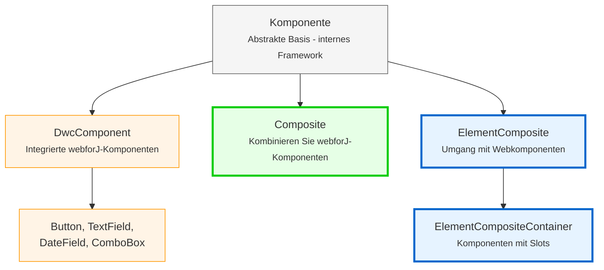

<JavadocLink type="foundation" location="com/webforj/component/Component" top='true'/>

Bevor Sie benutzerdefinierte Komponenten in webforJ erstellen, ist es wichtig, die grundlegende Architektur zu verstehen, die die Funktionsweise der Komponenten prägt. Dieser Artikel erklärt die Komponentenhierarchie, die Identität der Komponenten, Lebenszykluskonzepte und wie Concern-Interfaces Komponentenfähigkeiten bereitstellen.

## Verständnis der Komponentenhierarchie {#understanding-the-component-hierarchy}

webforJ organisiert Komponenten in einer Hierarchie mit zwei Gruppen: internen Framework-Klassen, die Sie niemals erweitern sollten, und Klassen, die speziell für den Bau benutzerdefinierter Komponenten entwickelt wurden. In diesem Abschnitt erfahren Sie, warum webforJ Komposition über Vererbung verwendet und was jede Ebene der Hierarchie bietet.

### Warum Komposition statt Vererbung? {#why-composition-instead-of-extension}

In webforJ sind integrierte Komponenten wie [`Button`](../components/button) und [`TextField`](../components/fields/textfield) finale Klassen – Sie können sie nicht erweitern:

```java
// Das funktioniert nicht in webforJ
public class MyButton extends Button {
    // Button ist final - kann nicht erweitert werden
}
```

webforJ verwendet **Komposition über Vererbung**. Anstatt bestehende Komponenten zu erweitern, erstellen Sie eine Klasse, die `Composite` erweitert und Komponenten darin kombiniert. `Composite` fungiert als Container, der eine einzelne Komponente (die gebundene Komponente) umschließt und es Ihnen ermöglicht, eigene Komponenten und Verhaltensweisen hinzuzufügen.

```java
public class SearchBar extends Composite<FlexLayout> {
    private final FlexLayout self = getBoundComponent();
    private TextField searchField;
    private Button searchButton;
    
    public SearchBar() {
        searchField = new TextField("Suchen");
        searchButton = new Button("Los");
        
        self.setDirection(FlexDirection.ROW)
            .add(searchField, searchButton);
    }
}
```

### Warum Sie integrierte Komponenten nicht erweitern können {#why-you-cant-extend-built-in-components}

webforJ-Komponenten sind als final gekennzeichnet, um die Integrität der zugrunde liegenden clientseitigen Webkomponente zu wahren. Das Erweitern von webforJ-Komponentenklassen würde die Kontrolle über die zugrunde liegende Webkomponente ermöglichen, was zu unbeabsichtigten Konsequenzen führen und die Konsistenz und Vorhersehbarkeit des Verhaltens der Komponenten beeinträchtigen könnte.

Für eine detaillierte Erklärung siehe [Final Classes and Extension Restrictions](https://docs.webforj.com/docs/architecture/controls-components#final-classes-and-extension-restrictions) in der Architektur-Dokumentation.

### Die Komponentenhierarchie {#the-component-hierarchy}


```mermaid
graph TD
    A[Komponente<br/><small>Abstrakte Basis - internes Framework</small>]
    
    A --> B[DwcComponent<br/><small>Integrierte webforJ-Komponenten</small>]
    A --> C[Composite<br/><small>Kombinieren Sie webforJ-Komponenten</small>]
    A --> D[ElementComposite<br/><small>Umgang mit Webkomponenten</small>]
    
    B --> E[Button, TextField,<br/>DateField, ComboBox]
    
    D --> F[ElementCompositeContainer<br/><small>Komponenten mit Slots</small>]
    
    style A fill:#f5f5f5,stroke:#666
    style B fill:#fff4e6,stroke:#ff9800
    style C fill:#e6ffe6,stroke:#00cc00
    style D fill:#e6f3ff,stroke:#0066cc
    style E fill:#fff4e6,stroke:#ff9800
    style F fill:#e6f3ff,stroke:#0066cc
    
    classDef userClass stroke-width:3px
    class C,D,F userClass
```

**Klassen für Entwickler (verwenden Sie diese):**
- **Composite**
- **ElementComposite**
- **ElementCompositeContainer**

**Interne Framework-Klassen (nie direkt erweitern):**
- **Component**
- **DwcComponent**

:::warning[Niemals `Component` oder `DwcComponent` direkt erweitern]
Erweitern Sie niemals `Component` oder `DwcComponent` direkt. Alle integrierten Komponenten sind final. Verwenden Sie immer Kompositionsmuster mit `Composite` oder `ElementComposite`.

Versuche, `DwcComponent` zu erweitern, führen zu einer Laufzeitausnahme.
:::

## Concern-Interfaces {#concern-interfaces}

Concern-Interfaces sind Java-Interfaces, die spezifische Fähigkeiten zu Ihren Komponenten bereitstellen. Jedes Interface fügt eine Reihe von verwandten Methoden hinzu. Zum Beispiel fügt `HasSize` Methoden zur Steuerung von Breite und Höhe hinzu, während `HasFocus` Methoden zur Verwaltung des Fokusstatus hinzufügt.

Wenn Sie ein Concern-Interface in Ihrer Komponente implementieren, erhalten Sie Zugriff auf diese Fähigkeiten, ohne Implementierungscode schreiben zu müssen. Das Interface bietet Standardimplementierungen, die automatisch funktionieren.

Die Implementierung von Concern-Interfaces gibt Ihren benutzerdefinierten Komponenten dieselben APIs wie den integrierten webforJ-Komponenten:

```java
// Implementieren Sie HasSize, um automatisch Breiten-/Höhenmethoden zu erhalten
public class SizedCard extends Composite<Div> implements HasSize<SizedCard> {
    private final Div self = getBoundComponent();
    
    public SizedCard() {
        self.setText("Inhalt der Karte");
    }
    
    // Diese müssen nicht implementiert werden - Sie erhalten sie kostenlos:
    // setWidth(), setHeight(), setSize()
}

// Verwenden Sie es wie eine beliebige webforJ-Komponente
SizedCard card = new SizedCard();
card.setWidth("300px")
    .setHeight("200px");
```

Der Composite leitet diese Aufrufe automatisch an das zugrunde liegende `Div` weiter. Kein zusätzlicher Code erforderlich.

**Häufige Concern-Interfaces:**
- `HasSize` - `setWidth()`, `setHeight()`, `setSize()`
- `HasFocus` - `focus()`, `setFocusable()`, Fokusereignisse
- `HasClassName` - `addClassName()`, `removeClassName()`
- `HasStyle` - `setStyle()`, Inline-CSS-Verwaltung
- `HasVisibility` - `setVisible()`, Anzeige-/Verstecken-Fähigkeit
- `HasText` - `setText()`, Textinhaltverwaltung
- `HasAttribute` - `setAttribute()`, HTML-Attributverwaltung

:::warning
Wenn die zugrunde liegende Komponente die Schnittstellenfähigkeit nicht unterstützt, erhalten Sie eine Laufzeitausnahme. Stellen Sie in diesem Fall Ihre eigene Implementierung bereit.
:::

Für eine vollständige Liste der verfügbaren Concern-Interfaces siehe die [webforJ JavaDoc](https://javadoc.io/doc/com.webforj/webforj-foundation/latest/com/webforj/concern/package-summary.html).

## Überblick über den Komponentenlebenszyklus {#component-lifecycle-overview}

webforJ verwaltet den Komponentenlebenszyklus automatisch. Das Framework übernimmt die Erstellung, Anfügung und Zerstörung von Komponenten, ohne dass manuelle Eingriffe erforderlich sind.

**Lebenszyklus-Hooks** stehen zur Verfügung, wenn Sie sie benötigen:
- `onDidCreate()` - Wird aufgerufen, nachdem die Komponente dem DOM angefügt wurde
- `onDidDestroy()` - Wird aufgerufen, wenn die Komponente zerstört wird

Diese Hooks sind **optional**. Verwenden Sie sie, wenn Sie:
- Ressourcen bereinigen müssen (Intervalle stoppen, Verbindungen schließen)
- Komponenten initialisieren möchten, die eine DOM-Anfügung erfordern
- Integrieren mit clientseitigem JavaScript

In den meisten einfachen Fällen können Sie Komponenten direkt im Konstruktor initialisieren. Verwenden Sie Lebenszyklus-Hooks wie `onDidCreate()`, um Arbeiten bei Bedarf zu verzögern.
