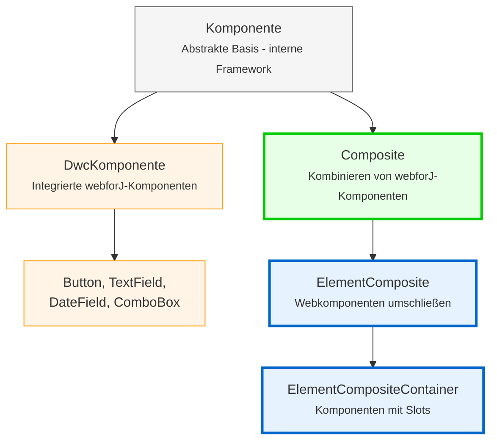

<JavadocLink type="foundation" location="com/webforj/component/Component" top='true'/> 

Bevor Sie benutzerdefinierte Komponenten in webforJ erstellen, ist es wichtig, die grundlegende Architektur zu verstehen, die bestimmt, wie Komponenten funktionieren. Dieser Artikel erklärt die Komponentenhierarchie, die Identität von Komponenten, Lebenszykluskonzepte und wie Concern-Interfaces die Funktionalitäten von Komponenten bereitstellen.

## Verständnis der Komponentenhierarchie {#understanding-the-component-hierarchy}

webforJ organisiert Komponenten in eine Hierarchie mit zwei Gruppen: internen Klassen des Frameworks, die Sie niemals erweitern sollten, und Klassen, die speziell zum Erstellen benutzerdefinierter Komponenten entworfen wurden. In diesem Abschnitt wird erklärt, warum webforJ Komposition anstelle von Vererbung verwendet und welche Funktionen jede Ebene der Hierarchie bereitstellt.

### Warum Komposition statt Erweiterung? {#why-composition-instead-of-extension}

In webforJ sind integrierte Komponenten wie [`Button`](../components/button) und [`TextField`](../components/fields/textfield) finale Klassen – Sie können sie nicht erweitern:

```java
// Das funktioniert nicht in webforJ
public class MyButton extends Button {
  // Button ist final - kann nicht erweitert werden 
}
```

webforJ verwendet **Komposition anstelle von Vererbung**. Anstatt bestehende Komponenten zu erweitern, erstellen Sie eine Klasse, die `Composite` erweitert und Komponenten darin kombiniert. `Composite` fungiert als Container, der eine einzelne Komponente (die gebundene Komponente genannt) umschließt und es Ihnen ermöglicht, eigene Komponenten und Verhaltensweisen hinzuzufügen.

```java
public class SearchBar extends Composite<FlexLayout> {
  private final FlexLayout self = getBoundComponent();
  private TextField searchField;
  private Button searchButton;
  
  public SearchBar() {
    searchField = new TextField("Suchen");
    searchButton = new Button("Los");
    
    self.setDirection(FlexDirection.ROW)
      .add(searchField, searchButton);
  }
}
```

### Warum Sie integrierte Komponenten nicht erweitern können {#why-you-cant-extend-built-in-components}

Die Komponenten von webforJ sind als final markiert, um die Integrität der zugrunde liegenden clientseitigen Webkomponente aufrechtzuerhalten. Das Erweitern von Klassen der webforJ-Komponenten würde Kontrolle über die zugrunde liegende Webkomponente gewähren, was zu unbeabsichtigten Konsequenzen führen und die Konsistenz sowie Vorhersehbarkeit des Verhaltens der Komponenten stören könnte.

Für eine detaillierte Erklärung siehe [Final Classes and Extension Restrictions](https://docs.webforj.com/docs/architecture/controls-components#final-classes-and-extension-restrictions) in der Architektur-Dokumentation.

### Die Komponentenhierarchie {#the-component-hierarchy}

<div style={{textAlign: 'center'}}>

```mermaid
graph TD
  A[Komponente<br/><small>Abstrakte Basis - interne Framework</small>]
  
  A --> B[DwcKomponente<br/><small>Integrierte webforJ-Komponenten</small>]
  A --> C[Composite<br/><small>Kombinieren von webforJ-Komponenten</small>]
  
  B --> E[Button, TextField,<br/>DateField, ComboBox]
  
  C --> D[ElementComposite<br/><small>Webkomponenten umschließen</small>]
  D --> F[ElementCompositeContainer<br/><small>Komponenten mit Slots</small>]
  
  style A fill:#f5f5f5,stroke:#666
  style B fill:#fff4e6,stroke:#ff9800
  style C fill:#e6ffe6,stroke:#00cc00
  style D fill:#e6f3ff,stroke:#0066cc
  style E fill:#fff4e6,stroke:#ff9800
  style F fill:#e6f3ff,stroke:#0066cc
  
  classDef userClass stroke-width:3px
  class C,D,F userClass
```
</div>

Klassen für Entwickler (verwenden Sie diese):
- `Composite`
- `ElementComposite`
- `ElementCompositeContainer`

Interne Klassen des Frameworks (niemals direkt erweitern):
- `Component`
- `DwcComponent`

:::warning[Niemals `Component` oder `DwcComponent` direkt erweitern]
Erweitern Sie niemals `Component` oder `DwcComponent` direkt. Alle integrierten Komponenten sind final. Verwenden Sie immer Kompositionsmuster mit `Composite` oder `ElementComposite`.

Der Versuch, `DwcComponent` zu erweitern, führt zu einer Laufzeitausnahme.
:::

## Concern-Interfaces {#concern-interfaces}

Concern-Interfaces sind Java-Interfaces, die spezifische Funktionalitäten für Ihre Komponenten bereitstellen. Jedes Interface fügt eine Reihe verwandter Methoden hinzu. Zum Beispiel fügt `HasSize` Methoden zur Steuerung von Breite und Höhe hinzu, während `HasFocus` Methoden zur Verwaltung des Fokusstatus hinzufügt.

Wenn Sie ein Concern-Interface in Ihrer Komponente implementieren, haben Sie Zugriff auf diese Funktionen, ohne Implementierungscode schreiben zu müssen. Das Interface bietet Standardimplementierungen, die automatisch funktionieren.

Die Implementierung von Concern-Interfaces verleiht Ihren benutzerdefinierten Komponenten dieselben APIs wie integrierten webforJ-Komponenten:

```java
// Implementieren Sie HasSize, um Breite/Höhen-Methoden automatisch zu erhalten
public class SizedCard extends Composite<Div> implements HasSize<SizedCard> {
  private final Div self = getBoundComponent();
  
  public SizedCard() {
    self.setText("Inhalt der Karte");
  }
  
  // Keine Notwendigkeit, diese zu implementieren - Sie erhalten sie kostenlos:
  // setWidth(), setHeight(), setSize()
}

// Verwenden Sie es wie jede webforJ-Komponente
SizedCard card = new SizedCard();
card.setWidth("300px")
  .setHeight("200px");
```

Das Composite leitet diese Aufrufe automatisch an das zugrunde liegende `Div` weiter. Kein zusätzlicher Code erforderlich.

**Häufige Concern-Interfaces:**
- `HasSize` - `setWidth()`, `setHeight()`, `setSize()`
- `HasFocus` - `focus()`, `setFocusable()`, Fokusereignisse
- `HasClassName` - `addClassName()`, `removeClassName()`
- `HasStyle` - `setStyle()`, Inline-CSS-Verwaltung
- `HasVisibility` - `setVisible()`, Sichtbarkeitsverwaltung
- `HasText` - `setText()`, Textinhaltsverwaltung
- `HasAttribute` - `setAttribute()`, HTML-Attributverwaltung

:::warning
Wenn die zugrunde liegende Komponente die Funktionalität des Interfaces nicht unterstützt, erhalten Sie eine Laufzeitausnahme. Stellen Sie in diesem Fall Ihre eigene Implementierung bereit.
:::

Für eine vollständige Liste der verfügbaren Concern-Interfaces siehe die [webforJ JavaDoc](https://javadoc.io/doc/com.webforj/webforj-foundation/latest/com/webforj/concern/package-summary.html).

## Übersicht über den Lebenszyklus von Komponenten {#component-lifecycle-overview}

webforJ verwaltet den Lebenszyklus der Komponenten automatisch. Das Framework kümmert sich um die Erstellung, Anbringung und Zerstörung von Komponenten, ohne dass eine manuelle Intervention erforderlich ist.

**Lebenszyklus-Hooks** stehen zur Verfügung, wenn Sie sie benötigen:
- `onDidCreate()` - Wird aufgerufen, nachdem die Komponente dem DOM hinzugefügt wurde
- `onDidDestroy()` - Wird aufgerufen, wenn die Komponente zerstört wird

Diese Hooks sind **optional**. Verwenden Sie sie, wenn Sie:
- Ressourcen aufräumen (Intervallen stoppen, Verbindungen schließen)
- Komponenten initialisieren müssen, die eine DOM-Anhängigkeit erfordern
- Mit clientseitigem JavaScript integrieren möchten

Für die meisten einfachen Fälle können Sie Komponenten direkt im Konstruktor initialisieren. Verwenden Sie Lebenszyklus-Hooks wie `onDidCreate()`, um Arbeiten bei Bedarf aufzuschieben.
