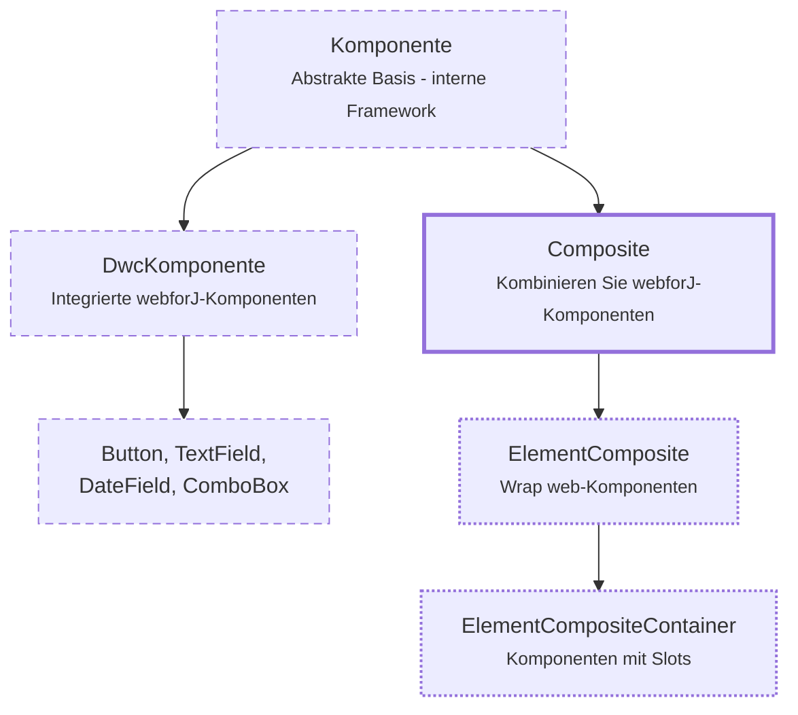

<JavadocLink type="foundation" location="com/webforj/component/Component" top='true'/>

Bevor Sie benutzerdefinierte Komponenten in webforJ erstellen, ist es wichtig, die grundlegende Architektur zu verstehen, die bestimmt, wie Komponenten funktionieren. Dieser Artikel erklärt die Komponentenhierarchie, die Identität von Komponenten, Lebenszykluskonzepte und wie Concern-Schnittstellen den Komponentenfähigkeiten bereitstellen.

## Verständnis der Komponentenhierarchie {#understanding-the-component-hierarchy}

webforJ organisiert Komponenten in einer Hierarchie mit zwei Gruppen: internen Framework-Klassen, die Sie niemals erweitern sollten, und Klassen, die speziell für den Bau benutzerdefinierter Komponenten entwickelt wurden. Dieser Abschnitt erklärt, warum webforJ Komposition statt Vererbung verwendet und was jede Ebene der Hierarchie bietet.

### Warum Komposition statt Erweiterung? {#why-composition-instead-of-extension}

In webforJ sind eingebaute Komponenten wie [`Button`](../components/button) und [`TextField`](../components/fields/textfield) finale Klassen - Sie können sie nicht erweitern:

```java
// Das funktioniert nicht in webforJ
public class MyButton extends Button {
  // Button ist final - kann nicht erweitert werden
}
```

webforJ verwendet **Komposition statt Vererbung**. Anstatt vorhandene Komponenten zu erweitern, erstellen Sie eine Klasse, die `Composite` erweitert und Komponenten darin kombiniert. `Composite` fungiert als Container, der eine einzelne Komponente (die gebundene Komponente genannt) umschließt und es Ihnen ermöglicht, Ihre eigenen Komponenten und Verhaltensweisen hinzuzufügen.

```java
public class SearchBar extends Composite<FlexLayout> {
  private final FlexLayout self = getBoundComponent();
  private TextField searchField;
  private Button searchButton;

  public SearchBar() {
    searchField = new TextField("Suche");
    searchButton = new Button("Los");

    self.setDirection(FlexDirection.ROW)
      .add(searchField, searchButton);
  }
}
```

### Warum Sie eingebaute Komponenten nicht erweitern können {#why-you-cant-extend-built-in-components}

webforJ-Komponenten sind als final markiert, um die Integrität der zugrunde liegenden clientseitigen Webkomponente aufrechtzuerhalten. Das Erweitern von webforJ-Komponentenklassen würde die Kontrolle über die zugrunde liegende Webkomponente ermöglichen, was zu unbeabsichtigten Konsequenzen führen und die Konsistenz und Vorhersehbarkeit des Verhaltens von Komponenten beeinträchtigen könnte.

Für eine detaillierte Erklärung siehe [Finale Klassen und Erweiterungseinschränkungen](https://docs.webforj.com/docs/architecture/controls-components#final-classes-and-extension-restrictions) in der Architektur-Dokumentation.

### Die Komponentenhierarchie {#the-component-hierarchy}

<div style={{textAlign: 'center'}}>

```mermaid
graph TD
  A[Komponente<br/><small>Abstrakte Basis - interne Framework</small>]

  A --> B[DwcKomponente<br/><small>Integrierte webforJ-Komponenten</small>]
  A --> C[Composite<br/><small>Kombinieren Sie webforJ-Komponenten</small>]

  B --> E[Button, TextField,<br/>DateField, ComboBox]

  C --> D[ElementComposite<br/><small>Wrap web-Komponenten</small>]
  D --> F[ElementCompositeContainer<br/><small>Komponenten mit Slots</small>]

  classDef internal stroke-dasharray:6 4,stroke-width:1px
  classDef primary stroke-width:3px
  classDef secondary stroke-width:2px,stroke-dasharray:2 2
  class A,B,E internal
  class C primary
  class D,F secondary
```
</div>

Klassen für Entwickler (verwenden Sie diese):
- `Composite`
- `ElementComposite`
- `ElementCompositeContainer`

Interne Framework-Klassen (niemals direkt erweitern):
- `Component`
- `DwcComponent`

:::warning[Niemals `Component` oder `DwcComponent` direkt erweitern]
Erweitern Sie niemals `Component` oder `DwcComponent` direkt. Alle eingebauten Komponenten sind final. Verwenden Sie immer Kompositionsmuster mit `Composite` oder `ElementComposite`.

Der Versuch, `DwcComponent` zu erweitern, wirft zu Laufzeit eine Ausnahme aus.
:::

## Concern-Schnittstellen {#concern-interfaces}

Concern-Schnittstellen sind Java-Schnittstellen, die spezifische Fähigkeiten zu Ihren Komponenten bereitstellen. Jede Schnittstelle fügt eine Menge verwandter Methoden hinzu. Zum Beispiel fügt `HasSize` Methoden zur Kontrolle von Breite und Höhe hinzu, während `HasFocus` Methoden zur Verwaltung des Fokusstatus hinzufügt.

Wenn Sie eine Concern-Schnittstelle in Ihrer Komponente implementieren, erhalten Sie Zugriff auf diese Fähigkeiten, ohne Implementierungscode schreiben zu müssen. Die Schnittstelle bietet Standardimplementierungen, die automatisch funktionieren.

Die Implementierung von Concern-Schnittstellen verleiht Ihren benutzerdefinierten Komponenten dieselben APIs wie eingebauten webforJ-Komponenten:

```java
// Implementieren Sie HasSize, um Breite/Höhenmethoden automatisch zu erhalten
public class SizedCard extends Composite<Div> implements HasSize<SizedCard> {
  private final Div self = getBoundComponent();

  public SizedCard() {
    self.setText("Kartengehalt");
  }

  // Diese müssen nicht implementiert werden - Sie erhalten sie umsonst:
  // setWidth(), setHeight(), setSize()
}

// Verwenden Sie es wie jede webforJ-Komponente
SizedCard card = new SizedCard();
card.setWidth("300px")
  .setHeight("200px");
```

Das Composite leitet diese Aufrufe automatisch an das zugrunde liegende `Div` weiter. Kein zusätzlicher Code erforderlich.

### Aussehen {#concern-interfaces-appearance}

Diese Schnittstellen steuern die visuelle Darstellung einer Komponente, einschließlich ihrer Abmessungen, Sichtbarkeit, Stile und Themen.

| Schnittstelle | Beschreibung |
|---|---|
| `HasSize` | Steuert Breite und Höhe, einschließlich min- und max-Beschränkungen. Erweitert `HasWidth`, `HasHeight` und deren min/max-Varianten. |
| `HasVisibility` | Zeigt oder versteckt die Komponente, ohne sie aus dem Layout zu entfernen. |
| `HasClassName` | Verwaltet CSS-Klassennamen im Root-Element der Komponente. |
| `HasStyle` | Wendet inline CSS-Stile an und entfernt sie. |
| `HasHorizontalAlignment` | Steuert, wie Inhalte horizontal innerhalb der Komponente ausgerichtet sind. |
| `HasExpanse` | Setzt die Größenvariante der Komponente unter Verwendung der standardmäßigen Expansions-Tokens (`XSMALL` bis `XLARGE`). |
| `HasTheme` | Wendet eine Themenvariante wie `DEFAULT`, `PRIMARY` oder `DANGER` an. |
| `HasPrefixAndSuffix` | Fügt Komponenten zum Präfix- oder Suffix-Slot innerhalb der Komponente hinzu. |

### Inhalt {#concern-interfaces-content}

Diese Schnittstellen verwalten, was eine Komponente anzeigt, einschließlich Text, HTML, Labels, Hinweise und andere beschreibende Inhalte.

| Schnittstelle | Beschreibung |
|---|---|
| `HasText` | Setzt und ruft den einfachen Textinhalt der Komponente ab. |
| `HasHtml` | Setzt und ruft das innere HTML der Komponente ab. |
| `HasLabel` | Fügt ein beschreibendes Label hinzu, das mit der Komponente verknüpft ist, und wird für Barrierefreiheit verwendet. |
| `HasHelperText` | Zeigt sekundären Hinweistext unterhalb der Komponente an. |
| `HasPlaceholder` | Setzt Platzhaltertext, der angezeigt wird, wenn die Komponente keinen Wert hat. |
| `HasTooltip` | Hängt ein Tooltip an, das beim Schweben erscheint. |

### Zustand {#concern-interfaces-state}

Diese Schnittstellen steuern den interaktiven Zustand einer Komponente, einschließlich ob sie aktiviert, bearbeitbar, erforderlich oder beim Laden fokussiert ist.

| Schnittstelle | Beschreibung |
|---|---|
| `HasEnablement` | Aktiviert oder deaktiviert die Komponente. |
| `HasReadOnly` | Versetzt die Komponente in einen schreibgeschützten Zustand, in dem der Wert sichtbar, aber nicht änderbar ist. |
| `HasRequired` | Markiert die Komponente als erforderlich, typischerweise für die Formularvalidierung. |
| `HasAutoFocus` | Verschiebt den Fokus automatisch auf die Komponente, wenn die Seite geladen wird. |

### Fokus {#concern-interfaces-focus}

Diese Schnittstellen verwalten, wie eine Komponente den Tastaturfokus erhält und darauf reagiert.

| Schnittstelle | Beschreibung |
|---|---|
| `HasFocus` | Verwaltet den Fokusstatus und ob die Komponente den Fokus erhalten kann. |
| `HasFocusStatus` | Überprüft, ob die Komponente derzeit den Fokus hat. Erfordert eine Rundreise zum Client. |
| `HasHighlightOnFocus` | Steuert, ob der Inhalt der Komponente hervorgehoben wird, wenn sie den Fokus erhält, und wie (`KEY`, `MOUSE`, `KEY_MOUSE`, `ALL` und so weiter). |

### Eingabebeschränkungen {#concern-interfaces-input-constraints}

Diese Schnittstellen definieren, welche Werte eine Komponente akzeptiert, einschließlich des aktuellen Wertes, zulässiger Bereiche, Längenbeschränkungen, Formatmasken und lokal spezifischem Verhalten.

| Schnittstelle | Beschreibung |
|---|---|
| `HasValue` | Ruft den aktuellen Wert der Komponente ab und setzt ihn. |
| `HasMin` | Setzt einen minimal zulässigen Wert. |
| `HasMax` | Setzt einen maximal zulässigen Wert. |
| `HasStep` | Setzt den Schrittinkrement für numerische oder Bereichseingaben. |
| `HasPattern` | Wendet ein reguläres Ausdrucksmuster an, um akzeptierte Eingaben einzuschränken. |
| `HasMinLength` | Setzt die minimale Anzahl von Zeichen, die im Wert der Komponente erforderlich sind. |
| `HasMaxLength` | Setzt die maximale Anzahl von Zeichen, die im Wert der Komponente zulässig sind. |
| `HasMask` | Wendet eine Formatmaske auf die Eingabe an. Wird von Maskenfeldkomponenten verwendet. |
| `HasTypingMode` | Steuert, ob eingegebene Zeichen eingefügt oder vorhandene Zeichen überschrieben werden (`INSERT` oder `OVERWRITE`). Wird von Maskenfeldern und `TextArea` verwendet. |
| `HasRestoreValue` | Definiert einen Wert, auf den die Komponente zurückgesetzt wird, wenn der Benutzer Escape drückt oder `restoreValue()` aufruft. Wird von Maskenfeldern verwendet. |
| `HasLocale` | Speichert eine pro-Komponente-Lokalisierung für lokale sensitive Formatierung. Wird von maskierten Daten- und Zeitfeldern verwendet. |
| `HasPredictedText` | Setzt einen vorhergesagten oder automatisch vervollständigten Textwert. Wird von `TextArea` verwendet, um Inline-Vorschläge zu unterstützen. |

### Validierung {#concern-interfaces-validation}

Diese Schnittstellen fügen clientseitige Verhaltensweisen zur Validierung hinzu, einschließlich der Kennzeichnung von Komponenten als ungültig, der Anzeige von Fehlermeldungen und der Steuerung, wann die Validierung ausgeführt wird.

| Schnittstelle | Beschreibung |
|---|---|
| `HasClientValidation` | Markiert eine Komponente als ungültig, setzt die Fehlermeldung und fügt einen clientseitigen Validator hinzu. |
| `HasClientAutoValidation` | Steuert, ob die Komponente automatisch validiert wird, während der Benutzer eingibt. |
| `HasClientAutoValidationOnLoad` | Steuert, ob die Komponente beim ersten Laden validiert wird. |
| `HasClientValidationStyle` | Steuert, wie Validierungsnachrichten angezeigt werden: `INLINE` (unter der Komponente) oder `POPOVER`. |

### DOM-Zugriff {#concern-interfaces-dom-access}

Diese Schnittstellen bieten einen niedrigschwelligen Zugriff auf das zugrunde liegende HTML-Element und die clientseitigen Eigenschaften der Komponente.

| Schnittstelle | Beschreibung |
|---|---|
| `HasAttribute` | Liest und schreibt beliebige HTML-Attribute am Element der Komponente. |
| `HasProperty` | Liest und schreibt DWC-Komponenten-Eigenschaften direkt am Klientenelement. |

### i18n {#concern-interfaces-i18n}

Diese Schnittstelle bietet Unterstützung für Übersetzungen für Komponenten, die lokalisierten Text anzeigen müssen.

| Schnittstelle | Beschreibung |
|---|---|
| `HasTranslation` | Stellt die `t()`-Hilfsmethode bereit, um Übersetzungsschlüssel in lokalisierte Strings unter Verwendung der aktuellen Lokalisierung der App aufzulösen. |

:::warning
Wenn die zugrunde liegende Komponente die Schnittstelleneigenschaft nicht unterstützt, erhalten Sie eine Laufzeitausnahme. Stellen Sie in diesem Fall Ihre eigene Implementierung bereit.
:::

Für eine vollständige Liste der verfügbaren Concern-Schnittstellen siehe die [webforJ JavaDoc](https://javadoc.io/doc/com.webforj/webforj-foundation/latest/com/webforj/concern/package-summary.html).

## Komponentenidentifikatoren {#component-identifiers}

webforJ-Komponenten haben drei verschiedene Arten von Identifikatoren, die unterschiedliche Zwecke erfüllen:

- **Serverseitige Komponenten-ID** (`getComponentId()`) - Automatisch von dem Framework für die interne Verfolgung von Komponenten zugewiesen. Verwenden Sie dies, wenn Sie spezifische Komponenten abfragen oder benutzerdefinierte Komponentenregistrierungen implementieren müssen.
- **Clientseitige Komponenten-ID** (`getClientComponentId()`) - Bietet Zugriff auf die zugrunde liegende Webkomponente von JavaScript. Verwenden Sie dies, wenn Sie native Methoden der Webkomponente aufrufen oder mit clientseitigen Bibliotheken integrieren müssen.
- **HTML `id`-Attribut** (`setAttribute("id", "...")`) - Standard-DOM-Identifikator. Verwenden Sie dies für CSS-Zielsetzung, Testautomatisierungs-Selektoren und das Verknüpfen von Formularlabels mit Eingaben.

Das Verständnis dieser Unterschiede hilft Ihnen, den richtigen Identifikator für Ihren Anwendungsfall zu wählen.

### Serverseitige Komponenten-ID {#server-side-component-id}

Jede Komponente wird automatisch mit einer serverseitigen Identifikationsnummer erstellt. Dieser Identifikator wird intern vom Framework zur Verfolgung von Komponenten verwendet. Sie können ihn mit `getComponentId()` abrufen:

```java
Button button = new Button("Klicke mich");
String serverId = button.getComponentId();
```

Die serverseitige ID ist nützlich, wenn Sie spezifische Komponenten innerhalb eines Containers abfragen oder benutzerdefinierte Komponentenverfolgungslogik implementieren müssen.

### Clientseitige Komponenten-ID {#client-side-component-id}

Die clientseitige Komponenten-ID ermöglicht den Zugriff auf die zugrunde liegende Webkomponente von JavaScript. Dies ermöglicht es Ihnen, direkt mit der clientseitigen Komponente zu interagieren, wenn es erforderlich ist:

```java
Button btn = new Button("Klicke mich");
btn.onClick(e -> {
  OptionDialog.showMessageDialog("Der Button wurde angeklickt", "Ein Ereignis trat ein");
});

btn.whenAttached().thenAccept(e -> {
  Page.getCurrent().executeJs("objects.get('" + btn.getClientComponentId() + "').click()");
});
```

Verwenden Sie `getClientComponentId()` mit `objects.get()` in JavaScript, um auf die Webkomponenteninstanz zuzugreifen.

:::important
Die clientseitige Komponenten-ID ist nicht das HTML `id`-Attribut des DOM-Elements. Für das Setzen von HTML-IDs für Tests oder CSS-Zielsetzung siehe [Verwendung von Komponenten](using-components).
:::

## Überblick über den Komponentenlebenszyklus {#component-lifecycle-overview}

webforJ verwaltet den Komponentenlebenszyklus automatisch. Das Framework übernimmt die Erstellung, Anbringung und Zerstörung der Komponenten, ohne dass manuelles Eingreifen erforderlich ist.

**Lebenszyklus-Hooks** sind verfügbar, wenn Sie sie benötigen:
- `onDidCreate(T container)` - Wird aufgerufen, nachdem die Komponente dem DOM angehängt wurde
- `onDidDestroy()` - Wird aufgerufen, wenn die Komponente zerstört wird

Diese Hooks sind **optional**. Verwenden Sie sie, wenn Sie:
- Ressourcen bereinigen müssen (Intervalle stoppen, Verbindungen schließen)
- Komponenten initialisieren müssen, die eine DOM-Anbringung erfordern
- Mit clientseitigem JavaScript integrieren müssen

In den meisten einfachen Fällen können Sie Komponenten direkt im Konstruktor initialisieren. Verwenden Sie Lebenszyklus-Hooks wie `onDidCreate()`, um Arbeiten bei Bedarf zu verzögern.
