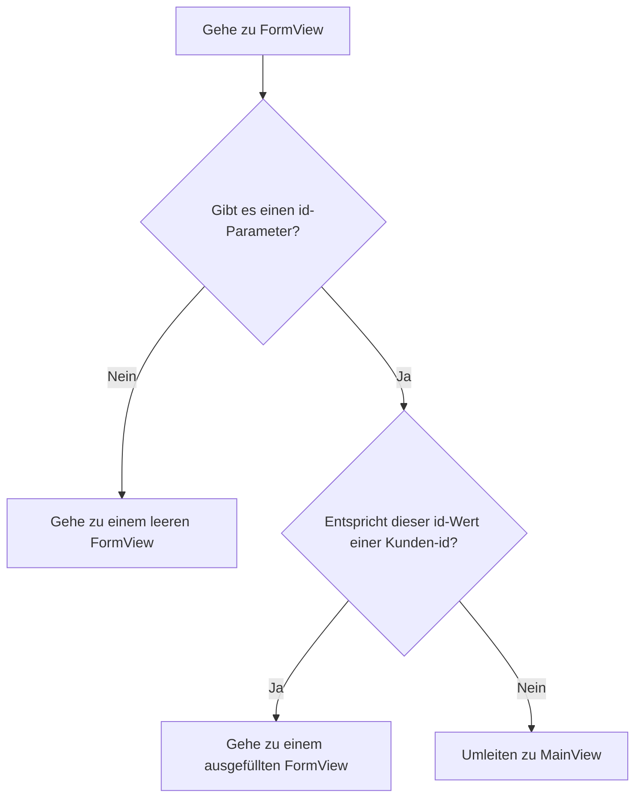

Die App aus [Routing und Composites](/docs/introduction/tutorial/routing-and-composites) kann nur neue Kunden zur Datenbank hinzufügen. Mit den folgenden Konzepten geben Sie den Benutzern die Möglichkeit, auch die Daten vorhandener Kunden zu bearbeiten:

- Routenmuster
- Übergeben von Parameterwerten durch eine URL
- Lebenszyklusbeobachter

Der Abschluss dieses Schrittes erstellt eine Version von [4-observers-and-route-parameters](https://github.com/webforj/webforj-tutorial/tree/main/4-observers-and-route-parameters).

## Die App ausführen {#running-the-app}

Während Sie Ihre App entwickeln, können Sie [4-observers-and-route-parameters](https://github.com/webforj/webforj-tutorial/tree/main/4-observers-and-route-parameters) als Vergleich verwenden. Um die App in Aktion zu sehen:

1. Navigieren Sie in das oberste Verzeichnis, das die Datei `pom.xml` enthält, dies ist `4-observers-and-route-parameters`, wenn Sie der Version auf GitHub folgen.

2. Verwenden Sie den folgenden Maven-Befehl, um die Spring Boot-App lokal auszuführen:
    ```bash
    mvn
    ```

Beim Ausführen der App wird automatisch ein neuer Browser unter `http://localhost:8080` geöffnet.

## Verwendung der `id` des Kunden {#using-the-customers-id}

Um `FormView` zu verwenden, um vorhandene Kunden zu bearbeiten, benötigen Sie eine Möglichkeit, es anzugeben, welchen Kunden Sie bearbeiten möchten.
Sie können dies tun, indem Sie einen Anfangsparameter zu `FormView` hinzufügen, der die Kunden-ID darstellt.
In [Mit Daten arbeiten](/docs/introduction/tutorial/working-with-data) haben Sie eine `Customer`-Entität erstellt, die einen numerischen `Long`-Wert als eindeutige `id` an Kunden zuweist, wenn sie der Datenbank hinzugefügt werden.

```java
 @Id
 @GeneratedValue(strategy = GenerationType.IDENTITY)
  private Long id;
```

In diesem Schritt werden Sie Änderungen an `FormView` vornehmen, damit es eine `id` als Anfangsparameter verwendet, bevor irgendetwas geladen wird. Dann wird `FormView` die `id` auswerten, um festzustellen, ob das Formular zur Hinzufügung eines neuen Kunden oder zur Aktualisierung eines vorhandenen gehört. Schließlich werden Sie `MainView` ändern, damit es beim Navigieren zu `FormView` einen `id`-Wert sendet.

## Hinzufügen eines Routenmusters zu `FormView` {#adding-a-route-pattern}

Im vorherigen Schritt wird die Route in `FormView` auf `@Route(customer)` gesetzt, um die Klasse lokal auf `http://localhost:8080/customer` zuzuordnen. Das Hinzufügen eines Routenmusters ermöglicht es Ihnen, eine `id` als Anfangsparameter zu `FormView` hinzuzufügen.

Ein [Routenmuster](/docs/routing/route-patterns) ermöglicht es Ihnen, einen Parameter in der URL hinzuzufügen, ihn optional zu machen und Einschränkungen für gültige Muster festzulegen. Mit der `@Route`-Annotation wird die `id` zu einem optionalen Routenparameter für `FormView`:

- **`/:id`** gibt der Route einen benannten Parameter `id`, sodass der Zugriff auf `http://localhost:8080/customer/6` `FormView` mit einem `id`-Parameter von `6` lädt.

- **`?`** macht den `id`-Parameter optional. Standardmäßig sind Parameter erforderlich, aber da der `id` optional ist, können Sie `FormView` auch für die Hinzufügung neuer Kunden verwenden, die noch keine `id` haben.

- **`<[0-9]+>`** schränkt `id` auf eine positive Zahl ein. In spitzen Klammern `<>` können Sie eine Einschränkung als regulären Ausdruck zum Parameter hinzufügen. Wenn die `id` nicht mit der Einschränkung übereinstimmt, z.B. `http://localhost:8080/customer/john-smith`, wird der Benutzer zu einer 404-Seite weitergeleitet.

Um den optionalen Routenparameter zu `FormView` hinzuzufügen, ändern Sie die `@Route`-Annotation zu:

```java
@Route("customer/:id?<[0-9]+>")
```

## Routing zu `FormView` {#routing-to-formview}

`FormView` akzeptiert nun einen optionalen `id`-Parameter und wird nur geladen, wenn die `id` eine ganze positive Zahl ist.

Allerdings kann `FormView` weiterhin geladen werden, wenn ein Benutzer manuell eine URL für einen nicht vorhandenen Kunden eingibt, wie `http://localhost:8080/customer/5000`. Das Hinzufügen eines Lebenszyklusbeobachters vor dem Betreten von `FormView` ermöglicht es Ihrer App zu bestimmen, wie mit dem eingehenden `id`-Wert umgegangen werden soll.

### Bedingtes Routing {#conditional-routing}

Lebenszyklusbeobachter ermöglichen es Komponenten, auf Lebensereignisse zu bestimmten Zeitpunkten zu reagieren. Der Artikel [Lifecycle Observers](/docs/routing/navigation-lifecycle/observers) listet verfügbare Beobachter auf, aber dieser Schritt verwendet nur den `WillEnterObserver`.

Die Zeit des `WillEnterObserver` tritt auf, bevor das Routing der Komponente abgeschlossen ist.
Mit diesem Beobachter können Sie die eingehende `id` auswerten. Wenn die `id` nicht mit einem vorhandenen Kunden übereinstimmt, können Sie den Benutzer zurück zu `MainView` umleiten, um einen gültigen Kunden zu finden, der bearbeitet werden soll.

Bevor wir den Code für den `WillEnterObserver` besprechen, legt das folgende Flussdiagramm die möglichen Ergebnisse dar, die beim Routing zu `FormView` eintreten sollten:



### Verwendung des `WillEnterObserver` {#using-the-willenterobserver}

Die Verwendung des Lebenszyklusbeobachters, der vor dem vollständigen Laden der Komponente ausgelöst wird, `WillEnterObserver`, ermöglicht es Ihnen, Bedingungen hinzuzufügen, um zu bestimmen, ob die App zu `FormView` fortfahren soll oder ob sie die Benutzer zu `MainView` umleiten muss.

Jeder Lebenszyklusbeobachter ist ein Interface, sodass Sie `WillEnterObserver` als Teil der Deklaration von `FormView` implementieren:

```java
public class FormView extends Composite<Div> implements WillEnterObserver {
```

Der `WillEnterObserver` hat die Methode `onWillEnter()`, die webforJ vor dem Routing zur Komponente aufruft. Diese Methode hat zwei Parameter: das `WillEnterEvent` und die `ParametersBag`.

Das `WillEnterEvent` bestimmt, ob das Routing zur Komponente mit der Methode `accept()` fortgesetzt wird oder ob das Routing mit der Methode `reject()` gestoppt wird. Nach der Ablehnung der aktuellen Route müssen Sie den Benutzer woanders umleiten.

Der `ParametersBag` enthält die Routerparameter aus der URL. Sie werden das `ParametersBag` im nächsten Abschnitt verwenden, um die bedingte Logik für `onWillEnter()` unter Verwendung des `id`-Parameters zu erstellen.

Das folgende `onWillEnter()` ist ein Beispiel mit nur zwei Ergebnissen:

```java
@Override
public void onWillEnter(WillEnterEvent event, ParametersBag parameters) {

  //Bedingungslogik hinzufügen
  if (<condition>) {

    //Erlaube das Routing zur FormView
    event.accept();

  } else {

    //Beende das Routing zur FormView
    event.reject();

    //Leite den Benutzer zu MainView weiter
    navigateToMain();
  }
}
```

### Verwendung des `ParametersBag` {#using-the-parametersbag}

Wie im vorherigen Abschnitt kurz erwähnt, enthält das `ParametersBag` den Routerparameter aus der URL. Jeder Lebenszyklusbeobachter hat Zugriff auf dieses Objekt, und die Verwendung in Ihrer App ermöglicht es Ihnen, den `id`-Wert zu erhalten.

Das `ParametersBag`-Objekt bietet mehrere Abfragemethoden, um einen Parameter als bestimmten Objekttyp abzurufen. Beispielsweise kann `getInt()` Ihnen einen Parameter als `Integer` zurückgeben.

Da einige Parameter jedoch optional sind, gibt `getInt()` tatsächlich `Optional<Integer>` zurück. Die Verwendung der Methode `ifPresentOrElse()` auf dem `Optional<Integer>` ermöglicht es Ihnen, eine Variable unter Verwendung des `Integer` festzulegen.

Wenn keine `id` vorhanden ist, kann der Benutzer weiterhin zu `FormView` gehen, um einen neuen Kunden hinzuzufügen.

```java
@Override
public void onWillEnter(WillEnterEvent event, ParametersBag parameters) {

  //Bestimmen Sie, welchen Parameter Sie abrufen möchten, und prüfen Sie, ob er vorhanden ist oder nicht
  parameters.getInt("id").ifPresentOrElse(id -> {

    //Verwende die id als Variable
    customerId = Long.valueOf(id);

  //Wenn keine id vorhanden ist, fahren Sie mit FormView für einen neuen Kunden fort
  }, () -> event.accept());

}
```

### Ist die `id` gültig? {#is-the-id-valid}

Zurzeit akzeptiert der `WillEnterObserver` aus dem letzten Abschnitt nur das Routing, wenn keine `id` vorhanden ist. Der Beobachter muss noch eine Überprüfung durchführen, bevor er zu `FormView` fortfährt: Überprüfen, ob die `id` mit einem vorhandenen Kunden übereinstimmt.

Jetzt kann `FormView` den `CustomerService` verwenden, um die Existenz eines Kunden mit der Methode `doesCustomerExist()` zu bestätigen. Wenn es keine Übereinstimmung gibt, kann die App das aktuelle Routing ablehnen und den Benutzer mit `navigateToMain()` zu `MainView` umleiten.

Wenn eine gültige `id` gegeben ist, kann die App `accept()` verwenden, um mit dem Routing zu `FormView` fortzufahren. Erstellen Sie eine Methode `fillForm()`, um die Variable `customer` dem Kunden mit der entsprechenden `id` in der Datenbank zuzuweisen und die Werte der Felder festzulegen:

```java
public void fillForm(Long customerId) {
  customer = customerService.getCustomerByKey(customerId);
  firstName.setValue(customer.getFirstName());
  lastName.setValue(customer.getLastName());
  company.setValue(customer.getCompany());
  country.selectKey(customer.getCountry());
}
```

Wie beim Hinzufügen eines neuen Kunden ermöglicht die Verwendung der Arbeitskopie den Benutzern, Kundendaten in der Benutzeroberfläche zu bearbeiten, ohne direkt das Repository zu ändern.

### Fertiggestelltes `onWillEnter()` {#completed-onwillenter}

Die letzten beiden Abschnitte behandelten im Detail, wie man mit jedem Ergebnis für das Routing in `FormView` unter Verwendung des `ParametersBag` und des `CustomerService` umgeht.

Das folgende ist das vollständige `onWillEnter()` für `FormView`, das das `ParametersBag` verwendet, um entweder die eingehende Route abzulehnen oder zu akzeptieren, und andere Methoden aufruft, um entweder das Formular zu füllen oder den Benutzer zu `MainView` zu senden:

```java
@Override
public void onWillEnter(WillEnterEvent event, ParametersBag parameters) {

  //Bestimmen Sie, welchen Parameter Sie abrufen möchten, und prüfen Sie, ob er vorhanden ist oder nicht
  parameters.getInt("id").ifPresentOrElse(id -> {

    //Verwende die id als Variable
    customerId = Long.valueOf(id);

    //Überprüfen Sie, ob es einen Kunden mit dieser id gibt
    if (customerService.doesCustomerExist(customerId)) {

        //Dieser Kunde existiert, also fahren Sie mit FormView fort und initialisieren Sie die Felder mit der id
        event.accept();
        fillForm(customerId);
      } else {

        //Dieser Kunde existiert nicht, also umleiten zu MainView
        event.reject();
        navigateToMain();
      }

  //Es war keine id vorhanden, also weiterhin zu FormView für einen neuen Kunden
  }, () -> event.accept());

}
```

## Hinzufügen oder Bearbeiten eines Kunden {#adding-or-editing-a-customer}

Die vorherige Version dieser App konnte nur neue Kunden hinzufügen, wenn der Benutzer das Formular sendete. Jetzt, da Benutzer vorhandene Kunden bearbeiten können, muss die Methode `submitCustomer()` überprüfen, ob der Kunde bereits existiert, bevor die Datenbank aktualisiert wird.

Anfangs war es nicht erforderlich, eine Variable für die Kunden-`id` in `FormView` zuzuweisen, da neuen Kunden beim Einfügen in die Datenbank eine eindeutige `id` zugewiesen wird. Wenn Sie jedoch `customerId` als Anfangsvariable in `FormView` mit einem `id`-Wert deklarieren, der nicht verwendet wird, bleibt sie unverändert für neue Kunden und wird in `onWillEnter()` für vorhandene überschrieben.

Damit können Sie `doesCustomerExist()` verwenden, um zu überprüfen, ob ein neuer Kunde hinzugefügt oder ein vorhandener aktualisiert werden soll.

```java
private Long customerId = 0L;

//...

private void submitCustomer() {
  if (customerService.doesCustomerExist(customerId)) {
    customerService.updateCustomer(customer);
  } else {
    customerService.createCustomer(customer);
  }
  navigateToMain();
}
```

## Fertiggestelltes `FormView` {#completed-formview}

So sollte `FormView` aussehen, jetzt, da es die Bearbeitung vorhandener Kunden handhaben kann:

```java
@Route("customer/:id?<[0-9]+>")
@FrameTitle("Kundenformular")
public class FormView extends Composite<Div> implements WillEnterObserver {
  private final CustomerService customerService;
  private Customer customer = new Customer();
  private Long customerId = 0L;
  private Div self = getBoundComponent();
  private TextField firstName = new TextField("Vorname", e -> customer.setFirstName(e.getValue()));
  private TextField lastName = new TextField("Nachname", e -> customer.setLastName(e.getValue()));
  private TextField company = new TextField("Firma", e -> customer.setCompany(e.getValue()));
  private ChoiceBox country = new ChoiceBox("Land", e -> customer.setCountry((Customer.Country) e.getSelectedItem().getKey()));
  private Button submit = new Button("Absenden", ButtonTheme.PRIMARY, e -> submitCustomer());
  private Button cancel = new Button("Abbrechen", ButtonTheme.OUTLINED_PRIMARY, e -> navigateToMain());
  private ColumnsLayout layout = new ColumnsLayout(
      firstName, lastName,
      company, country,
      submit, cancel);

  public FormView(CustomerService customerService) {
    this.customerService = customerService;
    fillCountries();
    setColumnsLayout();
    self.setMaxWidth(600)
        .addClassName("card")
        .add(layout);
    submit.setStyle("margin-top", "var(--dwc-space-l)");
    cancel.setStyle("margin-top", "var(--dwc-space-l)");
  }

  private void setColumnsLayout() {
    List<Breakpoint> breakpoints = List.of(
        new Breakpoint(600, 2));
    layout.setSpacing("var(--dwc-space-l)")
        .setBreakpoints(breakpoints);
  }

  private void fillCountries() {
    ArrayList<ListItem> listCountries = new ArrayList<>();
    for (Country countryItem : Customer.Country.values()) {
      listCountries.add(new ListItem(countryItem, countryItem.toString()));
    }
    country.insert(listCountries);
    country.selectIndex(0);
  }

  private void submitCustomer() {
    if (customerService.doesCustomerExist(customerId)) {
      customerService.updateCustomer(customer);
    } else {
      customerService.createCustomer(customer);
    }
    navigateToMain();
  }

  private void navigateToMain() {
    Router.getCurrent().navigate(MainView.class);
  }

  @Override
  public void onWillEnter(WillEnterEvent event, ParametersBag parameters) {
    parameters.getInt("id").ifPresentOrElse(id -> {
      customerId = Long.valueOf(id);
      if (customerService.doesCustomerExist(customerId)) {
        event.accept();
        fillForm(customerId);
      } else {
        event.reject();
        navigateToMain();
      }

    }, () -> event.accept());
  }

  public void fillForm(Long customerId) {
    customer = customerService.getCustomerByKey(customerId);
    firstName.setValue(customer.getFirstName());
    lastName.setValue(customer.getLastName());
    company.setValue(customer.getCompany());
    country.selectKey(customer.getCountry());
  }
}
```

## Navigieren von `MainView` zu `FormView`, um Kunden zu bearbeiten {#navigating-from-mainview-to-formview-to-edit-customers}

Früher in diesem Schritt haben Sie ein vorhandenes `ParametersBag` verwendet, um den Wert einer `id` zu bestimmen. Das Erstellen eines neuen `ParametersBag` ermöglicht es Ihnen, direkt zwischen Klassen mit den gewünschten Parametern zu navigieren. Die Verwendung der Daten in der `Table` ist eine praktikable Option, um Benutzer mit einer Kunden-`id` zu `FormView` zu senden.

Ähnlich wie beim Button ermöglicht das Verknüpfen der Navigation mit einer vom Benutzer gewählten Aktion, dass die Benutzer entscheiden, wann sie zu `FormView` gehen. Das Hinzufügen eines Ereignislisteners zur `Table` ermöglicht es Ihnen, den Benutzer mit einem `ParametersBag` zu `FormView` zu senden:

```java
table.addItemClickListener(this::editCustomer);

private void editCustomer(TableItemClickEvent<Customer> e) {
  Router.getCurrent().navigate(FormView.class,
      ParametersBag.of("id=" + e.getItemKey()));
  }
```

Der Schlüssel der `Table`-Elemente wird standardmäßig automatisch generiert. Sie können jeden Schlüssel explizit auf die `id` eines Kunden abgleichen, indem Sie die Methode `setKeyProvider()` verwenden:

```java
table.setKeyProvider(Customer::getId);
```

In `MainView` fügen Sie die Methoden `addItemClickListener()` und `setKeyProvider()` zu `buildTable()` hinzu, und fügen die Methode hinzu, die den Benutzer zu `FormView` mit einem Wert für die `id` im `ParametersBag` sendet, basierend darauf, wo der Benutzer in der Tabelle geklickt hat:

```java title="MainView.java" {30-31,34-37}
@Route("/")
@FrameTitle("Kundetabelle")
public class MainView extends Composite<Div> {
  private final CustomerService customerService;
  private Div self = getBoundComponent();
  private Table<Customer> table = new Table<>();
  private Button addCustomer = new Button("Kunden hinzufügen", ButtonTheme.PRIMARY,
      e -> Router.getCurrent().navigate(FormView.class));

  public MainView(CustomerService customerService) {
    this.customerService = customerService;
    addCustomer.setWidth(200);
    buildTable();
    self.setWidth("fit-content")
        .addClassName("card")
        .add(table, addCustomer);
  }

  private void buildTable() {
    table.setSize("1000px", "294px");
    table.setMaxWidth("90vw");
    table.addColumn("firstName", Customer::getFirstName).setLabel("Vorname");
    table.addColumn("lastName", Customer::getLastName).setLabel("Nachname");
    table.addColumn("company", Customer::getCompany).setLabel("Firma");
    table.addColumn("country", Customer::getCountry).setLabel("Land");
    table.setColumnsToAutoFit();
    table.setColumnsToResizable(false);
    table.getColumns().forEach(column -> column.setSortable(true));
    table.setRepository(customerService.getRepositoryAdapter());
    table.setKeyProvider(Customer::getId);
    table.addItemClickListener(this::editCustomer);
  }

  private void editCustomer(TableItemClickEvent<Customer> e) {
    Router.getCurrent().navigate(FormView.class,
        ParametersBag.of("id=" + e.getItemKey()));
  }
}
```

## Nächster Schritt {#next-step}

Jetzt, da Benutzer die Kundendaten direkt bearbeiten können, sollte Ihre App Änderungen validieren, bevor sie diese in das Repository übernimmt. In [Validieren und Binden von Daten](/docs/introduction/tutorial/validating-and-binding-data) werden Sie Validierungsregeln erstellen und die Datenmodell direkt mit der Benutzeroberfläche verknüpfen, sodass die Komponenten Fehlermeldungen anzeigen können, wenn die Daten ungültig sind.
