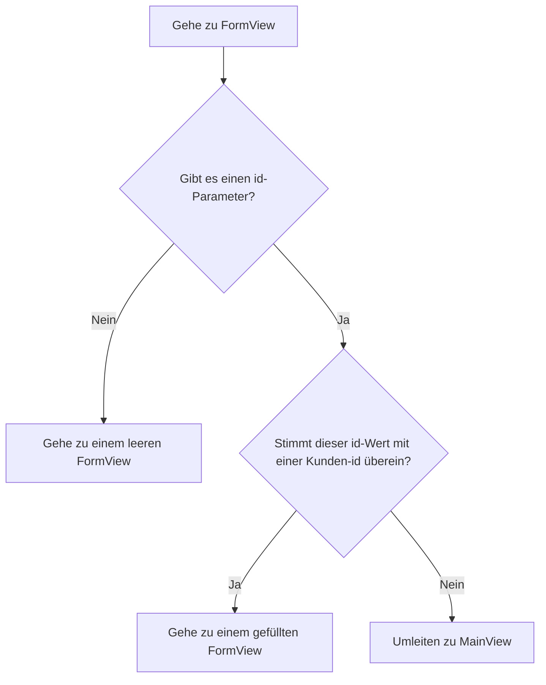

Die App aus [Routing und Composites](/docs/introduction/tutorial/routing-and-composites) kann nur neue Kunden zur Datenbank hinzufügen. Mit den folgenden Konzepten werden Sie den Nutzern die Möglichkeit geben, auch die Daten bestehender Kunden zu bearbeiten:

- Routenmuster
- Übergeben von Parameterwerten über eine URL
- Lifecycle-Observer

Abschließen dieses Schrittes erstellt eine Version von [4-observers-and-route-parameters](https://github.com/webforj/webforj-tutorial/tree/main/4-observers-and-route-parameters).

## Die App ausführen {#running-the-app}

Während Sie Ihre App entwickeln, können Sie [4-observers-and-route-parameters](https://github.com/webforj/webforj-tutorial/tree/main/4-observers-and-route-parameters) als Vergleich verwenden. Um die App in Aktion zu sehen:

1. Navigieren Sie zu dem Verzeichnis, das die `pom.xml`-Datei enthält. Dies ist `4-observers-and-route-parameters`, wenn Sie der Version auf GitHub folgen.

2. Verwenden Sie den folgenden Maven-Befehl, um die Spring Boot App lokal auszuführen:
    ```bash
    mvn
    ```

Das Ausführen der App öffnet automatisch einen neuen Browser unter `http://localhost:8080`.

## Verwendung der `id` des Kunden {#using-the-customers-id}

Um `FormView` zu verwenden, um bestehende Kunden zu bearbeiten, benötigen Sie eine Möglichkeit, um zu erklären, welchen Kunden Sie bearbeiten möchten. Sie können dies tun, indem Sie `FormView` einen Anfangsparameter übergeben, der die Kunden-ID darstellt. In [Working with Data](/docs/introduction/tutorial/working-with-data) haben Sie eine `Customer`-Entität erstellt, die einen numerischen `Long`-Wert als einzigartige `id` zu Kunden zuweist, wenn diese zur Datenbank hinzugefügt werden.

```java
@Id
@GeneratedValue(strategy = GenerationType.IDENTITY)
private Long id;
```

In diesem Schritt werden Sie Änderungen an `FormView` vornehmen, sodass sie eine `id` als Anfangsparameter verwendet, bevor irgendetwas geladen wird. Dann wird `FormView` die `id` auswerten, um zu bestimmen, ob das Formular zum Hinzufügen eines neuen Kunden oder zur Aktualisierung eines bestehenden gedacht ist. Schließlich werden Sie `MainView` ändern, sodass es einen `id`-Wert sendet, wenn es zu `FormView` navigiert.

## Hinzufügen eines Routenmusters zu `FormView` {#adding-a-route-pattern}

Im vorherigen Schritt wurde die Route in `FormView` auf `@Route(customer)` gesetzt, was die Klasse lokal zu `http://localhost:8080/customer` zuordnet. Das Hinzufügen eines Routenmusters ermöglicht es Ihnen, eine `id` als Anfangsparameter an `FormView` hinzuzufügen.

Ein [Routenmuster](/docs/routing/route-patterns) ermöglicht es, einen Parameter in der URL hinzuzufügen, ihn optional zu machen und Einschränkungen für gültige Muster festzulegen. Mit der `@Route`-Annotation können Sie wie folgt `id` zu einem optionalen Routenparameter für `FormView` machen:

- **`/:id`** gibt der Route einen benannten Parameter `id`, sodass der Zugriff auf `http://localhost:8080/customer/6` `FormView` mit einem `id`-Parameter von `6` lädt.

- **`?`** macht den `id`-Parameter optional. Standardmäßig sind Parameter erforderlich, aber die Option, die `id` optional zu machen, ermöglicht es Ihnen, `FormView` auch für das Hinzufügen neuer Kunden zu verwenden, die noch keine `id` haben.

- **`<[0-9]+>`** schränkt die `id` auf eine positive Zahl ein. In spitzen Klammern `<>` können Sie eine Einschränkung als regulären Ausdruck für den Parameter hinzufügen. Wenn die `id` nicht mit der Einschränkung übereinstimmt, z. B. `http://localhost:8080/customer/john-smith`, wird der Benutzer zu einer 404-Seite geleitet.

Um den optionalen Routenparameter zu `FormView` hinzuzufügen, ändern Sie die `@Route`-Annotation wie folgt:

```java
@Route("customer/:id?<[0-9]+>")
```

## Routing zu `FormView` {#routing-to-formview}

`FormView` akzeptiert nun einen optionalen `id`-Parameter und lädt nur, wenn `id` eine ganze positive Zahl ist.

Allerdings kann `FormView` weiterhin geladen werden, wenn ein Benutzer manuell eine URL für einen nicht existierenden Kunden eingibt, wie z. B. `http://localhost:8080/customer/5000`. Das Hinzufügen eines Lifecycle-Observers, bevor `FormView` betreten wird, ermöglicht Ihrer App zu bestimmen, wie mit dem eingehenden `id`-Wert umgegangen werden soll.

### Bedingtes Routing {#conditional-routing}

Lifecycle-Observer ermöglichen es Komponenten, auf Lebenszyklusereignisse zu bestimmten Zeitpunkten zu reagieren. Der Artikel über [Lifecycle Observers](/docs/routing/navigation-lifecycle/observers) listet die verfügbaren Observer auf, aber dieser Schritt verwendet nur den `WillEnterObserver`.

Das Timing des `WillEnterObserver` erfolgt, bevor das Routing der Komponente abgeschlossen ist. Dieser Observer ermöglicht es Ihnen, die eingehende `id` zu bewerten. Wenn die `id` nicht mit einer vorhandenen Kunden-ID übereinstimmt, können Sie den Benutzer zurück zu `MainView` umleiten, um einen gültigen Kunden zum Bearbeiten zu finden.

Bevor wir den Code für den `WillEnterObserver` besprechen, zeigt das folgende Flussdiagramm die möglichen Ergebnisse, wenn zu `FormView` geroutet wird:



### Verwendung des `WillEnterObserver` {#using-the-willenterobserver}

Die Verwendung des Lifecycle-Observers, der ausgelöst wird, bevor die Komponente vollständig geladen wird, `WillEnterObserver`, ermöglicht es Ihnen, Bedingungen hinzuzufügen, um zu bestimmen, ob die App zu `FormView` fortfahren oder ob sie die Benutzer zu `MainView` umleiten muss.

Jeder Lifecycle-Observer ist ein Interface, also implementieren Sie `WillEnterObserver` als Teil der Deklaration für `FormView`:

```java
public class FormView extends Composite<Div> implements WillEnterObserver {
```

Der `WillEnterObserver` hat die Methode `onWillEnter()`, die von webforJ aufgerufen wird, bevor zum Komponent geroutet wird. Diese Methode hat zwei Parameter: das `WillEnterEvent` und das `ParametersBag`.

Das `WillEnterEvent` bestimmt, ob das Routing zur Komponente mit der Methode `accept()` fortgesetzt oder mit der Methode `reject()` gestoppt werden soll. Nach der Ablehnung der aktuellen Route müssen Sie den Benutzer irgendwo anders hin umleiten.

Das `ParametersBag` enthält die Router-Parameter aus der URL. Sie werden das `ParametersBag` im nächsten Abschnitt verwenden, um die bedingte Logik für `onWillEnter()` unter Verwendung des `id`-Parameters zu erstellen.

Die folgende `onWillEnter()` ist ein Beispiel mit nur zwei Ergebnissen:

```java
@Override
public void onWillEnter(WillEnterEvent event, ParametersBag parameters) {

  //Bedingte Logik hinzufügen
  if (<condition>) {

    //Erlaube das Routing zu FormView fortzusetzen
    event.accept();

  } else {

    //Stoppe das Routing zu FormView
    event.reject();

    //Sende den Benutzer zu MainView
    navigateToMain();
  }
}
```

### Verwendung des `ParametersBag` {#using-the-parametersbag}

Wie im vorherigen Abschnitt kurz erwähnt, enthält das `ParametersBag` den Routerparameter aus der URL. Jeder Lifecycle-Observer hat Zugriff auf dieses Objekt, und die Verwendung in Ihrer App ermöglicht es Ihnen, den `id`-Wert zu erhalten.

Das `ParametersBag`-Objekt bietet mehrere Abfragemethoden, um einen Parameter in einem bestimmten Objekttyp zu erhalten. Zum Beispiel gibt `getInt()` Ihnen einen Parameter als `Integer`.

Da einige Parameter jedoch optional sind, gibt `getInt()` tatsächlich ein `Optional<Integer>` zurück. Die Verwendung der Methode `ifPresentOrElse()` auf dem `Optional<Integer>` ermöglicht es Ihnen, eine Variable unter Verwendung des `Integer` zu setzen.

Wenn kein `id` vorhanden ist, kann der Benutzer weiterhin zu `FormView` gehen, um einen neuen Kunden hinzuzufügen.

```java
@Override
public void onWillEnter(WillEnterEvent event, ParametersBag parameters) {

  //Bestimme, welchen Parameter zu erhalten ist, und überprüfe, ob er vorhanden ist oder nicht
  parameters.getInt("id").ifPresentOrElse(id -> {

    //Verwende die id als Variable
    customerId = Long.valueOf(id);

  //Wenn keine id vorhanden ist, gehe weiter zu FormView für einen neuen Kunden
  }, () -> event.accept());
        
}
```

### Ist die `id` gültig? {#is-the-id-valid}

Der `WillEnterObserver` aus dem letzten Abschnitt akzeptiert derzeit nur das Routing, wenn keine `id` vorhanden ist. Der Observer muss eine weitere Überprüfung durchführen, bevor er zu `FormView` fortfährt: Überprüfen, ob die `id` mit einem bestehenden Kunden übereinstimmt.

Jetzt kann `FormView` den `CustomerService` verwenden, um die Existenz eines Kunden mit der Methode `doesCustomerExist()` zu bestätigen. Wenn es keine Übereinstimmung gibt, kann die App das aktuelle Routing ablehnen und den Benutzer durch `navigateToMain()` zu `MainView` umleiten.

Bei einer gültigen `id` kann die App `accept()` verwenden, um das Routing zu `FormView` fortzusetzen. Erstellen Sie eine Methode `fillForm()`, um die Variable `customer` mit dem Kunden mit der entsprechenden `id` in der Datenbank zuzuweisen und die Werte der Felder festzulegen:

```java
public void fillForm(Long customerId) {
  customer = customerService.getCustomerByKey(customerId);
  firstName.setValue(customer.getFirstName());
  lastName.setValue(customer.getLastName());
  company.setValue(customer.getCompany());
  country.selectKey(customer.getCountry());
}
```

Wie beim Hinzufügen eines neuen Kunden ermöglicht die Verwendung der Arbeitskopie den Benutzern, Kundendaten in der Benutzeroberfläche zu bearbeiten, ohne das Repository direkt zu bearbeiten.

### Abgeschlossenes `onWillEnter()` {#completed-onwillenter}

Die letzten beiden Abschnitte gingen detailliert auf die Handhabung jedes Ergebnisses für das Routing in `FormView` ein, unter Verwendung des `ParametersBag` und des `CustomerService`.

Das folgende ist das abgeschlossene `onWillEnter()` für `FormView`, das das `ParametersBag` verwendet, um entweder die eingehende Route abzulehnen oder zu akzeptieren, und andere Methoden aufruft, um entweder das Formular auszufüllen oder den Benutzer zu `MainView` zu senden:

```java
@Override
public void onWillEnter(WillEnterEvent event, ParametersBag parameters) {

  //Bestimme, welchen Parameter zu erhalten ist, und überprüfe, ob er vorhanden ist oder nicht
  parameters.getInt("id").ifPresentOrElse(id -> {
    customerId = Long.valueOf(id);
    //Überprüfe, ob ein Kunde mit dieser id vorhanden ist
    if (customerService.doesCustomerExist(customerId)) {
      //Dieser Kunde existiert, also fahre mit FormView fort und initialisiere die Felder mit der id
      event.accept();
      fillForm(customerId);
    } else {
      //Dieser Kunde existiert nicht, also umleiten zu MainView
      event.reject();
      navigateToMain();
    }

  //Keine id war vorhanden, also fortfahren zu FormView für einen neuen Kunden
  }, () -> event.accept());
        
}
```

## Hinzufügen oder Bearbeiten eines Kunden {#adding-or-editing-a-customer}

In der vorherigen Version dieser App wurden nur neue Kunden hinzugefügt, wenn der Benutzer das Formular abgeschickt hat. Da die Nutzer jetzt bestehende Kunden bearbeiten können, muss die Methode `submitCustomer()` überprüfen, ob der Kunde bereits existiert, bevor die Datenbank aktualisiert wird.

Zunächst war es nicht notwendig, eine Variable für die Kunden-ID in `FormView` zuzuweisen, da neuen Kunden eine eindeutige `id` zugewiesen wird, wenn sie in die Datenbank übermittelt werden. Wenn Sie jedoch `customerId` als ursprüngliche Variable in `FormView` mit einem ungenutzten `id`-Wert deklarieren, bleibt sie für neue Kunden unverändert und wird in `onWillEnter()` für bestehende überschrieben.

Dies ermöglicht es Ihnen, `doesCustomerExist()` zu verwenden, um zu überprüfen, ob ein neuer Kunde hinzugefügt oder ein bestehender aktualisiert werden soll. 

```java
private Long customerId = 0L;

//...

private void submitCustomer() {
  if (customerService.doesCustomerExist(customerId)) {
    customerService.updateCustomer(customer);
  } else {
    customerService.createCustomer(customer);
  }
  navigateToMain();
}
```

## Abgeschlossenes `FormView` {#completed-formview}

So sollte `FormView` jetzt aussehen, da es mit dem Bearbeiten bestehender Kunden umgehen kann: 

<ExpandableCode title="FormView.java" language="java" startLine={1} endLine={15}>
  {`@Route("customer/:id?<[0-9]+>")
  @FrameTitle("Kundenformular")
  public class FormView extends Composite<Div> implements WillEnterObserver {
    private final CustomerService customerService;
    private Customer customer = new Customer();
    private Long customerId = 0L;
    private Div self = getBoundComponent();
    private TextField firstName = new TextField("Vorname", e -> customer.setFirstName(e.getValue()));
    private TextField lastName = new TextField("Nachname", e -> customer.setLastName(e.getValue()));
    private TextField company = new TextField("Firma", e -> customer.setCompany(e.getValue()));
    private ChoiceBox country = new ChoiceBox("Land",
        e -> customer.setCountry((Customer.Country) e.getSelectedItem().getKey()));
    private Button submit = new Button("Absenden", ButtonTheme.PRIMARY, e -> submitCustomer());
    private Button cancel = new Button("Abbrechen", ButtonTheme.OUTLINED_PRIMARY, e -> navigateToMain());
    private ColumnsLayout layout = new ColumnsLayout(
        firstName, lastName,
        company, country,
        submit, cancel);

    public FormView(CustomerService customerService) {
      this.customerService = customerService;
      fillCountries();
      setColumnsLayout();
      self.setMaxWidth(600)
          .addClassName("card")
          .add(layout);
      submit.setStyle("margin-top", "var(--dwc-space-l)");
      cancel.setStyle("margin-top", "var(--dwc-space-l)");
    }

    private void setColumnsLayout() {
      List<Breakpoint> breakpoints = List.of(
          new Breakpoint(600, 2));
      layout.setSpacing("var(--dwc-space-l)")
          .setBreakpoints(breakpoints);
    }

    private void fillCountries() {
      ArrayList<ListItem> listCountries = new ArrayList<>();
      for (Country countryItem : Customer.Country.values()) {
        listCountries.add(new ListItem(countryItem, countryItem.toString()));
      }
      country.insert(listCountries);
      country.selectIndex(0);
    }

    private void submitCustomer() {
      if (customerService.doesCustomerExist(customerId)) {
        customerService.updateCustomer(customer);
      } else {
        customerService.createCustomer(customer);
      }
      navigateToMain();
    }

    private void navigateToMain() {
      Router.getCurrent().navigate(MainView.class);
    }

    @Override
    public void onWillEnter(WillEnterEvent event, ParametersBag parameters) {
      parameters.getInt("id").ifPresentOrElse(id -> {
        customerId = Long.valueOf(id);
        if (customerService.doesCustomerExist(customerId)) {
          event.accept();
          fillForm(customerId);
        } else {
          event.reject();
          navigateToMain();
        }

      }, () -> event.accept());
    }

    public void fillForm(Long customerId) {
      customer = customerService.getCustomerByKey(customerId);
      firstName.setValue(customer.getFirstName());
      lastName.setValue(customer.getLastName());
      company.setValue(customer.getCompany());
      country.selectKey(customer.getCountry());
    }
  }
`}
</ExpandableCode>

## Navigation von `MainView` zu `FormView`, um Kunden zu bearbeiten {#navigating-from-mainview-to-formview-to-edit-customers}

Früher in diesem Schritt haben Sie ein bestehendes `ParametersBag` verwendet, um den Wert einer `id` zu bestimmen. Das Erstellen eines neuen `ParametersBag` ermöglicht es Ihnen, zwischen den Klassen direkt mit den von Ihnen gewählten Parametern zu navigieren. Die Verwendung der Daten in der `Table` ist eine praktikable Option, um Benutzer nach `FormView` mit einer Kunden-ID zu senden.

Ähnlich wie bei der Schaltfläche erlaubt es die Bindung der Navigation an eine vom Benutzer gewählte Aktion, dass dieser entscheidet, wann er zu `FormView` wechseln möchte. Das Hinzufügen eines Ereignislisteners zur `Table` ermöglicht es Ihnen, den Benutzer zu `FormView` mit einem `ParametersBag` zu senden:

```java
table.addItemClickListener(this::editCustomer);

private void editCustomer(TableItemClickEvent<Customer> e) {
  Router.getCurrent().navigate(FormView.class,
      ParametersBag.of("id=" + e.getItemKey()));
}
```

Der Schlüssel der `Table`-Elemente wird jedoch standardmäßig automatisch generiert. Sie können explizit jeden Schlüssel mit der `id` eines Kunden verknüpfen, indem Sie die Methode `setKeyProvider()` verwenden:

```java
table.setKeyProvider(Customer::getId);
```

Fügen Sie in `MainView` die Methoden `addItemClickListener()` und `setKeyProvider()` zu `buildTable()` hinzu, und fügen Sie die Methode hinzu, die den Benutzer zu `FormView` mit einem Wert für die `id` im `ParametersBag` sendet, basierend darauf, wo auf der Tabelle der Benutzer geklickt hat:

```java title="MainView.java" {30-31,34-37}
@Route("/")
@FrameTitle("Kundentabelle")
public class MainView extends Composite<Div> {
  private final CustomerService customerService;
  private Div self = getBoundComponent();
  private Table<Customer> table = new Table<>();
  private Button addCustomer = new Button("Kunden hinzufügen", ButtonTheme.PRIMARY,
      e -> Router.getCurrent().navigate(FormView.class));

  public MainView(CustomerService customerService) {
    this.customerService = customerService;
    addCustomer.setWidth(200);
    buildTable();
    self.setWidth("fit-content")
        .addClassName("card")
        .add(table, addCustomer);
  }

  private void buildTable() {
    table.setSize("1000px", "294px");
    table.setMaxWidth("90vw");
    table.addColumn("firstName", Customer::getFirstName).setLabel("Vorname");
    table.addColumn("lastName", Customer::getLastName).setLabel("Nachname");
    table.addColumn("company", Customer::getCompany).setLabel("Firma");
    table.addColumn("country", Customer::getCountry).setLabel("Land");
    table.setColumnsToAutoFit();
    table.setColumnsToResizable(false);
    table.getColumns().forEach(column -> column.setSortable(true));
    table.setRepository(customerService.getRepositoryAdapter());
    table.setKeyProvider(Customer::getId);
    table.addItemClickListener(this::editCustomer);
  }

  private void editCustomer(TableItemClickEvent<Customer> e) {
    Router.getCurrent().navigate(FormView.class,
        ParametersBag.of("id=" + e.getItemKey()));
  }
}
```

## Nächster Schritt {#next-step}

Jetzt, da die Nutzer die Kundendaten direkt bearbeiten können, sollte Ihre App Änderungen vor dem Speichern im Repository validieren. In [Validating and Binding Data](/docs/introduction/tutorial/validating-and-binding-data) werden Sie Validierungsregeln erstellen und das Datenmodell direkt mit der Benutzeroberfläche verknüpfen, damit die Komponenten Fehlermeldungen anzeigen, wenn die Daten ungültig sind.
