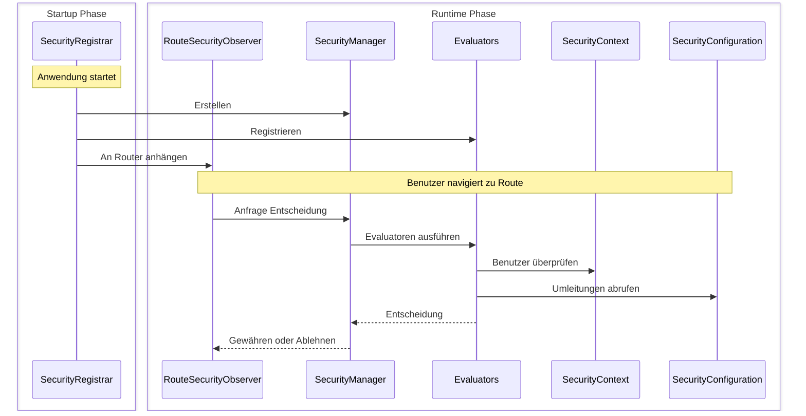

Dieser Leitfaden beschreibt den Aufbau einer vollständigen benutzerdefinierten Sicherheitsimplementierung unter Verwendung der sitzungsbasierten Authentifizierung. Sie werden lernen, wie die vier Kernschnittstellen zusammenarbeiten, indem Sie sie von Grund auf implementieren.

:::tip[Die meisten Apps sollten Spring Security verwenden]
Die [Spring Security Integration](/docs/security/getting-started) konfiguriert alles automatisch, was hier gezeigt wird. Erstellen Sie nur eine benutzerdefinierte Sicherheit, wenn Sie spezifische Anforderungen haben oder Spring Boot nicht verwenden.
:::

## Was Sie erstellen werden {#what-youll-build}

Ein funktionierendes Sicherheitssystem mit vier Klassen:

- **SecurityConfiguration** - Definiert das Sicherheitsverhalten und die Umleitungsstandorte
- **SecurityContext** - Verfolgt, wer mit HTTP-Sitzungen angemeldet ist
- **SecurityManager** - Koordiniert Sicherheitsprüfungen und ermöglicht Anmeldungen/Abmeldungen
- **SecurityRegistrar** - Verbindet alles beim Start der App

Dieses Beispiel verwendet sitzungsbasierten Speicher, aber Sie könnten dieselben Schnittstellen mit Datenbankabfragen, LDAP oder einem anderen Authentifizierungsbackend implementieren.

## Wie die Teile zusammenarbeiten {#how-the-pieces-work-together}



**Ablauf:**
1. **`SecurityRegistrar`** läuft beim Start der App, erstellt den Manager, registriert die Evaluatoren und fügt den Observer hinzu.
2. **`SecurityManager`** koordiniert alles - er versorgt die Evaluatoren mit Kontext und Konfiguration.
3. **`SecurityContext`** beantwortet die Frage "Wer ist angemeldet?" durch das Lesen der HTTP-Sitzungen.
4. **`SecurityConfiguration`** beantwortet die Frage "Wohin umleiten?" für Anmeldeseiten und Seiten mit verweigertem Zugriff.
5. **`Evaluators`** treffen Zugriffsentscheidungen unter Verwendung des Kontexts und der Konfiguration.

## Schritt 1: Sicherheitskonfiguration definieren {#step-1-define-security-configuration}

Die Konfiguration sagt dem Sicherheitssystem, wie es sich verhalten und wohin es die Benutzer umleiten soll:

```java title="SecurityConfiguration.java"
package com.securityplain.security;

import com.webforj.router.history.Location;
import com.webforj.router.security.RouteSecurityConfiguration;
import java.util.Optional;

/**
 * Sicherheitskonfiguration für die Anwendung.
 *
 * <p>
 * Definiert, wohin Benutzer umgeleitet werden, wenn Authentifizierung erforderlich ist oder der Zugriff verweigert wird.
 * </p>
 */
public class SecurityConfiguration implements RouteSecurityConfiguration {

  @Override
  public boolean isEnabled() {
    return true;
  }

  @Override
  public boolean isSecureByDefault() {
    return false;
  }

  @Override
  public Optional<Location> getAuthenticationLocation() {
    return Optional.of(new Location("/login"));
  }

  @Override
  public Optional<Location> getDenyLocation() {
    return Optional.of(new Location("/access-denied"));
  }
}
```

- `isEnabled() = true` - Sicherheit ist aktiv
- `isSecureByDefault() = false` - Routen sind öffentlich, es sei denn, sie sind annotiert (verwenden Sie `true`, um Authentifizierung standardmäßig für alle Routen zu verlangen)
- `/login` - Wo nicht authentifizierte Benutzer hingehen
- `/access-denied` - Wo authentifizierte Benutzer ohne Berechtigungen hingehen

## Schritt 2: Sicherheitskontext implementieren {#step-2-implement-security-context}

Der Kontext verfolgt, wer angemeldet ist. Diese Implementierung verwendet HTTP-Sitzungen, um Benutzerinformationen zu speichern:

<!-- vale off -->

<ExpandableCode title="SecurityContext.java" language="java">
{`package com.securityplain.security;

import com.webforj.Environment;
import com.webforj.router.security.RouteSecurityContext;
import java.util.HashMap;
import java.util.Map;
import java.util.Optional;
import java.util.Set;

/**
 * Einfacher sitzungsbasierter Sicherheitskontext.
 *
 * <p>
 * Speichert Benutzerhaupt und Rollen in der HTTP-Sitzung. Dies ist eine minimale Implementierung zu Lehrzwecken.
 * </p>
 */
public class SecurityContext implements RouteSecurityContext {
  private static final String SESSION_USER_KEY = "security.user";
  private static final String SESSION_ROLES_KEY = "security.roles";
  private static final String SESSION_ATTRS_KEY = "security.attributes";

  /**
   * {@inheritDoc}
   */
  @Override
  public boolean isAuthenticated() {
    return getPrincipal().isPresent();
  }

  /**
   * {@inheritDoc}
   */
  @Override
  public Optional<Object> getPrincipal() {
    return getSessionAttribute(SESSION_USER_KEY);
  }

  /**
   * {@inheritDoc}
   */
  @Override
  public boolean hasRole(String role) {
    Optional<Object> rolesObj = getSessionAttribute(SESSION_ROLES_KEY);
    if (rolesObj.isPresent() && rolesObj.get() instanceof Set) {
      @SuppressWarnings("unchecked")
      Set<String> roles = (Set<String>) rolesObj.get();
      return roles.contains(role);
    }
    return false;
  }

  /**
   * {@inheritDoc}
   */
  @Override
  public boolean hasAuthority(String authority) {
    // In dieser einfachen Implementierung sind Berechtigungen das gleiche wie Rollen
    return hasRole(authority);
  }

  /**
   * {@inheritDoc}
   */
  @Override
  public Optional<Object> getAttribute(String name) {
    Optional<Object> attrsObj = getSessionAttribute(SESSION_ATTRS_KEY);
    if (attrsObj.isPresent() && attrsObj.get() instanceof Map) {
      @SuppressWarnings("unchecked")
      Map<String, Object> attrs = (Map<String, Object>) attrsObj.get();
      return Optional.ofNullable(attrs.get(name));
    }
    return Optional.empty();
  }

  /**
   * {@inheritDoc}
   */
  @Override
  public void setAttribute(String name, Object value) {
    Environment.ifPresent(env -> {
      env.getSessionAccessor().ifPresent(accessor -> {
        accessor.access(session -> {
          @SuppressWarnings("unchecked")
          Map<String, Object> attrs =
              (Map<String, Object>) session.getAttribute(SESSION_ATTRS_KEY);
          if (attrs == null) {
            attrs = new HashMap<>();
            session.setAttribute(SESSION_ATTRS_KEY, attrs);
          }
          attrs.put(name, value);
        });
      });
    });
  }

  private Optional<Object> getSessionAttribute(String key) {
    final Object[] result = new Object[1];
    Environment.ifPresent(env -> {
      env.getSessionAccessor().ifPresent(accessor -> {
        accessor.access(session -> {
          result[0] = session.getAttribute(key);
        });
      });
    });
    return Optional.ofNullable(result[0]);
  }
}`}
</ExpandableCode>

<!-- vale on -->

**Wie es funktioniert:**

- `isAuthenticated()` überprüft, ob ein Benutzerhaupt in der Sitzung existiert
- `getPrincipal()` ruft den Benutzernamen aus dem Sitzungspeicher ab
- `hasRole()` überprüft, ob die Rollenset des Benutzers die angegebene Rolle enthält
- `getAttribute()` / `setAttribute()` verwalten benutzerdefinierte Sicherheitsattribute
- `Environment.getSessionAccessor()` bietet thread-sicheren Zugriff auf die Sitzung

## Schritt 3: Sicherheitsmanager erstellen {#step-3-create-security-manager}

Der Manager koordiniert Sicherheitsentscheidungen. Er erweitert `AbstractRouteSecurityManager`, welches die Evaluatorenketten und den Zugriff verweigert:

<!-- vale off -->

<ExpandableCode title="SecurityManager.java" language="java">
{`package com.securityplain.security;

import com.webforj.environment.ObjectTable;
import com.webforj.environment.SessionObjectTable;
import com.webforj.router.Router;
import com.webforj.router.security.AbstractRouteSecurityManager;
import com.webforj.router.security.RouteAccessDecision;
import com.webforj.router.security.RouteSecurityConfiguration;
import com.webforj.router.security.RouteSecurityContext;

import java.util.Set;

/**
 * Einfache Implementierung des Sicherheitsmanagers.
 *
 * <p>
 * Bietet statische Methoden für Anmelde-/Abmeldungsfunktionen und verwaltet den Sicherheitskontext.
 * </p>
 */
public class SecurityManager extends AbstractRouteSecurityManager {
  private static final String SESSION_USER_KEY = "security.user";
  private static final String SESSION_ROLES_KEY = "security.roles";

  /**
   * {@inheritDoc}
   */
  @Override
  public RouteSecurityConfiguration getConfiguration() {
    return new SecurityConfiguration();
  }

  /**
   * {@inheritDoc}
   */
  @Override
  public RouteSecurityContext getSecurityContext() {
    return new SecurityContext();
  }

  /**
   * Meldet einen Benutzer mit Rollen an.
   *
   * @param username der Benutzername
   * @param password das Passwort
   */
  public RouteAccessDecision login(String username, String password) {
    if ("user".equals(username) && "password".equals(password)) {
      Set<String> roles = Set.of("USER");
      persistUser(username, roles);
      return RouteAccessDecision.grant();
    } else if ("admin".equals(username) && "admin".equals(password)) {
      Set<String> roles = Set.of("USER", "ADMIN");
      persistUser(username, roles);
      return RouteAccessDecision.grant();
    }

    return RouteAccessDecision.deny("Ungültiger Benutzername oder Passwort");
  }

  /**
   * Meldet den aktuellen Benutzer ab und leitet zur Anmeldeseite um.
   */
  public void logout() {
    SessionObjectTable.clear(SESSION_USER_KEY);
    SessionObjectTable.clear(SESSION_ROLES_KEY);

    Router router = Router.getCurrent();
    if (router != null) {
      getConfiguration().getAuthenticationLocation().ifPresent(location -> router.navigate(location));
    }
  }

  /**
   * Gibt die aktuelle Managerinstanz zurück.
   *
   * @return die aktuelle Managerinstanz
   */
  public static SecurityManager getCurrent() {
    String key = SecurityManager.class.getName();
    if (ObjectTable.contains(key)) {
      return (SecurityManager) ObjectTable.get(key);
    }

    SecurityManager instance = new SecurityManager();
    ObjectTable.put(key, instance);

    return instance;
  }

  void saveCurrent(SecurityManager manager) {
    String key = SecurityManager.class.getName();
    ObjectTable.put(key, manager);
  }

  private void persistUser(String username, Set<String> roles) {
    SessionObjectTable.put(SESSION_USER_KEY, username);
    SessionObjectTable.put(SESSION_ROLES_KEY, roles);
  }
}`}
</ExpandableCode>

<!-- vale on -->

**Wie es funktioniert:**

- Erweitert `AbstractRouteSecurityManager`, um die Logik der Evaluatorenketten zu erben
- Bietet Implementierungen für `getConfiguration()` und `getSecurityContext()`
- Fügt `login()` hinzu, um Benutzer zu authentifizieren und Anmeldeinformationen in der Sitzung zu speichern
- Fügt `logout()` hinzu, um die Sitzung zu löschen und zur Anmeldeseite umzuleiten
- Verwendet [`SessionObjectTable`](/docs/advanced/object-string-tables#sessionobjecttable) für einfachen Sitzungspeicher
- Speichert sich selbst in [`ObjectTable`](/docs/advanced/object-string-tables#objecttable) für den Zugriff aus der gesamten App

## Schritt 4: Allen Komponenten beim Start verbinden {#step-4-wire-everything-at-startup}

Der Registrar verbindet alle Teile, wenn die App startet:

```java title="SecurityRegistrar.java"
package com.securityplain.security;

import com.webforj.App;
import com.webforj.AppLifecycleListener;
import com.webforj.annotation.AppListenerPriority;
import com.webforj.router.Router;
import com.webforj.router.security.RouteSecurityObserver;
import com.webforj.router.security.evaluator.AnonymousAccessEvaluator;
import com.webforj.router.security.evaluator.DenyAllEvaluator;
import com.webforj.router.security.evaluator.PermitAllEvaluator;
import com.webforj.router.security.evaluator.RolesAllowedEvaluator;

/**
 * Registriert Komponenten der Routen-Sicherheit während des Startvorgangs der Anwendung.
 *
 * <p>
 * Richtet den Sicherheitsmanager und die Evaluatoren mit dem Router ein.
 * </p>
 */
@AppListenerPriority(1)
public class SecurityRegistrar implements AppLifecycleListener {

  /**
   * {@inheritDoc}
   */
  @Override
  public void onWillRun(App app) {
    // Erstellen Sie den Sicherheitsmanager
    SecurityManager securityManager = new SecurityManager();
    securityManager.saveCurrent(securityManager);

    // Registrieren Sie integrierte Evaluatoren mit Prioritäten
    securityManager.registerEvaluator(new DenyAllEvaluator(), 0);
    securityManager.registerEvaluator(new AnonymousAccessEvaluator(), 1);
    securityManager.registerEvaluator(new PermitAllEvaluator(), 2);
    securityManager.registerEvaluator(new RolesAllowedEvaluator(), 3);

    // Erstellen Sie den Sicherheitsbeobachter und hängen Sie ihn an den Router an
    RouteSecurityObserver securityObserver = new RouteSecurityObserver(securityManager);
    Router router = Router.getCurrent();
    if (router != null) {
      router.getRenderer().addObserver(securityObserver);
    }
  }
}
```

**Registrieren Sie den Listener:**

Erstellen Sie `src/main/resources/META-INF/services/com.webforj.AppLifecycleListener` mit:

```text
com.securityplain.security.SecurityRegistrar
```

Dies registriert Ihren [`AppLifecycleListener`](/docs/advanced/lifecycle-listeners), sodass er beim Start der App ausgeführt wird.

**Wie es funktioniert:**

- Läuft früh (`@AppListenerPriority(1)`), um Sicherheit einzurichten, bevor Routen geladen werden
- Erstellt den Sicherheitsmanager und speichert ihn global
- Registriert integrierte Evaluatoren in der Prioritätsreihenfolge (niedrigere Nummern laufen zuerst)
- Erstellt den Observer, der die Navigation abfängt
- Hängt den Observer an den Router an, sodass Sicherheitsprüfungen automatisch durchgeführt werden

Nach dem Ausführen wird die Sicherheit für alle Navigationen aktiviert.

## Verwendung Ihrer Implementierung {#using-your-implementation}

### Erstellen Sie eine Anmeldeseite {#create-a-login-view}

Die folgende Ansicht verwendet die [`Login`](/docs/components/login) Komponente.

```java title="LoginView.java"
package com.securityplain.views;

import com.securityplain.security.SecurityManager;
import com.webforj.component.Composite;
import com.webforj.component.login.Login;
import com.webforj.router.Router;
import com.webforj.router.annotation.FrameTitle;
import com.webforj.router.annotation.Route;
import com.webforj.router.history.Location;
import com.webforj.router.security.annotation.AnonymousAccess;

@Route("/login")
@FrameTitle("Anmeldung")
@AnonymousAccess
public class LoginView extends Composite<Login> {
  private Login self = getBoundComponent();

  public LoginView() {
    self.onSubmit(e -> {
      var result = SecurityManager.getCurrent().login(
        e.getUsername(), e.getPassword()
      );
      
      if (result.isGranted()) {
        Router.getCurrent().navigate(new Location("/"));
      } else {
        self.setError(true);
        self.setEnabled(true);
      }
    });

    self.whenAttached().thenAccept(c -> self.open());
  }
}
```
