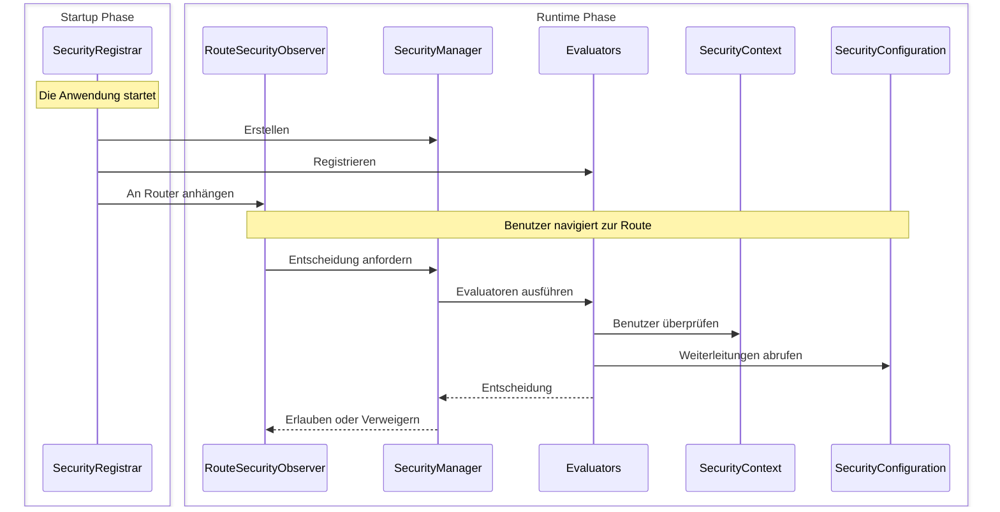

Dieser Leitfaden führt durch den Aufbau einer vollständigen benutzerdefinierten Sicherheitsimplementierung mit sitzungsbasierter Authentifizierung. Sie lernen, wie die vier Kernschnittstellen zusammenarbeiten, indem Sie sie von Grund auf neu implementieren.

:::tip[Die meisten Apps sollten Spring Security verwenden]
Die [Spring Security-Integration](/docs/security/getting-started) konfiguriert automatisch alles, was hier gezeigt wird. Erstellen Sie nur benutzerdefinierte Sicherheit, wenn Sie spezifische Anforderungen haben oder Spring Boot nicht verwenden.
:::

## Was Sie erstellen werden {#what-youll-build}

Ein funktionierendes Sicherheitssystem mit vier Klassen:

- **SecurityConfiguration** - Definiert das Sicherheitsverhalten und die Weiterleitungsstandorte
- **SecurityContext** - Verfolgt, wer mit HTTP-Sitzungen angemeldet ist
- **SecurityManager** - Koordiniert Sicherheitsüberprüfungen und bietet Anmeldungen/Abmeldungen
- **SecurityRegistrar** - Verkabelt alles zusammen beim Start der App

Dieses Beispiel verwendet sitzungsbasierte Speicherung, aber Sie könnten die gleichen Schnittstellen mit Datenbankabfragen, LDAP oder einem anderen Authentifizierungs-Backend implementieren.

## Wie die Komponenten zusammenarbeiten {#how-the-pieces-work-together}


```mermaid
sequenceDiagram
  box Startup Phase
  participant Registrar as SecurityRegistrar
  end
  box Runtime Phase
  participant Observer as RouteSecurityObserver
  participant Manager as SecurityManager
  participant Evaluators
  participant Context as SecurityContext
  participant Config as SecurityConfiguration
  end

  Note over Registrar: Die Anwendung startet
  Registrar->>Manager: Erstellen
  Registrar->>Evaluators: Registrieren
  Registrar->>Observer: An Router anhängen

  Note over Observer,Config: Benutzer navigiert zur Route
  Observer->>Manager: Entscheidung anfordern
  Manager->>Evaluators: Evaluatoren ausführen
  Evaluators->>Context: Benutzer überprüfen
  Evaluators->>Config: Weiterleitungen abrufen
  Evaluators-->>Manager: Entscheidung
  Manager-->>Observer: Erlauben oder Verweigern
```

**Ablauf:**
1. **`SecurityRegistrar`** läuft beim Start, erstellt den Manager, registriert Evaluatoren und hängt den Beobachter an
2. **`SecurityManager`** koordiniert alles - er stellt den Kontext und die Konfiguration für die Evaluatoren bereit
3. **`SecurityContext`** beantwortet die Frage "Wer ist angemeldet?" durch Lesen von HTTP-Sitzungen
4. **`SecurityConfiguration`** beantwortet die Frage "Wohin umleiten?" für Anmelde- und Zugriffsverweigerungsseiten
5. **`Evaluators`** treffen Zugriffsentscheidungen mithilfe des Kontextes und der Konfiguration

## Schritt 1: Sicherheitskonfiguration definieren {#step-1-define-security-configuration}

Die Konfiguration sagt dem Sicherheitssystem, wie es sich verhalten soll und wohin es Benutzer umleiten soll:

```java title="SecurityConfiguration.java"
package com.securityplain.security;

import com.webforj.router.history.Location;
import com.webforj.router.security.RouteSecurityConfiguration;
import java.util.Optional;

/**
 * Sicherheitskonfiguration für die Anwendung.
 *
 * <p>
 * Definiert, wohin Benutzer umgeleitet werden, wenn eine Authentifizierung erforderlich ist oder der Zugriff verweigert wird.
 * </p>
 */
public class SecurityConfiguration implements RouteSecurityConfiguration {

  @Override
  public boolean isEnabled() {
    return true;
  }

  @Override
  public boolean isSecureByDefault() {
    return false;
  }

  @Override
  public Optional<Location> getAuthenticationLocation() {
    return Optional.of(new Location("/login"));
  }

  @Override
  public Optional<Location> getDenyLocation() {
    return Optional.of(new Location("/access-denied"));
  }
}
```

- `isEnabled() = true` - Sicherheit ist aktiv
- `isSecureByDefault() = false` - Routen sind öffentlich, es sei denn, sie sind annotiert (verwenden Sie `true`, um die Authentifizierung für alle Routen standardmäßig zu verlangen)
- `/login` - Wohin nicht authentifizierte Benutzer gehen
- `/access-denied` - Wohin authentifizierte Benutzer ohne Berechtigungen gehen

## Schritt 2: Sicherheitskontext implementieren {#step-2-implement-security-context}

Der Kontext verfolgt, wer angemeldet ist. Diese Implementierung verwendet HTTP-Sitzungen, um Benutzerinformationen zu speichern:

<!-- vale off -->

<ExpandableCode title="SecurityContext.java" language="java">
{`package com.securityplain.security;

import com.webforj.Environment;
import com.webforj.router.security.RouteSecurityContext;
import java.util.HashMap;
import java.util.Map;
import java.util.Optional;
import java.util.Set;

/**
 * Einfacher sitzungsbasierter Sicherheitskontext.
 *
 * <p>
 * Speichert Benutzerprinzipal und Rollen in HTTP-Sitzungen. Dies ist eine minimale Implementierung zu Lehrzwecken.
 * </p>
 */
public class SecurityContext implements RouteSecurityContext {
  private static final String SESSION_USER_KEY = "security.user";
  private static final String SESSION_ROLES_KEY = "security.roles";
  private static final String SESSION_ATTRS_KEY = "security.attributes";

  /**
   * {@inheritDoc}
   */
  @Override
  public boolean isAuthenticated() {
    return getPrincipal().isPresent();
  }

  /**
   * {@inheritDoc}
   */
  @Override
  public Optional<Object> getPrincipal() {
    return getSessionAttribute(SESSION_USER_KEY);
  }

  /**
   * {@inheritDoc}
   */
  @Override
  public boolean hasRole(String role) {
    Optional<Object> rolesObj = getSessionAttribute(SESSION_ROLES_KEY);
    if (rolesObj.isPresent() && rolesObj.get() instanceof Set) {
      @SuppressWarnings("unchecked")
      Set<String> roles = (Set<String>) rolesObj.get();
      return roles.contains(role);
    }
    return false;
  }

  /**
   * {@inheritDoc}
   */
  @Override
  public boolean hasAuthority(String authority) {
    // In dieser einfachen Implementierung sind die Befugnisse gleich den Rollen
    return hasRole(authority);
  }

  /**
   * {@inheritDoc}
   */
  @Override
  public Optional<Object> getAttribute(String name) {
    Optional<Object> attrsObj = getSessionAttribute(SESSION_ATTRS_KEY);
    if (attrsObj.isPresent() && attrsObj.get() instanceof Map) {
      @SuppressWarnings("unchecked")
      Map<String, Object> attrs = (Map<String, Object>) attrsObj.get();
      return Optional.ofNullable(attrs.get(name));
    }
    return Optional.empty();
  }

  /**
   * {@inheritDoc}
   */
  @Override
  public void setAttribute(String name, Object value) {
    Environment.ifPresent(env -> {
      env.getSessionAccessor().ifPresent(accessor -> {
        accessor.access(session -> {
          @SuppressWarnings("unchecked")
          Map<String, Object> attrs =
              (Map<String, Object>) session.getAttribute(SESSION_ATTRS_KEY);
          if (attrs == null) {
            attrs = new HashMap<>();
            session.setAttribute(SESSION_ATTRS_KEY, attrs);
          }
          attrs.put(name, value);
        });
      });
    });
  }

  private Optional<Object> getSessionAttribute(String key) {
    final Object[] result = new Object[1];
    Environment.ifPresent(env -> {
      env.getSessionAccessor().ifPresent(accessor -> {
        accessor.access(session -> {
          result[0] = session.getAttribute(key);
        });
      });
    });
    return Optional.ofNullable(result[0]);
  }
}`}
</ExpandableCode>

<!-- vale on -->

**Wie es funktioniert:**

- `isAuthenticated()` überprüft, ob ein Benutzerprinzipal in der Sitzung vorhanden ist
- `getPrincipal()` ruft den Benutzernamen aus der Sitzungsspeicherung ab
- `hasRole()` prüft, ob die Rollensammlung des Benutzers die angegebene Rolle enthält
- `getAttribute()` / `setAttribute()` verwalten benutzerdefinierte Sicherheitsattribute
- `Environment.getSessionAccessor()` bietet thread-sicheren Zugriff auf die Sitzung

## Schritt 3: Sicherheitsmanager erstellen {#step-3-create-security-manager}

Der Manager koordiniert Sicherheitsentscheidungen. Er erweitert `AbstractRouteSecurityManager`, das die Evaluatorenketten und Zugriffsverweigerungen behandelt:

<!-- vale off -->

<ExpandableCode title="SecurityManager.java" language="java">
{`package com.securityplain.security;

import com.webforj.environment.ObjectTable;
import com.webforj.environment.SessionObjectTable;
import com.webforj.router.Router;
import com.webforj.router.security.AbstractRouteSecurityManager;
import com.webforj.router.security.RouteAccessDecision;
import com.webforj.router.security.RouteSecurityConfiguration;
import com.webforj.router.security.RouteSecurityContext;

import java.util.Set;

/**
 * Einfache Implementierung des Sicherheitsmanagers.
 *
 * <p>
 * Bietet statische Methoden für Anmeldung/Abmeldung und verwaltet den Sicherheitskontext.
 * </p>
 */
public class SecurityManager extends AbstractRouteSecurityManager {
  private static final String SESSION_USER_KEY = "security.user";
  private static final String SESSION_ROLES_KEY = "security.roles";

  /**
   * {@inheritDoc}
   */
  @Override
  public RouteSecurityConfiguration getConfiguration() {
    return new SecurityConfiguration();
  }

  /**
   * {@inheritDoc}
   */
  @Override
  public RouteSecurityContext getSecurityContext() {
    return new SecurityContext();
  }

  /**
   * Meldet einen Benutzer mit Rollen an.
   *
   * @param username der Benutzername
   * @param password das Passwort
   */
  public RouteAccessDecision login(String username, String password) {
    if ("user".equals(username) && "password".equals(password)) {
      Set<String> roles = Set.of("USER");
      persistUser(username, roles);
      return RouteAccessDecision.grant();
    } else if ("admin".equals(username) && "admin".equals(password)) {
      Set<String> roles = Set.of("USER", "ADMIN");
      persistUser(username, roles);
      return RouteAccessDecision.grant();
    }

    return RouteAccessDecision.deny("Ungültiger Benutzername oder Passwort");
  }

  /**
   * Meldet den aktuellen Benutzer ab und leitet zur Anmeldeseite weiter.
   */
  public void logout() {
    SessionObjectTable.clear(SESSION_USER_KEY);
    SessionObjectTable.clear(SESSION_ROLES_KEY);

    Router router = Router.getCurrent();
    if (router != null) {
      getConfiguration().getAuthenticationLocation().ifPresent(location -> router.navigate(location));
    }
  }

  /**
   * Holen Sie sich die aktuelle Instanz des Managers.
   *
   * @return die aktuelle Instanz des Managers
   */
  public static SecurityManager getCurrent() {
    String key = SecurityManager.class.getName();
    if (ObjectTable.contains(key)) {
      return (SecurityManager) ObjectTable.get(key);
    }

    SecurityManager instance = new SecurityManager();
    ObjectTable.put(key, instance);

    return instance;
  }

  void saveCurrent(SecurityManager manager) {
    String key = SecurityManager.class.getName();
    ObjectTable.put(key, manager);
  }

  private void persistUser(String username, Set<String> roles) {
    SessionObjectTable.put(SESSION_USER_KEY, username);
    SessionObjectTable.put(SESSION_ROLES_KEY, roles);
  }
}`}
</ExpandableCode>

<!-- vale on -->

**Wie es funktioniert:**

- Erweitert `AbstractRouteSecurityManager`, um die Logik der Evaluatorenketten zu erben
- Bietet Implementierungen für `getConfiguration()` und `getSecurityContext()`
- Fügt `login()` hinzu, um Benutzer zu authentifizieren und Anmeldeinformationen in der Sitzung zu speichern
- Fügt `logout()` hinzu, um die Sitzung zu leeren und zur Anmeldeseite weiterzuleiten
- Verwendet [`SessionObjectTable`](/docs/advanced/object-string-tables#sessionobjecttable) für einfachen Sitzungspeicher
- Speichert sich selbst in [`ObjectTable`](/docs/advanced/object-string-tables#objecttable) für den zugriff auf die gesamte App

## Schritt 4: Alles beim Start verbinden {#step-4-wire-everything-at-startup}

Der Registrar verbindet alle Teile, wenn die App startet:

```java title="SecurityRegistrar.java"
package com.securityplain.security;

import com.webforj.App;
import com.webforj.AppLifecycleListener;
import com.webforj.annotation.AppListenerPriority;
import com.webforj.router.Router;
import com.webforj.router.security.RouteSecurityObserver;
import com.webforj.router.security.evaluator.AnonymousAccessEvaluator;
import com.webforj.router.security.evaluator.DenyAllEvaluator;
import com.webforj.router.security.evaluator.PermitAllEvaluator;
import com.webforj.router.security.evaluator.RolesAllowedEvaluator;

/**
 * Registriert Routensicherheitselemente während des Anwendungsstarts.
 *
 * <p>
 * Richten Sie den Sicherheitsmanager und Evaluatoren mit dem Router ein.
 * </p>
 */
@AppListenerPriority(1)
public class SecurityRegistrar implements AppLifecycleListener {

  /**
   * {@inheritDoc}
   */
  @Override
  public void onWillRun(App app) {
    // Sicherheitsmanager erstellen
    SecurityManager securityManager = new SecurityManager();
    securityManager.saveCurrent(securityManager);

    // Eingebaute Evaluatoren mit Prioritäten registrieren
    securityManager.registerEvaluator(new DenyAllEvaluator(), 0);
    securityManager.registerEvaluator(new AnonymousAccessEvaluator(), 1);
    securityManager.registerEvaluator(new PermitAllEvaluator(), 2);
    securityManager.registerEvaluator(new RolesAllowedEvaluator(), 3);

    // Sicherheitsbeobachter erstellen und an Router anhängen
    RouteSecurityObserver securityObserver = new RouteSecurityObserver(securityManager);
    Router router = Router.getCurrent();
    if (router != null) {
      router.getRenderer().addObserver(securityObserver);
    }
  }
}
```

**Registrieren Sie den Listener:**

Erstellen Sie `src/main/resources/META-INF/services/com.webforj.AppLifecycleListener` mit:

```text
com.securityplain.security.SecurityRegistrar
```

Dies registriert Ihren [`AppLifecycleListener`](/docs/advanced/lifecycle-listeners), damit er beim App-Start läuft.

**Wie es funktioniert:**

- Läuft früh (`@AppListenerPriority(1)`), um die Sicherheit einzurichten, bevor die Routen geladen werden
- Erstellt den Sicherheitsmanager und speichert ihn global
- Registriert eingebaute Evaluatoren in der Prioritätsreihenfolge (niedrigere Zahlen werden zuerst ausgeführt)
- Erstellt den Beobachter, der die Navigation abfängt
- Fügt den Beobachter dem Router hinzu, damit Sicherheitsüberprüfungen automatisch erfolgen

Nachdem dies ausgeführt wurde, ist die Sicherheit bei allen Navigationen aktiv.

## Verwendung Ihrer Implementierung {#using-your-implementation}

### Erstellen Sie eine Anmeldeseite {#create-a-login-view}

Die folgende Ansicht verwendet die [`Login`](/docs/components/login) Komponente.

```java title="LoginView.java"
package com.securityplain.views;

import com.securityplain.security.SecurityManager;
import com.webforj.component.Composite;
import com.webforj.component.login.Login;
import com.webforj.router.Router;
import com.webforj.router.annotation.FrameTitle;
import com.webforj.router.annotation.Route;
import com.webforj.router.history.Location;
import com.webforj.router.security.annotation.AnonymousAccess;

@Route("/login")
@FrameTitle("Anmelden")
@AnonymousAccess
public class LoginView extends Composite<Login> {
  private final Login self = getBoundComponent();

  public LoginView() {
    self.onSubmit(e -> {
      var result = SecurityManager.getCurrent().login(
        e.getUsername(), e.getPassword()
      );

      if (result.isGranted()) {
        Router.getCurrent().navigate(new Location("/"));
      } else {
        self.setError(true);
        self.setEnabled(true);
      }
    });

    self.whenAttached().thenAccept(c -> self.open());
  }
}
```
