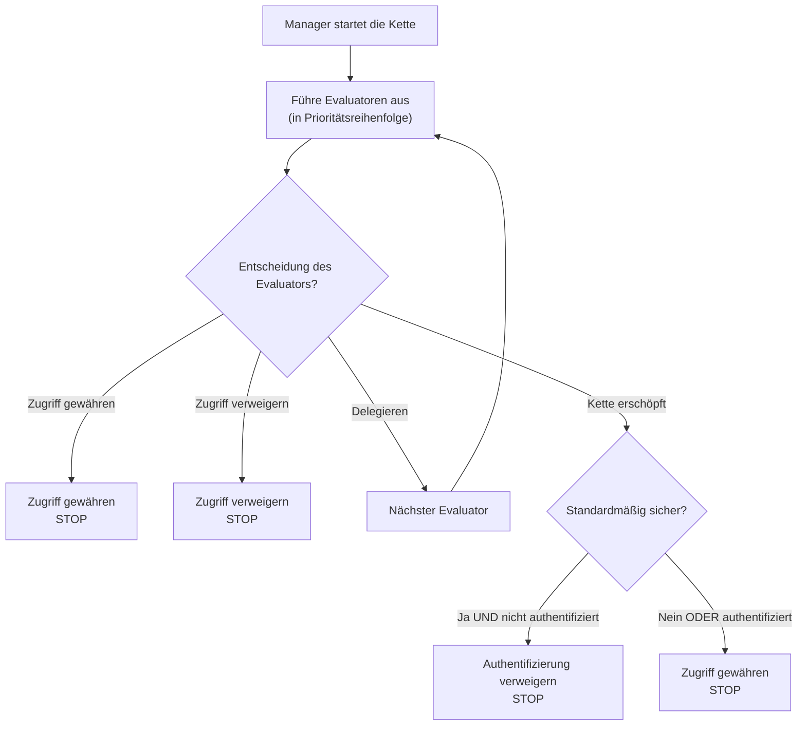

Die Evaluator-Kette ist das Herz des Sicherheitssystems von webforJ. Es handelt sich um eine priorisierte Sequenz von Evaluatoren, die Routen untersuchen und Zugangsbeschlüsse mithilfe des Entwurfsmusters der Verantwortungskette fassen. Zu verstehen, wie die Kette funktioniert, hilft Ihnen, benutzerdefinierte Evaluatoren zu erstellen und unerwartete Zugangsbeschränkungen zu beheben.

## Das Muster der Verantwortungskette {#the-chain-of-responsibility-pattern}

Die Evaluator-Kette nutzt das Muster der Verantwortungskette, bei dem jeder Evaluator in der Sequenz entweder eine Navigationsanfrage bearbeiten oder sie an den nächsten Evaluator weiterleiten kann. Dies schafft ein System, in dem die Sicherheitslogik auf mehrere spezialisierte Evaluatoren verteilt ist, anstatt in einem einzigen monolithischen Prüfer zentralisiert zu sein.

Wenn eine Route bewertet werden muss, erstellt der Sicherheitsmanager eine Kette und startet sie beim ersten Evaluator. Dieser Evaluator prüft die Route und trifft eine von drei Entscheidungen:

1. **Zugang gewähren:** Der Evaluator genehmigt die Route und gibt sofort zurück. Es werden keine weiteren Evaluatoren ausgeführt.
2. **Zugang verweigern:** Der Evaluator blockiert die Route und gibt sofort zurück. Es werden keine weiteren Evaluatoren ausgeführt.
3. **Delegieren:** Der Evaluator trifft keine Entscheidung und ruft `chain.evaluate()` auf, um die Kontrolle an den nächsten Evaluator zu übergeben.

Dieses Muster ermöglicht es den Evaluatoren, sich auf spezifische Fälle zu konzentrieren. Jeder Evaluator implementiert `supports(Class<?> routeClass)`, um anzugeben, welche Routen er behandelt. Zum Beispiel wird der `AnonymousAccessEvaluator` nur für mit `@AnonymousAccess` markierte Routen ausgeführt, der Manager ruft ihn nie für andere Routen auf.

## Wie die Kette aufgebaut wird {#how-the-chain-is-built}

Der Sicherheitsmanager verwaltet eine Liste registrierter Evaluatoren, von denen jeder eine zugehörige Priorität hat. Wenn eine Route bewertet werden muss, sortiert der Manager die Evaluatoren nach Priorität (niedrigere Zahlen zuerst) und erstellt eine Kette.

Evaluatoren werden mithilfe der Methode `registerEvaluator()` des Managers registriert:

```java
// Registriere integrierte Evaluatoren
securityManager.registerEvaluator(new DenyAllEvaluator(), 0);
securityManager.registerEvaluator(new AnonymousAccessEvaluator(), 1);
securityManager.registerEvaluator(new PermitAllEvaluator(), 2);
securityManager.registerEvaluator(new RolesAllowedEvaluator(), 3);

// Registriere benutzerdefinierte Evaluatoren
securityManager.registerEvaluator(new SubscriptionEvaluator(), 10);
```

Die Priorität bestimmt die Reihenfolge der Bewertung. Niedrigere Prioritäten werden zuerst ausgeführt, was ihnen die erste Gelegenheit gibt, Zugangsbeschlüsse zu fassen. Dies ist wichtig für die Sicherheit, da es kritischen Evaluatoren ermöglicht, den Zugang zu blockieren, bevor nachsichtige Evaluatoren ihn gewähren können.

Die Kette ist zustandslos und wird für jede Navigationsanfrage neu erstellt, damit die Bewertung einer Navigation eine andere nicht beeinflusst.

## Ausführungsfluss der Kette {#chain-execution-flow}

Wenn die Kette startet, beginnt sie beim ersten Evaluator (niedrigste Priorität) und verläuft sequentiell:



Die Kette stoppt, sobald ein Evaluator den Zugang gewährt oder verweigert. Wenn alle Evaluatoren delegieren, erschöpft sich die Kette und fällt auf ein sicheres Verhalten zurück.

## Reihenfolge der integrierten Evaluatoren {#built-in-evaluator-ordering}

Vier integrierte Evaluatoren behandeln Standardannotation:

| Evaluator | Annotation | Verhalten | Kettenverhalten | Typische Reihenfolge |
|-----------|------------|----------|----------------|---------------|
| `DenyAllEvaluator` | `@DenyAll` | Blockiert immer den Zugriff | Stoppt Kette (terminal) | Wird zuerst ausgeführt |
| `AnonymousAccessEvaluator` | `@AnonymousAccess` | Erlaubt jedem (authentifiziert oder nicht) | Stoppt Kette (terminal) | Wird früh ausgeführt |
| `PermitAllEvaluator` | `@PermitAll` | Erfordert Authentifizierung, erlaubt allen authentifizierten Benutzern | Stoppt Kette (terminal) | Wird in der Mitte der Kette ausgeführt |
| `RolesAllowedEvaluator` | `@RolesAllowed` | Erfordert Authentifizierung und spezielle Rolle | **Fährt mit der Kette fort** (komponierbar) | Wird später ausgeführt |

:::note
Genau Prioritätszahlen werden während der Registrierung der Evaluatoren zugewiesen und unterscheiden sich zwischen Implementierungen. Siehe [Spring Security](/docs/security/getting-started) oder [Benutzerdefinierte Implementierung](/docs/security/architecture/custom-implementation#securityregistrar) für spezifische Werte.
:::

## Wie Evaluatoren delegieren {#how-evaluators-delegate}

Bevor ein Evaluator aufgerufen wird, ruft der Manager seine Methode `supports(Class<?> routeClass)` auf. Nur Evaluatoren, die `true` zurückgeben, werden aufgerufen. Diese Filterung zwingt die Evaluatoren, nur für Routen auszuführen, für die sie konzipiert sind.

Wenn ein Evaluator aufgerufen wird, kann er entweder:
- **Eine Entscheidung treffen:** Gewähren oder verweigern zurückgeben, um die Kette zu stoppen
- **Delegieren:** `chain.evaluate()` aufrufen, um die Kontrolle an den nächsten Evaluator in der Prioritätssequenz weiterzugeben

Zum Beispiel überprüft der `RolesAllowedEvaluator`, ob der Benutzer die erforderliche Rolle besitzt. Wenn ja, ruft er `chain.evaluate()` auf, um weitere Prüfungen durch höher priorisierte Evaluatoren zu ermöglichen. Diese aktive Delegation ermöglicht die Zusammensetzung von Evaluatoren.

Terminalevaluatoren wie `PermitAllEvaluator` treffen endgültige Entscheidungen, ohne die Kette aufzurufen, was eine weitere Bewertung verhindert.

## Wenn die Kette erschöpft ist {#when-the-chain-exhausts}

Wenn jeder Evaluator delegiert und keiner eine Entscheidung trifft, erschöpft sich die Kette, es gibt keine weiteren Evaluatoren, die ausgeführt werden können. Zu diesem Zeitpunkt wendet das Sicherheitssystem eine Rückfallregel basierend auf der Konfiguration `isSecureByDefault()` an:

**Standardmäßig sicher aktiviert** (`isSecureByDefault() == true`):
- Wenn der Benutzer authentifiziert ist: Zugriff gewähren
- Wenn der Benutzer nicht authentifiziert ist: Verweigern mit erforderlicher Authentifizierung

**Standardmäßig sicher deaktiviert** (`isSecureByDefault() == false`):
- Zugriff gewähren, unabhängig von der Authentifizierung

Routen ohne Sicherheitsannotation haben dennoch ein definiertes Verhalten. Wenn standardmäßig sicher aktiviert ist, erfordern nicht annotierte Routen eine Authentifizierung. Wenn es deaktiviert ist, sind nicht annotierte Routen öffentlich.

## Prioritäten benutzerdefinierter Evaluatoren {#custom-evaluator-priorities}

Bei der Erstellung benutzerdefinierter Evaluatoren sollten Sie die Prioritäten sorgfältig wählen:

- **0-9**: Reserviert für Core-Framework-Evaluatoren. Vermeiden Sie die Verwendung dieser Prioritäten, es sei denn, Sie ersetzen integrierte Evaluatoren.
- **10-99**: Empfohlen für benutzerdefinierte Geschäftslogik-Evaluatoren. Diese werden nach den core Evaluatoren, aber vor generischen Rückfallevaluatoren ausgeführt.

Beispiel:

```java title="SubscriptionEvaluator.java"
// Benutzerdefinierter Evaluator für abonnementbasierten Zugriff
@RegisteredEvaluator(priority = 10)
public class SubscriptionEvaluator implements RouteSecurityEvaluator {
  @Override
  public boolean supports(Class<?> routeClass) {
    return routeClass.isAnnotationPresent(RequiresSubscription.class);
  }

  @Override
  public RouteAccessDecision evaluate(Class<?> routeClass,
                                       NavigationContext context,
                                       RouteSecurityContext securityContext,
                                       SecurityEvaluatorChain chain) {
    // Überprüfen, ob der Benutzer ein aktives Abonnement hat
    boolean hasSubscription = checkSubscription(securityContext);

    if (!hasSubscription) {
      return RouteAccessDecision.deny("Aktives Abonnement erforderlich");
    }

    // Benutzer hat Abonnement - Kette für zusätzliche Prüfungen fortsetzen
    return chain.evaluate(routeClass, context, securityContext);
  }
}
```

Dieser Evaluator wird mit Priorität 10 ausgeführt, nach den core Evaluatoren. Wenn der Benutzer ein aktives Abonnement hat, delegiert er an die Kette, sodass eine Komposition mit anderen Evaluatoren möglich ist.

## Komposition von Evaluatoren {#evaluator-composition}

Die meisten integrierten Evaluatoren sind **terminal**, sie treffen eine endgültige Entscheidung und stoppen die Kette. Nur `RolesAllowedEvaluator` setzt die Kette fort, nachdem der Zugang gewährt wurde, und ermöglicht die Komposition mit benutzerdefinierten Evaluatoren.

**Terminal-Evaluatoren (können nicht komponiert werden):**
- `@DenyAll`: Verweigert immer, stoppt die Kette
- `@AnonymousAccess`: Gewährt immer, stoppt die Kette
- `@PermitAll`: Gewährt authentifizierten Benutzern, stoppt die Kette

**Komponierbare Evaluatoren:**
- `@RolesAllowed`: Wenn der Benutzer die Rolle hat, **setzt die Kette fort**, um weitere Prüfungen zuzulassen

### Funktionierende Komposition {#composition-that-works}

Sie können `@RolesAllowed` mit benutzerdefinierten Evaluatoren komponieren:

```java
@Route("/premium-admin")
@RolesAllowed("ADMIN")  // Überprüft die Rolle und fährt dann mit der Kette fort
@RequiresSubscription   // Benutzerdefinierte Prüfung erfolgt nach der Rollenüberprüfung
public class PremiumAdminView extends Composite<Div> {
  // Erfordert ADMIN-Rolle UND aktives Abonnement
}
```

Ablauf:
1. `RolesAllowedEvaluator` überprüft, ob der Benutzer die `ADMIN`-Rolle hat
2. Wenn ja, ruft er `chain.evaluate()` auf, um fortzufahren
3. `SubscriptionEvaluator` überprüft den Abonnementstatus (wird später in der Kette ausgeführt)
4. Wenn das Abonnement aktiv ist, wird der Zugang gewährt; andernfalls wird er verweigert

### Nicht funktionierende Komposition {#composition-that-does-not-work}

Sie **können** `@PermitAll` nicht mit anderen Evaluatoren kombinieren, da es die Kette stoppt:

```java
@Route("/wrong")
@PermitAll           // Gewährt sofort, stoppt die Kette
@RolesAllowed("ADMIN")  // Wird NIEMALS ausgeführt!
public class WrongView extends Composite<Div> {
  // Dies gewährt den Zugang zu JEDEM authentifizierten Benutzer
  // @RolesAllowed wird ignoriert
}
```

`PermitAllEvaluator` wird zuerst ausgeführt (registriert mit niedrigerer Priorität), gewährt jedem authentifizierten Benutzer Zugang und gibt zurück, ohne `chain.evaluate()` aufzurufen. Der `RolesAllowedEvaluator` wird niemals ausgeführt.
