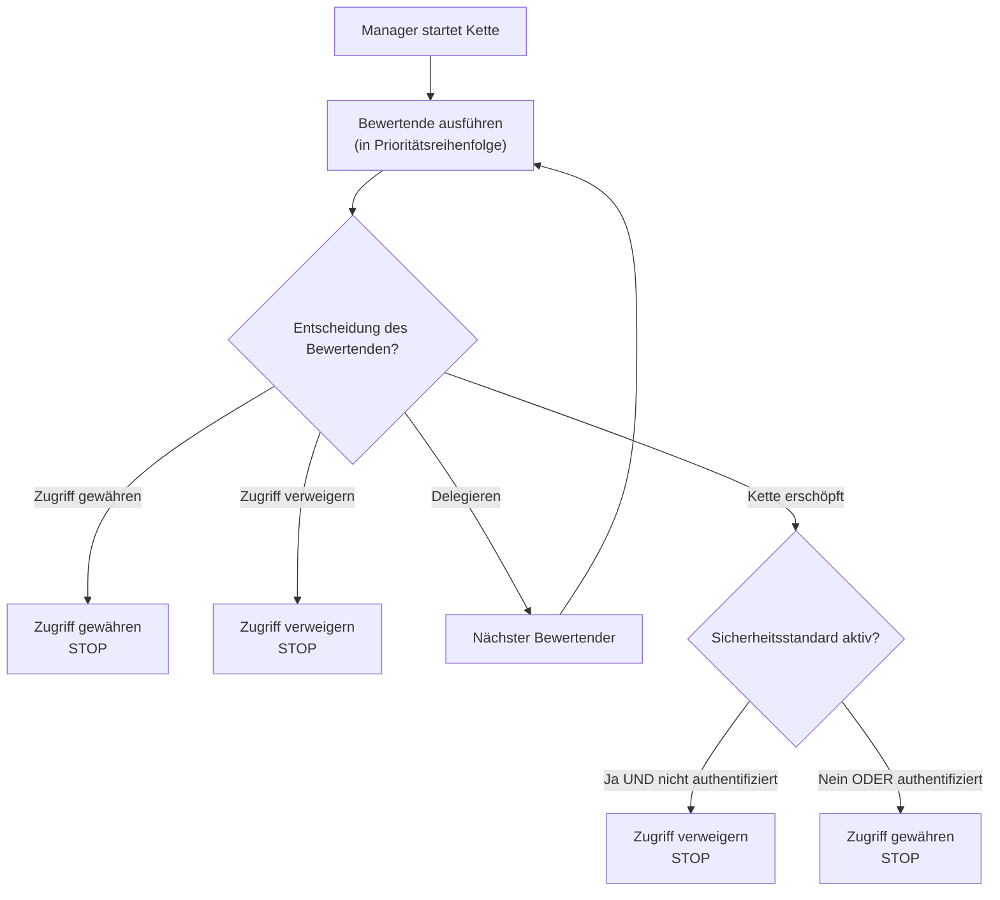

Die Bewertungskette ist das Herz des Sicherheitssystems von webforJ. Es handelt sich um eine priorisierte Reihenfolge von Bewertenden, die Routen prüfen und Zugriffsentscheidungen unter Verwendung des Entwurfsmusters Chain of Responsibility treffen. Das Verständnis der Funktionsweise der Kette hilft Ihnen dabei, benutzerdefinierte Bewertende zu erstellen und unerwartete Zugriffsverweigerungen zu beheben.

## Das Chain of Responsibility-Muster {#the-chain-of-responsibility-pattern}

Die Bewertungskette verwendet das Chain of Responsibility-Muster, bei dem jeder Bewertende in der Reihenfolge entweder eine Navigationsanfrage bearbeiten oder an den nächsten Bewertenden weitergeben kann. Dies schafft ein System, in dem die Sicherheitslogik über mehrere spezialisierte Bewertende verteilt ist, anstatt in einem einzigen monolithischen Prüfer zentralisiert zu sein.

Wenn eine Route bewertet werden muss, erstellt der Sicherheitsmanager eine Kette und startet sie beim ersten Bewertenden. Dieser Bewertende prüft die Route und trifft eine der drei Entscheidungen:

1. **Zugriff gewähren:** Der Bewertende genehmigt die Route und gibt sofort zurück. Kein weiterer Bewertender wird ausgeführt.
2. **Zugriff verweigern:** Der Bewertende blockiert die Route und gibt sofort zurück. Kein weiterer Bewertender wird ausgeführt.
3. **Delegieren:** Der Bewertende trifft keine Entscheidung und ruft `chain.evaluate()` auf, um die Kontrolle an den nächsten Bewertenden weiterzugeben.

Dieses Muster ermöglicht es den Bewertenden, sich auf spezifische Fälle zu konzentrieren. Jeder Bewertende implementiert `supports(Class<?> routeClass)`, um anzuzeigen, welche Routen er bearbeitet. Zum Beispiel läuft `AnonymousAccessEvaluator` nur für Routen, die mit `@AnonymousAccess` gekennzeichnet sind; der Manager ruft ihn niemals für andere Routen auf.

## Wie die Kette aufgebaut wird {#how-the-chain-is-built}

Der Sicherheitsmanager führt eine Liste registrierter Bewertender, jeder mit einer zugehörigen Priorität. Wenn eine Route bewertet werden muss, sortiert der Manager die Bewertenden nach Priorität (niedrigere Zahlen zuerst) und erstellt eine Kette.

Bewertende werden mit der Methode `registerEvaluator()` des Managers registriert:

```java
// Registrieren von eingebauten Bewertenden
securityManager.registerEvaluator(new DenyAllEvaluator(), 0);
securityManager.registerEvaluator(new AnonymousAccessEvaluator(), 1);
securityManager.registerEvaluator(new PermitAllEvaluator(), 2);
securityManager.registerEvaluator(new RolesAllowedEvaluator(), 3);

// Registrieren von benutzerdefinierten Bewertenden
securityManager.registerEvaluator(new SubscriptionEvaluator(), 10);
```

Die Priorität bestimmt die Reihenfolge der Bewertung. Niedrigere Prioritäten laufen zuerst, was ihnen die erste Gelegenheit gibt, Zugriffsentscheidungen zu treffen. Dies ist wichtig für die Sicherheit, da es kritischen Bewertenden ermöglicht, den Zugriff zu blockieren, bevor großzügige Bewertende ihn gewähren können.

Die Kette ist zustandslos und wird für jede Navigationsanfrage neu erstellt, sodass die Bewertung einer Navigation die einer anderen nicht beeinflusst.

## Ausführung der Kette {#chain-execution-flow}

Wenn die Kette gestartet wird, beginnt sie beim ersten Bewertenden (niedrigste Priorität) und verläuft sequenziell:



Die Kette stoppt, sobald ein Bewertender Zugriff gewährt oder verweigert. Wenn alle Bewertenden delegieren, ist die Kette erschöpft und fällt auf das Standardverhalten "sicherheitsorientiert" zurück.

## Reihenfolge der eingebauten Bewertenden {#built-in-evaluator-ordering}

Vier integrierte Bewertende verarbeiten Standardannotationen:

| Bewertender | Annotation | Verhalten | Verhalten der Kette | Typische Reihenfolge |
|-------------|------------|-----------|---------------------|----------------------|
| `DenyAllEvaluator` | `@DenyAll` | Blockiert immer den Zugriff | Stoppt die Kette (terminal) | Läuft zuerst |
| `AnonymousAccessEvaluator` | `@AnonymousAccess` | Erlaubt allen (authentifiziert oder nicht) | Stoppt die Kette (terminal) | Läuft früh |
| `PermitAllEvaluator` | `@PermitAll` | Benötigt Authentifizierung, erlaubt allen authentifizierten Benutzern | Stoppt die Kette (terminal) | Läuft in der Mitte der Kette |
| `RolesAllowedEvaluator` | `@RolesAllowed` | Benötigt Authentifizierung und spezifische Rolle | **Setzt Kette fort** (komponierbar) | Läuft später |

:::note
Die genauen Prioritätszahlen werden während der Registrierung der Bewertenden zugewiesen und unterscheiden sich zwischen den Implementierungen. Siehe [Spring Security](/docs/security/getting-started) oder [Benutzerdefinierte Implementierung](/docs/security/architecture/custom-implementation) für spezifische Werte.
:::

## Wie Bewertende delegieren {#how-evaluators-delegate}

Vor der Invokation eines Bewertenden ruft der Manager die Methode `supports(Class<?> routeClass)` auf. Nur Bewertende, die `true` zurückgeben, werden aufgerufen. Diese Filterung zwingt die Bewertenden dazu, nur für Routen ausgeführt zu werden, für die sie ausgelegt sind.

Wenn ein Bewertender aufgerufen wird, kann er entweder:
- **Eine Entscheidung treffen**: Gewähren oder verweigern, um die Kette zu stoppen
- **Delegieren**: `chain.evaluate()` aufrufen, um die Kontrolle an den nächsten Bewertenden in der Prioritätsreihenfolge weiterzugeben

Zum Beispiel prüft `RolesAllowedEvaluator`, ob der Benutzer die erforderliche Rolle hat. Wenn ja, ruft er `chain.evaluate()` auf, um weiteren Prüfungen durch höherpriorisierte Bewertende zu ermöglichen. Diese aktive Delegation ermöglicht die Zusammensetzung von Bewertenden.

Terminale Bewertende wie `PermitAllEvaluator` treffen endgültige Entscheidungen, ohne die Kette aufzurufen, was eine weitere Bewertung verhindert.

## Wenn die Kette erschöpft ist {#when-the-chain-exhausts}

Wenn jeder Bewertende delegiert und keiner eine Entscheidung trifft, ist die Kette erschöpft und es gibt keine Bewertenden mehr, die ausgeführt werden können. In diesem Fall wendet das Sicherheitssystem eine Rückfallregel an, die auf der Konfiguration `isSecureByDefault()` basiert:

**Sicherheit standardmäßig aktiviert** (`isSecureByDefault() == true`):
- Wenn der Benutzer authentifiziert ist: Zugriff gewähren
- Wenn der Benutzer nicht authentifiziert ist: Verweigern mit erforderlicher Authentifizierung

**Sicherheit standardmäßig deaktiviert** (`isSecureByDefault() == false`):
- Zugriff gewähren, unabhängig von der Authentifizierung

Routen ohne Sicherheitsannotationen haben dennoch definiertes Verhalten. Bei aktivierter Sicherheitsstandard-Option erfordern unannotierte Routen eine Authentifizierung. Bei deaktivierter Sicherheitsstandard-Option sind unannotierte Routen öffentlich.

## Prioritäten benutzerdefinierter Bewertender {#custom-evaluator-priorities}

Bei der Erstellung benutzerdefinierter Bewertender sollten Sie die Prioritäten sorgfältig wählen:

- **0-9**: Reserviert für Bewertende des Kernrahmenwerks. Vermeiden Sie die Verwendung dieser Prioritäten, es sei denn, Sie ersetzen eingebaute Bewertende.
- **10-99**: Empfohlen für benutzerdefinierte Bewertende für Geschäftslogik. Diese laufen nach den Kernbewertenden, aber vor generischen Rückfallmechanismen.

Beispiel:

```java title="SubscriptionEvaluator.java"
// Benutzerdefinierter Bewertender für den abonnementbasierten Zugang
@RegisteredEvaluator(priority = 10)
public class SubscriptionEvaluator implements RouteSecurityEvaluator {
  @Override
  public boolean supports(Class<?> routeClass) {
    return routeClass.isAnnotationPresent(RequiresSubscription.class);
  }

  @Override
  public RouteAccessDecision evaluate(Class<?> routeClass,
                                       NavigationContext context,
                                       RouteSecurityContext securityContext,
                                       SecurityEvaluatorChain chain) {
    // Überprüfen, ob der Benutzer ein aktives Abonnement hat
    boolean hasSubscription = checkSubscription(securityContext);

    if (!hasSubscription) {
      return RouteAccessDecision.deny("Aktives Abonnement erforderlich");
    }

    // Benutzer hat ein Abonnement - Kette für zusätzliche Prüfungen fortsetzen
    return chain.evaluate(routeClass, context, securityContext);
  }
}
```

Dieser Bewertende läuft mit der Priorität 10, nach den Kernbewertenden. Wenn der Benutzer ein aktives Abonnement hat, delegiert er an die Kette und ermöglicht die Zusammensetzung mit anderen Bewertenden.

## Zusammensetzung von Bewertenden {#evaluator-composition}

Die meisten eingebauten Bewertenden sind **terminal**, sie treffen eine finale Entscheidung und stoppen die Kette. Nur `RolesAllowedEvaluator` setzt die Kette fort, nachdem er Zugriff gewährt hat, was eine Zusammensetzung mit benutzerdefinierten Bewertenden ermöglicht.

**Terminale Bewertende (können nicht zusammengesetzt werden):**
- `@DenyAll`: Verweigert immer, stoppt die Kette
- `@AnonymousAccess`: Gewährt immer, stoppt die Kette
- `@PermitAll`: Gewährt authentifizierten Benutzern Zugriff, stoppt die Kette

**Komponierbare Bewertende:**
- `@RolesAllowed`: Wenn der Benutzer die Rolle hat, **setzt die Kette fort**, um weitere Prüfungen zu ermöglichen

### Funktionierende Zusammensetzung {#composition-that-works}

Sie können `@RolesAllowed` mit benutzerdefinierten Bewertenden kombinieren:

```java
@Route("/premium-admin")
@RolesAllowed("ADMIN")  // Überprüft Rolle, setzt dann die Kette fort
@RequiresSubscription   // Benutzerdefinierte Prüfung erfolgt nach der Rollenprüfung
public class PremiumAdminView extends Composite<Div> {
  // Benötigt ADMIN-Rolle UND aktives Abonnement
}
```

Ablauf:
1. `RolesAllowedEvaluator` prüft, ob der Benutzer die Rolle `ADMIN` hat
2. Wenn ja, ruft er `chain.evaluate()` auf, um fortzufahren
3. `SubscriptionEvaluator` prüft den Abonnementstatus (läuft später in der Kette)
4. Wenn das Abonnement aktiv ist, wird Zugriff gewährt; andernfalls wird der Zugriff verweigert

### Zusammensetzung, die nicht funktioniert {#composition-that-does-not-work}

Sie **können** `@PermitAll` nicht mit anderen Bewertenden kombinieren, da es die Kette stoppt:

```java
@Route("/wrong")
@PermitAll           // Gewährt sofort, stoppt die Kette
@RolesAllowed("ADMIN")  // LÄUFT NIE!
public class WrongView extends Composite<Div> {
  // Dies gewährt den Zugriff für JEDEN authentifizierten Benutzer
  // @RolesAllowed wird ignoriert
}
```

`PermitAllEvaluator` läuft zuerst (registriert mit niedrigerer Priorität), gewährt Zugriff für jeden authentifizierten Benutzer und gibt zurück, ohne `chain.evaluate()` aufzurufen. Der `RolesAllowedEvaluator` wird niemals ausgeführt.
