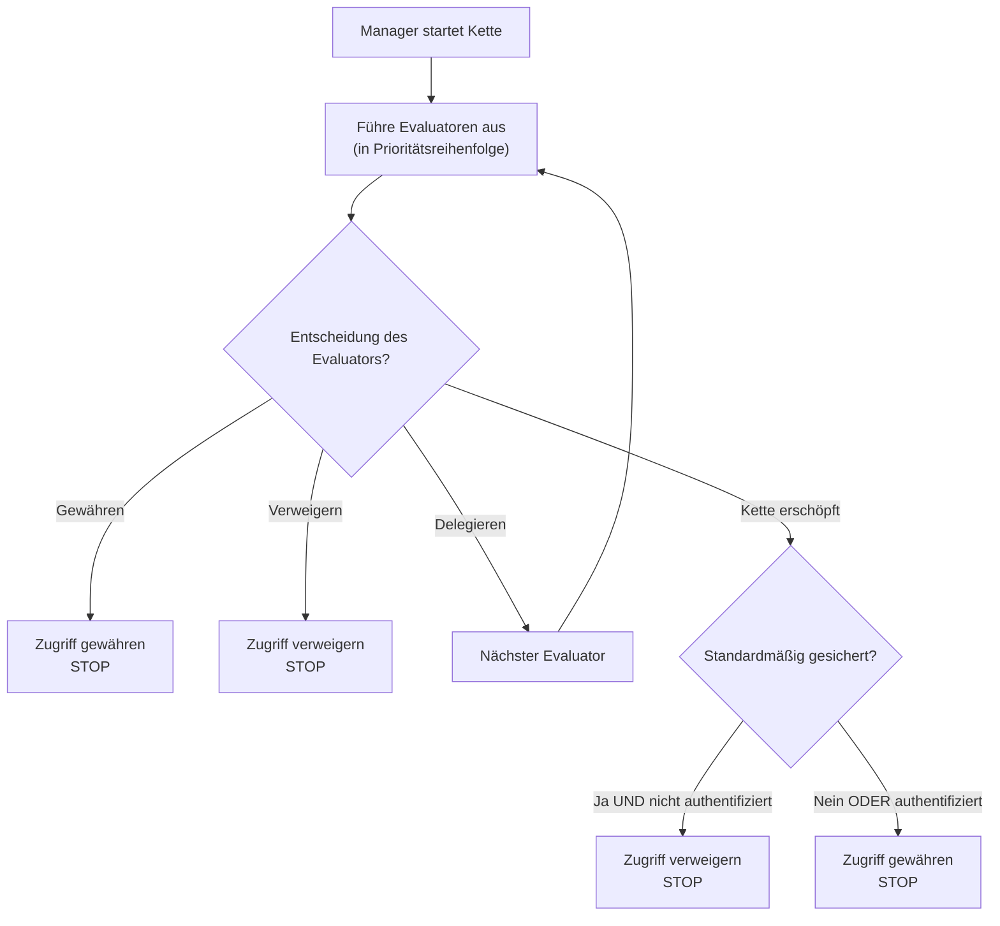

Die Evaluator-Kette ist das Herzstück des Sicherheitssystems von webforJ. Sie ist eine prioritätsgeordnete Sequenz von Evaluatoren, die Routen überprüfen und Zugangsentscheidungen anhand des Entwurfsmusters der Verantwortungskette treffen. Zu verstehen, wie die Kette funktioniert, hilft Ihnen, benutzerdefinierte Evaluatoren zu erstellen und unerwartete Zugriffverweigerungen zu beheben.

## Das Muster der Verantwortungskette {#the-chain-of-responsibility-pattern}

Die Evaluator-Kette verwendet das Muster der Verantwortungskette, bei dem jeder Evaluator in der Sequenz entweder eine Navigationsanfrage bearbeiten oder an den nächsten Evaluator weiterleiten kann. Dies schafft ein System, in dem die Sicherheitslogik auf mehrere spezialisierte Evaluatoren verteilt ist, anstatt in einem einzigen monolithischen Prüfer zentralisiert zu sein.

Wenn eine Route bewertet werden muss, erstellt der Sicherheitsmanager eine Kette und startet sie beim ersten Evaluator. Dieser Evaluator prüft die Route und trifft eine von drei Entscheidungen:

1. **Zugriff gewähren:** Der Evaluator genehmigt die Route und gibt sofort zurück. Keine weiteren Evaluatoren werden ausgeführt.
2. **Zugriff verweigern:** Der Evaluator blockiert die Route und gibt sofort zurück. Keine weiteren Evaluatoren werden ausgeführt.
3. **Delegieren:** Der Evaluator trifft keine Entscheidung und ruft `chain.evaluate()` auf, um die Kontrolle an den nächsten Evaluator zu übergeben.

Dieses Muster ermöglicht es den Evaluatoren, sich auf spezifische Fälle zu konzentrieren. Jeder Evaluator implementiert `supports(Class<?> routeClass)`, um anzuzeigen, welche Routen er behandelt. Zum Beispiel wird `AnonymousAccessEvaluator` nur für Routen ausgeführt, die mit `@AnonymousAccess` gekennzeichnet sind, der Manager ruft ihn nie für andere Routen auf.

## Wie die Kette erstellt wird {#how-the-chain-is-built}

Der Sicherheitsmanager pflegt eine Liste registrierter Evaluatoren, jeder mit einer zugehörigen Priorität. Wenn eine Route bewertet werden muss, sortiert der Manager die Evaluatoren nach Priorität (niedrigere Zahlen zuerst) und erstellt eine Kette.

Evaluatoren werden mit der Methode `registerEvaluator()` des Managers registriert:

```java
// Registriere integrierte Evaluatoren
securityManager.registerEvaluator(new DenyAllEvaluator(), 0);
securityManager.registerEvaluator(new AnonymousAccessEvaluator(), 1);
securityManager.registerEvaluator(new PermitAllEvaluator(), 2);
securityManager.registerEvaluator(new RolesAllowedEvaluator(), 3);

// Registriere benutzerdefinierte Evaluatoren
securityManager.registerEvaluator(new SubscriptionEvaluator(), 10);
```

Die Priorität bestimmt die Reihenfolge der Bewertung. Niedrigere Prioritäten werden zuerst ausgeführt, was ihnen die erste Gelegenheit gibt, Zugriffsentscheidungen zu treffen. Dies ist für die Sicherheit wichtig, da es kritischen Evaluatoren ermöglicht, den Zugriff zu blockieren, bevor nachsichtige Evaluatoren ihn gewähren können.

Die Kette ist zustandslos und wird für jede Navigationsanfrage frisch erstellt, sodass die Bewertung einer Navigation die einer anderen nicht beeinflusst.

## Ablauf der Kettenausführung {#chain-execution-flow}

Wenn die Kette startet, beginnt sie beim ersten Evaluator (niedrigste Priorität) und verläuft sequenziell:


```mermaid
flowchart TD
  Start["Manager startet Kette"] --> Eval["Führe Evaluatoren aus<br/>(in Prioritätsreihenfolge)"]

  Eval --> Check{"Entscheidung des Evaluators?"}
  Check -->|Gewähren| Grant["Zugriff gewähren<br/>STOP"]
  Check -->|Verweigern| Deny["Zugriff verweigern<br/>STOP"]
  Check -->|Delegieren| Next["Nächster Evaluator"]

  Next --> Eval

  Check -->|Kette erschöpft| Default{"Standardmäßig gesichert?"}
  Default -->|Ja UND nicht authentifiziert| DenyDefault["Zugriff verweigern<br/>STOP"]
  Default -->|Nein ODER authentifiziert| GrantDefault["Zugriff gewähren<br/>STOP"]
```

Die Kette stoppt, sobald ein Evaluator den Zugriff gewährt oder verweigert. Wenn alle Evaluatoren delegieren, erschöpft sich die Kette und fällt auf das standardmäßig sichere Verhalten zurück.

## Reihenfolge der integrierten Evaluatoren {#built-in-evaluator-ordering}

Vier integrierte Evaluatoren behandeln Standardannotations:

| Evaluator | Annotation | Verhalten | Kettenverhalten | Typische Reihenfolge |
|-----------|------------|----------|----------------|---------------------|
| `DenyAllEvaluator` | `@DenyAll` | Blockiert immer den Zugriff | Stoppt Kette (terminal) | Wird als erstes ausgeführt |
| `AnonymousAccessEvaluator` | `@AnonymousAccess` | Erlaubt jedem (authentifiziert oder nicht) | Stoppt Kette (terminal) | Wird früh ausgeführt |
| `PermitAllEvaluator` | `@PermitAll` | Erfordert Authentifizierung, erlaubt allen authentifizierten Benutzern | Stoppt Kette (terminal) | Wird in der Mitte der Kette ausgeführt |
| `RolesAllowedEvaluator` | `@RolesAllowed` | Erfordert Authentifizierung und bestimmte Rolle | **Fährt mit der Kette fort** (komponierbar) | Wird später ausgeführt |

:::note
Genau Prioritätsnummern werden während der Registrierung von Evaluatoren vergeben und können zwischen Implementierungen variieren. Siehe [Spring Security](/docs/security/getting-started) oder [Benutzerdefinierte Implementierung](/docs/security/architecture/custom-implementation) für spezifische Werte.
:::

## Wie Evaluatoren delegieren {#how-evaluators-delegate}

Bevor ein Evaluator aufgerufen wird, ruft der Manager seine Methode `supports(Class<?> routeClass)` auf. Nur Evaluatoren, die `true` zurückgeben, werden aufgerufen. Diese Filterung zwingt die Evaluatoren, nur für Routen ausgeführt zu werden, für die sie entworfen wurden.

Wenn ein Evaluator aufgerufen wird, kann er entweder:
- **Eine Entscheidung treffen:** Gewähre oder verweigere zurückgeben, um die Kette zu stoppen
- **Delegieren:** `chain.evaluate()` aufrufen, um die Kontrolle an den nächsten Evaluator in der Prioritätssequenz zu übergeben

Zum Beispiel prüft `RolesAllowedEvaluator`, ob der Benutzer die erforderliche Rolle hat. Wenn ja, ruft er `chain.evaluate()` auf, um weiteren Prüfungen durch Evaluatoren mit höherer Priorität zuzulassen. Diese aktive Delegation ermöglicht die Zusammensetzung von Evaluatoren.

Terminal-Evaluatoren wie `PermitAllEvaluator` treffen endgültige Entscheidungen, ohne die Kette aufzurufen, was eine weitere Bewertung verhindert.

## Wann die Kette erschöpft {#when-the-chain-exhausts}

Wenn jeder Evaluator delegiert und keiner eine Entscheidung trifft, erschöpft sich die Kette, es gibt keine weiteren Evaluatoren mehr. In diesem Fall wendet das Sicherheitssystem eine Rückfallregel an, die auf der Konfiguration `isSecureByDefault()` basiert:

**Standardmäßig gesichert aktiviert** (`isSecureByDefault() == true`):
- Wenn der Benutzer authentifiziert ist: Zugriff gewähren
- Wenn der Benutzer nicht authentifiziert ist: Verweigern mit erforderlicher Authentifizierung

**Standardmäßig gesichert deaktiviert** (`isSecureByDefault() == false`):
- Zugriff gewähren, unabhängig von der Authentifizierung

Routen ohne Sicherheitsannotationen haben dennoch definiertes Verhalten. Bei aktivem Standardmäßig gesichert erfordert nicht annotierte Routen eine Authentifizierung. Bei deaktiviertem Standard sind nicht annotierte Routen öffentlich.

## Prioritäten für benutzerdefinierte Evaluatoren {#custom-evaluator-priorities}

Bei der Erstellung benutzerdefinierter Evaluatoren sollten Sie Prioritäten sorgfältig wählen:

- **0-9**: Reserviert für Kernframework-Evaluatoren. Vermeiden Sie die Verwendung dieser Prioritäten, es sei denn, Sie ersetzen integrierte Evaluatoren.
- **10-99**: Empfohlen für benutzerdefinierte Geschäftslogik-Evaluatoren. Diese werden nach den Kernevaluatoren, aber vor allgemeinen Rückfallevaluatoren ausgeführt.

Beispiel:

```java title="SubscriptionEvaluator.java"
// Benutzerdefinierter Evaluator für abonnementsbasierte Zugriffe
@RegisteredEvaluator(priority = 10)
public class SubscriptionEvaluator implements RouteSecurityEvaluator {
  @Override
  public boolean supports(Class<?> routeClass) {
    return routeClass.isAnnotationPresent(RequiresSubscription.class);
  }

  @Override
  public RouteAccessDecision evaluate(Class<?> routeClass,
                                       NavigationContext context,
                                       RouteSecurityContext securityContext,
                                       SecurityEvaluatorChain chain) {
    // Prüfen, ob der Benutzer ein aktives Abonnement hat
    boolean hasSubscription = checkSubscription(securityContext);

    if (!hasSubscription) {
      return RouteAccessDecision.deny("Aktives Abonnement erforderlich");
    }

    // Benutzer hat Abonnement - Kette für zusätzliche Checks fortsetzen
    return chain.evaluate(routeClass, context, securityContext);
  }
}
```

Dieser Evaluator läuft mit Priorität 10, nach den Kernevaluatoren. Hat der Benutzer ein aktives Abonnement, delegiert er an die Kette, was die Zusammensetzung mit anderen Evaluatoren ermöglicht.

## Zusammensetzung von Evaluatoren {#evaluator-composition}

Die meisten integrierten Evaluatoren sind **terminal**, sie treffen eine endgültige Entscheidung und stoppen die Kette. Nur `RolesAllowedEvaluator` setzt die Kette nach der Gewährung von Zugriff fort und ermöglicht die Zusammensetzung mit benutzerdefinierten Evaluatoren.

**Terminal-Evaluatoren (können nicht komponiert werden):**
- `@DenyAll`: Verweigert immer, stoppt die Kette
- `@AnonymousAccess`: Gewährt immer, stoppt die Kette
- `@PermitAll`: Gewährt authentifizierten Benutzern, stoppt die Kette

**Komponierbare Evaluatoren:**
- `@RolesAllowed`: Wenn der Benutzer die Rolle hat, **setzt die Kette fort**, um weitere Prüfungen zuzulassen

### Zusammensetzung, die funktioniert {#composition-that-works}

Sie können `@RolesAllowed` mit benutzerdefinierten Evaluatoren zusammensetzen:

```java
@Route("/premium-admin")
@RolesAllowed("ADMIN")  // Prüft Rolle, dann Kette fortsetzen
@RequiresSubscription   // Benutzerdefinierte Prüfung erfolgt nach der Rollenprüfung
public class PremiumAdminView extends Composite<Div> {
  // Erfordert ADMIN-Rolle UND aktives Abonnement
}
```

Ablauf:
1. `RolesAllowedEvaluator` prüft, ob der Benutzer die Rolle `ADMIN` hat
2. Wenn ja, ruft er `chain.evaluate()` auf, um fortzufahren
3. `SubscriptionEvaluator` prüft den Abonnementstatus (wird später in der Kette ausgeführt)
4. Ist das Abonnement aktiv, wird der Zugriff gewährt; andernfalls wird verweigert

### Zusammensetzung, die nicht funktioniert {#composition-that-does-not-work}

Sie **können** `@PermitAll` nicht mit anderen Evaluatoren kombinieren, da dies die Kette stoppt:

```java
@Route("/wrong")
@PermitAll           // Gewährt sofort, stoppt die Kette
@RolesAllowed("ADMIN")  // WIRD NIE ausgeführt!
public class WrongView extends Composite<Div> {
  // Dies gewährt Zugriff für JEDEN authentifizierten Benutzer
  // @RolesAllowed wird ignoriert
}
```

`PermitAllEvaluator` wird zuerst ausgeführt (mit niedrigerer Priorität registriert), gewährt den Zugriff für jeden authentifizierten Benutzer und gibt zurück, ohne `chain.evaluate()` aufzurufen. Der `RolesAllowedEvaluator` wird niemals ausgeführt.
