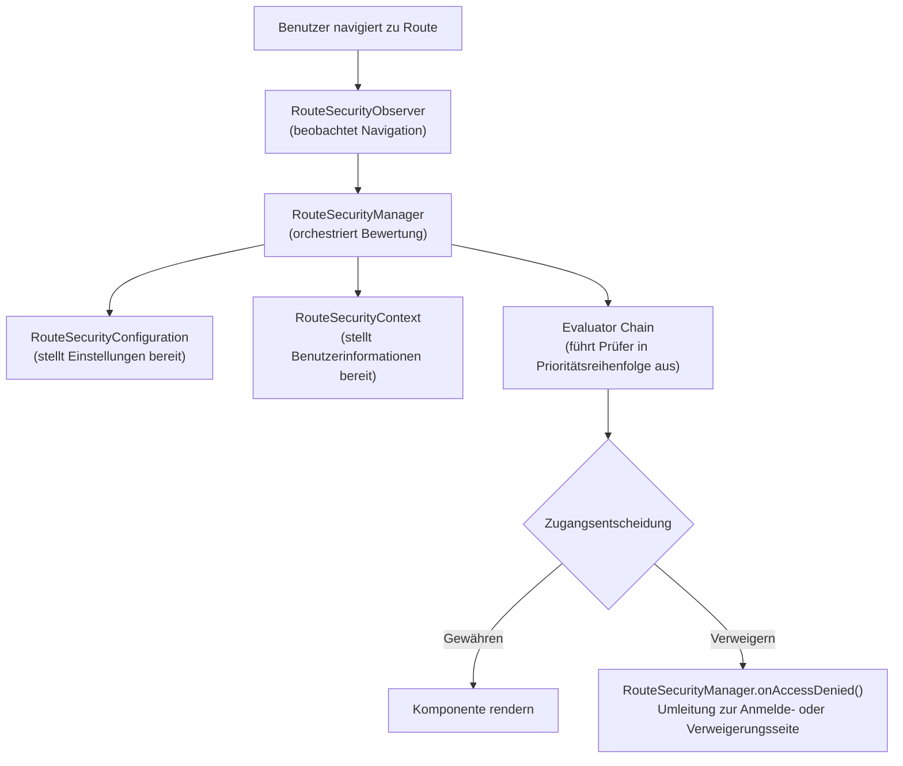

Das webforJ-Sicherheitssystem basiert auf einer Grundlage von Kernschnittstellen, die zusammenarbeiten, um eine Zugriffssteuerung auf Routenebene bereitzustellen. Diese Schnittstellen definieren die Verträge für das Sicherheitsverhalten, wodurch verschiedene Implementierungen – sei es sitzungsbasiert, auf JSON Web Tokens (JWT) basierend, LDAP-integriert oder datenbankgestützt – in das gleiche zugrunde liegende Framework integriert werden können.

Das Verständnis dieser Architektur hilft Ihnen zu erkennen, wie Sicherheitsannotationen wie `@RolesAllowed` und `@PermitAll` bewertet werden, wie die Navigation abgerufen wird und wie Sie benutzerdefinierte Sicherheitsimplementierungen für Ihre spezifischen Anforderungen erstellen können.

## Die Kernschnittstellen {#the-four-core-interfaces}

Die Sicherheitsgrundlage basiert auf wichtigen Abstraktionen, von denen jede eine spezifische Verantwortung hat:

### `RouteSecurityManager` {#routesecuritymanager}

Der `RouteSecurityManager` ist der zentrale Koordinator des Sicherheitssystems. Er verwaltet Sicherheitsprüfer, orchestriert den Bewertungsprozess und behandelt den Zugang verweigert, indem er Benutzer auf die entsprechenden Seiten umleitet.

**Verantwortlichkeiten:**

- Registrieren und Verwalten von Sicherheitsprüfern mit Prioritäten
- Koordinieren des Bewertungsprozesses, wenn ein Benutzer zu einer Route navigiert
- Handhaben von Zugangsverweigerungen, indem Umleitungen zu Anmelde- oder Zugang verweigert-Seiten ausgelöst werden
- Speichern und Abrufen von vorab authentifizierten Standorten für Umleitungen nach der Anmeldung

```java
public interface RouteSecurityManager {
  RouteAccessDecision evaluate(Class<?> routeClass, NavigationContext context);
  void onAccessDenied(RouteAccessDecision decision, NavigationContext context);
  RouteSecurityContext getSecurityContext();
  RouteSecurityConfiguration getConfiguration();
  void registerEvaluator(RouteSecurityEvaluator evaluator, int priority);
  Optional<Location> consumePreAuthenticationLocation();
}
```

Der Manager trifft keine Sicherheitsentscheidungen selbst, sondern delegiert an Prüfer und Konfiguration. Er ist das Bindeglied, das alle Sicherheitskomponenten verbindet.

### `RouteSecurityContext` {#routesecuritycontext}

Der `RouteSecurityContext` bietet Zugriff auf den Authentifizierungsstatus des aktuellen Benutzers. Er beantwortet Fragen wie, ob der Benutzer authentifiziert ist, wie sein Benutzername lautet und ob er die Rolle `ADMIN` hat.

**Verantwortlichkeiten:**

- Bestimmen, ob der aktuelle Benutzer authentifiziert ist
- Bereitstellen des Benutzers (typischerweise sein Benutzername oder Benutzerobjekt)
- Überprüfen, ob der Benutzer spezifische Rollen oder Befugnisse hat
- Speichern und Abrufen von benutzerdefinierten Sicherheitsattributen

```java
public interface RouteSecurityContext {
  boolean isAuthenticated();
  Optional<Object> getPrincipal();
  boolean hasRole(String role);
  boolean hasAuthority(String authority);
  Optional<Object> getAttribute(String name);
  void setAttribute(String name, Object value);
}
```

Die Implementierungen variieren je nach Authentifizierungssystem, Speicherung der HTTP-Sitzung, JWT-Token, die aus Headern dekodiert werden, Datenbankabfragen, LDAP-Suchvorgänge oder andere Mechanismen.

### `RouteSecurityConfiguration` {#routesecurityconfiguration}

Die `RouteSecurityConfiguration` definiert das Sicherheitsverhalten und Umleitungsstandorte. Sie gibt dem Sicherheitssystem an, wohin Benutzer geleitet werden sollen, wenn eine Authentifizierung erforderlich ist oder der Zugang verweigert wird.

**Verantwortlichkeiten:**

- Definieren, ob Sicherheit aktiviert ist
- Sicherstellen eines sicheren Standards
- Bereitstellen des Standorts der Anmeldeseite (typischerweise `/login`)
- Bereitstellen des Standorts der Zugangsverweigerungsseite

```java
public interface RouteSecurityConfiguration {
  default boolean isEnabled() { return true; }
  default boolean isSecureByDefault() { return true; }
  default Optional<Location> getAuthenticationLocation() {
    return Optional.of(new Location("/login"));
  }
  default Optional<Location> getDenyLocation() { /* ... */ }
}
```

Diese Schnittstelle trennt die Sicherheitsrichtlinie von der Sicherheitsdurchsetzung. Sie können Umleitungsstandorte ändern oder einen sicheren Standard aktivieren, ohne den Manager oder die Prüfer zu ändern.

### `RouteSecurityEvaluator` {#routesecurityevaluator}

Der `RouteSecurityEvaluator` ist der Ort, an dem die tatsächlichen Sicherheitsregeln überprüft werden. Jeder Prüfer untersucht eine Route und entscheidet, ob der Zugang gewährt, verweigert oder die Entscheidung an den nächsten Prüfer in der Kette delegiert wird.

**Verantwortlichkeiten:**

- Bestimmen, ob dieser Prüfer die angegebene Route behandelt
- Bewerten von Sicherheitsannotationen in der Routenklasse
- Zugang gewähren, Zugang verweigern oder an den nächsten Prüfer delegieren
- Teilnahme am Muster der Verantwortlichkeit

```java
public interface RouteSecurityEvaluator {
  RouteAccessDecision evaluate(Class<?> routeClass,
                                NavigationContext context,
                                RouteSecurityContext securityContext,
                                SecurityEvaluatorChain chain);
  default boolean supports(Class<?> routeClass) { return true; }
}
```

Integrierte Prüfer behandeln Standardannotationen wie `@RolesAllowed`, `@PermitAll`, `@DenyAll` und `@AnonymousAccess`. Sie können benutzerdefinierte Prüfer erstellen, um domänenspezifische Sicherheitslogik zu implementieren.

## Wie die Schnittstellen zusammenarbeiten {#how-the-interfaces-work-together}

Diese vier Schnittstellen arbeiten während der Navigation zusammen, um Sicherheitsregeln durchzusetzen:



Wenn ein Benutzer navigiert, unterbricht der `RouteSecurityObserver` die Navigation und bittet den `RouteSecurityManager`, den Zugang zu bewerten. Der Manager konsultiert die `RouteSecurityConfiguration` für Einstellungen, erhält Benutzerinformationen vom `RouteSecurityContext` und führt jeden `RouteSecurityEvaluator` in Prioritätsreihenfolge aus, bis einer eine Entscheidung trifft.

## Schnittstellen als Verträge {#the-interfaces-as-contracts}

Jede Schnittstelle definiert einen Vertrag, eine Reihe von Fragen, die das Sicherheitssystem beantwortet haben muss. **Wie** Sie diese Fragen beantworten, liegt an Ihrer Implementierungsentscheidung:

**Vertrag von `RouteSecurityContext`:**

- "Ist der aktuelle Benutzer authentifiziert?" (`isAuthenticated()`)
- "Wer ist der Benutzer?" (`getPrincipal()`)
- "Hat der Benutzer die Rolle X?" (`hasRole()`)

Sie entscheiden, woher diese Informationen stammen: HTTP-Sitzungen, JWT-Token, die aus Headern dekodiert werden, Datenbankabfragen, LDAP-Abfragen oder andere Authentifizierungsbackends.

**Vertrag von `RouteSecurityConfiguration`:**

- "Ist Sicherheit aktiviert?" (`isEnabled()`)
- "Sollten Routen standardmäßig sicher sein?" (`isSecureByDefault()`)
- "Wohin sollten nicht authentifizierte Benutzer gehen?" (`getAuthenticationLocation()`)

Sie entscheiden, wie Sie diese Werte beziehen: hartcodiert, aus Konfigurationsdateien, aus Umgebungsvariablen, aus einer Datenbank oder dynamisch berechnet.

**Vertrag von `RouteSecurityManager`:**

- "Sollte dieser Benutzer auf diese Route zugreifen?" (`evaluate()`)
- "Was passiert, wenn der Zugang verweigert wird?" (`onAccessDenied()`)
- "Welche Prüfer sollten ausgeführt werden?" (`registerEvaluator()`)

Sie entscheiden über den Authentifizierungsfluss, wo vorab authentifizierte Standorte gespeichert werden und wie mit benutzerdefinierten Verweigerungsszenarien umzugehen ist.

Die grundlegende Architektur definiert diese Verträge, jedoch ist die Implementierung flexibel. Verschiedene Systeme können diese Schnittstellen auf völlig unterschiedliche Weise implementieren, basierend auf spezifischen Anforderungen.

## Die `AbstractRouteSecurityManager` Basisklasse {#the-abstractroutesecuritymanager-base-class}

Die meisten Implementierungen implementieren `RouteSecurityManager` nicht direkt. Stattdessen erweitern sie `AbstractRouteSecurityManager`, das Folgendes bereitstellt:

- Registrierung von Prüfern und Prioritätsbasierte Sortierung
- Logik zur Kettenausführung
- Handhaben von Zugangsverweigerungen mit automatischen Umleitungen
- Speicherung vorab authentifizierter Standorte in der HTTP-Sitzung
- Sicherer Standardverhalten

Die Basisklasse implementiert die Schnittstelle `RouteSecurityManager` und bietet konkrete Implementierungen für die Verwaltung von Prüfern, den Zugangsevaluierungsprozess und die Handhabung von Verweigerungen. Unterklassen müssen nur den Sicherheitskontext und die Konfiguration bereitstellen. Die Basisklasse übernimmt automatisch die Verwaltung von Prüfern, die Ausführung von Ketten und die Handhabung von Verweigerungen.
