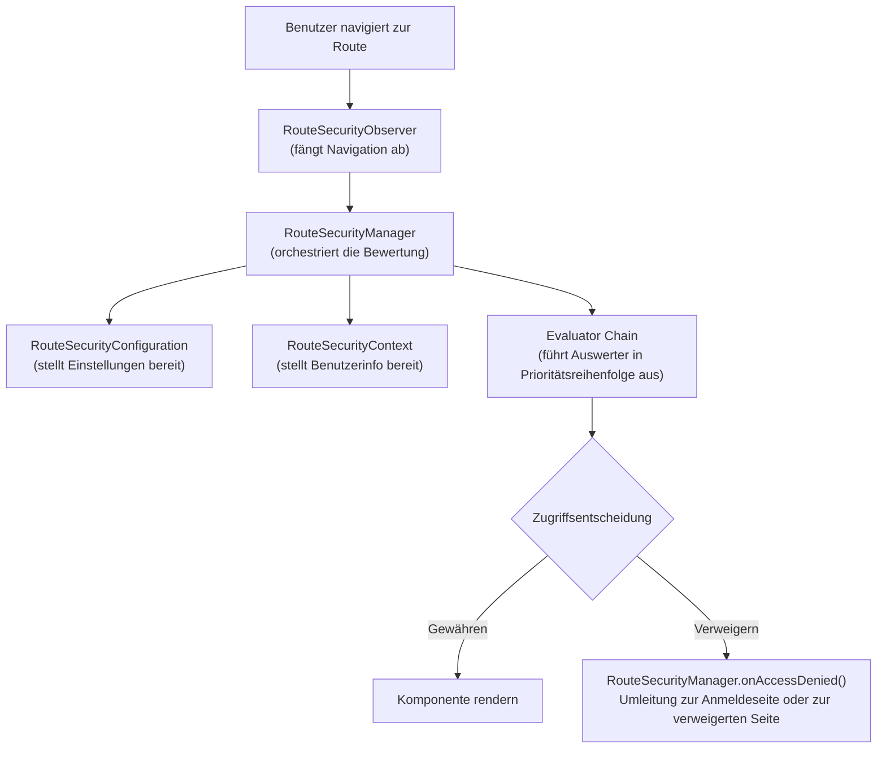

Das webforJ-Sicherheitssystem basiert auf einer Grundlage von Kernschnittstellen, die zusammenarbeiten, um eine Zugriffskontrolle auf Routenebene bereitzustellen. Diese Schnittstellen definieren die Verträge für das Sicherheitsverhalten und ermöglichen es verschiedenen Implementierungen, ob sitzungsbasiert, auf JSON Web Tokens (JWT) basierend, LDAP-integriert oder datenbankgestützt, dasselbe zugrunde liegende Framework zu verwenden.

Das Verständnis dieser Architektur hilft Ihnen zu sehen, wie Sicherheitsannotation wie `@RolesAllowed` und `@PermitAll` ausgewertet werden, wie die Navigationseinmischung funktioniert und wie Sie benutzerdefinierte Sicherheitsimplementierungen für Ihre speziellen Bedürfnisse erstellen können.

## Die Kernschnittstellen {#the-four-core-interfaces}

Die Sicherheitsgrundlage basiert auf wichtigen Abstraktionen, von denen jede eine spezifische Verantwortung hat:

### `RouteSecurityManager` {#routesecuritymanager}

Der `RouteSecurityManager` ist der zentrale Koordinator des Sicherheitssystems. Er verwaltet Sicherheitsauswerter, orchestriert den Evaluierungsprozess und behandelt den Zugriffsschutz, indem er Benutzer auf geeignete Seiten umleitet.

**Verantwortlichkeiten:**

- Registrieren und Verwalten von Sicherheitsauswertern mit Prioritäten
- Koordinierung des Evaluierungsprozesses, wenn ein Benutzer zu einer Route navigiert
- Behandlung von Zugriffsverweigerungen durch Auslösen von Umleitungen zu Anmelde- oder Zugriffsverweigerungsseiten
- Speichern und Abrufen von Standorten vor der Authentifizierung für Umleitungen nach der Anmeldung

```java
public interface RouteSecurityManager {
  RouteAccessDecision evaluate(Class<?> routeClass, NavigationContext context);
  void onAccessDenied(RouteAccessDecision decision, NavigationContext context);
  RouteSecurityContext getSecurityContext();
  RouteSecurityConfiguration getConfiguration();
  void registerEvaluator(RouteSecurityEvaluator evaluator, int priority);
  Optional<Location> consumePreAuthenticationLocation();
}
```

Der Manager trifft keine Sicherheitsentscheidungen selbst, sondern delegiert an Auswerter und Konfiguration. Er ist das Bindeglied, das alle Sicherheitskomponenten verbindet.

### `RouteSecurityContext` {#routesecuritycontext}

Der `RouteSecurityContext` bietet Zugriff auf den Authentifizierungsstatus des aktuellen Benutzers. Er beantwortet Fragen wie, ob der Benutzer authentifiziert ist, wie sein Benutzername lautet und ob er die Rolle `ADMIN` hat.

**Verantwortlichkeiten:**

- Bestimmen, ob der aktuelle Benutzer authentifiziert ist
- Bereitstellen des Benutzers (typischerweise sein Benutzername oder Benutzerobjekt)
- Überprüfen, ob der Benutzer bestimmte Rollen oder Berechtigungen hat
- Speichern und Abrufen benutzerdefinierter Sicherheitsattribute

```java
public interface RouteSecurityContext {
  boolean isAuthenticated();
  Optional<Object> getPrincipal();
  boolean hasRole(String role);
  boolean hasAuthority(String authority);
  Optional<Object> getAttribute(String name);
  void setAttribute(String name, Object value);
}
```

Implementierungen variieren je nach Authentifizierungssystem, Speicherung von HTTP-Sitzungen, JWT-Tokens, die aus Headers dekodiert werden, Datenbankabfragen, LDAP-Suchen oder anderen Mechanismen.

### `RouteSecurityConfiguration` {#routesecurityconfiguration}

Die `RouteSecurityConfiguration` definiert das Sicherheitsverhalten und die Umleitungsstandorte. Sie gibt dem Sicherheitssystem an, wohin Benutzer geschickt werden sollen, wenn eine Authentifizierung erforderlich ist oder der Zugriff verweigert wird.

**Verantwortlichkeiten:**

- Definieren, ob die Sicherheit aktiviert ist
- Spezifizieren des Verhaltens "standardmäßig sicher"
- Bereitstellung des Standorts der Anmeldeseite (typischerweise `/login`)
- Bereitstellung des Standorts der Zugriffsverweigerungsseite

```java
public interface RouteSecurityConfiguration {
  default boolean isEnabled() { return true; }
  default boolean isSecureByDefault() { return true; }
  default Optional<Location> getAuthenticationLocation() {
    return Optional.of(new Location("/login"));
  }
  default Optional<Location> getDenyLocation() { /* ... */ }
}
```

Diese Schnittstelle trennt die Sicherheitsrichtlinie von der Durchsetzung der Sicherheit. Sie können Umleitungsstandorte ändern oder sicher-standardmäßig umschalten, ohne den Manager oder die Auswerter zu ändern.

### `RouteSecurityEvaluator` {#routesecurityevaluator}

Der `RouteSecurityEvaluator` ist der Ort, an dem die tatsächlichen Sicherheitsregeln überprüft werden. Jeder Auswerter untersucht eine Route und entscheidet, ob der Zugriff gewährt, verweigert oder die Entscheidung an den nächsten Auswerter in der Kette delegiert wird.

**Verantwortlichkeiten:**

- Bestimmen, ob dieser Auswerter die gegebene Route bearbeitet
- Sicherheitsannotation auf der Routenklasse auswerten
- Zugriff gewähren, Zugriff verweigern oder an den nächsten Auswerter delegieren
- Teil des Kettens von Verantwortlichkeiten sein

```java
public interface RouteSecurityEvaluator {
  RouteAccessDecision evaluate(Class<?> routeClass,
                                NavigationContext context,
                                RouteSecurityContext securityContext,
                                SecurityEvaluatorChain chain);
  default boolean supports(Class<?> routeClass) { return true; }
}
```

Integrierte Auswerter behandeln Standardannotationen wie `@RolesAllowed`, `@PermitAll`, `@DenyAll` und `@AnonymousAccess`. Sie können benutzerdefinierte Auswerter erstellen, um domainspezifische Sicherheitslogik zu implementieren.

## Wie die Schnittstellen zusammenarbeiten {#how-the-interfaces-work-together}

Diese vier Schnittstellen arbeiten während der Navigation zusammen, um Sicherheitsregeln durchzusetzen:


```mermaid
flowchart TB
  User["Benutzer navigiert zur Route"] --> Observer["RouteSecurityObserver<br/>(fängt Navigation ab)"]
  Observer --> Manager["RouteSecurityManager<br/>(orchestriert die Bewertung)"]

  Manager --> Config["RouteSecurityConfiguration<br/>(stellt Einstellungen bereit)"]
  Manager --> Context["RouteSecurityContext<br/>(stellt Benutzerinfo bereit)"]
  Manager --> Chain["Evaluator Chain<br/>(führt Auswerter in Prioritätsreihenfolge aus)"]

  Chain --> Decision{"Zugriffsentscheidung"}
  Decision -->|"Gewähren"| Render["Komponente rendern"]
  Decision -->|"Verweigern"| Redirect["RouteSecurityManager.onAccessDenied()<br/>Umleitung zur Anmeldeseite oder zur verweigerten Seite"]
```

Wenn ein Benutzer navigiert, fängt der `RouteSecurityObserver` die Navigation ab und bittet den `RouteSecurityManager`, den Zugriff zu bewerten. Der Manager konsultiert die `RouteSecurityConfiguration` nach Einstellungen, erhält Benutzerinformationen vom `RouteSecurityContext` und führt jeden `RouteSecurityEvaluator` in Prioritätsreihenfolge aus, bis einer eine Entscheidung trifft.

## Schnittstellen als Verträge {#the-interfaces-as-contracts}

Jede Schnittstelle definiert einen Vertrag, eine Reihe von Fragen, die das Sicherheitssystem beantwortet benötigt. **Wie** Sie diese Fragen beantworten, liegt in Ihrer Implementierungsentscheidung:

**Vertrag von `RouteSecurityContext`:**

- "Ist der aktuelle Benutzer authentifiziert?" (`isAuthenticated()`)
- "Wer ist der Benutzer?" (`getPrincipal()`)
- "Hat der Benutzer die Rolle X?" (`hasRole()`)

Sie entscheiden, woher diese Informationen kommen: HTTP-Sitzungen, JWT-Tokens, die aus den Headers dekodiert werden, Datenbankabfragen, LDAP-Anfragen oder jedem anderen Authentifizierungsback-End.

**Vertrag von `RouteSecurityConfiguration`:**

- "Ist die Sicherheit aktiviert?" (`isEnabled()`)
- "Sollen Routen standardmäßig sicher sein?" (`isSecureByDefault()`)
- "Wohin sollen nicht authentifizierte Benutzer gehen?" (`getAuthenticationLocation()`)

Sie entscheiden, wie Sie diese Werte beziehen: hardcodiert, aus Konfigurationsdateien, aus Umgebungsvariablen, aus einer Datenbank oder dynamisch berechnet.

**Vertrag von `RouteSecurityManager`:**

- "Soll dieser Benutzer auf diese Route zugreifen?" (`evaluate()`)
- "Was passiert, wenn der Zugriff verweigert wird?" (`onAccessDenied()`)
- "Welche Auswerter sollten ausgeführt werden?" (`registerEvaluator()`)

Sie entscheiden den Authentifizierungsfluss, wo Sie die Standorte vor der Authentifizierung speichern und wie Sie benutzerdefinierte Verweigerungsszenarien behandeln.

Die Architektur der Grundlage definiert diese Verträge, aber die Implementierung ist flexibel. Verschiedene Systeme können diese Schnittstellen auf völlig unterschiedliche Weise implementieren, basierend auf spezifischen Anforderungen.

## Die Basisklasse `AbstractRouteSecurityManager` {#the-abstractroutesecuritymanager-base-class}

Die meisten Implementierungen implementieren `RouteSecurityManager` nicht direkt. Stattdessen erweitern sie `AbstractRouteSecurityManager`, das Folgendes bietet:

- Registrierung von Auswertern und sortierung basierend auf Prioritäten
- Logik zur Kettenausführung
- Umgang mit Zugriffsverweigerung mit automatischen Umleitungen
- Speicherung von Standorten vor der Authentifizierung in der HTTP-Sitzung
- Verhalten, das standardmäßig sicher ist

Die Basisklasse implementiert die `RouteSecurityManager`-Schnittstelle und bietet konkrete Implementierungen für die Verwaltung von Auswertern, die Zugriffsbewertung und den Umgang mit Verweigerungen. Unterklassen müssen nur den Sicherheitskontext und die Konfiguration bereitstellen. Die Basisklasse übernimmt automatisch die Verwaltung von Auswertern, die Kettenausführung und den Umgang mit Verweigerungen.
