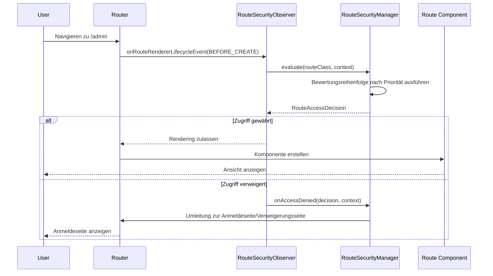

Sicherheitsdurchsetzung in webforJ erfolgt automatisch während der Navigation. Wenn ein Benutzer auf einen Link klickt oder zu einer Route navigiert, unterbricht das Sicherheitssystem die Navigation, bewertet die Zugriffsregeln und erlaubt entweder die Fortsetzung der Navigation oder leitet den Benutzer auf eine geeignete Seite um. Diese Unterbrechung ist für die Benutzer unsichtbar und erfordert keine manuellen Sicherheitsüberprüfungen in Ihrem Komponenten-Code.

Das Verständnis der Funktionsweise der Navigationsunterbrechung hilft Ihnen, Sicherheitsprobleme zu beheben und benutzerdefinierte Navigationslogik zu erstellen, die mit dem Sicherheitssystem integriert ist.

## Der `RouteSecurityObserver` {#the-routesecurityobserver}

Der `RouteSecurityObserver` ist ein Navigationsbeobachter, der in den Lebenszyklus des Routers eingreift. Er hört auf Navigationsereignisse und bewertet Sicherheitsregeln, bevor eine Komponente gerendert wird.

Der Beobachter wird beim Start der App an den Renderer des Routers angehängt:

```java
// Erstellen Sie den Beobachter mit Ihrem Sicherheitsmanager
RouteSecurityObserver observer = new RouteSecurityObserver(securityManager);

// Hängen Sie ihn an den Renderer des Routers an
Router router = Router.getCurrent();
if (router != null) {
  router.getRenderer().addObserver(observer);
}
```

Sobald er angehängt ist, unterbricht der Beobachter jede Navigationsanforderung. Der Beobachter sitzt zwischen Navigationsanforderungen und dem Rendern von Komponenten. Wenn die Navigation beginnt, bittet er den Sicherheitsmanager, den Zugriff zu bewerten. Nur wenn der Zugriff gewährt wird, wird die Komponente gerendert.

## Navigationsunterbrechungsfluss {#navigation-interception-flow}

Wenn ein Benutzer zu einer Route navigiert, tritt folgende Abfolge ein:



Dieser Fluss zeigt, dass die Sicherheitsevaluation stattfindet, bevor irgendein sensibler Routen-Code ausgeführt wird. Wenn der Zugriff verweigert wird, wird die Komponente nie instanziiert, was verhindert, dass unbefugte Benutzer Geschäftsanlogik auslösen oder auf geschützte Daten zugreifen.

## Unterbrechnungspunkte {#interception-points}

Der Beobachter unterbricht die Navigation zu einem bestimmten Zeitpunkt im Routing-Lebenszyklus:

**Vor dem Rendering** Die Methode `onRouteRendererLifecycleEvent()` des Beobachters wird mit dem Ereignis `LifecycleEvent.BEFORE_CREATE` aufgerufen, nachdem die Route aufgelöst wurde, aber bevor die Komponente erstellt wurde. Dies ist der kritische Sicherheitspunkt.

An diesem Punkt weiß der Router, welche Routenklasse gerendert werden soll, aber die Route wurde noch nicht instanziiert. Der Beobachter kann Sicherheitsannotations an der Klasse bewerten, ohne die Routenlogik auszuführen.

Wenn der Zugriff verweigert wird, verhindert der Beobachter das Rendering und löst eine Umleitung aus. Die ursprüngliche Route wird niemals instanziiert.

## Der Evaluierungsprozess {#the-evaluation-process}

Wenn der Beobachter die Navigation unterbricht, delegiert er die Bewertung an den Sicherheitsmanager. Der Beobachter ruft die Routenklasse aus dem Navigationskontext ab und bittet den Manager, den Zugriff zu bewerten. Wenn die Entscheidung den Zugriff gewährt, erfolgt die Navigation normal. Wenn die Entscheidung den Zugriff verweigert, stoppt der Beobachter die Weiterleitung, um das Rendering zu verhindern, und lässt den Manager mit der Verweigerung umgehen.

Der Manager koordiniert die Bewertung, indem er:

1. Überprüft, ob die Sicherheit in der Konfiguration aktiviert ist
2. Den aktuellen Sicherheitskontext (Benutzerinformationen) abruft
3. Die Bewertungsreihe in Prioritätsreihenfolge ausführt
4. Die endgültige Zugriffsentscheidung zurückgibt

Der Beobachter handelt nach der Entscheidung: Wenn gewährt, setzt sich die Navigation fort; wenn verweigert, stoppt der Beobachter die Weiterleitung und lässt den Manager mit der Verweigerung umgehen.

## Wie Zugriffsentscheidungen getroffen werden {#how-access-decisions-are-made}

Der Sicherheitsmanager erstellt eine Bewertungsreihe und führt jeden Evaluator in Prioritätsreihenfolge aus. Evaluatoren können drei Arten von Entscheidungen treffen:

- **Zugriff gewähren:** Der Evaluator genehmigt die Navigation, und die Route wird gerendert. Keine weiteren Evaluatoren werden konsultiert. Der Evaluator gibt eine Entscheidung zurück, die anzeigt, dass der Zugriff gewährt wurde.

- **Zugriff verweigern:** Der Evaluator blockiert die Navigation. Der Beobachter stoppt das Rendering und löst eine Umleitung aus. Der Evaluator gibt eine Verweigerungsentscheidung zurück, optional mit einer Begründungsnachricht. Die Verweigerung kann auf mangelnde Authentifizierung (Anmeldung erforderlich) oder mangelnde Autorisierung (unzureichende Berechtigungen) zurückzuführen sein.

- **An den nächsten Evaluator delegieren:** Der Evaluator trifft keine Entscheidung und gibt die Kontrolle an den nächsten Evaluator in der Reihe weiter. Der Evaluator ruft die Evaluierungsmethode der Kette auf, die zum nächsten Evaluator in Prioritätsreihenfolge übergeht.

Die meisten Evaluatoren behandeln nur Routen mit bestimmten Annotations. Zum Beispiel bewertet der `RolesAllowedEvaluator` nur Routen, die mit `@RolesAllowed` annotiert sind. Wenn die Annotation nicht vorhanden ist, delegiert er an den nächsten Evaluator.

## Umgang mit Zugriffsverweigerung {#handling-access-denial}

Wenn der Zugriff verweigert wird, behandelt die Methode `onAccessDenied()` des Managers die Verweigerung basierend auf dem Verweigerungstyp:

- **Authentifizierung erforderlich:** Der Benutzer ist nicht angemeldet. Umleitung zur Anmeldeseite, die in `RouteSecurityConfiguration.getAuthenticationLocation()` konfiguriert ist.

- **Zugriff verweigert:** Der Benutzer ist angemeldet, hat jedoch nicht die erforderlichen Berechtigungen. Umleitung zur Seite „Zugriff verweigert“, die in `RouteSecurityConfiguration.getDenyLocation()` konfiguriert ist.

Vor der Umleitung speichert der Manager den ursprünglich angeforderten Standort in der HTTP-Sitzung. Nach erfolgreicher Anmeldung kann dieser Standort mithilfe der Methode `consumePreAuthenticationLocation()` des Managers abgerufen werden, die den gespeicherten Standort zurückgibt und ihn aus der Sitzung entfernt. Wenn ein Standort gespeichert wurde, kann die App dorthin navigieren; andernfalls navigiert sie zu einer Standardseite.

## Wenn die Sicherheit deaktiviert ist {#when-security-is-disabled}

Wenn `RouteSecurityConfiguration.isEnabled()` `false` zurückgibt, umgeht der Manager alle Bewertungen und gewährt jedem Route sofort Zugriff. Die Bewertungsreihe wird niemals ausgeführt, und es finden keine Sicherheitsüberprüfungen statt.

Dies ist während der Entwicklung oder für Anwendungen nützlich, die keine Sicherheit erfordern. Sie können die Sicherheit ein- und ausschalten, ohne Annotations zu entfernen oder den Beobachter abzumelden.

## Integration mit dem Navigationslebenszyklus {#integration-with-navigation-lifecycle}

Der Sicherheitsbeobachter integriert sich in den umfassenderen [Navigationslebenszyklus](/docs/routing/navigation-lifecycle/overview), in dem mehrere Beobachter in Navigationsereignisse eingreifen können. Die Sicherheitsevaluation erfolgt früh in diesem Lebenszyklus, bevor Navigationsblockaden oder Komponentenlebenszyklusereignisse eintreten.

Wenn Sie benutzerdefinierte Navigationsbeobachter implementieren, sollten Sie sich dessen bewusst sein, dass die Sicherheitsevaluation zuerst erfolgt. Wenn der Zugriff verweigert wird, wird das `onRouteRendererLifecycleEvent()` Ihres Beobachters nicht mit `BEFORE_CREATE` aufgerufen, da die Navigation gestoppt wird.
