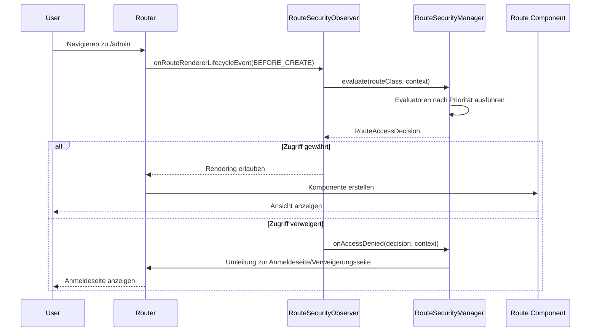

Die Durchsetzung von Sicherheit in webforJ erfolgt automatisch während der Navigation. Wenn ein Benutzer auf einen Link klickt oder zu einem Route navigiert, unterbricht das Sicherheitssystem die Navigation, bewertet die Zugriffsregeln und erlaubt entweder die Fortsetzung der Navigation oder leitet den Benutzer auf eine entsprechende Seite um. Diese Unterbrechung ist für die Benutzer unsichtbar und erfordert keine manuellen Sicherheitsüberprüfungen in Ihrem Komponenten-Code.

Das Verständnis, wie die Navigationsteilung funktioniert, hilft Ihnen, Sicherheitsprobleme zu beheben und benutzerdefinierte Navigationslogik zu erstellen, die mit dem Sicherheitssystem integriert ist.

## Der `RouteSecurityObserver` {#the-routesecurityobserver}

Der `RouteSecurityObserver` ist ein Navigationsbeobachter, der in den Lebenszyklus des Routers eingreift. Er hört auf Navigationsereignisse und bewertet Sicherheitsregeln, bevor eine Komponente gerendert wird.

Der Beobachter wird während des Starts der App an den Renderer des Routers angehängt:

```java
// Erstellen Sie den Beobachter mit Ihrem Sicherheitsmanager
RouteSecurityObserver observer = new RouteSecurityObserver(securityManager);

// Hängen Sie ihn an den Renderer des Routers an
Router router = Router.getCurrent();
if (router != null) {
  router.getRenderer().addObserver(observer);
}
```

Sobald er angehängt ist, unterbricht der Beobachter jede Navigationsanforderung. Der Beobachter befindet sich zwischen Navigationsanforderungen und dem Komponentenir rendering. Wenn die Navigation beginnt, bittet er den Sicherheitsmanager, den Zugriff zu bewerten. Nur wenn der Zugriff gewährt wird, wird die Komponente gerendert.

## Ablauf der Navigationsteilung {#navigation-interception-flow}

Wenn ein Benutzer zu einer Route navigiert, tritt die folgende Sequenz ein:


```mermaid
sequenceDiagram
  participant User
  participant Router
  participant Observer as RouteSecurityObserver
  participant Manager as RouteSecurityManager
  participant Component as Route Component

  User->>Router: Navigieren zu /admin
  Router->>Observer: onRouteRendererLifecycleEvent(BEFORE_CREATE)
  Observer->>Manager: evaluate(routeClass, context)
  Manager->>Manager: Evaluatoren nach Priorität ausführen
  Manager-->>Observer: RouteAccessDecision

  alt Zugriff gewährt
    Observer-->>Router: Rendering erlauben
    Router->>Component: Komponente erstellen
    Component-->>User: Ansicht anzeigen
  else Zugriff verweigert
    Observer->>Manager: onAccessDenied(decision, context)
    Manager->>Router: Umleitung zur Anmeldeseite/Verweigerungsseite
    Router-->>User: Anmeldeseite anzeigen
  end
```

Dieser Ablauf zeigt, dass die Sicherheitsbewertung erfolgt, bevor jeglicher sensibler Routencode ausgeführt wird. Wenn der Zugriff verweigert wird, wird die Komponente nie instanziiert, wodurch unbefugte Benutzer daran gehindert werden, Geschäftslogik auszulösen oder auf geschützte Daten zuzugreifen.

## Unterbrechungspunkte {#interception-points}

Der Beobachter unterbricht die Navigation an einem bestimmten Punkt im Routing-Lebenszyklus:

**Vor dem Rendering** Die Methode `onRouteRendererLifecycleEvent()` des Beobachters wird mit dem Ereignis `LifecycleEvent.BEFORE_CREATE` aufgerufen, nachdem die Route aufgelöst wurde, aber bevor die Komponente erstellt wird. Dies ist der kritische Sicherheitscheckpoint.

Zu diesem Zeitpunkt weiß der Router, welche Routeklasse gerendert werden soll, aber die Route wurde noch nicht instanziiert. Der Beobachter kann Sicherheitsannotation auf der Klasse bewerten, ohne die Routelogik auszuführen.

Wenn der Zugriff verweigert wird, verhindert der Beobachter das Rendering und löst eine Umleitung aus. Die ursprüngliche Route wird niemals instanziiert.

## Der Evaluierungsprozess {#the-evaluation-process}

Wenn der Beobachter die Navigation unterbricht, delegiert er die Bewertung an den Sicherheitsmanager. Der Beobachter ruft die Routklasse aus dem Navigationskontext ab und bittet den Manager, den Zugriff zu bewerten. Wenn die Entscheidung den Zugriff gewährt, erfolgt die Navigation normal. Wenn die Entscheidung den Zugriff verweigert, stoppt der Beobachter die Weiterleitung, um das Rendering zu verhindern, und lässt den Manager mit der Ablehnung umgehen.

Der Manager koordiniert die Bewertung durch:

1. Überprüfung, ob Sicherheit in der Konfiguration aktiviert ist
2. Abrufen des aktuellen Sicherheitskontexts (Benutzerinformationen)
3. Ausführen der Evaluatorenkette in Prioritätsreihenfolge
4. Rückgabe der endgültigen Zugriffsentscheidung

Der Beobachter handelt entsprechend der Entscheidung: wenn gewährt, erfolgt die Navigation; wenn verweigert, stoppt der Beobachter die Weiterleitung und lässt den Manager mit der Ablehnung umgehen.

## Wie Zugriffsentscheidungen getroffen werden {#how-access-decisions-are-made}

Der Sicherheitsmanager erstellt eine Evaluatorenkette und führt jeden Evaluator in Prioritätsreihenfolge aus. Evaluatoren können drei Arten von Entscheidungen treffen:

- **Zugriff gewähren:** Der Evaluator genehmigt die Navigation, und die Route wird gerendert. Es werden keine weiteren Evaluatoren konsultiert. Der Evaluator gibt eine Entscheidung zurück, die anzeigt, dass Zugriff gewährt wird.

- **Zugriff verweigern:** Der Evaluator blockiert die Navigation. Der Beobachter stoppt das Rendering und löst eine Umleitung aus. Der Evaluator gibt eine Ablehnungsentscheidung zurück, optional mit einer Grundnachricht. Die Ablehnung kann auf fehlende Authentifizierung (Anmeldung erforderlich) oder fehlende Autorisierung (unzureichende Berechtigungen) zurückzuführen sein.

- **An den nächsten Evaluator delegieren:** Der Evaluator trifft keine Entscheidung und übergibt die Kontrolle an den nächsten Evaluator in der Kette. Der Evaluator ruft die Evaluatoren-Methode der Kette auf, die zum nächsten Evaluator in der Prioritätsreihenfolge wechselt.

Die meisten Evaluatoren bearbeiten nur Routen mit bestimmten Annotations. Beispielsweise bewertet der `RolesAllowedEvaluator` nur Routen, die mit `@RolesAllowed` annotiert sind. Wenn die Annotation nicht vorhanden ist, delegiert er an den nächsten Evaluator.

## Umgang mit Zugriffsverweigerungen {#handling-access-denial}

Wenn der Zugriff verweigert wird, behandelt die Methode `onAccessDenied()` des Managers die Ablehnung basierend auf dem Ablehnungstyp:

- **Authentifizierung erforderlich:** Benutzer ist nicht angemeldet. Umleitung zur Anmeldeseite, die in `RouteSecurityConfiguration.getAuthenticationLocation()` konfiguriert ist.

- **Zugriff verweigert:** Benutzer ist angemeldet, hat aber nicht die erforderlichen Berechtigungen. Umleitung zur Zugriffsverweigerungsseite, die in `RouteSecurityConfiguration.getDenyLocation()` konfiguriert ist.

Vor der Umleitung speichert der Manager den ursprünglich angeforderten Standort in der HTTP-Sitzung. Nach erfolgreicher Anmeldung kann dieser Standort mit der Methode `consumePreAuthenticationLocation()` des Managers abgerufen werden, die den gespeicherten Standort zurückgibt und ihn aus der Sitzung entfernt. Wenn ein Standort gespeichert wurde, kann die App dorthin navigieren; andernfalls navigiert sie zu einer Standardseite.

## Wenn die Sicherheit deaktiviert ist {#when-security-is-disabled}

Wenn `RouteSecurityConfiguration.isEnabled()` `false` zurückgibt, umgeht der Manager alle Bewertungen und gewährt sofort Zugriff auf jede Route. Die Evaluatorenkette wird niemals ausgeführt, und es finden keine Sicherheitsprüfungen statt.

Dies ist während der Entwicklung oder für Anwendungen nützlich, die keine Sicherheit erfordern. Sie können die Sicherheit ein- und ausschalten, ohne Annotations zu entfernen oder den Beobachter abzumelden.

## Integration mit dem Navigationslebenszyklus {#integration-with-navigation-lifecycle}

Der Sicherheitsbeobachter integriert sich in den umfassenderen [Navigationslebenszyklus](/docs/routing/navigation-lifecycle/overview), in dem mehrere Beobachter in Navigationsereignisse eingreifen können. Die Sicherheitsbewertung erfolgt früh in diesem Lebenszyklus, bevor Navigationsblockierungen oder Ereignisse im Komponentenlebenszyklus auftreten.

Wenn Sie benutzerdefinierte Navigationsbeobachter implementieren, sollten Sie sich bewusst sein, dass die Sicherheitsbewertung zuerst erfolgt. Wenn der Zugriff verweigert wird, wird das Event `onRouteRendererLifecycleEvent()` Ihres Beobachters nicht mit `BEFORE_CREATE` aufgerufen, da die Navigation gestoppt wird.
